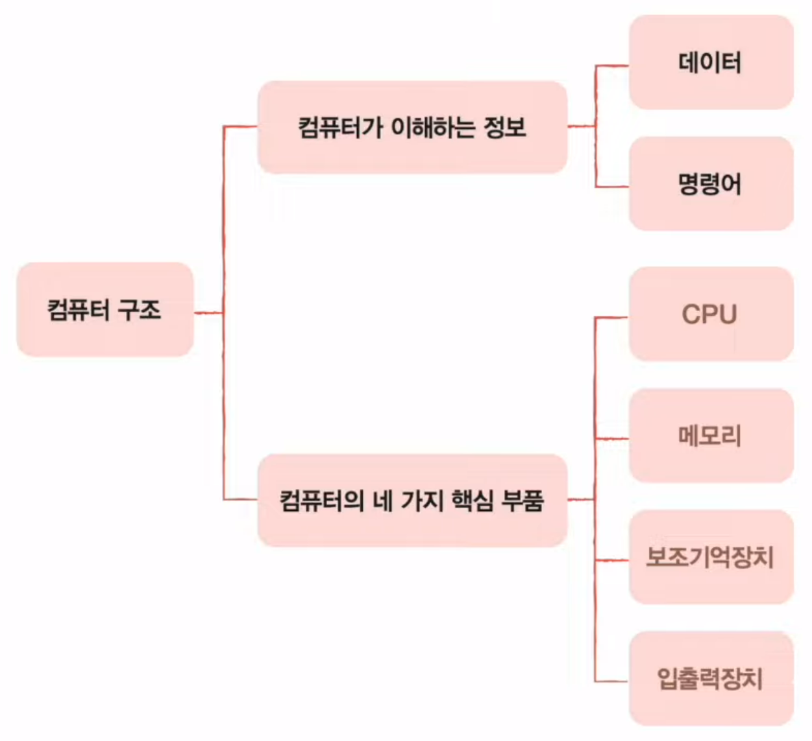
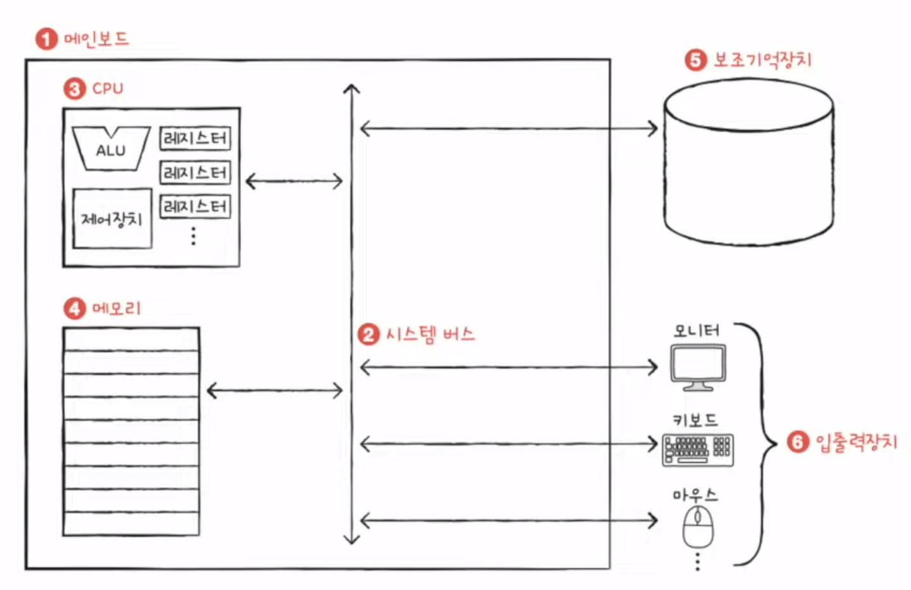
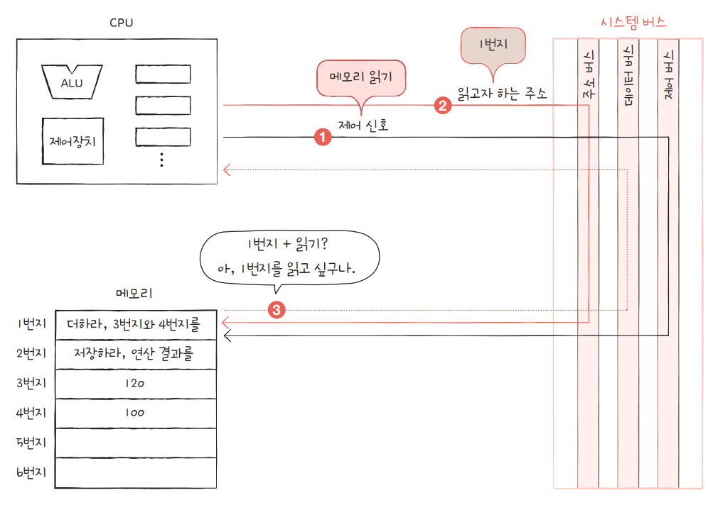
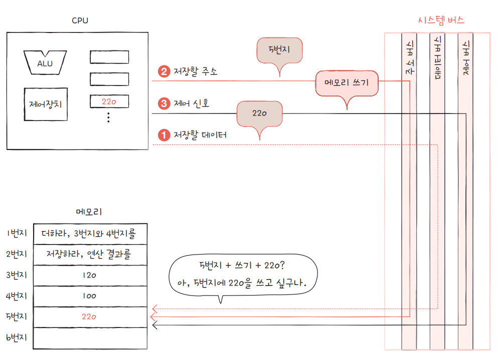

# Chapter 01. 컴퓨터 구조 시작하기

## 목차

01-1. 컴퓨터 구조를 알아야 하는 이유  
01-2. 컴퓨터 구조의 큰 그림

 

## 01-1. 컴퓨터 구조를 알아야 하는 이유

- 개발자도 컴퓨터 구조를 알아야 하는 이유는?

1. 내가 작성한 코드가 컴퓨터에서 어떻게 동작하는지 내부 원리를 정확히 이해하고 있어야 어떤 문제가 발생하여도 확실하게 처리할 수 있다.
즉, 컴퓨터는 우리에게 "미지의 대상"이 아닌 "분석의 대상"이 될 수 있어야 한다.

2. 개발을 넘어 컴퓨터의 **성능, 용량, 비용**까지 고려하며 개발하는 개발자가 될 수 있어야 한다.

 

## 01-2. 컴퓨터 구조의 큰 그림

컴퓨터가 이해하는 정보는 크게 **데이터**와 **명령어**이다.

**데이터**란 숫자나 문자, 이미지, 동영상 등과 같이 정적인 정보이며, **명령어**란 컴퓨터가 데이터를 처리하기 위한 실행 정보이다.

### CPU(Control Process Unit)

- 메모리에 저장된 명령어를 읽고, 해석하고, 실행하는 장치이다.
- ALU, 레지스터, 제어장치로 구성되어 있다.
  - [ALU(Arithmetic Logic Unit)](http://www.ktword.co.kr/test/view/view.php?m_temp1=374): 산술논리연산장치로 산술 연산과 논리 연산을 수행하는 장치이다.
  - [레지스터](http://www.ktword.co.kr/test/view/view.php?nav=2&no=5269&sh=%EB%A0%88%EC%A7%80%EC%8A%A4%ED%84%B0): CPU 내부에서 프로그램을 실행하는 데 필요한 값들을 저장하는 임시 저장 장치이다. 역할에 따라 다양한 레지스터가 존재한다.
  - [제어장치](http://www.ktword.co.kr/test/view/view.php?nav=2&no=6039&sh=%EC%A0%9C%EC%96%B4%EC%9E%A5%EC%B9%98): **제어 신호**라는 전기 신호를 내보내고 명령어를 해석하는 장치이다. 명령어와 데이터의 입출력과 ALU의 동작을 제어한다. 제어 신호에는 **메모리 읽기**와 **메모리 쓰기** 신호가 있다.

### 메모리

- 현재 실행되는 프로그램의 명령어와 데이터를 저장하는 장치이다.
- 크게 RAM과 ROM이 있다.

### 보조기억장치

- 컴퓨터의 전원이 꺼져도 저장된 내용을 잃지 않는 메모리이다.
- 주기억장치(메모리)는 현재 실행되고 있는 프로그램을 저장하고, 보조기억장치는 보관할 프로그램을 저장한다.
- 대표적으로 하드 디스크, SSD, USB 메모리, DVD, CD_ROM 등이 있다.

### 입출력장치

- 컴퓨터 외부에 연결되어 컴퓨터 내부와 정보를 교환하는 장치이다.
- 마이크, 스피커, 프린터, 마우스, 키보드 등이 있다.

### 메인보드와 시스템 버스

- 컴퓨터의 핵심 부품들이 장착되는 회로판이다.
- 부품을 부착할 수 있는 슬롯과 단자가 있다.
- 부품들끼리 정보를 교환할 수 있는 다양한 **버스**가 존재한다.
- 네 가지 핵심 부품을 연결하는 가장 중요한 버스는 **시스템 버스**이다.
  - **주소 버스**: 주소를 주고 받는 통로
  - **데이터 버스**: 명령어와 데이터를 주고 받는 통로
  - **제어 버스**: 제어 신호를 주고 받는 통로

  
  

 

## (추가 정보)

### 주기억장치 RAM 과 ROM

**RAM(Random Access Memory)**
- 컴퓨터가 프로그램을 실행하기 위해 필요한 정보를 저장하는 메모리
- RAM은 CPU가 RAM의 모든 임의의 주소에 직접 접근(엑세스)할 수 있음을 의미함
- 휘발성 메모리
- 읽기와 쓰기가 가능
- 가장 빠르고 비용이 많이 드는 메모리

**ROM(Read Only Memory)**
- 컴퓨터가 부팅할 때 필요한 정보를 저장하는 메모리
- 비휘발성 메모리
- 읽기 전용 메모리
- 수정 불가능

### CPU 명령어

1. CPU 명령어의 구성 (Instruction Structure)

- CPU 명령어 = 명령코드 + 피연산자
  - 명령코드 (Operation code, Op code)
    - 명령어들은, 1 이상의 피연산자(오퍼랜드)를 갖거나, 갖지 않을 수 있음
    - 종류 : STORE, LOAD, SHIFT, XOR, JUMP 등
  - 피연산자 (Operand, 오퍼랜드)
    - 데이터(리터럴) or 데이터 위치(메모리 내 주소, 어느 레지스터 인가? 등)

2. CPU 명령어의 종류 (연산 종류)

- 데이터 전송 : LOAD, STORE 등
  - 레지스터와 레지스터 간, 레지스터와 메모리 간, 메모리와 메모리 간
- 연산 : ADD, AND, OR, XOR, SHIFT, ROTATE 등
  - 논리 연산 : AND, OR, NOT, XOR
  - 산술 연산 : ADD
    - 뺄셈은, 덧셈과 부호반전(negation)의 조합으로써,  ☞ 1의 보수,2의 보수 참조
    - 곱셈은, 덧셈의 반복으로써,
    - 나눗셈은, 뺄셈의 반복으로써, 구현 가능
  - 회전,자리이동 연산 : SHIFT, ROTATE
    - 제어 : BRANCH, JUMP, CALL 등

**References**
- [RAM vs ROM - 1](https://information-factory.tistory.com/270)
- [RAM vs ROM - 2](https://ko.gadget-info.com/difference-between-ram)
- [[정보통신기술용어해설] CPU 명령어 문법](http://www.ktword.co.kr/test/view/view.php?m_temp1=1549&id=604)
- [[정보통신기술용어해설] 어셈블러](http://www.ktword.co.kr/test/view/view.php?m_temp1=1549&id=604)