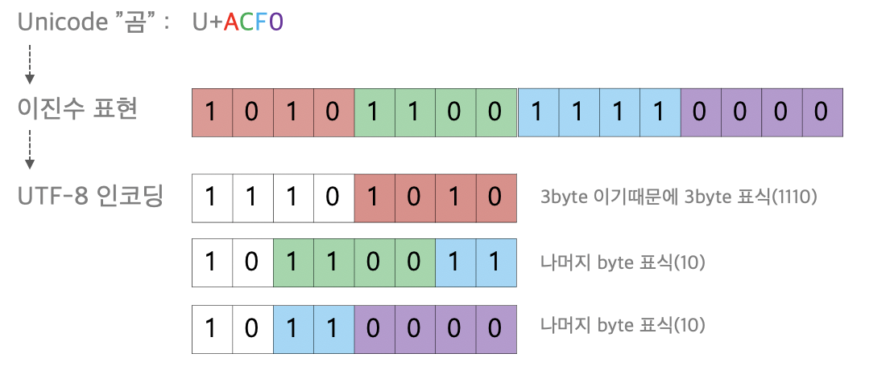
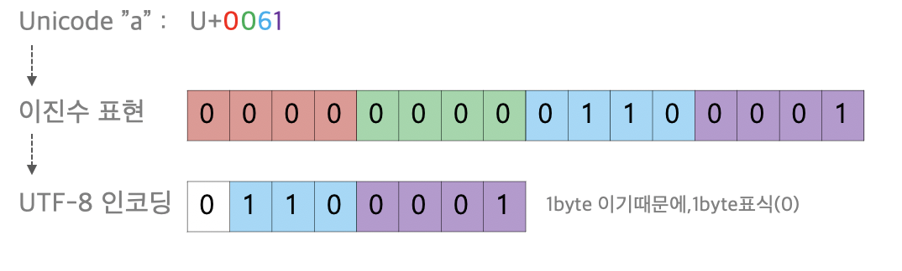

# Chapter 02. 데이터

## 목차

- 02-1 0과 1로 숫자를 표현하는 방법
- 02-2 0과 1로 문자를 표현하는 방법

 

## 1) 0과 1로 숫자를 표현하는 방법

### 정보 단위

- 컴퓨터는 0과 1로 모든 정보를 표현한다.
- 컴퓨터에서 가장 작은 정보의 단위는 비트(bit)이다.
- bit > byte > kB > MB > GB > TB > PB > ...

> 워드(word)란?
> CPU가 한 번에 처리할 수 있는 데이터의 크기이다.  
> 즉, 워드의 크기는 CPU마다 다르며 현대 컴퓨터의 워드 크기는 대부분 32비트 또는 64비트이다.  
> (예. 인텔의 x86: 1워드=32비트, x64: 64비트)  
> 크기에 따라 하프 워드, 풀 워드, 더블 워드 등이 있다.

### 이진법

- 0과 1만으로 숫자를 표현하는 방법
- 컴퓨터에서는 이진수를 표현할 때 `0b`를 앞에 붙인다. (ex. 0b1011)

**이진수의 음수 표현 (2의 보수)**

1. 1은 0으로, 0은 1로 모든 수를 뒤집는다 (1의 보수)
2. 1을 더한다
3. 양수와 음수는 가장 첫 번째 비트(플래그) 값으로 구분한다 (0: 양수, 1: 음수)

### 십육진법

- 0 ~ F 까지의 총 16개 문자로 숫자를 표현하는 방법
- ex) 15 = 0xF, 78 = 0x4E
- 이진수는 사람이 읽기에 너무 길기 때문에, 이진수에서 변환이 쉬운 십육진수도 많이 사용한다

이진수 → 십육진수 변환

십육진수 → 이진수

 

## 2) 0과 1로 문자를 표현하는 방법

### 문자 집합과 인코딩

- 문자 집합(Character set): 컴퓨터가 인식하고 표현할 수 있는 문자의 모음
- 문자 인코딩(Character encoding): 문자를 문자 코드 0과 1로 변환
- 문자 디코딩(Character decoding): 문자 코드 0과 1을 문자로 변환

### 아스키 코드 (ASCII: American Standard Code for Information Interchange)

- 아스키는 초창기 문자 집합 중 하나이다
- 아스키 코드는 7비트의 문자 집합과 1비트의 패리티 비트(parity bit)로 구성된다
- 즉, 7비트 = 2^7개 = 128개의 문자
- 패리티 비트는 오류 검출을 위해 사용되는 비트이다

- 위와 같이 모든 문자에는 코드 번호가 붙어 있으며 이를 코드 포인트(code point)라 부른다
- Backspace, Excape, Cancel, Space 등의 제어 문자도 포함되어 있다
- But, 영어가 아닌 다른 나라 언어는 표현할 수 없다

### EUC-KR

한국어 인코딩에는 위와 같이 크게 두 가지 방식이 있다
- `완성형 인코딩`: 초성, 중성, 종성의 조합으로 이루어진 완성된 하나의 글자에 고유한 코드를 부여하는 방식
- `조합형 인코딩`: 초성을 위한 비트열, 중성을 위한 비트열, 종성을 위한 비트열을 할당하여 이들의 조합으로 하나의 글자를 완성하는 방식

- `KS X 1001`, `KS X 1003`이라는 문자 집합을 기반으로 하는 **대표적인 완성형 인코딩** 방식
- 문자 집합의 크기는 2byte
- 총 2,350개의 한글 단어를 표현하지만, 이도 역시 모든 한글 조합을 표현할 수 없음
- 대안으로 마이크로소프트의 `CP949(Code Page 949)`를 만들었지만 이 또한 여전히 부족함

### 유니코드와 UTF-8

**유니코드(Unicode)**
- 세계 모든 언어와 기호에 코드 값을 부여한 문자 집합
- 전 세계의 모든 문자를 담는 [ISO/IEC 10646](https://www.iso.org/standard/69119.html) 코드표 사용 (4byte 크기)

**UTF-8, UTF-16, UTF-32, ...**
- UTF (Unicode Transformation Format): 유니코드 변환 형식
- 가변 길이 인코딩: 인코딩 결과가 1 ~ 4 바이트 크기의 가변 길이를 갖는다
- 인코딩 결과가 몇 바이트가 될지는 유니코드에 부여된 값에 따라 다름

## References

**동영상 강의**
- [[컴퓨터 공학 기초 강의] 4강. 0과 1로 숫자를 표현하는 방법](https://www.youtube.com/watch?v=peg8c6Gn-zc&list=PLVsNizTWUw7FCS83JhC1vflK8OcLRG0Hl&index=6)
- [[컴퓨터 공학 기초 강의] 5강. 0과 1로 문자를 표현하는 방법](https://www.youtube.com/watch?v=upoRINMqlrw&list=PLVsNizTWUw7FCS83JhC1vflK8OcLRG0Hl&index=7)

**References**
- [유니코드 블록 (홈페이지)](https://unicode-table.com/en/blocks/)
- [유니코드 블록 (위키백과)](https://ko.wikipedia.org/wiki/%EC%9C%A0%EB%8B%88%EC%BD%94%EB%93%9C_%EC%98%81%EC%97%AD)
- [유니코드와 UTF 이해하기](https://velog.io/@goggling/%EC%9C%A0%EB%8B%88%EC%BD%94%EB%93%9C%EC%99%80-UTF-%EC%9D%B4%ED%95%B4%ED%95%98%EA%B8%B0)

