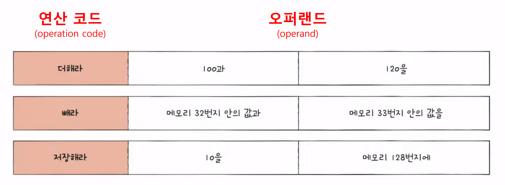

# Chapter 03. 명령어

## 목차

- 03-1) 소스 코드와 명령어
- 03-2) 명령어의 구조

## 1) 소스 코드와 명령어

## 고급 언어와 저급 언어

- 저급 언어 (low-level programming language): 컴퓨터가 이해하기 쉬운 언어
  - 기계어 (machine code): 실제로 컴퓨터의 CPU가 읽어서 실행할 수 있는 0과 1로 이루어진 명령어
  - 어셈블리어 (assembly language): 기계어와 일대일 대응이 되는 컴퓨터 프로그래밍의 저급 언어


- 고급 언어 (high-level programming language): 사람이 이해하기 쉬운 언어
  - 컴파일 언어: 컴파일러에 의해 소스 코드 전체가 저급 언어로 변환되어 실행되는 언어
    - 컴파일
    - 컴파일러
    - 목적 코드 (object code): 컴파일러를 통해 저급 언어로 변환된 코드
  - 인터프리터 언어: 인터프리터에 의해 소스 코드가 한 줄 씩 실행되는 언어
    - 인터프리터

💡 컴파일 & 인터프리트 과정 살펴보기: https://godbolt.org

> 💡 목적 파일 vs 실행 파일  
> 소스 코드가 컴파일러에 의해 변환된 코드를 **목적 코드**라고 하며, 이 코드가 담긴 파일을 **목적 파일**이라 한다.  
> 그리고 이러한 목적 파일들 내부의 목적 코드들을 서로 이어주는 역할을 하는 작업이 **링킹**이라고 한다.  
> 이렇게 링킹 작업까지 모두 완료되면 하나의 **실행 파일**이 생성되는 것이다. (예. 윈도우의 .exe 파일) 

## 2) 명령어의 구조

### 연산 코드와 오퍼랜드

<div align="center"></div>

### 명령어

명령어는 **연산 코드**와 **오퍼 랜드**로 구성되어 있다.

- 연산 코드 (operation code): 명령어가 수행할 연산 (연산자)
- 오퍼랜드 (operand): 연산에 사용할 데이터 또는 데이터가 저장된 위치 (피연산자)

### 연산 코드

연산 코드는 명령어가 수행할 연산을 의미한다. 연산 코드의 종류는 CPU마다도 모두 다르며 그 종류도 굉장히 많다.  
아래는 가장 기본적인 연산 코드의 유형을 4가지로 분류한 것이다.

```
데이터 전송
- MOVE: 데이터를 옮겨라
- STORE: 메모리에 저장하라
- LOAD(FETCH): 메모리에서 CPU로 데이터를 가져와라
- PUSH: 스택에 데이터를 저장하라
- POP: 스택의 최상단 데이터를 가져와라

산술/논리 연산
- ADD / SUBTRACT / MULTIPLY / DIVIDE: 덧셈 / 뺄셈 / 곱셈 / 나눗셈을 수행하라
- INCREMENT / DECREMENT: 오퍼랜드에 1을 더허라 / 오퍼랜드에 1을 빼라
- AND / OR / NOT: AND / OR / NOT 연산을 수행하라
- COMPARE: 두 개의 숫자 또는 TRUE / FALSE 값을 비교하라

제어 흐름 변경
- JUMP: 특정 주소로 실행 순서를 옮겨라
- CONDITIONAL JUMP: 조건에 부합할 때 특정 주소로 실행 순서를 옮겨라
- HALT: 프로그램의 실행을 멈춰라
- CALL: 되돌아올 주소를 저장한 채 특정 주소로 실행 순서를 옮겨라 (함수 호출)
- RETURN: CALL을 호출할 때 저장했던 주소로 돌아가라 (함수 리턴)

입출력 제어
- READ (INPUT): 특정 입출력 장치로부터 데이터를 읽어라
- WRITE (OUTPUT): 특정 입출력 장치로 데이터를 써라
- START IO: 입출력 장치를 시작하라
- TEST IO: 입출력 장치의 상태를 확인하라
```

### 오퍼랜드

오퍼랜드는 **연산에 사용할 데이터** 또는 **연산에 사용할 데이터가 저장된 위치**를 의미한다.  
즉, 오퍼랜드 필드에는 숫자와 문자 등의 데이터 또는 메모리 주소나 레지스터 주소가 올 수 있다.  
그러나 오퍼랜드 필드 공간의 제약 때문에 데이터의 주소를 사용하는 경우가 대부분이기 때문에 **주소 필드**라고 부르기도 한다.

- 오퍼랜드 개수에 따른 이름
  - 0-주소 명령어: 오퍼랜드가 없는 경우
  - 1-주소 명령어: 오퍼랜드가 한 개인 경우
  - 2-주소 명령어: 오퍼랜드가 두 개인 경우
  - 3-주소 명령어: 오퍼랜드가 세 개인 경우

### 주소 지정 방식

오퍼랜드 필드에 데이터의 값이 아닌 메모리나 레지스터의 주소를 사용할 경우, 해당 주소를 **유효 주소**라고 한다.  
그리고 이러한 유효 주소를 지정하는 방식에는 다양한 방법들이 존재하는데 이를 **주소 지정 방식**이라 하며, 대표적으로 사용되는 5가지 방식은 다음과 같다.

- 즉시 주소 지정 방식: 연산에 사용될 데이터의 값
- 직접 주소 지정 방식: 유효 주소 (메모리 주소)
- 간접 주소 지정 방식: 유효 주소의 주소
- 레지스터 주소 지정 방식: 유효 주소 (레지스터 이름)
- 레지스터 간접 주소 지정 방식: 유효 주소를 저장한 레지스터

(💡참고) CPU 외부에 있는 메모리에 접근하는 것보다 CPU 내부에 있는 레지스터에 접근하는 것이 더 빠르다

## References

- [[컴퓨터 공학 기초 강의] 6강. 소스코드와 명령어](https://www.youtube.com/watch?v=B8TDaBp3UWo&list=PLVsNizTWUw7FCS83JhC1vflK8OcLRG0Hl&index=8)
- [[컴퓨터 공학 기초 강의] 7강. 명령어의 구조와 주소 지정 방식](https://www.youtube.com/watch?v=bWPHUi6BPxo&list=PLVsNizTWUw7FCS83JhC1vflK8OcLRG0Hl&index=9)