# Chapter 04. CPU의 작동 원리

- [04-1) ALU와 제어장치](#1-alu와-제어장치)
- [04-2) 레지스터](#2-레지스터)
- [04-3) 명령어 사이클과 인터럽트](#3-명령어-사이클과-인터럽트)

## 1️⃣ ALU와 제어장치

```markdown
💡 CPU의 구성 요소 중 ALU와 제어장치가 어떤 정보를 내보내고 받아들이는지에 대해 알아보기
```

### ❇️ ALU

<div align="center">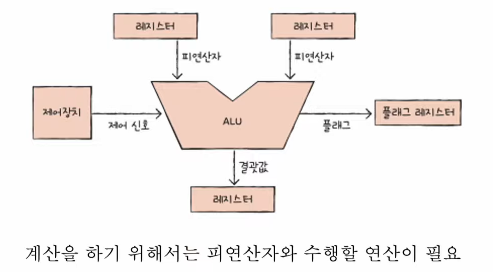</div>

- 받아들이는 정보

ALU는 **제어장치**로부터 수행할 연산을 알려주는 **① 제어 신호**와, **레지스터**로부터 연산에 필요한 값들인 **② 피연산자**를 받아들인다.

- 내보내는 정보

연산을 수행한 결과에는 숫자나 문자, 메모리 주소 등이 있다.  
그리고 이러한 결과는 연산을 통해 얻게 된 실제 **① 결괏값**과 **② 플래그** 정보로 나뉜다.

#### 🔍 플래그(상태) 레지스터

<div align="center">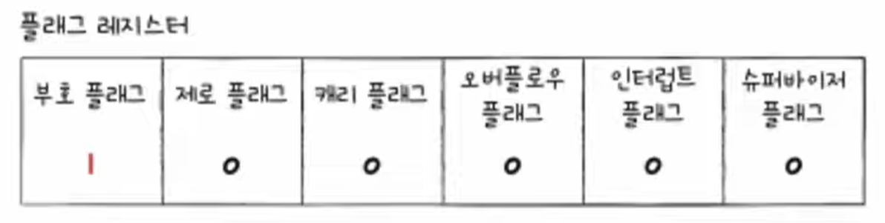</div>
<div align="center">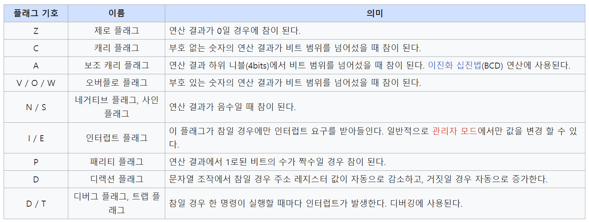</div>

- CPU의 레지스터에는 프로그램 카운터, 메모리 주소 레지스터, 메모리 버퍼 레지스터, 명령어 레지스터 등이 있다.
- 그 중 ALU 연산의 결과로 나오는 **플래그** 정보를 저장하는 **플래그 레지스터**가 있다.
- **플래그**란 ALU의 연산 결과에 대한 추가적인 상태 정보를 나타낸다.

### ❇️ 제어장치

<div align="center">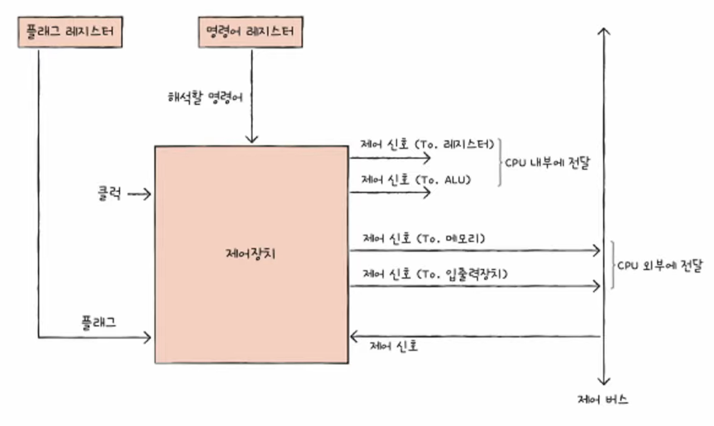</div>
<p align="center" style="font-weight:bold">< 제어장치 ></p>
<div align="center">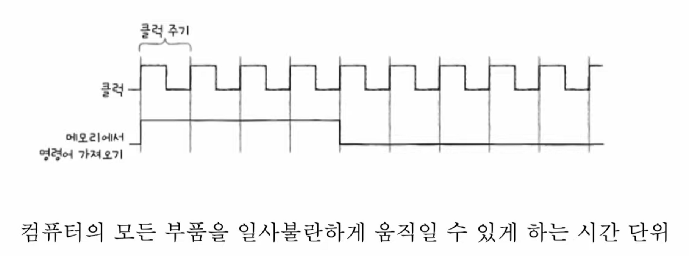</div>


#### 🔍 제어장치가 받아들이는 4가지 정보

1. 제어장치는 **클럭 신호**를 받아들인다.
   - **클럭**이란 CPU의 속도를 나타내는 단위로 제어 신호의 최소 주기를 나타낸다.
   - (주의) 모든 클럭의 명령어 사이클이 단일 클럭 주기로 동작되는 것은 아니다.
2. 제어장치는 해석해야 할 **명령어**를 받아들인다.
   - 수행해야 할 명령어를 **명령어 레지스터**로부터 가져와 해석한 뒤, 명령어 처리를 위한 **제어 신호**를 발생시킨다.
3. 제어장치는 플래그 레지스터 속 **플래그 값**을 받아들인다. 
   - ALU 연산에 대한 상태 정보인 플래그 값을 확인한 뒤, 제어 신호를 발생시킨다.
4. 제어장치는 시스템버스, 그중에서 제어 버스로 전달된 **제어 신호**를 받아들인다.
   - 제어 신호는 CPU뿐만 아니라 입출력장치를 비롯한 외부 장치도 발생시킬 수 있다.
   - 제어장치는 제어 버스를 통해 **외부로 전달된 제어 신호**를 받아들인다.

#### 🔍 제어장치가 내보내는 2가지 정보

1. **CPU 내부**에 제어 신호 발생(ALU, 레지스터 등)
   - ALU에는 수행할 연산을 지시하기 위해
   - 레지스터에는 레지스터 간의 데이터 이동이나 명령어를 해석하기 위해
2. **CPU 외부**에 제어 신호 발생 (메모리, 입출력장치 등)
   - 입출력하기 위해

---
<br>


## 2️⃣ 레지스터 (Register)

```markdown
💡 레지스터의 종류와 역할을 알아보고, 각 레지스터를 통해 명령어가 처리되는 과정을 이해하기
```

> 💡 **레지스터란?**  
> 레지스터란 CPU가 **명령어를 처리하기 위해** 필요한 **데이터와 명령어**를 보관할 수 있는 작은 **임시저장장치**이다.  
> CPU 내부에 존재하며, 공간의 크기는 매우 작지만 컴퓨터 내에서 **속도가 가장 빠른 메모리**이다.

### ❇️ 반드시 알아야 할 레지스터 종류

- 프로그램 카운터
- 메모리 주소 레지스터
- 메모리 버퍼 레지스터
- 명령어 레지스터
- 플래그 레지스터
- 범용 레지스터
- 스택 포인터
- 베이스 레지스터

#### 🔍 프로그램 카운터 (PC, Program Counter)

- 메모리에서 가져올 **명령어의 주소를 저장**하는 레지스터이다.
- CPU에 따라 명령어 포인터(IP, Instruction Pointer)라는 명칭을 사용하기도 한다.

#### 🔍 메모리 주소 레지스터 (MAR, Memory Address Register)

- **메모리의 주소를 저장**하는 레지스터이다.
- CPU가 읽어 들이고자 하는 주소 값을 주소 버스로 보낼 때 이 메모리 주소 레지스터를 거치게 된다.

#### 🔍 메모리 버퍼 레지스터 (MBR, Memory Buffer Register)

- 메모리와 주고 받을 **값(데이터와 명령어)을 저장**하는 레지스터이다.
- CPU가 **주소 버스**로 내보낼 값이 메모리 주소 레지스터를 거친다면, **데이터 버스**로 주고 받을 값은 메모리 버퍼 레지스터를 거친다.
- 메모리 데이터 레지스터(MDR, Memoery Data Register)라는 명칭으로도 사용된다.

#### 🔍 명령어 레지스터 (IR, Instruction Register)

- 방금 메모리에서 읽어 들인 **명령어를 저장**하는 레지스터이다.
- 제어장치에서 해석할 명령어를 이 명령어 레지스터에서 가져오게 된다.


- [**(출처) CPU의 명령어 처리 과정 유튜브 보기**](https://www.youtube.com/watch?v=Fg00LN30Ezg&t=831s)

#### 🔍 범용 레지스터

- **데이터**와 **주소**를 **모두 저장**할 수 있는 범용 레지스터이다.
- 보통 CPU 내에 여러 개의 범용 레지스터를 갖고 있으며, 일반적인 상황에서 자유롭게 사용할 수 있다.

#### 🔍 플래그 레지스터

- ALU 연산 결과에 대한 부가적인 상태 정보인 플래그를 저장하는 레지스터이다.
- 대표적으로 부호 플래그, 제로 플래그, 캐리 플래그, 오버플로우 플래그, 인터럽트 플래그 등이 있다.

#### 🔍 스택 포인터 (Stack Pointer)

- 스택의 꼭대기 위치에 있는 주소 정보를 저장하는 레지스터이다.
- **스택 주소 지정 방식**에서 사용된다.

#### 🔍 베이스 레지스터 (Base Register)

- 기준 주소를 저장하는 레지스터이다.
- 상대 주소 지정 방식 중 **베이스 레지스터 주소 지정 방식**에 사용된다.


### ❇️ 특정 레지스터를 이용한 주소 지정 방식 :: (1) 스택 주소 지정 방식

```markdown
💡 03장에서 배웠던 주소 지정 방식 5가지
- 즉시 주소 지정 방식
- 직접 주소 지정 방식
- 간접 주소 지정 방식
- 레지스터 주소 지정 방식
- 레지스터 간접 주소 지정 방식
```

<div align="center">

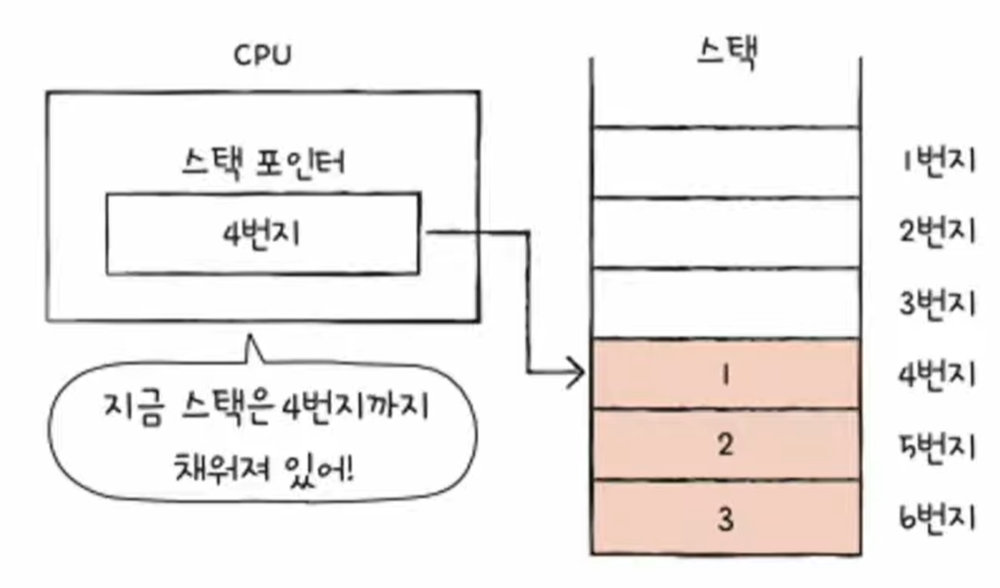
</div>

- **스택**과 **스택 포인터**를 이용한 **주소 지정 방식**이다.
- 스택은 메모리 내에 **스택 영역**이라는 곳에 존재한다.
- **스택 포인터**란 스택의 가장 마지막에 저장된 값의 위치를 나타낸다.

### ❇️ 특정 레지스터를 이용한 주소 지정 방식 :: (2) 변위 주소 지정 방식

<div align="center">
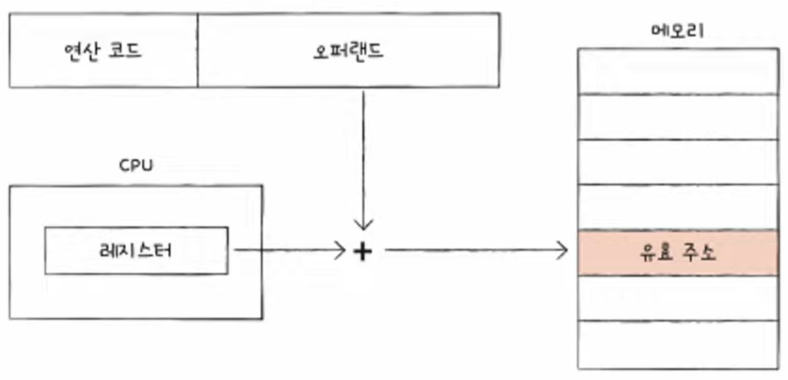
<p/>
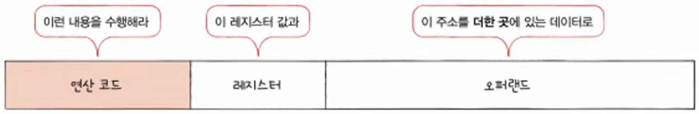
</div>

- 변위 주소 지정 방식은 **오퍼랜드 필드의 값**(변위)과 특정 **레지스터의 값**을 **더하여** 유효 주소를 얻어내는 **주소 지정 방식**이다.
- 오퍼랜드 필드의 주소와 **어떤 레지스터의 값**을 더하는지에 따라 **상대 주소 지정 방식**과 **베이스 레지스터 주소 지정 방식** 등으로 나뉜다.

#### 🔍 a. 상대 주소 지정 방식

<div align="center">
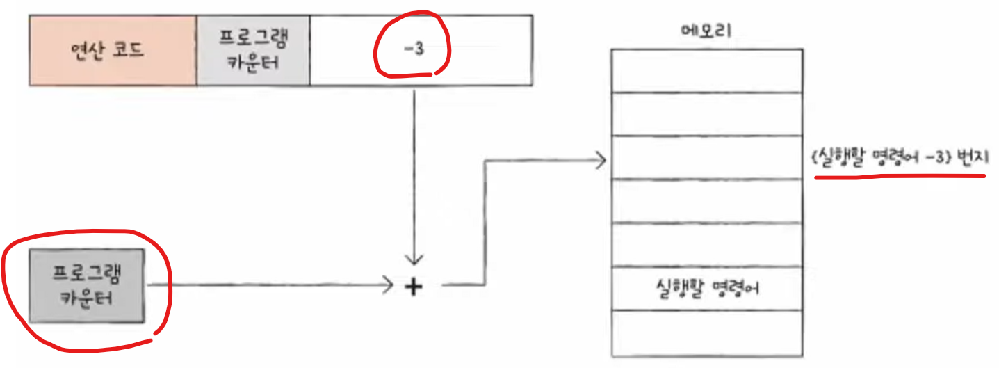
</div>

- 상대 주소 지정 방식은 **오퍼랜드**와 **프로그램 카운터**의 값을 더하여 유효 주소를 얻는 방식이다.
- 위의 예시에서 프로그램 카운터에 있던 명령어의 주소에 -3 만큼 이전에 있는 주소의 메모리에 있는 값을 가져온다.
- 프로그래밍 언어의 if문과 유사하게 모든 코드를 실행하는 것이 아닌, 분기하여 특정 주소의 코드를 실행할 때 사용된다.

#### 🔍 b. 상대 주소 지정 방식

<div align="center">
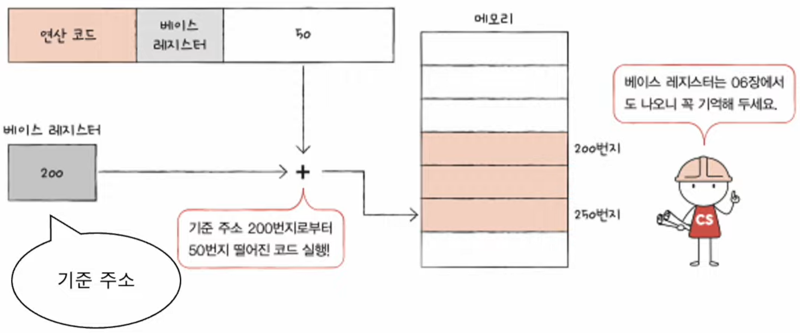
</div>

- 베이스 레지스터 주소 지정 방식은 **오퍼랜드**와 **베이스 레지스터의 값**을 더하여 유효 주소를 얻는 방식이다.


---
<br>


## 3) 명령어 사이클과 인터럽트

```markdown
💡 CPU가 하나의 명령어를 처리하는 흐름인 명령어 사이클과 그 흐름을 방해하는 인터럽트에 대해 알아본다
```

### ❇️ 명령어 사이클

> **명령어 사이클**이란 CPU가 하나의 명령어를 처리하는 정형화된 과정을 뜻한다.

<div align="center">
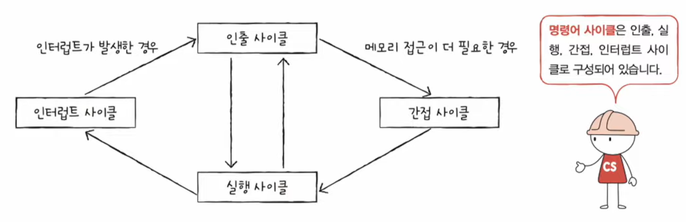
<p style="font-weight:bold;">[명령어 사이클 도식화]</p>
</div>

📌 명령어 사이클은 다음과 같이 크게 4가지로 구분된다

- **인출 사이클**: 메모리에 있는 명령어를 CPU로 가지고 오는 단계
- **실행 사이클**: CPU로 가져온(인출된) 명령어를 실행하는 단계
- **간접 사이클**: 주소 지정 방식과 같이 메모리에 접근이 필요한 경우 메모리에 있는 데이터를 CPU로 가지고 오는 단계
- **인터럽트 사이클**: 인터럽트가 발생한 경우, 인터럽트 서비스 루틴을 처리하는 단계

프로그램을 이루는 수많은 명령어는 일반적으로 인출과 실행 사이클을 무수히 반복하며 실행된다.  

### ❇️ 인터럽트 (Interrupt)

- 인터럽트(interrupt): 방해하다, 중단시키다  
- 즉, 인터럽트란 CPU가 작업을 계속 수행하고 있는 도중에 외부 요인에 의해 중단되는 경우를 말한다
- "CPU가 꼭 주목해야 할 때" 혹은 "CPU가 얼른 처리해야 할 다른 작업이 생겼을 때" 발생한다

<div align="center">
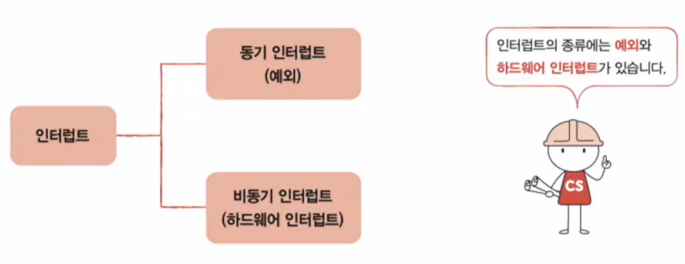
</div>

### ❇️ 동기 인터럽트 (Synchronous interrupt) ≒ 예외 (Exception)

- **CPU에 의해 발생**하는 인터럽트이다
- CPU가 명령어들을 수행하다가 **예기치 못한 오류**가 발생했을 때 발생하는 인터럽트이다
- 이러한 점에서 동기 인터럽트는 **예외**(Exception)이라는 표현을 더 많이 사용한다

### ❇️ 비동기 인터럽트 (Asynchronous interrupt) ≒ 인터럽트 ≒ 하드웨어 인터럽트

- 주로 **입출력장치에 의해 발생**하는 인터럽트이다
- 흔히 **인터럽트**라고 말하는 것이 비동기 인터럽트를 뜻하며, **하드웨어 인터럽트**라는 명칭도 많이 사용된다 
- 알림과 같은 인터럽트이다
- 입출력장치는 CPU보다 속도가 현저히 느리기 때문에 비동기 방식으로 인터럽트를 발생시킨다

#### 🔍 인터럽트 처리 순서

<div align="center">
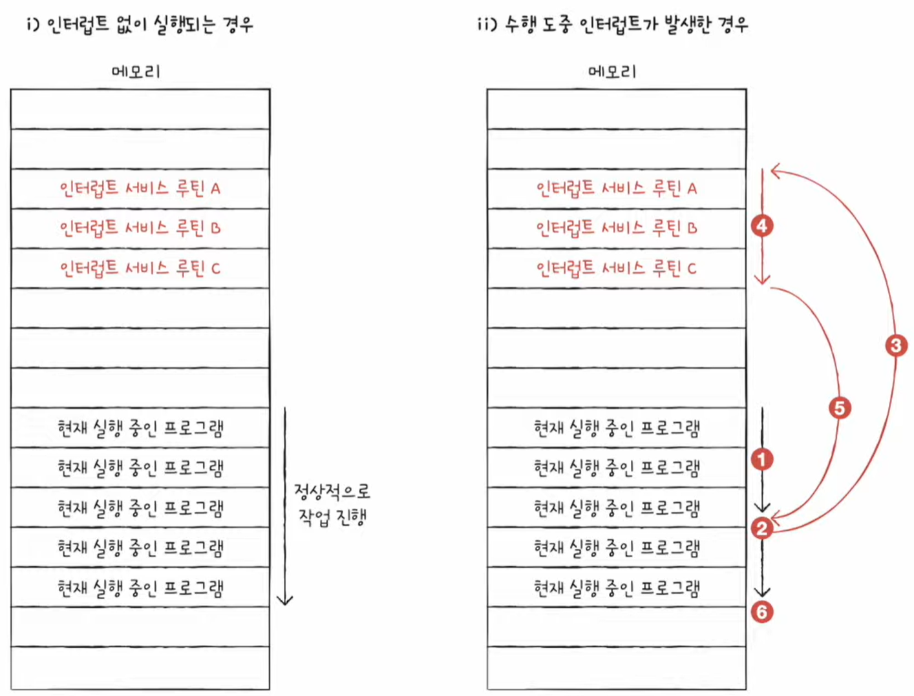
</div>

> ① 입출력장치는 CPU에 **인터럽트 요청 신호**를 보낸다  
> ② CPU는 실행 사이클이 끝나고 명령어를 인출하기 전 항상 인터럽트 여부를 확인한다  
> ③ CPU는 인터럽트 요청을 확인하고 **인터럽트 플래그**를 통해 현재 인터럽트를 받아들일 수 있는지 여부를 확인한다    
> ④ 인터럽트를 받아들일 수 있다면 CPU는 지금까지의 작업을 **백업**한다  
> ⑤ CPU는 **인터럽트 벡터**를 참조하여 **인터럽트 서비스 루틴**을 실행한다  
> ⑥ 인터럽트 서비스 루틴 실행이 모두 끝나면 ④에서 백업해 둔 작업을 복구하여 **실행을 재개**한다  

#### 🔍 인터럽트 요청 신호

- 인터럽트가 발생했다고 CPU에게 알리는 요청 신호

#### 🔍 인터럽트 플래그

<div align="center">
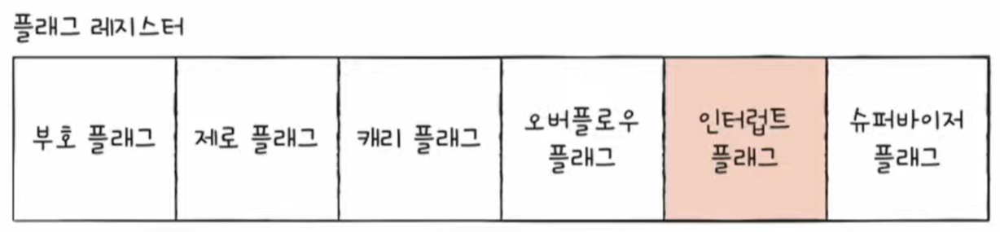
</div>

- CPU가 현재 인터럽트 요청을 **처리할 수 있는지 여부**에 대한 플래그 값이다
- `1: 처리 가능`, `0: 처리 불가능`
- 0일 경우 인터럽트 요청이 들어오더라도 해당 요청은 무시된다
- 무시할 수 없는 인터럽트 요청도 있다
  - 막을 수 있는 인터럽트: 일반적인 입출력 인터럽트
  - 막을 수 없는 인터럽트: 정전이나 하드웨어 고장 등의 반드시 가장 먼저 처리해야 하는 인터럽트

#### 🔍 인터럽트 벡터

<div align="center">
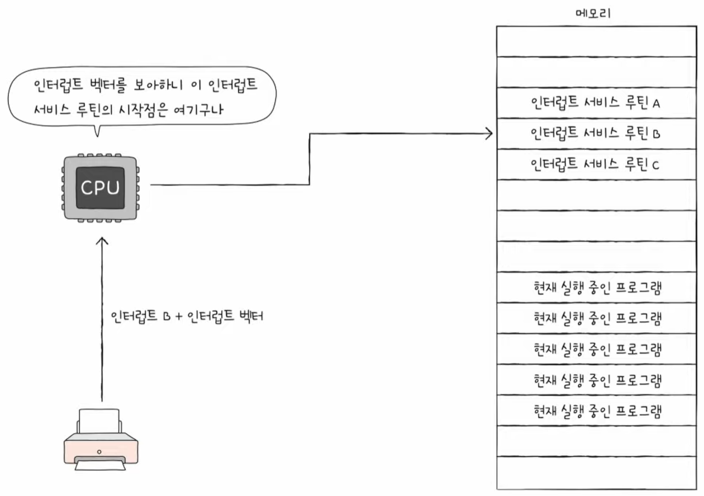
</div>

- 인터럽트 서비스 루틴을 식별하기 위한 정보 (시작 주소값)
- CPU는 하드웨어 인터럽트 **요청을 보낸 대상**으로부터 데이터 버스를 통해 **인터럽트 벡터를 전달받는다**

#### 🔍 인터럽트 서비스 루틴 (ISR, Interrupt Service Routine)

- 인터럽트를 처리하기 위한 프로그램이다
- 어떤 인터럽트가 발생했을 때 해당 인터럽트를 어떻게 처리하고 작동해야 할지에 대한 정보로 이루어진 프로그램이다
- 인터럽트 핸들러(Interrupt Handler)라고 부르기도 한다

> 💡 인터럽트 서비스 루틴의 작업이 모두 끝난 뒤, 기존의 작업을 다시 재개하려면 어떻게 해야할까?  
> → 서비스 루틴을 시작하기 전에 프로그램을 재개하기 위해 필요한 모든 정보를 **스택에 백업**한다

<div align="center">
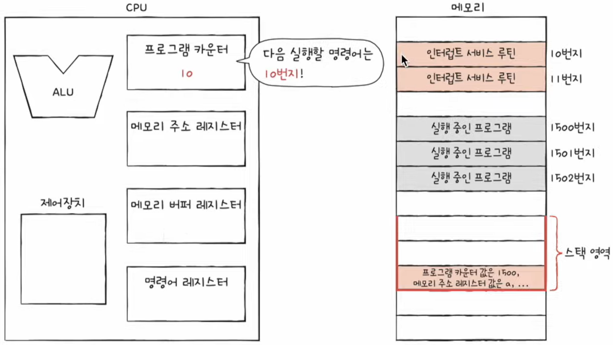
</div>

- 인터럽트 서비스 루틴을 실행하기 전, 프로그램 카운터 값 등 현재 프로그램을 재개하기 위해 필요한 모든 내용을 **스택에 백업**한다
- 스택은 메모리 내에 **스택 영역**이라는 곳에 존재한다.


### ⚙️ [좀 더 알아보기] 예외의 종류

<div align="center">
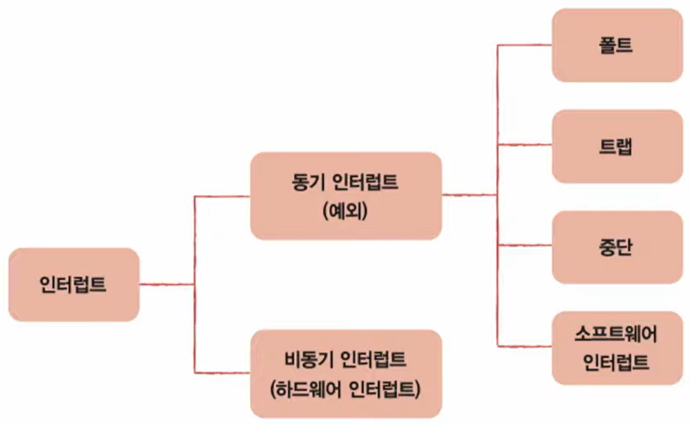
</div>

예외가 발생하면 CPU는 하던 일을 중단하고 해당 예외를 처리해야 한다.  
예외가 발생한 명령어부터 실행하느냐, 예외가 발생한 명령어의 다음 명령어부터 실행하느냐에 따라 **폴트**와 **트랩**으로 나뉜다.

- **폴트(fault)**: 예외를 처리한 직후 예외가 발생한 명령어부터 실행을 재개.
- **트랩(trap)**: 예외가 발생한 명령어의 다음 명령어부터 실행을 재개. 주로 디버깅할 때 사용.
- **중단(abort)**: CPU가 실행 중인 프로그램을 강제로 중단시킬 수밖에 없는 심각한 오류를 발견했을 때 발생하는 예외
- **소프트웨어 인터럽트(software interrupt)**: 시스템 호출이 발생했을 때. (09장에서 다룸)

---
<br>

## 궁금증

- 부호 플래그?? 제로 플래그??
- 연산 결과의 음수 값은 부호 플래그를 통해 구분?
- 그렇다면 메모리와 램에 음수 값을 저장할 때는 어떻게 하는가?
  - 실제 메모리에서는 첫 번째 비트를 부호 비트로 사용한다.
  - ex) Java의 Int 자료형의 크기는 32Bits 즉, -2^31 ~ 2^31-1 (-2147483648 ~ 2147483647)

- [[유튜브 - 코딩애플] CPU는 집에서 만들지말고 사서쓰세요 제발](https://www.youtube.com/watch?v=WGKHEIpXy5c)
  - 트랜지스터란?
  - 논리게이트(NOT, AND, OR, XOR 등)
  - 덧셈 논리 회로(XOR + AND + OR, half Adder, 올림수)
  - 8비트 CPU
- [[유튜브 - bRd 3D] CPU는 어떻게 작동할까?](https://www.youtube.com/watch?v=Fg00LN30Ezg&t=819s)
  - 트랜지스터란? (P형, N형, PNP, NPN 반도체)
  - 논리게이트(NOT, AND, OR, XOR 등)
  - 덧셈 논리 회로(XOR + AND + OR, half Adder, 올림수)
  - 메모리(REGISTER, CACHE, RAM, SSD(Hard Disk))
  - CPU 동작 원리(ALU, 누산기, 제어장치(CU), 레지스터)
- [[나무위키] 캐시메모리](https://namu.wiki/w/%EC%BA%90%EC%8B%9C%20%EB%A9%94%EB%AA%A8%EB%A6%AC)