# Chapter 05. CPU 성능 향상 기법

- [05-1) 빠른 CPU를 위한 설계 기법]()
- [05-2) 명령어 병렬 처리 기법]()
- [05-3) CISC와 RISC]()

## 1️⃣ 빠른 CPU를 위한 설계 기법

```markdown
💡 클럭과 코어, 스레드라는 개념을 알아보고, 빠른 CPU를 만드는 설계 기법인 멀티코어와 멀티스레드란 무엇인지 이해한다
```

<div align="center">
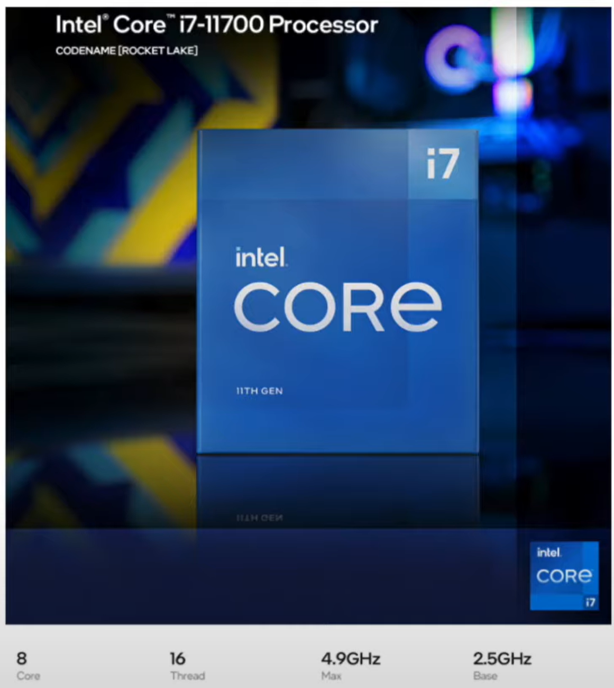
</div>

### ❇️ 클럭

- 컴퓨터 부품들은 '**클럭 신호**'에 맞춰 일사불란하게 움직인다
- **클럭 속도**는 헤르츠(Hz) 단위로 측정하여, 1초에 몇 번 반복되는지를 나타낸다
- 일반적으로 클럭 속도가 높은 CPU가 성능이 좋지만, 발열 등의 이유로 무조건 높다고 빨라지는 것은 아니다
- ex) (Base) 2.5GHz (Max) 4.9GHz :: 1초에 클럭이 25억번(2.5*10^9), 순간적으로 최대 49억번(4.9*10^9) 반복

❗클럭 속도는 일정하지 않다. 최대 클럭 속도를 강제로 끌어올리는 기법을 오버클럭킹(overclocking)이라고 한다.

### ❇️ 코어와 멀티코어

<div align="center" style="display:flex; align-items: center; justify-content: center;">
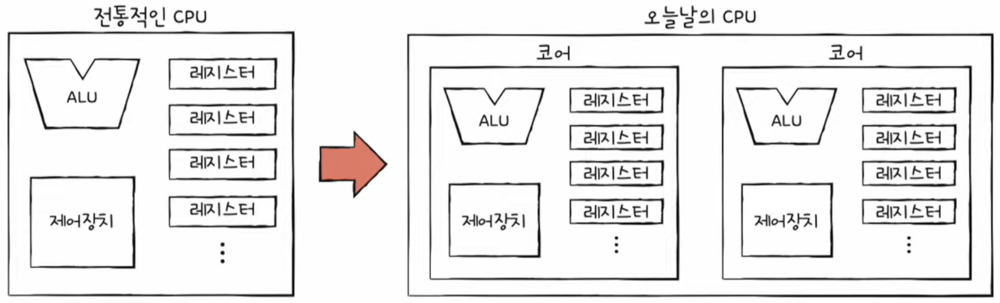
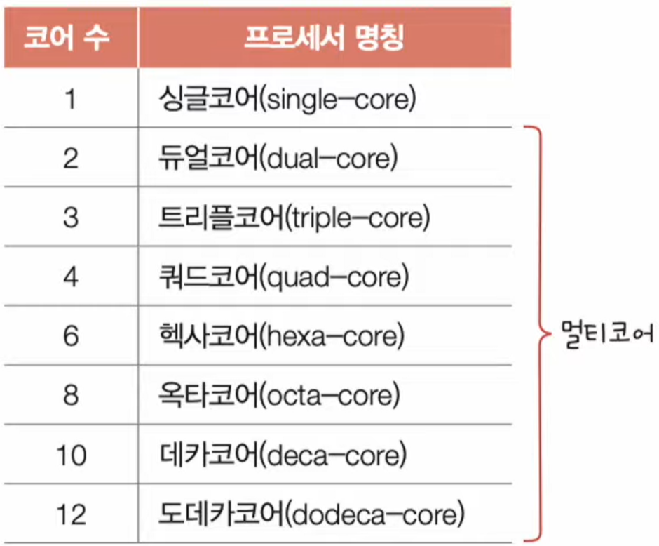
</div>

- 코어(Core)는 CPU내의 명령어를 실행하는 부품(ALU, CU, Register 등)을 통틀어 말한다
- CPU의 성능을 높이는 대표적인 방법으로 코어 수를 늘리는 것이다 (멀티코어)
- 작업량에 비해 코어 수가 너무 높으면 CPU의 성능이 더 이상 늘어나지 않는다

### ❇️ 스레드와 멀티스레드

- **스레드**의 사전적 의미는 '실행 흐름의 단위'를 뜻한다
  - **하드웨어 스레드**: 하나의 코어가 동시에 처리할 수 있는 명령어의 개수
  - **소프트웨어 스레드**: 하나의 프로그램에서 독립적으로 실행되는 단위(개수)

#### 🔍 하드웨어적 스레드

<div align="center">

</div>

- 하드웨어적 스레드는 하나의 코어가 동시에 처리할 수 있는 명령어의 단위(개수)를 뜻한다
- 예) 2코어 4스레드 CPU : 2개의 코어가 한 번에 4개의 명령어를 처리
- 이처럼 하나의 코어로 여러 명령어를 동시에 처리하는 CPU를 **멀티스레드 프로세서** 혹은 **멀티스레드 CPU**라고 한다

(하이퍼스레딩은 인텔에서 개발하는 멀티스레드 기술을 부르는 이름이다)

#### 🔍 소프트웨어적 스레드

<div align="center">
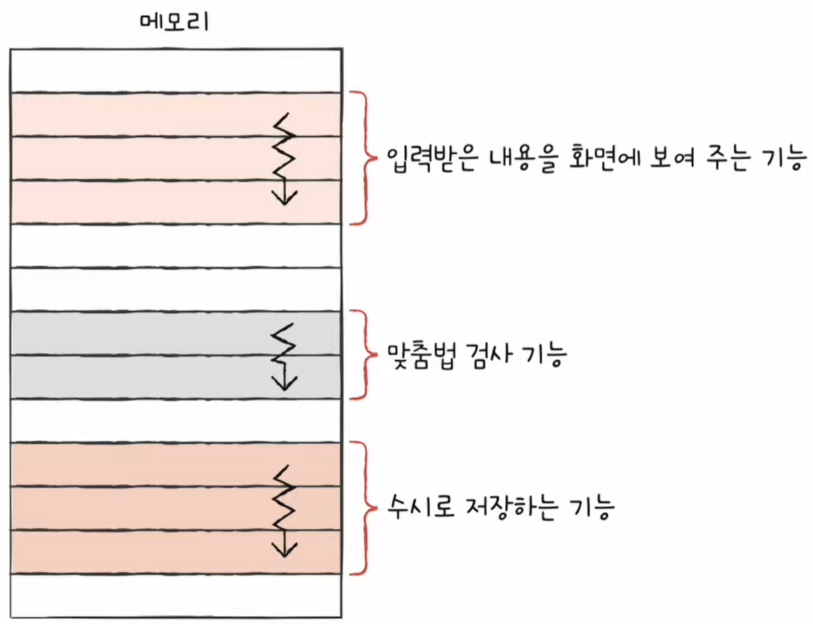
</div>

- 하나의 프로그램에서 독립적으로 실행되는 단위(개수)를 의미한다

#### 🔍 멀티스레드 프로세서

<div align="center">
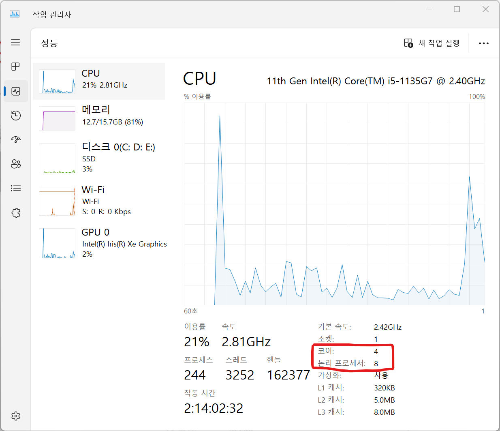
</div>

- 멀티스레드 프로세서의 가장 큰 핵심은 **레지스터의 개수**이다
- 하나의 코어로 여러 개의 명령어를 동시에 처리하도록 만들기 위해 프로그램 카운터, 스택 포인터 등 하나의 명령어를 처리하기 위해 꼭 필요한 레지스터를 여러개 가지고 있으면 된다
- 하드웨어 스레드는 **논리 프로세서**라고 부르기도 한다 (프로그램 입장에서 스레드와 코어의 차이가 구분이 안되기 때문)


---
<br/>


## 2️⃣ 명령어 병렬 처리 기법

```markdown
💡 명령어를 빠르고 효율적으로 처리하기 위해 CPU를 한시도 쉬지 않고 작동시키는 명령어 병렬 처리 기법을 알아본다
```

### ❇️ 명령어 파이프라인

<div align="center" style="display:flex; align-items: center; justify-content: center;">


</div>

> ① 명령어 인출(Instruction Fetch)  
> ② 명령어 해석(Instruction Decode)  
> ③ 명령어 실행(Excute Instruction)  
> ④ 결과 저장(Write Back)

- **명령어 파이프라인**은 하나의 명령어가 처리되는 전체 과정을 **단계별로 나누어** 실행하여 **동시에 여러개의 명령어를 수행하는 기법**이다
- 각각의 명령어들의 **단계가 겹치지 않게** 하면 동시에 여러개의 명령어를 처리할 수 있다
- 하지만, 특정 상황에서는 동시 실행이 불가능한 경우도 있는데 이를 **파이프라인 위험**이라고 부른다

⚠️ (전공서에 따라 명령어 처리 단계를 나누는 기준이 다를 수 있다)

### ❇️ 파이프라인 위험

<div align="center">
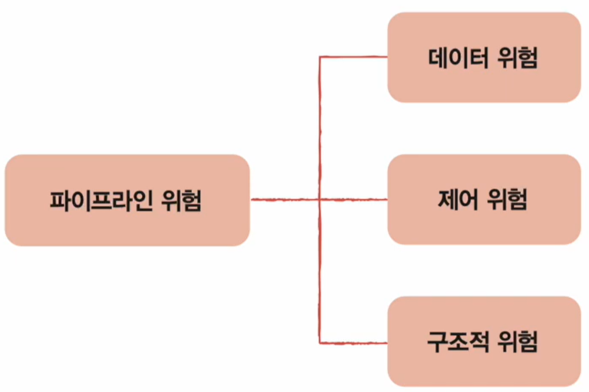
</div>

#### 🔍 데이터 위험 (Data Hazard)

<div align="center">

</div>

- **데이터 위험**은 명령어 간 **데이터 의존성**이 존재하는 경우 발생한다
- 위 예시에서와 같이 [명령어2]는 [명령어1]의 실행이 모두 완료된 후에 실행되어야 문제가 발생하지 않는다  
  즉, 이러한 경우 **[명령어2]는 [명령어1]의 데이터에 의존적이다** 라고 하며, 이러한 상황을 **데이터 위험**이라고 한다

#### 🔍 제어 위험 (Control Hazard)

<div align="center">
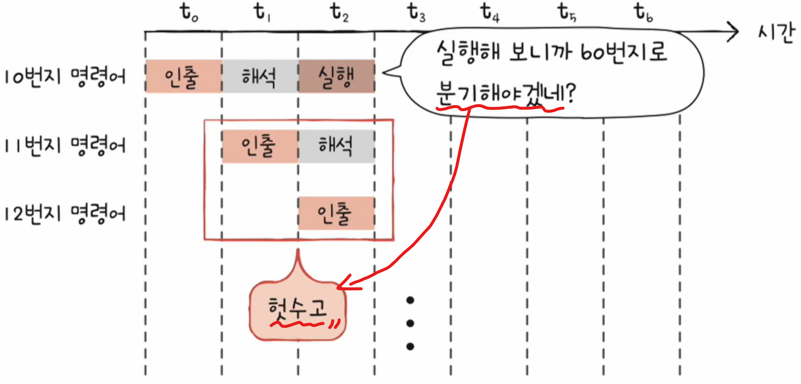
</div>

- **제어 위험**은 주로 분기 등으로 인한 **프로그램 카운터의 갑작스러운 변화**에 의해 발생한다
- 위 그림과 같이 어떤 명령어를 처리하다가 카운터의 변화로 프로그램의 실행 흐름이 바뀌게 될 경우 그 다음 명령어 파이프라인에서 처리중이었던 명령어 실행들이 헛수고가 된다
- 이를 보완하기 위해 프로그램이 어디로 분기할지 **미리 예측**한 후 **그 주소를 인출**하는 기술을 **분기 예측**(branch prediction)이라고 한다

#### 🔍 구조적 위험 (Structural Hazard)

- **구조적 위험**은 명령어들을 겹쳐 실행하는 과정에서 서로 다른 명령어가 동시에 ALU, 레지스터 등과 같은 CPU 자원을 사용하려고 할 때 발생한다
- **자원 위험**(Resource Hazard)이라고 부르기도 한다

### ❇️ 슈퍼스칼라 (Superscalar)

<div align="center" style="display:flex; align-items: center; justify-content: center;">
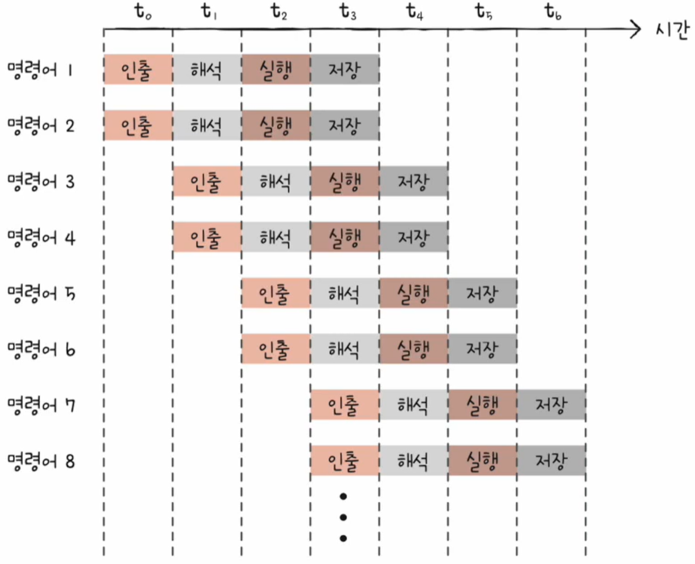

</div>

- 오늘날 대부분의 CPU에서는 위와 같이 **여러 개의 명령어 파이프라인**을 구성하며 이를 **슈퍼스칼라**라고 한다
- 이러한 CPU를 **슈퍼스칼라 프로세서** 혹은 **슈퍼스칼라 CPU**라고 부른다
- 슈퍼스칼라 프로세서는 매 클럭 주기마다 동시에 여러 명령어의 인출, 해석, 실행할 수 있어야 한다

✅ 이론적으로는 파이프라인의 개수에 비례하여 프로그램 처리 속도가 빨라진다. 하지만 파이프라인 위험 등의 예상치 못한 문제로 인해 반드시 비례하지는 않기 때문에 고도화된 CPU 설계 작업이 필요하다.

### ❇️ 비순차적 명령어 처리 (OoOE, Out-of-order execution)

<div align="center">
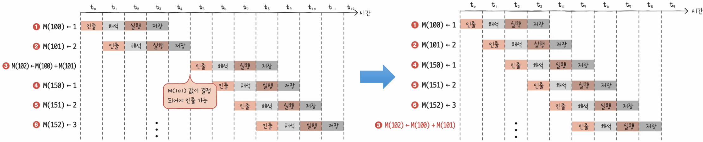
</div>

- 오늘날 **CPU 성능 향상에 크게 기여한 기법**이자 대부분의 CPU가 차용하고 있다
- **비순차적 명령어 처리**는 명령어들을 비순차적으로 실행하여 CPU를 최대한 효율적으로 활용하는 기법이다
- 위 그림과 같이 왼쪽의 경우 ②번 명령어에서 파이프라인이 멈추게 되는데, ③번과 ⑥번의 순서를 바꿔서 실행하여 대기 시간을 최소화 할 수 있다
- 즉, 순서를 바꿔 실행해도 무방한 명령어를 먼저 실행하여 **명령어 파이프라인이 멈추는 것을 방지하는 기법**이다

---
<br/>


## 3️⃣ CISC와 RISC

```markdown
💡 CPU의 언어인 ISA가 무엇인지 이해하고, 현대 CPU의 주요 설계 방식인 CISC와 RISC의 정의와 차이점에 대해 알아본다.
```

> 명령어 파이프라이닝과 슈퍼스칼라 기법을 실제로 CPU에 적용하려면 명령어가 파이프라이닝에 최적화되어 있어야 한다.  
> 즉, CPU가 인출하고 해석하고 실행하는 명령어가 쉬운 형태로 되어 있어야 한다.

### ❇️ 명령어 집합 구조 (ISA, Instruction Set Architecture)

- CPU가 이해할 수 있는 명령어들의 모음을 명령어 집합(Instruction Set) 또는 **명령어 집합 구조**(ISA)라고 한다
- **CPU마다 ISA가 조금씩 다를 수 있으며**, 이에 따라 명령어와 어셈블리어, 프로그램 실행 파일들도 모두 달라지게 된다
- ex) 인텔 CPU는 x86 혹은 x86-64 ISA, 애플의 아이폰 CPU는 ARM ISA

<div align="center">
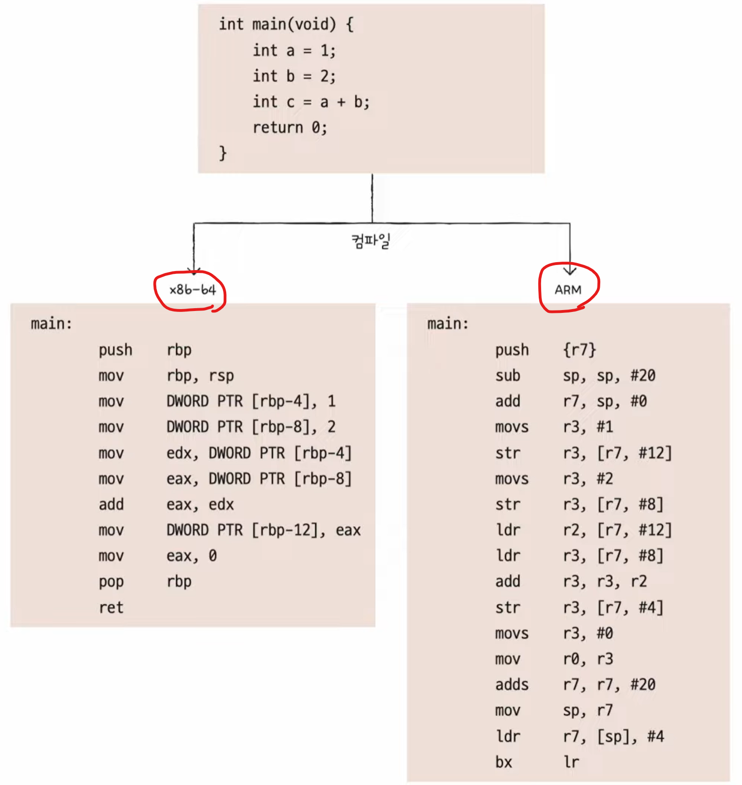
</div>

- ISA가 같은 CPU끼리는 서로의 명령어 이해 가능. 다르면 이해 불가능하다.  
  (**ISA**는 일종의 **CPU의 언어**라고 볼 수 있다)
- ISA가 다르면 제어장치가 명령어를 해석하는 방식, 사용되는 레지스터 종류의 개수, 메모리 관리 방법, 그리고 CPU 하드웨어 설계에도 큰 영향을 미친다
- 앞서 배운 **명령어 병렬 처리 기법**들을 적용하기에 용이한 ISA가 있고, 그렇지 못한 ISA가 있다.
- 현대 ISA의 양대 산맥에는 **CISC**와 **RISC**가 있다

### ❇️ CISC (Complex Instruction Set Computer)

<div align="center" style="display:flex; align-items: center; justify-content: center;">
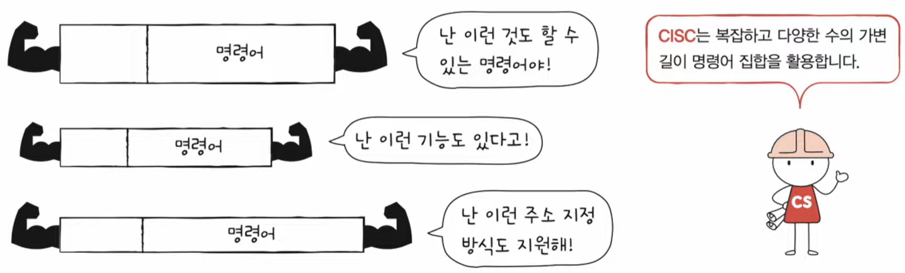

</div>

- 이름 그대로 **복잡하고 다양한 명령어들을 활용하는 CPU 설계 방식**이다
- 명령어의 형태와 크기가 다양한 **가변 길이 명령어**를 활용
- 다양하고 강력한 명령어 활용 → 적은 수의 명령어로 프로그램 실행 → **메모리 절약** 장점
- 그러나, 복잡한 가변 길이 명령어 → 실행 시간 길고 일정치 않음(여러 클럭 주기 필요) → 명령어 파이프라이닝 어려움 → **매우 치명적인 단점**‼️
- 즉, CISC 기반 CPU는 성장의 한계가 있다


### ❇️ RISC (Reduced Instruction Set Computer)

<div align="center" style="display:flex; align-items: center; justify-content: center;">
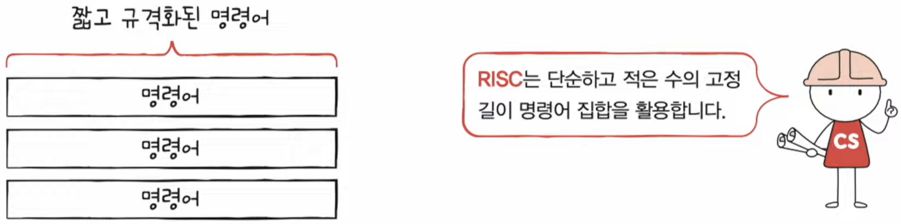
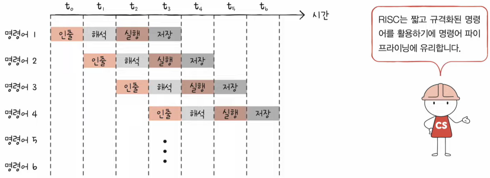
</div>

- 이름 그대로 **단순하고 적은 명령어를 활용하는 CPU 설계 방식**이다
- 원활한 파이프라이닝을 위해 **명령어 길이와 수행 시간이 짧고 규격화** 됨
- **자주 쓰이는 기본적인 명령어를 작고 빠르게 만드는 것**을 중요시 함 (실행 시간 1클럭 내외를 지향함)
- **고정 길이 명령어** 사용
- 메모리 직접 접근 명령어를 load와 store 두 개로 제한할 만큼 단순화하고 최소화를 추구 (load-store 구조)
- 주소 지정 방식의 종류가 적은 경우가 많다
- 메모리 접근을 단순화, 최소화하는 대신 **레지스터를 적극적으로 활용**
- CISC보다 프로그램 용량은 많이 차지함

### ✅ CISC vs RISC

| CISC                             | RISC                            |
|----------------------------------|---------------------------------|
| 복잡하고 다양한 명령어                     | 단순하고 적은 명령어                     |
| 가변 길이 명령어                        | 고정 길이 명령어                       |
| 다양한 주소 지정 방식                     | 적은 주소 지정 방식                     |
| 프로그램을 이루는 명령어의 수가 적음 (메모리 용량 작음) | 프로그램을 이루는 명령어의 수가 많음 (메모리 용량 큼) |
| 여러 클럭에 걸쳐 명령어 수행                 | 1클럭 내외로 명령어 수행                  |
| 파이프라이닝하기 어려움                    | 파이프라이닝에 최적화                     |

> 💡 현대에 와서는 CISC 기반의 CPU도 **마이크로 명령어**라는 기술을 활용하여 CPU 내부적으로 RISC 방식과 비슷하게 1클럭 내외로 동작하도록 설계 방식을 계속 보완해 나가고 있다.

---
<br/>


## *️⃣ References

- [[컴퓨터 공학 기초 강의] 12강. 빠른 CPU를 위한 설계 기법](https://www.youtube.com/watch?v=VO0RQAA7KYc&list=PLVsNizTWUw7FCS83JhC1vflK8OcLRG0Hl&index=14)
- [[컴퓨터 공학 기초 강의] 13강. 명령어 병렬 처리 기법](https://www.youtube.com/watch?v=Btsa_U-f26k&list=PLVsNizTWUw7FCS83JhC1vflK8OcLRG0Hl&index=15)
- [[컴퓨터 공학 기초 강의] 14강. 명령어 집합 구조, CISC와 RISC](https://www.youtube.com/watch?v=lJwIERMo_N4&list=PLVsNizTWUw7FCS83JhC1vflK8OcLRG0Hl&index=16)


