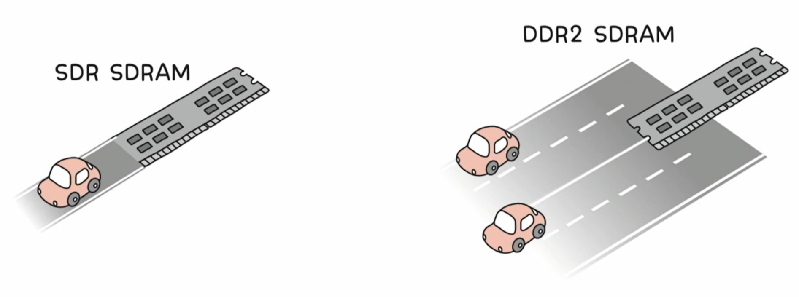
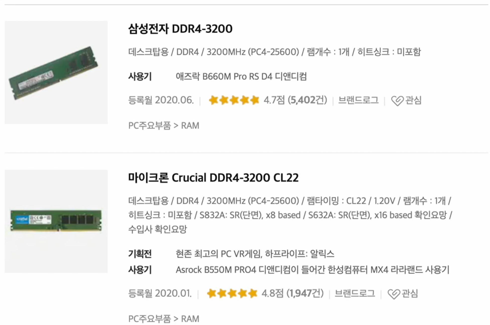
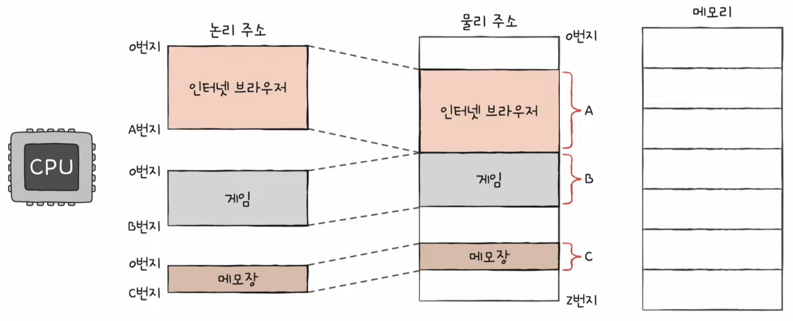
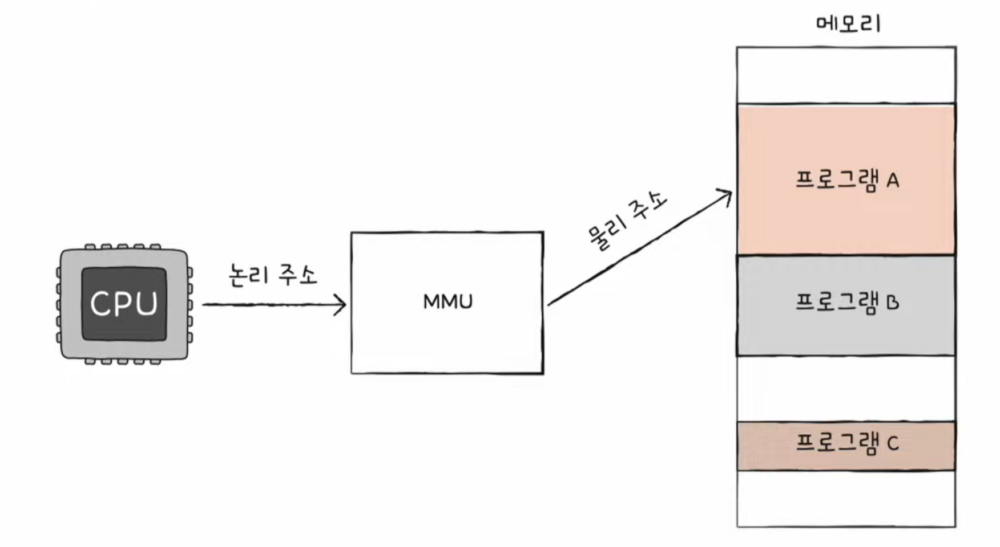
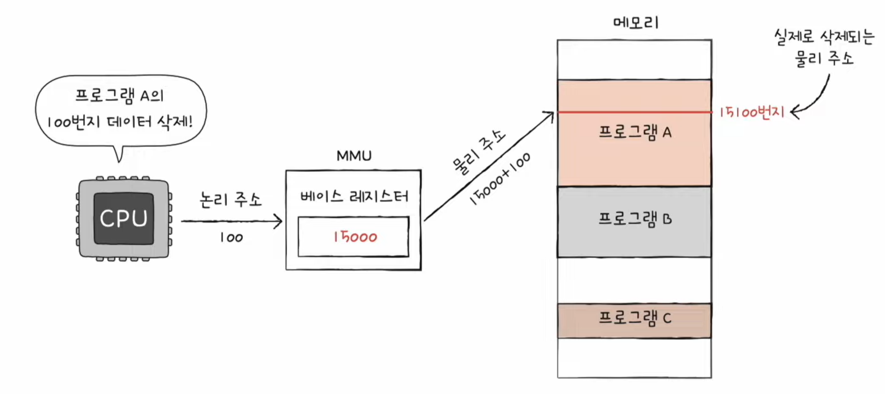
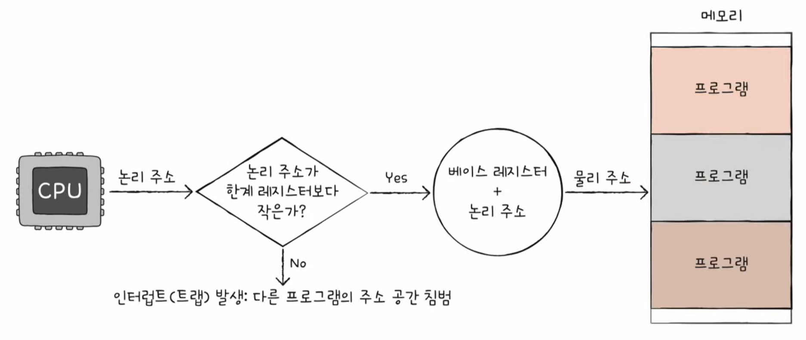
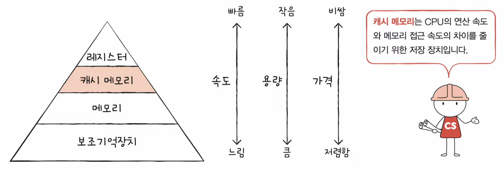
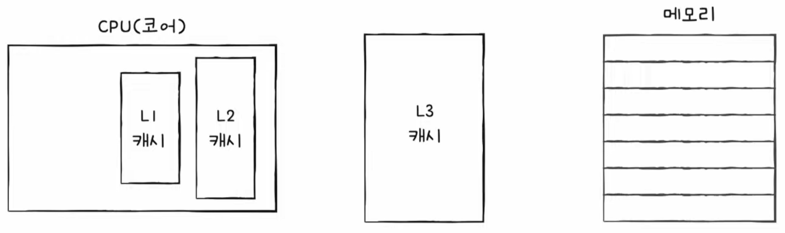
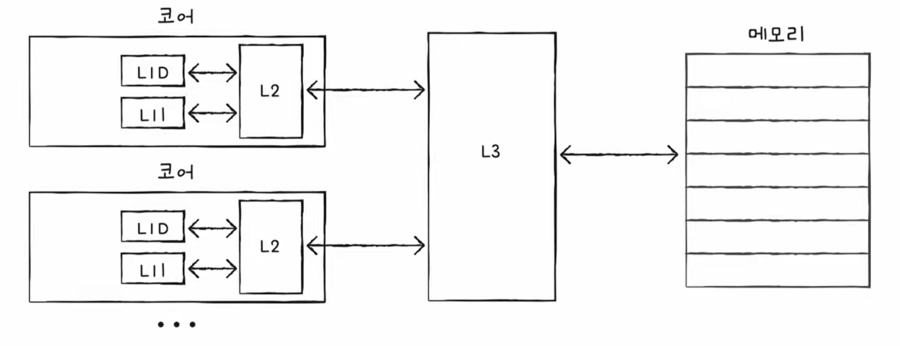
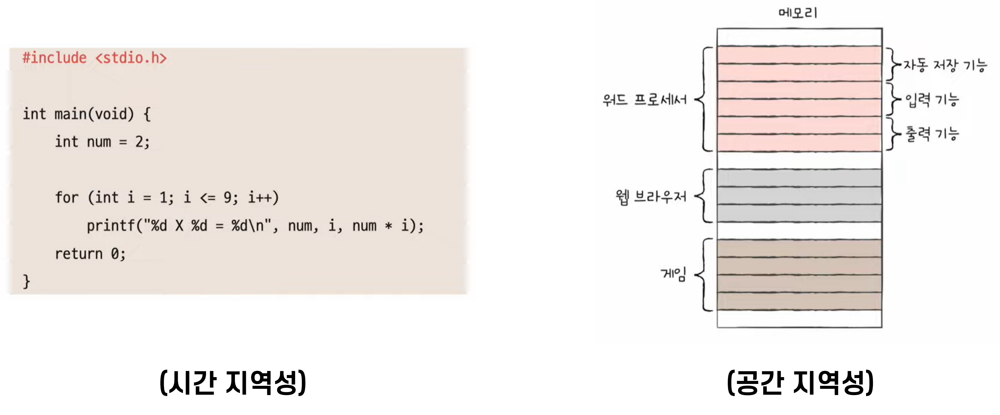

# Chapter 06. 메모리와 캐시 메모리

- [1) RAM의 특징과 종류](#1%EF%B8%8F⃣--ram의-특징과-종류)
- [2) 메모리의 주소 공간](#2%EF%B8%8F⃣--메모리의 주소 공간)
- [3) 캐시 메모리](#3%EF%B8%8F⃣--캐시-메모리)

---
<br/>


## 1️⃣ RAM의 특징과 종류

```markdown
💡 RAM의 하드웨어적 특성과 종류에 대해 알아보기
```

> 여기서 RAM이란?  
> 컴퓨터에서 실행중인 프로그램의 데이터와 명령어를 일시적으로 저장하기 위한 공간.  

### ❇️ RAM의 특징

- 전원이 종료되면 데이터가 날아가는 **휘발성 저장 장치**

### ❇️ RAM의 용량과 성능

- RAM의 용량이 크면 많은 프로그램을 동시에 빠르게 실행하는 데 유리하다
- 즉, 램의 용량이 클수록 성능이 높아지지만 필요 이상으로 커졌을 때는 더 이상 성능 향상이 이루어지지 않는다

### ❇️ RAM의 종류

- DRAM
- SRAM
- SDRAM
- DDR SDRAM

#### ✔️ DRAM (Dynamic RAM)

- 시간이 지나면 저장된 데이터가 점차 사라지는 RAM (Dynamic)
- 데이터의 소멸을 막기 위해 일정 주기로 데이터 재활성화가 필요하다
- **소비 전력이 낮고**, **가격이 저렴**하다
- **집적도가 높아 대용량으로 설계**하기에 용이하다
- 컴퓨터의 메인 메모리에 사용

#### ✔️ SRAM (Static RAM)

- 데이터가 사라지지 않는 RAM (Static)
- DRAM보다 **속도가 빠르다**
- 소비 전력이 크고, 가격이 비싸며, 집적도가 낮다
- 저용량의 속도가 빠른 메모리에 사용 **(캐시 메모리)**

#### ✔️ SDRAM (Synchronous Dynamic RAM)

- **클럭 신호와 동기화**된, 발전된 형태의 DRAM
- 즉, SDRAM은 클럭 주기에 맞춰서 동작하여 클럭 신호마다 CPU와 정보를 주고받을 수 있는 DRAM이다

#### ✔️ DDR SDRAM (Double Data Rate SDRAM)

<div align="center" style="display:flex; align-items: center; justify-content: center;">


</div>

- 대역폭을 2배로 넓혀 속도를 향상시킨 SDRAM  
  (대역폭: 데이터를 주고받는 길의 너비)
  - SDR SDRAM: Single Data Rate SDRAM (＝SDRAM)
  - DDR SDRAM: Double Data Rate SDRAM (＝SDRAM×2)
  - DDR2 SDRAM: DDR 2th Gen SDRAM (＝SDRAM×4)
  - DDR3 SDRAM: DDR 3th Gen SDRAM (＝SDRAM×8)
  - DDR4 SDRAM: DDR 4th Gen SDRAM (＝SDRAM×16)

---
<br/>


## 2️⃣ 메모리의 주소 공간

```markdown
💡 메모리의 주소 체계는 물리 주소와 논리 주소가 있다. 이 두 주소의 개념과 차이, 그리고 두 주소간 변환 방법을 알아본다
```

### ❇️ 물리 주소와 논리 주소

<div align="center">

</div>

- 물리 주소: 정보가 저장된 하드웨어상의 실제 주소
- 논리 주소: 실행 중인 프로그램 각각에게 부여된 가상 주소 (각각 0번지부터 시작)


### ❇️ 물리 주소와 논리 주소의 변환 (MMU)

<div align="center" style="display:flex; align-items: center; justify-content: center;">


</div>

CPU에서는 논리 주소만을 사용한다. 이를 메모리의 실제 주소에 접근하기 위해 메모리 관리 장치인 **MMU** (Memory Management Unit)를 거치게 된다.

- 물리 주소와 논리 주소는 **MMU**라는 하드웨어에 의해 변환
- MMU는 논리 주소와 **베이스 레지스터의 값**을 더하여 논리 주소를 물리 주소로 변환
  - 베이스 레지스터: 프로그램의 첫 번째 물리 주소의 값
  - 논리 주소: 프로그램의 시작점으로부터 떨어진 거리

### ❇️ 메모리 보호 기법

<div align="center">

</div>

- 논리 주소를 사용할 때, 다른 프로그램의 메모리 영역을 침범하는 경우를 막기 위함
- 논리 주소의 최대 크기를 **한계 레지스터**에 저장하여 보호함

---
<br/>


## 3️⃣ 캐시 메모리

```markdown
💡 저장 장치의 계층 구조를 알아보고, CPU와 메모리 사이에 위치한 캐시 메모리를 학습한다
```

### ❇️ 저장 장치 계층 구조 (Memory Hierarchy)

<div align="center">

</div>

1. CPU와 가까운 저장 장치는 빠르고, 멀리 있는 저장 장치는 느리다
2. 속도가 빠른 저장 장치는 저장 용량이 작고, 가격이 비싸다

### ❇️ 캐시 메모리

- CPU와 메모리 사이에 위치하여 레지스터보다 용량이 크고 메모리보다 빠른 SRAM 기반의 저장 장치
- CPU의 연산 속도와 메모리 접근 속도의 차이를 줄이기 위함

#### 🔍 계층적 캐시 메모리 (L1-L2-L3 캐시)

<div align="center">

</div>

- 속도는 `L1 > L2 > L3` 순으로 빠름
- 일반적으로 `L1`과 `L2`는 코어 내부에, `L3`는 코어 외부에 위치함

#### 🔍 멀티프로세서의 분리형 캐시 메모리 (L1-L2-L3 캐시, L1D & L1I)

<div align="center">

</div>

- 각 코어마다 `L1`과 `L2` 캐시가 존재
- 데이터만을 담기 위한 `L1D` 캐시
- 명령어만을 담기 위한 `L1I` 캐시
- 코어마다 `L1`과 `L2`의 싱크를 맞추는 것이 중요

### ❇️ 참조 지역성 원리 (Locality of reference, principle of locality)

- 캐시 메모리는 메모리(RAM)보다 용량이 작기 때문에, 모든 데이터를 다 저장할 수 없음
- **CPU가 자주 사용할 법한 데이터를 예측하여 저장함**
  - 캐시 히트(Cache Hit): 예측이 들어맞을 경우 (CPU가 캐시 메모리에 저장된 값을 활용할 경우, 성능 향상)
  - 캐시 미스(Cache Miss): 예측이 틀렸을 경우 (CPU가 메모리에 접근해야 하는 경우, 성능 하락)

```markdown
캐시 적중률 = 캐시 히트 횟수 / (캐시 히트 횟수 + 캐시 미스 횟수)
```

- **참조 지역성 원리란?**  
  CPU가 메모리에 접근할 때의 주된 경향을 바탕으로 만들어진 원리

<div align="center">

</div>

> 1. CPU는 최근에 접근했던 메모리 공간에 다시 접근하려는 경향이 있다. (시간 지역성, temporal locality)
> 2. CPU는 접근한 메모리 공간 근처를 접근하려는 경향이 있다. (공간 지역성, 순차 지역성, spatial locality)

