# Chapter 07. 다양한 보조기억장치

- [1) 다양한 보조기억장치]()
- [2) RAID의 정의와 종류]()

---
<br/>


## 1️⃣ 다양한 보조기억장치

```markdown
💡 가장 대표적인 보조기억장치인 하드 디스크와 플래시 메모리에 대해 알아보기
```

<div align="center">
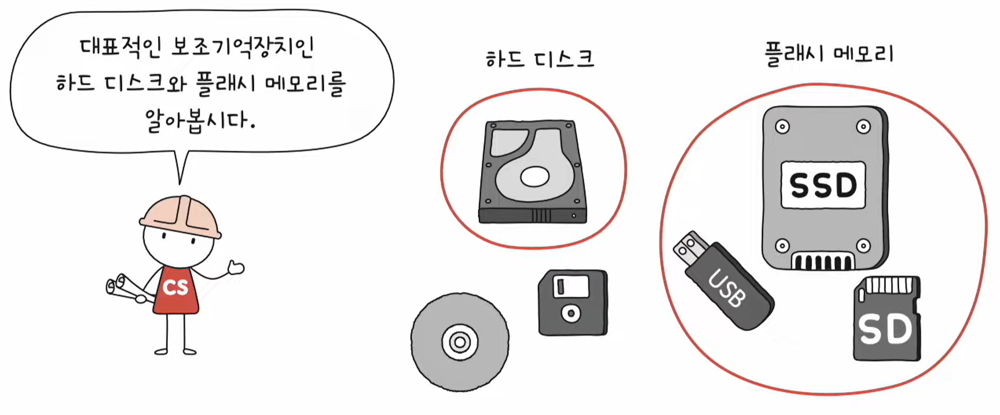
</div>

### ❇️ 하드 디스크 (HDD, Hard Disk Drive)

- **자기적인 방식**으로 데이터를 저장하는 보조기억장치
- 대용량 저장 장치나 서버실에서 많이 쓰인다

#### 🔍 하드 디스크의 구성 요소

<div align="center">
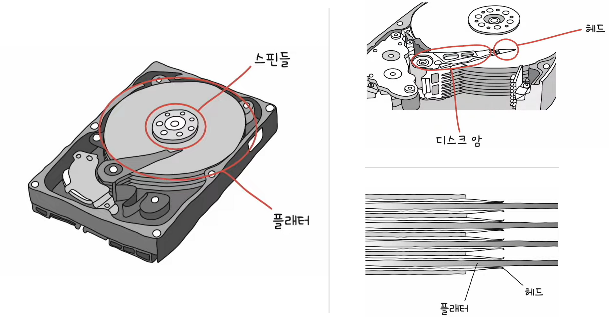
</div>

- **플래터(platter)**: 데이터가 저장되는 원판. N극과 S극으로 이루어진 수많은 자기 입자들로 덮여 있다.
- **스핀들(spindle)**: 플래터를 회전시키는 장치. RPM 단위를 사용한다.
- **디스크 암(disk arm)**: 헤드를 원하는 위치로 이동시키는 장치.
- **헤드(head)**: 플래터를 대상으로 데이터를 읽고 쓰는 장치.

> 📌 보다 많은 데이터를 저장하기 위해 **여러 겹**의 **양면 플래터**를 사용하며, 각 플래터마다 헤드가 위치해 있다. 

<div align="center">
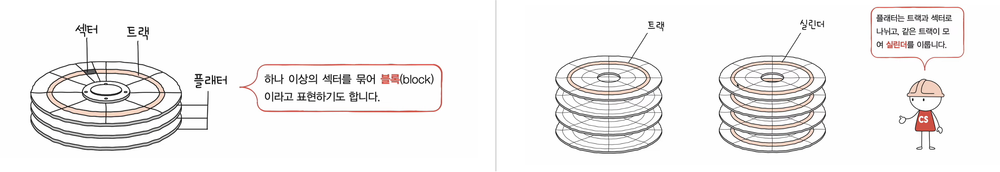
</div>

- **트랙(track)**: 플래터를 여러 동심원으로 나누었을 때 그중 하나의 원.
- **섹터(sector)**: 하드 디스크의 최소 기억 단위. 일반적으로 512바이트 정도의 크기. [(더보기)](https://ko.wikipedia.org/wiki/%EB%94%94%EC%8A%A4%ED%81%AC_%EC%84%B9%ED%84%B0)  
  _(하나 이상의 섹터를 묶어 블록(block)이라 불리는 단위도 있다)_
- **실린더(cylinder)**: 여러 겹의 플래터 상에서 같은 트랙이 위치한 곳을 모아 연결한 논리적 단위.
  _(헤드를 움직이지 않고도 바로 데이터에 접근이 가능하기 때문에, **연속된 정보는 보통 한 실린더에 기록**)_

#### 🔍 하드 디스크의 접근 소요 시간

<div align="center">
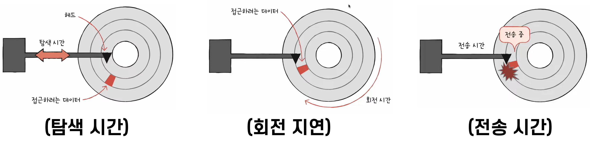
</div>

- 탐색 시간(seek time): 데이터가 저장된 트랙까지 헤드를 이동시키는 시간
- 회전 지연(rotational latency): 헤드가 있는 곳으로 플래터를 회전시키는 시간
- 전송 시간(transfer time): 하드 디스크와 컴퓨터 간에 데이터를 전송하는 시간

<div align="center">
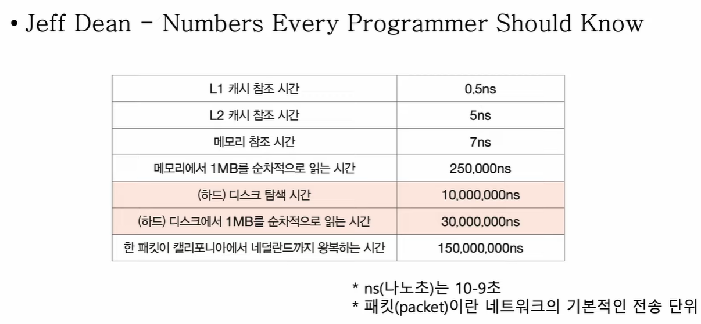
</div>

> 🔍 **다중 헤드 디스크**와 **고정 헤드 디스크**
> <div align="center">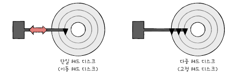</div>
> 
> - 플래터 한 면에 하나의 헤드만 쓰는 디스크를 **단일 헤드 디스크**, 각 트랙마다 헤드가 달려 있는 디스크를 **다중 헤드 디스크**라고 한다
> - 다중 헤드 디스크는 트랙마다 헤드가 있기 때문에 **탐색 시간이 0**이다.
> - 즉, 다중 헤드 디스크를 **고정 헤드 디스크**, 단일 헤드 디스크를 **이동 헤드 디스크**라고 부르기도 한다.

### ❇️ 플래시 메모리 (Flash Memory)

- 전기적으로 데이터를 읽고 쓰는 반도체 기반 저장 장치 [(wiki)](https://namu.wiki/w/%ED%94%8C%EB%9E%98%EC%8B%9C%20%EB%A9%94%EB%AA%A8%EB%A6%AC)
- 크게 NAND 플래시 메모리와 NOR 플래시 메모리가 있다. [(wiki)](https://namu.wiki/w/%ED%94%8C%EB%9E%98%EC%8B%9C%20%EB%A9%94%EB%AA%A8%EB%A6%AC#s-3.1)
  - NAND 플래시 메모리: NAND 게이트 기반의 메모리. 대용량 저장 장치로 많이 사용.
  - NOR 플래시 메모리: NOR 게이트 기반의 메모리. 

| 구분  | NAND형  | NOR형  |
|:---:|:------:|:-----:|
| 용도 | USB 메모리, SSD 등 저장 매체 | RAM처럼 실행 가능한 코드 저장 |
| 읽기 | 랜덤 액세스이나 한 블록이 모두 동작함. 비교적 느림 | 셀 단위 랜덤 액세스. 빠름 |
| 쓰기 | 한 번에 한 블록을 통째로 기록하여 빠름 | 한 셀씩 기록하여 느림 |
| 밀도 | 고밀도 | 저밀도 |
| 가격(용량 대비) | 저가 | 고가 |


#### 🔍 셀 레벨 (Cell Level)

> 플래시 메모리에서 데이터를 저장하는 가장 작은 단위를 **셀**(Cell)이라고 한다.  
> 그리고 하나의 셀에 몇 비트를 저장할 수 있느냐에 따라 SLC, MLC, TLC 등으로 나뉜다.
> [(wiki)](https://namu.wiki/w/%ED%94%8C%EB%9E%98%EC%8B%9C%20%EB%A9%94%EB%AA%A8%EB%A6%AC#s-3.2)

- **SLC(SIngle Level Cell)**: 한 셀당 하나의 비트.
  - 입출력이 빠르고, 수명이 길다.
  - IO 작업이 많고, 고성능의 빠른 저장 장치에 사용.
- **MLC(Multi Level Cell)**: 한 셀당 두 개의 비트.
  - SLC 보다는 느리고, 수명이 짧다.
  - 용량 대비 가격이 저렴.
  - 시중에서 많은 플래시 메모리에 사용. (혹은 TLC)
- **TLC(Triple Level Cell)**: 한 셀당 세 개의 비트.
  - SLC, MLC 보다 속도와 수명이 떨어짐.
  - 용량 대비 가격이 저렴하여 저가의 대용량 장치에 사용.

| 구분 | SLC(Single Level Cell) | MLC(Multi Level Cell) | TLC(Triple Level Cell) | QLC(Quad Level Cell) | PLC(Penta Level Cells) | HLC(Hexa Level Cells) | OLC(Octa Level Cell) |
| --- | --- | --- | --- | --- | --- | --- | --- |
| 셀당 비트 수 | 1 | 2 | 3 | 4 | 5 | 6 | 8 |
| 용도 | 항공·우주 산업용,SSD 캐시용 | 산업용,초고급 일반 사용자용 SSD | 일반 사용자용중급, 중고급 SSD, USB 메모리 | 일반 사용자용저가형 SSD, USB 메모리 | SSD 상용화 시도 중,초저가형 USB 메모리 | 기술 개발, 연구 중, 기술 홍보용 |  |
| 읽기 | NOR보다 느림 | SLC보다 느림 | MLC보다 느림 | 하드디스크 수준TLC보다 느림 | QLC보다 느림 | 이론상 PLC보다 느림 |  |
| 쓰기 | 매우 빠름 |  |  |  |  |  |  |
| 수명 | 최대 약 10만회 | 최대 약 3만회 | 최대 약 1만회 | 최대 약 1000회 | 최대 약 100회 | 상온에서 작동 불가 | 실 제품 없음 |
| 가격(용량 대비) | 초고가 | 고가 | 보통 | 중저가 | 저가 | 사실상 거래되지 않음 |  |

#### 🔍 플래시 메모리의 저장 단위

<div align="center">
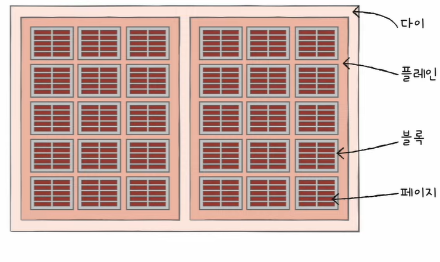
</div>

- **셀(Cell)** 들이 모여 **페이지(page)**, 페이지가 모여 **블록(block)**, 블록이 모여 **플레인(plane)**, 플레인이 모여 **다이(die)** 가 된다
- 플래시 메모리에서 읽기와 쓰기는 **페이지** 단위로, 삭제는 **블록** 단위로 이루어진다. 
- 페이지는 세 개의 상태를 가진다.
  - Free 상태: 어떠한 데이터도 저장하고 있지 않아 새로운 데이터를 저장할 수 있는 상태
  - Valid 상태: 이미 유효한 데이터를 저장하고 있는 상태
  - Invalid 상태: 유효하지 않은 데이터를 저장하고 있는 상태 (쓰레기값)  
  > 플래시 메모리는 블록 단위 삭제만 가능하기 때문에 페이지 단위의 덮어쓰기가 불가능하다.  
  > 따라서 특정 페이지의 값을 수정할 때에는 해당 페이지를 Invalid 상태로 만들고 새로운 페이지에 데이터를 저장한다.    
  > 이때, 쓰레기값이 차지하고 있는 공간 낭비 문제를 해결하기 위해 사용되는 기술을 **가비지 컬렉션(Garbage Collection)** 이라고 한다.

<div align="center">
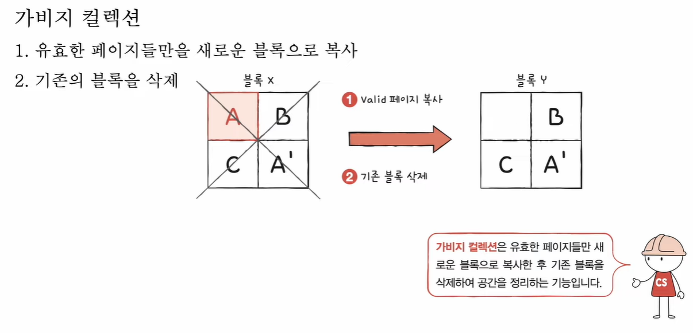
</div>


---
<br/>


## 2️⃣ RAID의 정의와 종류

```markdown
💡 보조기억장치를 더욱 빠르고 안전하게 활용하는 방법인 RAID에 대해 알아보기
```

<div align="center">
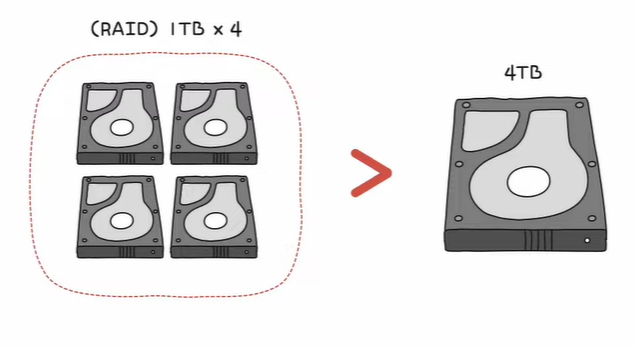
</div>

- 4TB 디스크 한 개보다 1TB 디스크 네 개를 RAID로 구성하면 성능과 안정성을 향상시킬 수 있다

### ❇️ RAID의 정의

- RAID (Redundant Array of Independent Disk)
- 하드 디스크와 SSD로 사용하는 기술
- 데이터의 안정성 혹은 높은 성능을 위해 **여러 개의 물리적 보조기억장치**를 마치 **하나의 논리적 보조기억장치**처럼 사용하는 기술  
  [(wiki 더보기)](https://namu.wiki/w/RAID)

### ❇️ RAID의 종류

- RAID를 구성하는 방법을 **RAID 레벨**이라고 부름
- `RAID 0`, `RAID 1`, `RAID 2`, `RAID 3`, `RAID 4`, `RAID 5`, `RAID 6` 등이 있다.  
  _(`RAID 2`와 `RAID 3` 은 잘 활용되지 않음)_
- RAID 방식으로 데이터를 저장할 때, 줄무늬처럼 분산되어 저장된 데이터를 **스트라입(stripe)** 이라 하며, 이렇게 저장하는 행위를 **스트라이핑(striping)** 이라고 한다.

#### ✔️ RAID 0

<div align="center" style="display:flex; align-items: center; justify-content: center;">
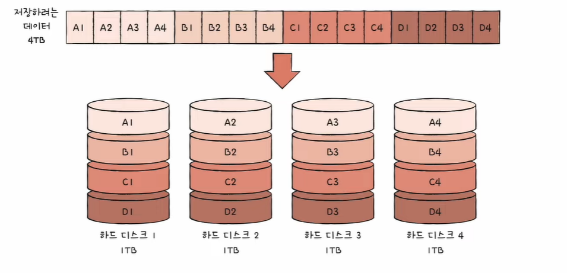
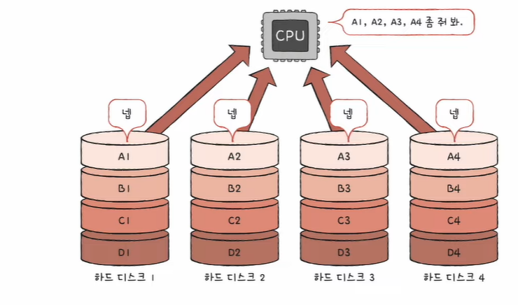
</div>

- 데이터를 동시에 접근할 수 있기 때문에 **입출력속도가 빠르다** _(위의 경우 이론상 4배)_
- 그러나 단점은 오류검출과 백업 기능이 없어서 저장된 정보가 **안전하지 않다**

#### ✔️ RAID 1

<div align="center">
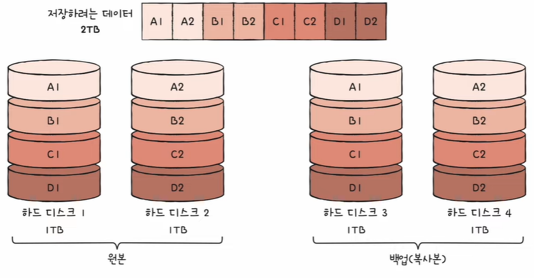
</div>

- `RAID 0`의 단점을 해결하기 위해 등장
- 복사본을 만들어 백업하는 **미러링(mirroring)** 을 사용
- 데이터 안정성은 증가했지만 쓰기 속도가 느리다.
- 백업 공간으로 인해 사용 가능한 용량이 적어짐 (비용 증가)

❗ 위키에 따르면 `RAID 1`은 완전한 백업이 아닌 가용성을 목적으로 한 반쪽짜리 백업이라고 함 [(wiki 보기)](https://namu.wiki/w/RAID#s-3.2)

#### ✔️ RAID 4

<div align="center" style="display:flex; align-items: center; justify-content: center;">
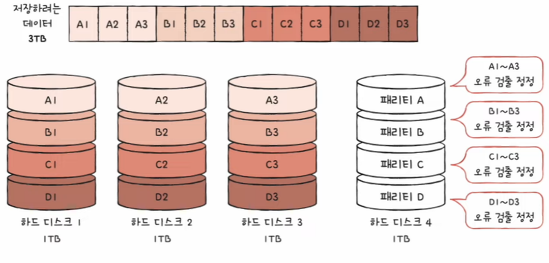
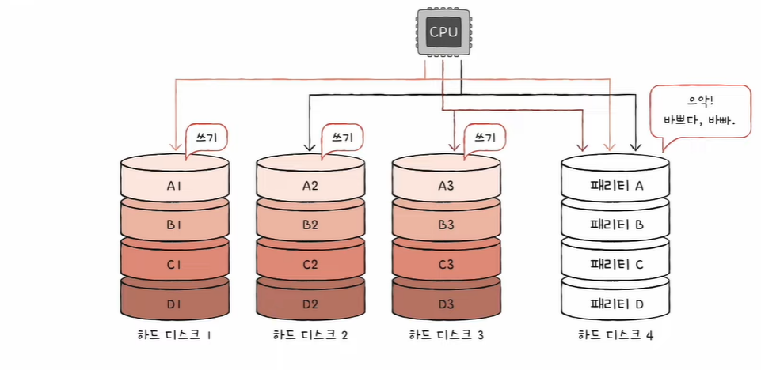
</div>

- 오류를 검출하고 복구하기 위한 **패리티 비트(parity bit)** 를 저장하는 **패리티 디스크**를 활용
- 용량 문제와 안정성 문제를 해결함
- but, 단점은 패리티 디스크의 **병목 현상** 문제가 발생할 수 있음

#### ✔️ RAID 5

<div align="center">
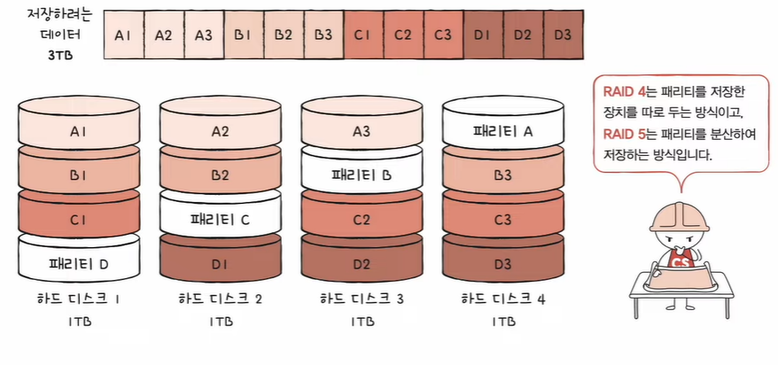
</div>

- `RAID 4`의 병목 현상 문제를 해결하기 위해 등장
- 패리티 정보를 분산하여 저장하는 방식

#### ✔️ RAID 6

<div align="center">
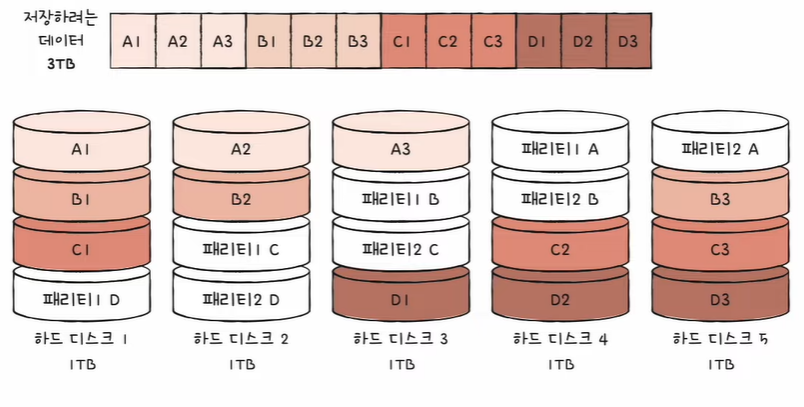
</div>

- 기본적으로 `RAID 5`와 구성이 같으나, 서로 다른 두 개의 패리티를 저장하는 방식
- 오류 검출과 복구 수단을 두 개를 두어 보다 안정성을 높임
- 대신 `RAID 5`보다 쓰기 속도가 느림

> 💡 이렇게 여러 RAID 레벨을 혼합하여 사용하는 방식을 **Nested RAID** 라고 한다.

