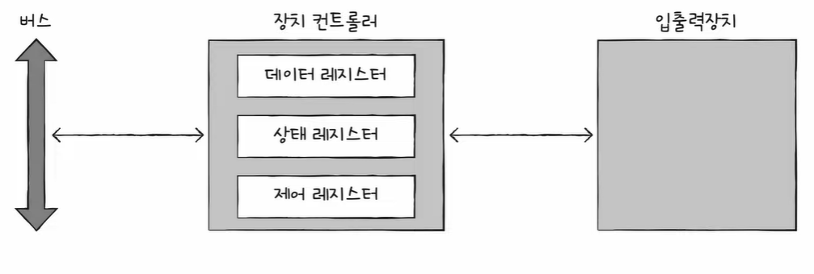
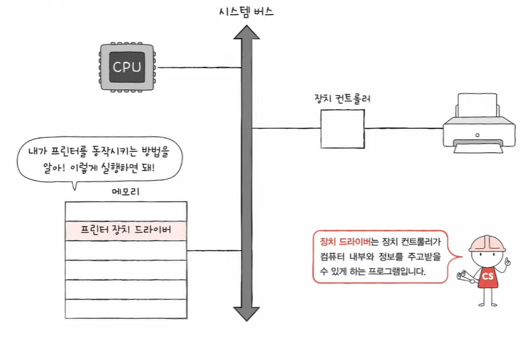

# Chapter 08. 입출력장치

- [1) 장치 컨트롤러와 장치 드라이버]()
- [2) 다양한 입출력 방법]()

---
<br/>


## 1️⃣ 장치 컨트롤러와 장치 드라이버

```markdown
💡 입출력장치는 컴퓨터 외부에 연결되는 장치이다. 
이러한 입출력장치를 컴퓨터 내부와 연결하고 데이터를 주고 받을 수 있게 해주는 장치 컨트롤러와 장치 드라이버에 대해 알아본다
```

> 장치 컨트롤러가 입출력장치를 연결하기 위한 하드웨어적인 통로라면,  
> 장치 드라이버는 입출력장치를 연결하기 위한 소프트웨어적인 통로(프로그램)이다.

### ❇️ 장치 컨트롤러

#### 🔍 장치 컨트롤러가 필요한 이유

1. 입출력장치의 종류가 너무 다양하다
   - 키보드, 모니터, USB, CD-ROM, SSD, 마우스, 프린터, 스피커, 마이크 등등...
2. CPU와 입출력장치의 속도 차이 문제
   - 전송률(Transfer rate): 데이터를 얼마나 빨리 교환할 수 있는지를 나타내는 지표
   - 일반적으로 CPU와 메모리의 데이터 전송률은 높지만 입출력장치의 데이터 전송률이 낮다

> 💡 장치 컨트롤러 (Device controller)는 입출력 제어기 (IO controller), 입출력 모듈 (IO module) 등 다양한 이름으로 불린다

#### 🔍 장치 컨트롤러의 역할

- **CPU와 입출력장치 간의 통신 중개**
  - 다양한 입출력장치에서 오는 통신 정보를 규격화 함
- **오류 검출**
  - 장치 컨트롤러에 연결된 장치에 문제가 없는지 오류를 검출함
- **데이터 버퍼링**
  - 버퍼를 통해 전송률을 비슷하게 맞춰줌

#### 🔍 장치 컨트롤러의 내부 구조

<div align="center">

</div>

- **데이터 레지스터**
  - CPU와 입출력장치 사이에 주고받을 데이터가 담기는 레지스터 (버퍼)
  - RAM을 사용하기도 함
- **상태 레지스터**
  - 상태 정보를 저장
    - 입출력장치가 IO 작업을 할 준비가 되었는지
    - IO 작업이 완료되었는지
    - 오류는 없는지 등등...
- **제어 레지스터**
  - 입출력장치가 수행할 내용에 대한 제어 정보

### ❇️ 장치 드라이버

<div align="center">

</div>

- 장치 컨트롤러의 동작을 감지하고 제어함으로써 장치 컨트롤러가 컴퓨터 내부와 정보를 주고받을 수 있게 하는 프로그램


---
<br/>


## 2️⃣ 다양한 입출력 방법

```markdown
💡 입출력의 가장 보편적인 방법인 프로그램 입출력과 인터럽트 기반 입출력, DMA 입출력에 대해 알아본다
```

- 프로그램 입출력
- 인터럽트 기반 입출력
- DMA 입출력

### ❇️ 프로그램 입출력

- 프로그램 속 명령어로 입출력장치를 제어하는 방법
- CPU가 장치 컨트롤러의 레지스터 값을 읽고 씀으로써 이루어짐

그렇다면, CPU가 입출력장치들의 주소를 어떻게 아는 것일까?

#### 🔍 메모리 맵 입출력

- 메모리에 접근하기 위한 주소 공간과 입출력장치에 접근하기 위한 주소 공간을 하나의 주소 공간으로 간주하는 방법

#### 🔍 고립형 입출력

- 메모리를 위한 주소 공간과 입출력 장치를 위한 주소 공간을 분리하는 방법

### ❇️ 인터럽트 기반 입출력

- 인터럽트로써 입출력을 수행하는 방법
- 플래그 레지스터 속 인터럽트 비트를 통해 입출력 작업을 컨트롤 함 (순차적 처리)
- 인터럽트를 무시할 수 없는 NMI(Non-Maskable Interrupt)가 발생한 경우, 기존 작업을 잠시 중단하고 즉시 처리
- PIC(Programmable Interrupt Controller)라는 하드웨어를 통해 인터럽트의 우선순위를 부여함

### ❇️ DMA 입출력

- DMA(Direct Access Memory)
- CPU를 거치지 않고 입출력장치가 메모리에 **직접적으로 접근**하는 방법
- CPU를 거치지 않고 **메모리와 입출력장치 간의 데이터를 주고받는** 방법
- 입출력 버스를 통해 데이터를 주고받는다
- 입출력 버스에는 PCI(Peripheral Component Interconnect) 버스, PCI Express(PCIe) 버스 등 여러 종류가 있다
- PCIe 슬롯은 PCIe 버스와 연결해 주는 통로이다


