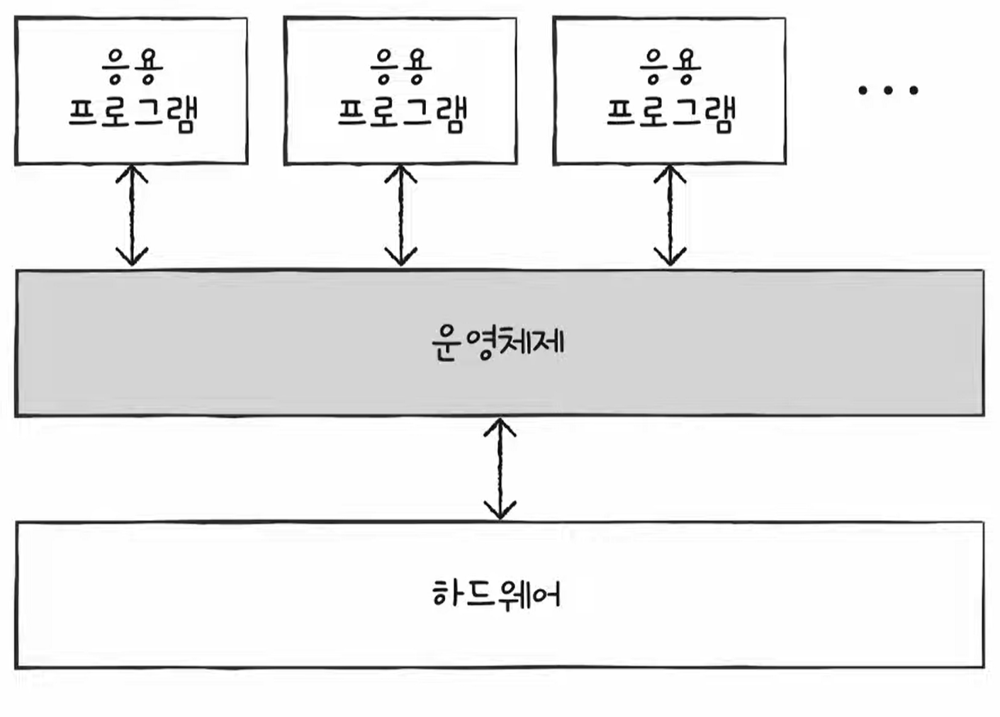

# Chapter 9. 운영체제 시작하기

1) 운영체제를 알아야 하는 이유
2) 운영체제의 큰 그림

<br/>
---

## 1️⃣ 운영체제를 알아야 하는 이유

```markdown
💡 Keywords: #운영체제 #정의 #알아야하는이유 #자원 #관리 #커널 #응용프로그램
```

### ❇️ 운영체제란?

<div align="center" style="display:flex; align-items: center; justify-content: center;">

&nbsp;&nbsp;&nbsp;&nbsp;&nbsp;&nbsp;&nbsp;&nbsp;&nbsp;

</div>

#### 🔶 정의

- 운영체제란 실행할 프로그램에 필요한 자원을 할당하고, 응용 프로그램이 올바르게 실행되도록 돕는 특별한 프로그램이다.
  - 사용자가 컴퓨터를 쉽게 다룰 수 있게 해주는 인터페이스. [(위키 정의1)](https://namu.wiki/w/%EC%9A%B4%EC%98%81%EC%B2%B4%EC%A0%9C)
  - 컴퓨터 자원을 효율적으로 관리하기 위한 시스템, 공통된 소프트웨어 플랫폼, 컴퓨터 응용 프로그램 관리자. [(위키 정의2)](https://namu.wiki/w/%EC%9A%B4%EC%98%81%EC%B2%B4%EC%A0%9C)

<div align="center">

</div>

#### 🔶 역할

- **운영체제**는 컴퓨터가 부팅될 때 메모리 내 **커널 영역(Kernel space)** 이라는 공간에 따로 적재되어 실행된다
- 사용자가 이용하는 **응용 프로그램**은 **사용자 영역(User space)** 에 적재되어 실행된다
- 운영체제는 실행할 프로그램을 메모리에 **적재**하고, 더 이상 실행되지 않는 프로그램을 메모리에서 **삭제**하며, 지속적으로 메모 **자원을 관리**한다
- 운영체제는 최대한 공정하게 여러 프로그램에 **CPU 자원을 할당**한다
- 운영체제는 **응용 프로그램과 하드웨어 사이**에서 필요한 자원을 **할당**하고, 프로그램이 올바르게 실행되도록 **관리**한다

### ❇️ 운영체제를 알아야 하는 이유

- 운영체제가 없다면 하드웨어를 조작하는 코드를 개발자가 모두 직접 작성해야 한다  
  (즉, 컴퓨터 자원을 쉽게 활용할 수 있도록 하는 인터페이스이다)
- 운영체제와의 대화로 하드웨어와 프로그램을 더 깊이 이해하고 **문제 해결의 실마리**를 찾을 수 있다


---
<br/>

## 2️⃣ 운영체제의 큰 그림

```markdown
💡 Keywords: #운영체제 #커널 #이중모드 #커널모드 #사용자모드 #시스템콜 #프로세스관리 #자원접근및할당 #파일시스템관리
```

### ❇️ 운영체제의 심장, 커널

<div align="center">

</div>

- 운영체제의 핵심 서비스를 담당하는 부부을 **커널(Kernel)** 이라고 한다
- but, 운영체제가 제공하는 서비스 중 커널에 포함되지 않는 대표적인 서비스에는 **사용자 인터페이스**가 있다 (GUI, CLI)

### ❇️ 이중 모드와 시스템 호출

<div align="center">

</div>

- 운영체제는 사용자가 실행하는 **응용 프로그램이** 하드웨어 자원에 **직접 접근하는 것을 방지**하여 **자원을 보호**한다
- 즉, 응용 프로그램이 자원에 접근하려고 할 때 오직 커널을 통해서만 접근하도록 한다
- 이러한 방식은 이중 모드로써 구현되는데, **이중 모드**는 "CPU가 명령어를 실행하는 모드를 크게 **사용자 모드**와 **커널 모드**로 구분하는 방식"이다
  - **사용자 모드 (User Mode)**
    - 운영체제 서비스를 제공받을 수 없는 실행 모드
    - 커널 영역의 코드를 실행할 수 없는 실행 모드
    - 자원 접근 불가
  - **커널 모드 (Kernel Mode)**
    - 운영체제 서비스를 제공받을 수 있는 실행 모드
    - 자원 접근을 비롯한 모든 명령어 실행 가능
  - _(CPU가 사용자 모드로 실행 중인지 커널 모드로 실행 중인지는 플래그 레지스터 속 **슈퍼바이저 플래그**로 확인할 수 있다)_

<div align="center" style="display:flex; align-items: center; justify-content: center;">

&nbsp;&nbsp;&nbsp;&nbsp;&nbsp;&nbsp;&nbsp;&nbsp;&nbsp;

</div>

- 이때, 사용자 모드에서 운영체제 서비스를 제공받기 위해 **커널 모드로 전환**하는 방법을 **시스템 호출(System Call)** 이라고 한다
- 시스템 호출은 일종의 인터럽트이며, 소프트웨어 인터럽트이다.

   
### ❇️ 운영체제의 핵심 서비스

- 프로세스 관리
- 자원 접근 및 할당
- 파일 시스템 관리

#### 🔶 프로세스 관리

- 실행 중인 프로그램을 **프로세스**라고 한다
- 일반적으로 하나의 **CPU는 한 번에 하나의 프로세스만 실행**할 수 있기 때문에 CPU는 이 프로세스들을 **조금씩 번갈아 가며 실행**한다
- **프로세스**들은 각각의 상태와 사용하고자 하는 자원이 다양하기 때문에 일목요연하게 **관리**하고 **실행**할 수 있어야 한다 (chapter.10)
- 여러 프로세스가 동시에 실행되는 환경에서는 **프로세스 동기화**가 필수적이며, **교착 상태**를 해결할 수 있어야 한다

#### 🔶 자원 접근 및 할당

운영체제는 프로세스들이 사용할 자원에 접근하고 조작함으로써 프로세스에 필요한 **자원을 할당**해준다

- **CPU**
  - 여러 프로세스들이 CPU를 공정하게 이용할 수 있도록 하는 **CPU 스케줄링**을 한다 (chapter.11)
- **메모리**
  - 새로운 프로세스가 적재될 때마다 어느 주소에 적재해야 할지를 결정하고, 메모리가 부족할 경우에 대한 처리를 한다 (chapter.14, 페이징, 스와핑, ...)
- **입출력장치**
  - 인터럽트 서비스 루틴은 운영체제가 제공하는 기능으로 커널 영역에 있다
  - 운영체제는 입출력장치의 인터럽트 서비스 루틴을 제공함으로써 입출력작업을 수행한다
- **파일 시스템 관리**
  - 파일 생성 및 삭제, 읽기, 쓰기, 폴더 관리 등의 작업은 운영체제가 제공하는 파일 시스템 기능에 의해 수행된다 (chapter.15)

> #### 🔍 [좀 더 알아보기] 가상 머신과 이중 모드의 발전
> 
> - **가상 머신** 이란 이름 그대로 소프트웨어적으로 만들어낸 가상 컴퓨터이다
> - 가상 머신을 설치하면 새로운 **운영체제**와 **응용 프로그램**을 설치하고 실행할 수 있다
> - 그런데, **가상 머신에 설치된 운영체제** 또한 응용 프로그램이기 때문에 **사용자 모드**로 작동하여 커널 영역의 명령어를 실행할 수 없다
> - 그래서, 가상화를 지원하는 CPU는 커널 모드와 사용자 모드 이외에 가상 머신을 위한 **하이퍼바이저 모드**를 따로 둠으로써 커널 영역의 기능들을 수행할 수 있게 한다
>
> #### 🔍 [좀 더 알아보기] 시스템 호출의 종류
> 
> <div align="center"></div>
>
> - 시스템콜의 종류만 잘 파악해도 해당 운영체제를 깊이 이해할 수 있다
> - 위 도표는 유닉스, 리눅스 등의 운영체제(POSIX 운영체제)에서 사용되는 대표적인 시스템콜의 종류이다
> - 아래 링크에서는 더 상세한 리눅스(x86) 시스템콜 종류를 확인해 볼 수 있다
> - https://kangtegong.github.io/self-learning-cs/system_calls/syscalls.html
> - https://chromium.googlesource.com/chromiumos/docs/+/master/constants/syscalls.md


## 0️⃣ References

- [[한빛미디어][컴퓨터 공학 기초 강의] 23강. 운영체제를 알아야 하는 이유](https://www.youtube.com/watch?v=1PEe33_INZc&list=PLVsNizTWUw7FCS83JhC1vflK8OcLRG0Hl&index=25)
- [[컴퓨터 공학 기초 강의] 24강. 운영체제의 큰 그림](https://www.youtube.com/watch?v=R4j_hDQuBOc&list=PLVsNizTWUw7FCS83JhC1vflK8OcLRG0Hl&index=26)