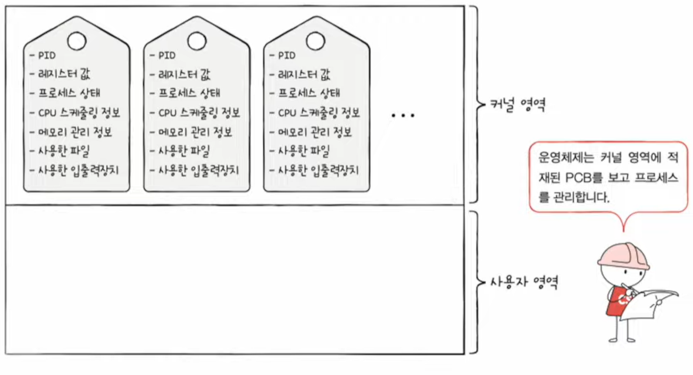

# Chapter 10. 프로세스와 스레드

1) 프로세스 개요
2) 프로세스 상태와 계층 구조
3) 스레드

---
<br/>


## 1️⃣ 프로세스 개요

```markdown
💡 Keywords: #프로세스 #프로세스제어블록(PCB) #문맥교환(Context-Switching) #프로세스사용자영역
```

### ❇️ 프로세스 종류

<div align="center">

</div>

- **포그라운드 프로세스 (Foreground Process)**
  - 사용자가 보이는 곳에서 실행되는 프로세스
- **백그라운드 프로세스 (Background Process)**
  - 사용자에게 보이지 않는 뒤에서 실행되는 프로세스

> #### 💡 데몬(Daemon)이란?
> 
> <div align="center"></div>
> 
> **데몬**은 서비스 요청에 응답하는 **장기 실행 백그라운드 프로세스**입니다. 이 용어는 Unix에서 유래되었지만 대부분의 운영 체제는 어떤 형태로든 데몬을 사용합니다. Unix에서는 데몬의 이름이 일반적으로 "d"로 끝납니다. 몇 가지 예로는 inetd, httpd, nfsd, sshd, 명명된 및 lpd가 있습니다. [(출처)](https://kb.iu.edu/d/aiau)  
>
> 윈도우에서는 데몬과 같은 역할을 하는 프로그램을 **서비스(Service)라고** 한다. [(위키백과)](https://ko.wikipedia.org/wiki/%EB%8D%B0%EB%AA%AC_(%EC%BB%B4%ED%93%A8%ED%8C%85))

### ❇️ 프로세스 제어 블록 (PCB, Process Control Block)

<div align="center">

</div>

#### 🔶 타이머 인터럽트 (Timer Interrupt)
- 프로세스들은 정해진 시간 만큼 CPU를 이용하고, 시간이 끝났음을 알리는 타이머 인터럽트가 발생하면 자신의 차례가 올 때까지 양보하고 기다린다.
- 타이머 인터럽트란 클럭 신호를 발생시키는 장치에 의해 주기적으로 발생하는 하드웨어 인터럽트이다. (≒ 타임아웃 인터럽트)

#### 🔶 PCB

- PCB는 **프로세스와 관련된 정보**를 저장하는 자료구조이다
- 메모리 내에 **커널 영역**에 생성되며, PCB는 프로세스 생성 시에 만들어지고 실행이 끝나면 제거된다  

<div align="center">

<h4>[PCB에 저장되는 대표적인 정보]</h4>
</div>

- **프로세스 ID (=PID)**
  - 특정 프로세스를 식별하기 위해 부여하는 고유한 번호
- **레지스터 값**
  - 프로세스는 자신의 실행 차례가 돌아오면 이전까지 사용했던 레지스터의 중간값들을 모두 복원한다
- **프로세스 상태**
  - 현재 프로세스가 어떤 상태인지를 저장
  - ex) 입출력장치 사용 대기 상태, CPU 사용 중, CPU 사용 대기, 등...
- **CPU 스케줄링 정보**
  - 프로세스가 언제, 어떤 순서로 CPU를 할당받을지에 대한 정보
- **메모리 관리 정보**
  - 프로세스가 어느 주소에 저장되어 있는지에 대한 정보
  - 베이스 레지스터, 한계 레지스터, 페이지 테이블 정보(chapter 14), 등...
- **사용한 파일과 입출력 장치 목록**
  - 할당된 입출력장치, 사용 중인 파일 정보

### ❇️ 문맥 교환 (Context Switching)

<div align="center" style="display:flex; align-items: center; justify-content: center;">


</div>

- 하나의 프로세스 수행을 재개하기 위해 기억해야 할 정보를 **문맥(Context)** 이라고 한다
- PCB에 저장된다
- 기존 프로세스의 문맥을 PCB에 백업하고, 새로운 프로세스를 실행하기 위해 문맥을 복구하는 과정을 **문맥 교환 (Context Switching)** 이라 한다
- but, 문맥 교환을 너무 자주 하면 오버헤드가 발생할 수 있음

### ❇️ 프로세스의 메모리 영역

<div align="center">

</div>

프로세스가 생성되면 **커널 영역**에는 PCB가 생성되고, **사용자 영역**에는 위와 같이 **4개의 영역**으로 나뉘어 저장된다.

- **코드 영역 (Code Segment)**
  - 실행할 수 있는 코드, 즉 기계어로 이루어진 **명령어**가 저장됨
  - 데이터가 아닌 CPU가 실행할 명령어가 담긴 **읽기 전용 (read-only)** 공간
- **데이터 영역 (Data Segment)**
  - 프로그램이 실행되는 동안 계속 유지할 데이터가 저장되는 공간
  - 대표적으로 **전역 변수 (global-variable)** 가 있다
- **힙 영역 (Heap Segment)**
  - 프로그래머가 직접 할당할 수 있는 저장 공간
  - 할당된 메모리 공간을 사용하지 않게 될 시점에 반환하지 않아 메모리가 계속 **낭비**되는 현상을 **메모리 누수 (Memory-Leak)** 이라고 한다
- **스택 영역 (Stack Segment)**
  - 잠깐 사용될 데이터를 일시적으로 저장하는 공간
  - 대표적으로 함수의 실행이 끝나면 사라지는 매개 변수, 지역 변수가 있다

> #### 💡 정적 할당 영역 vs 동적 할당 영역
> 
> - **코드 영역**과 **데이터 영역**은 크키가 변하지 않아 **정적 할당 영역**이라고 한다
> - **힙 영역**과 **스택 영역**은 실시간으로 크기가 변할 수 있는데, 이를 **동적 할당 영역**이라고 한다
> 
> <div align="center"></div>
> 
> - 일반적으로 힙 영역은 메모리의 낮은 주소에서 높은 주소로 할당되고, 스택 영역은 높은 주소에서 낮은 주소로 할당된다

---
<br/>


## 2️⃣ 프로세스 상태와 계층 구조

```markdown
💡 Keywords: #프로세스상태 #부모프로세스 #자식프로세스 #프로세스계층구조
```

### ❇️ 프로세스 상태 (Process State)

<div align="center">

<h4>&lt;프로세스 상태 다이어그램&gt;</h4>
</div>

- **생성 상태 (new or create)**
  - 이제 막 메모리에 적재되어 PCB를 할당 받은 상태
- **준비 상태 (ready)**
  - CPU를 할당 받기 위해 기다리고 있는 상태
  - 준비 상태 → 실행 상태 로 전환: 디스패치(dispatch)
- **실행 상태 (running)**
  - CPU를 할당 받아 실행 중인 상태
  - 할당된 일정 시간 동안 CPU를 사용
    - 타이머 인터럽트가 발생 시 다시 준비 상태로 전환
    - 입출력장치와 같은 이벤트가 발생 시 입출력작업이 끝날 때까지 대기 상태로 전환
- **대기 상태 (blocked or waiting)**
  - 입출력장치의 작업 혹은 이벤트를 기다리는 상태
  - 입출력작업 혹은 이벤트가 완료되면 다시 준비 상태로 전환하여 CPU의 할당을 기다림
- **종료 상태 (terminated)**
  - 프로세스가 종료된 상태
  - 프로세스에서 사용한 메모리와 PCB가 정리됨

### ❇️ 프로세스 계층 구조

- 프로세스는 실행 도중 **시스템 호출**을 통해 다른 프로세스를 **생성**할 수 있다
- 이는 **부모 프로세스(Parent Process)** 와 **자식 프로세스(Child Proecess)** 의 계층적 프로세스 구조를 형성한다
- 자식 프로세스의 PCB에는 부모 프로세스의 PID인 **PPID(Parent PID)** 값이 기록되어 있다 (운영체제마다 다를 수 있음)

✔️ (참고) 윈도우 운영체제는 프로세스를 계층적으로 관리하지 않는다

> #### 💡 최초의 프로세스
> - 모든 프로세스의 가장 위에 있는 프로세스를 **최초의 프로세스**라고 하며 PID는 항상 1이다
> - 유닉스에서는 `init`, 리눅스는 `systemd`, macOS는 `launched`

### ❇️ 프로세스 생성 기법

❓ 부모 프로세스가 자식 프로세스를 어떻게 만들어 내고, 자식 프로세스는 어떻게 자신만의 코드를 실행할까?

<div align="center">

</div>

- 부모 프로세스는 **fork 시스템 호출**을 통해 자신의 **복사본**을 자식 프로세스로 생성
- 자식 프로세스는 **exec 시스템 호출**을 통해 자신의 메모리 공간을 **다른 프로그램으로 교체**
- 부모와 자식 프로세스는 엄연히 다른 프로세스이기 때문에 PID 값이 서로 다르다

<div align="center">
<br/>
<a href="https://en.wikipedia.org/wiki/Fork%E2%80%93exec">[Wikipedia] Fork-exec</a>
</div>

✔️ (참고) 윈도우 운영체제와는 관련 없는 내용이다

---
<br/>


## 3️⃣ 스레드 (Thread)

```markdown
💡 Keywords: #스레드 #멀티프로세스 #멀티스레드
```

### ❇️ 프로세스와 스레드

#### 🔶 스레드(Thread)란?

- 스레드란 **프로세스를 구성하는 실행의 흐름 단위** 이다
- 하나의 프로세스는 여러 개의 스레드를 가질 수 있다
- 스레드의 구성 요소는 **스레드 ID, 프로그램 카운터, 레지스터, 스택** 으로 구성된다
- ✅ 스레드는 실행에 필요한 **최소한의 정보**만을 유지한 채 프로세스 **자원을 공유**하며 실행한다

> #### 💡 리눅스 운영체제에서의 프로세스 vs 스레드
>
> <div align="center">
> <br/>
> <a href="https://lkml.iu.edu/hypermail/linux/kernel/9608/0191.html">리누스 토발즈의 이메일 답변</a>
> </div>
> 
> - 많은 운영체제가 프로세스와 스레드를 구분하지만, 리눅스에서는 이 둘을 명확히 구분 짓지 않는 대표적인 운영체제 중 하나이다.
> - 리눅스는 프로세스와 스레드 모두 **실행의 문맥(context of execution)** 이라는 점에서 동등하다고 간주함
> - 프로세스와 스레드를 태스크(task)라는 이름으로 통일하여 명명함

### ❇️ 멀티프로세스와 멀티스레드

<div align="center">

</div>

- 프로세스는 각각의 **독립적인 자원**을 사용하지만, 같은 프로세스 내 스레드들은 **공유 자원**을 사용한다
- 즉, 멀티스레드는 **메모리를 효율적**으로 사용할 수 있고, **스레드 간의 통신**에 유리하다
- but, 멀티스레드는 자원을 공유하기 때문에 하나의 스레드에 문제가 생기면 프로세스 전체에 문제가 발생할 수 있다

> #### 💡 프로세스 간 통신 (IPC, Inter-Process Communication)
> 
> 프로세스도 스레드처럼 서로 간의 데이터를 주고 받을 수 있으며, 이를 IPC라 한다
> 
> - 파일을 통한 프로세스 간 통신
> - 공유 메모리
> - 소켓, 파이프를 통한 통신 등...


---
<br/>