# Chapter 14. 가상 메모리

1) 연속 메모리 할당
2) 페이징을 통한 가상 메모리 관리
3) 페이지 교체와 프레임 할당

<br/>
---

## 1️⃣ 연속 메모리 할당

```markdown
💡 keywords: #스와핑 #최초적합 #최적적합 #최악적합 #외부단편화
```

### ❇️ 연속 메모리 할당이란?

- 메모리 공간에 프로세스를 연속적으로 할당하는 방식

### ❇️ 스와핑

<div align="center" style="display:flex; align-items: center; justify-content: center;">
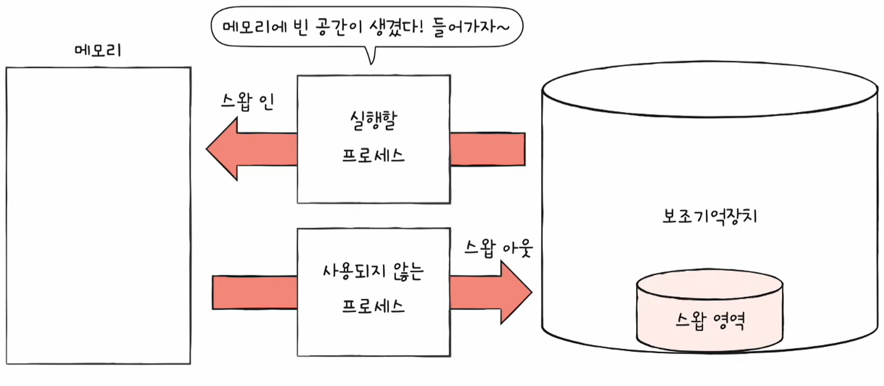
&nbsp;&nbsp;&nbsp;&nbsp;&nbsp;&nbsp;&nbsp;&nbsp;&nbsp;&nbsp;&nbsp;&nbsp;&nbsp;&nbsp;&nbsp;
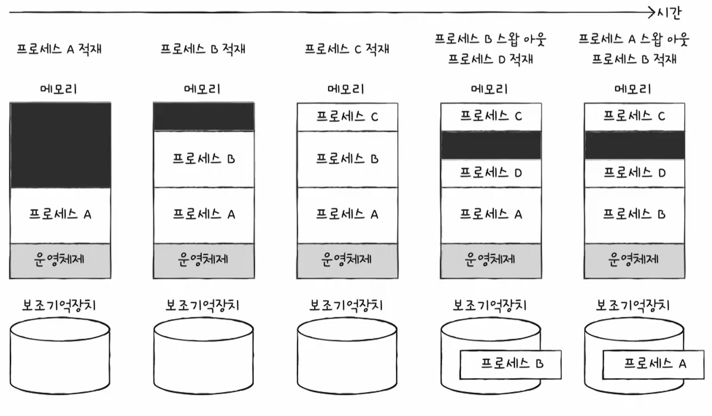
</div>

- 메모리에서 현재 **사용되지 않는** 일부 프로세스를 보조기억장치로 **내보내고** 지금 **실행할** 프로세스를 메모리로 다시 **불러오는** 메모리 관리 기법
- 스와핑을 이용하면 프로세스 총량이 메모리 공간보다 큰 경우에도 동시 실행이 가능하다
  - **스왑 영역(swap space)**: 보조기억장치로 내보내진 프로세스를 보관하는 영역
  - **스왑 아웃(swap-out)**: 프로세스를 메모리에서 스왑 영역으로 내보내는 것
  - **스왑 인(swap-in)**: 프로세스를 스왑 영역에서 메모리로 다시 불러오는 것

### ❇️ 메모리 할당

- 실행할 프로세스를 메모리의 빈 공간에 할당하는 것
- 연속 메모리 할당에는 대표적으로 **`최초 적합` `최적 적합` `최악 적합`** 의 세 가지 방식이 있다

<div align="center">
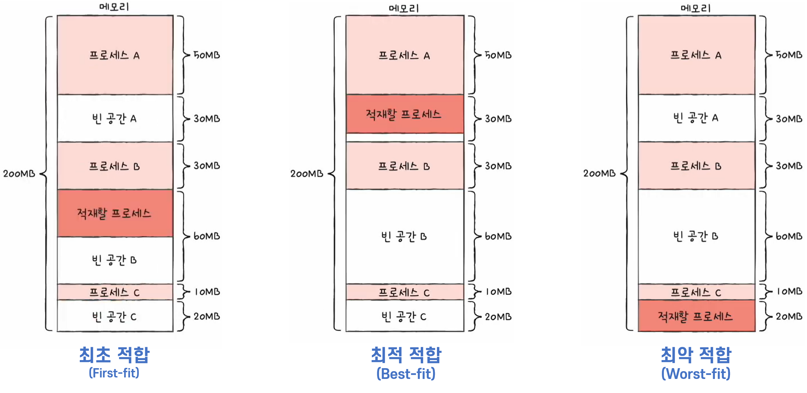
</div>

- **최초 적합 (First fit)**
  - 운영체제가 메모리를 **순차적으로 탐색**하여, 프로세스를 적재할 수 있는 빈 공간이 발견되면 **즉시 배치**하는 방식
  - 장점: 검색 최소화, 빠른 할당
- **최적 적합 (Best fit)**
  - 운영체제가 메모리의 빈 공간을 **모두 탐색**한 뒤, 프로세스를 적재할 수 있는 **가장 작은 공간**에 배치하는 방식
- **최악 적합 (Worst fit)**
  - 운영체제가 메모리의 빈 공간을 **모두 탐색**한 뒤, 프로세스를 적재할 수 있는 **가장 큰 공간**에 배치하는 방식

하지만, 이러한 연속 메모리 할당 방식은 외부 단편화 문제를 갖고 있다.

### ❇️ 외부 단편화 (External Fragmentation)

<div align="center">
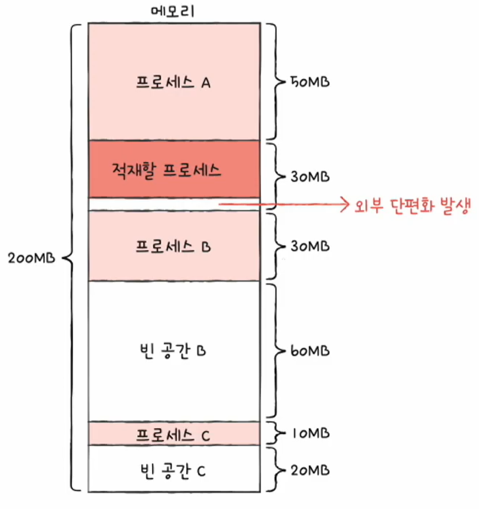
</div>

#### 🔷 외부 단편화란?

- 프로세스를 할당하기 어려울 만큼 작은 메모리 공간들로 인해 **메모리가 낭비되는 현상**
- 연속 메모리 할당 기법의 경우 프로세스들이 실행되고 종료되는 과정에서 메모리 사이 사이에 빈 공간들이 쌓이기 시작하면서 발생되는 현상이다

#### 🔷 외부 단편화 해결법

1) **메모리 압축 (compaction)**
   - 메모리 내에 저장된 프로세스들을 적당히 재배치하여 흩어져 있는 작은 빈 공간들을 제거하는 방식
   - 압축 방식의 단점
     - 압축을 위해 시스템은 하던 일을 중지해야 함
     - 많은 오버헤드가 발생함
     - 오버헤드를 최소화하기 위한 압축 방식을 찾기 어려움
2) **가상 메모리 기법 (페이징)**
   - 오늘날 운영체제의 가장 대표적인 메모리 관리 기법
   - 내용은 아래에서 다룸

<br/>
---


## 2️⃣ 페이징을 통한 가상 메모리 관리

```markdown
💡 keywords: #페이징 #페이지테이블 #PTBR #TLB
```

- 연속 메모리 할당 기법의 문제를 해결하기 위한 **가상 메모리 관리 기법**인 **페이징**에 대해 알아본다
- **가상 메모리**란 실행할 프로그램의 **일부만 메모리에 적재**하여 **실제 물리 메모리 크기**보다 **더 큰 프로세스를 실행**할 수 있게 하는 기술이다
- 가상 메모리 관리 기법에는 크게 **페이징**과 **세그멘테이션**이 있다
- 대부분의 현대 운영체제에서 사용하는 페이징 기법을 알아본다

### ❇️ 페이징(Paging)이란?

<div align="center" style="display:flex; align-items: center; justify-content: center;">
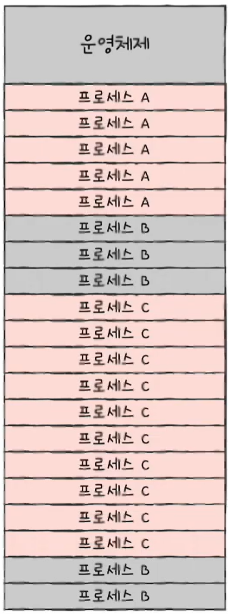
&nbsp;&nbsp;&nbsp;&nbsp;&nbsp;&nbsp;&nbsp;&nbsp;&nbsp;&nbsp;&nbsp;&nbsp;&nbsp;&nbsp;&nbsp;
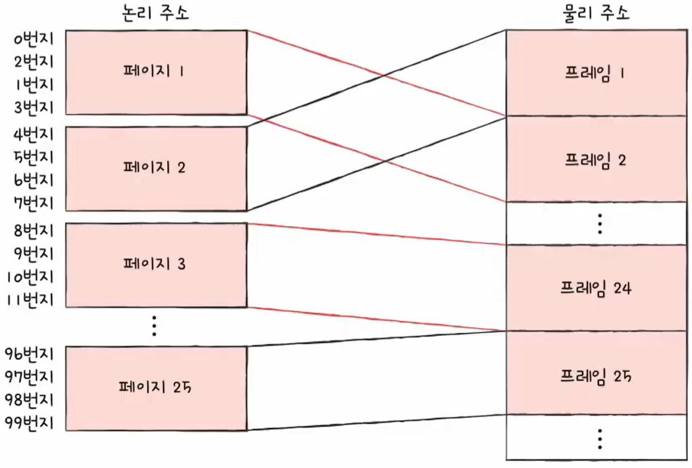
</div>

- 메모리의 물리 주소 공간을 **프레임** 단위로 자르고, 프로세스의 논리 주소 공간을 **페이지** 단위로 자른 뒤, 각 페이지를 프레임에 할당하는 가상 메모리 관리 기법
- 모든 프로세스를 **일정한 크기**의 페이지 단위로 나눠서 메모리에 적재하기 때문에 **외부 단편화 문제가 발생하지 않음**

<div align="center">
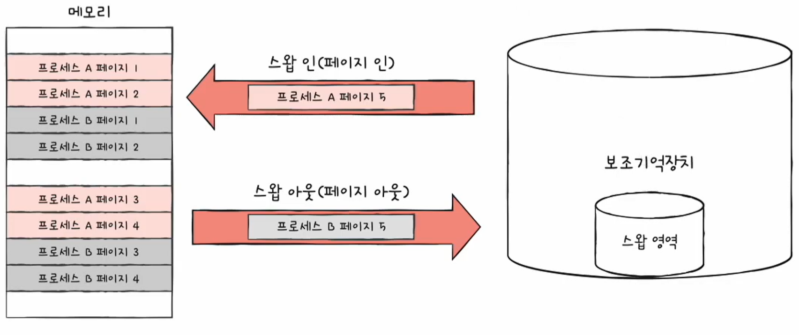
</div>

- 페이징에서의 스와핑
  - 프로세스 단위가 아닌 페이지 단위의 **페이지 인**과 **페이지 아웃**
  - 실행에 필요한 페이지는 페이지 인, 불필요한 페이지는 페이지 아웃
  - 이를 통해 **물리 메모리보다 큰 프로세스도 실행**될 수 있음

### ❇️ 페이지 테이블

<div align="center">
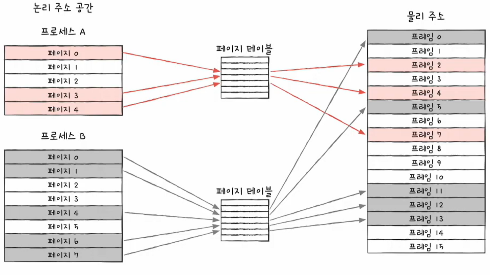
</div>

- 물리 주소가 불연속적으로 배치되더라도 논리 주소에는 연속적으로 배치되도록 하는 방법
- 페이지 번호와 프레임 번호를 짝지어 주는 일종의 이정표
- 프로세스마다 페이지 테이블이 존재함

> #### 💡 내부 단편화 (internal fragmentation) 문제
> 
> - 페이징은 외부 단편화 문제는 해결하였지만, 내부 단편화 문제가 발생할 수 있다
> - 프로세스를 페이지 단위로 나누었을 때, 정확히 나누어 떨어지지 않는 경우에 마지막 페이지의 공간이 남는 현상을 내부 단편화라고 한다  
>   (ex. 프로세스 크기 108KB, 페이지 크기 10KB)
> - 단일 페이지 크기보다 작게 발생하며, 페이지의 크기를 적절히 조절하는 것이 중요하다
> 
> (기본적으로 설정된 페이지보다 특별하게 큰 대형 페이지(huge page)라는 것도 있다)

<div align="center">
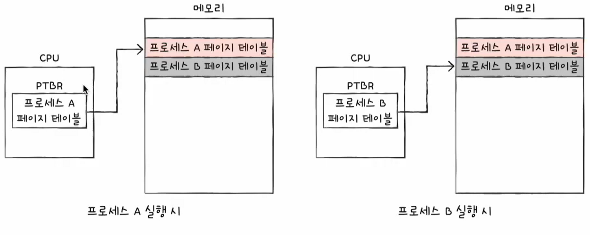
</div>

- **PTBR (Page Table Base Register)**
  - PTBR은 각 프로세스의 **페이지 테이블이 적재된 주소**를 담는 CPU 내의 레지스터

<div align="center">
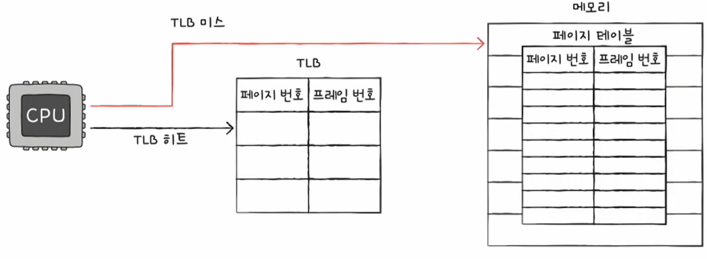
</div>

- **TLB (Translation Lookaside Buffer)**
  - CPU 곁에 페이지 테이블의 캐시 메모리
  - 메모리에 저장된 페이지 테이블에 접근하는 시간을 줄이기 위함
  - TLB hit, TLB miss

### ❇️ 페이징에서의 주소 변환

- CPU가 메모리 내의 프레임에 접근하기 위해서는 페이지 테이블에 있는 논리 주소를 참조한다
- 그리고 이 논리 주소에는 프레임의 위치를 알 수 있는 **페이지 번호(page number)** 와 **변위(offset)** 를 저장하고 있다
- 즉, 논리 주소 <페이지 번호, 변위>가 페이지 테이블을 통해 물리 주소 <프레임 번호, 변위>로 변환된다

### ❇️ 페이지 테이블 엔트리 (PTE, Page Table Entry)

- 페이지 테이블 각각의 행들을 페이지 테이블 엔트리라고 한다
- 각 엔트리에 담기는 정보로 페이지 번호와 프레임 번호 외에도 여러 중요한 정보들이 있다


- **유효 비트 (valid bit)**
  - 현재 해당 페이지에 접근이 가능한지 여부
  - 스와핑을 사용하기 때문에 메모리에 적재되지 않은 페이지의 경우 접근할 수 없다
  - 페이지가 메모리에 적재되어 있으면 1, 아니면 0

> **페이지 폴트 (page fault) 예외**
> 
> - 유효 비트가 0인 페이지에 접근해야 할 경우, 해당 페이지를 메모리에 불러오기 위해 페이지 폴트라는 하드웨어 인터럽트(예외)를 발생시킨다
> - CPU에서 페이지 폴트 처리 과정
>   1. CPU는 기존의 작업 내역을 백업
>   2. 페이지 폴트 처리 루틴을 실행
>   3. 페이지 처리 루틴은 원하는 페이지를 메모리로 가져온 뒤 유효 비트를 1로 변경
>   4. 페이지 폴트를 처리했다면 이제 CPU는 해당 페이지에 접근할 수 있게 됨

- **보호 비트(protection bit)**
  - 페이지 보호 기능을 위해 존재하는 비트
  - 일반적으로 **읽기/쓰기/실행(r/w/x)**, 총 3개 비트의 조합으로 나타낸다
- **참조 비트(reference bit)**
  - CPU가 해당 페이지에 **접근한 적이 있는지 여부**를 나타내는 비트
  - 메모리 적재 이후 한 번이라도 읽거나 쓴 페이지는 1, 아니면 0
- **수정 비트(modified bit)**
  - 해당 페이지에 데이터 **쓰기 작업을 한 적이 있는지 여부**를 나타내는 비트
  - 수정한 적이 있으면 1, 아니면 0
  - 수정 비트는 페이지 스와핑을 할 때, 만약 어떤 페이지에서 수정이 일어났다면 스왑 영역에도 수정해 주어야 하기 때문에 사용된다

> ### 💡 페이징의 이점 - 쓰기 시 복사 (copy on write)
> 
> - 페이징은 외부 단편화 문제 이외에도 다양한 이점이 있음
> - 대표적으로 **프로세스 간에 페이지를 공유**할 수 있는 공유 라이브러리, 쓰기 시 복사 등이 있다
> 
> <div align="center">
> 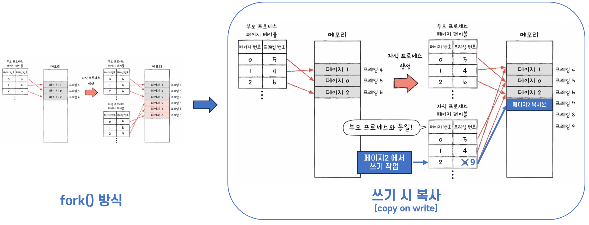
> </div>
> 
> - **fork()**
>   - 부모 프로세스의 복사본으로 자식 프로세스를 만드는 시스템 호출 명령어
>   - 시간적, 공간적(메모리) 효율이 좋지 않다
> - **쓰기 시 복사 (copy on write)**
>   - 자식 프로세스는 부모 프로세스와 동일한 프레임을 가르킨다
>   - 부모 혹은 자식 중 특정 프레임에서 쓰기 작업이 일어날 경우, 그 해당 프레임만 복사본을 만들기 시작한다
> 
> ### 💡 계층적 페이징 (Hierarchical paging)
> 
> - 페이지 테이블의 크기는 생각보다 작지 않다
> - 프로세스를 이루는 모든 페이지 테이블 엔트리를 메모리에 저장하는 것은 큰 낭비이며, 이를 해결하기 위한 기법
> - 다단계 페이지 테이블 (multilevel page table) 이라고도 함
> 
> <div align="center" style="display:flex; align-items: center; justify-content: center;">
> 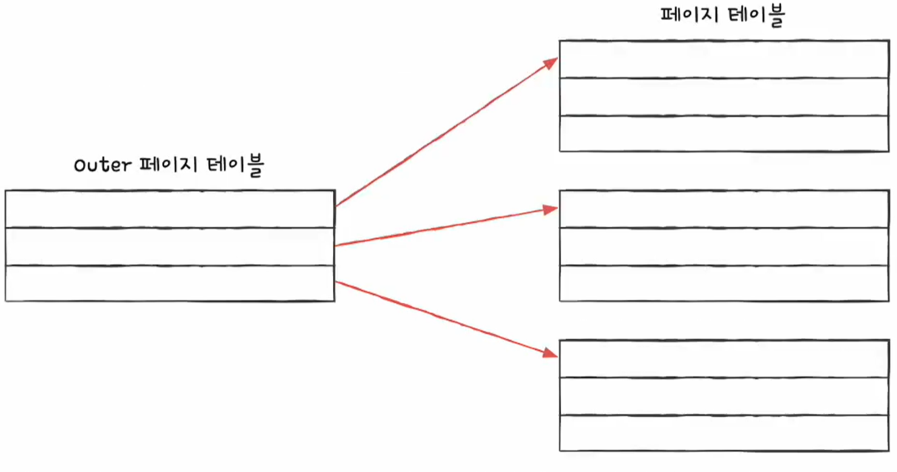
> &nbsp;&nbsp;&nbsp;&nbsp;&nbsp;&nbsp;&nbsp;&nbsp;&nbsp;&nbsp;&nbsp;&nbsp;&nbsp;&nbsp;&nbsp;
> 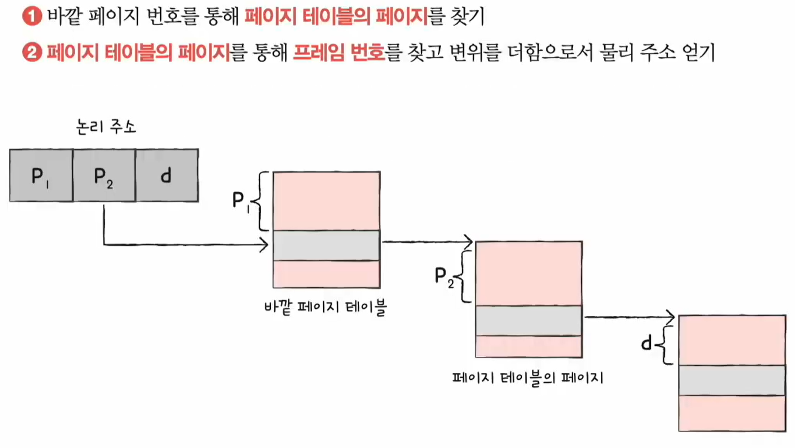
> </div>
> 
> - 계층적 페이징은 페이지를 여러 단계의 계층적으로 두는 방식
> - 페이티 테이블을 여러 페이지로 쪼개고, 이 페이지들을 가리키는 페이지 테이블(Outer 페이지 테이블)을 두는 방식이다
> - CPU와 가장 가까이 위치한 Outer 페이지 테이블은 메모리에 항상 유지된다
> - 계층적 페이징을 이용하는 환경에서는 논리 주소에 담기는 정보도 달라진다


<br/>
---


## 3️⃣ 페이지 교체와 프레임 할당

```markdown
💡 keywords: 
```

### ❇️

<br/>
---

