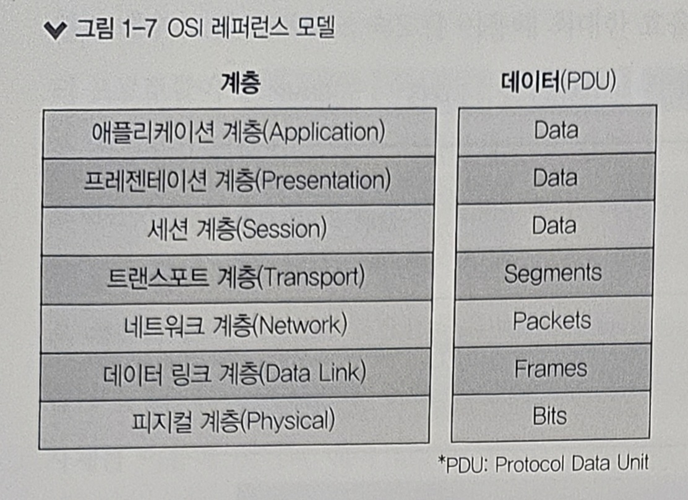
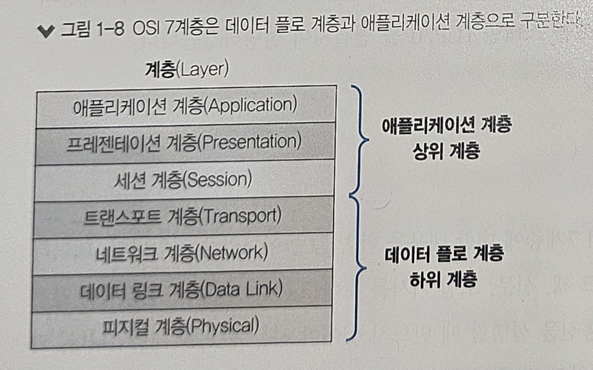
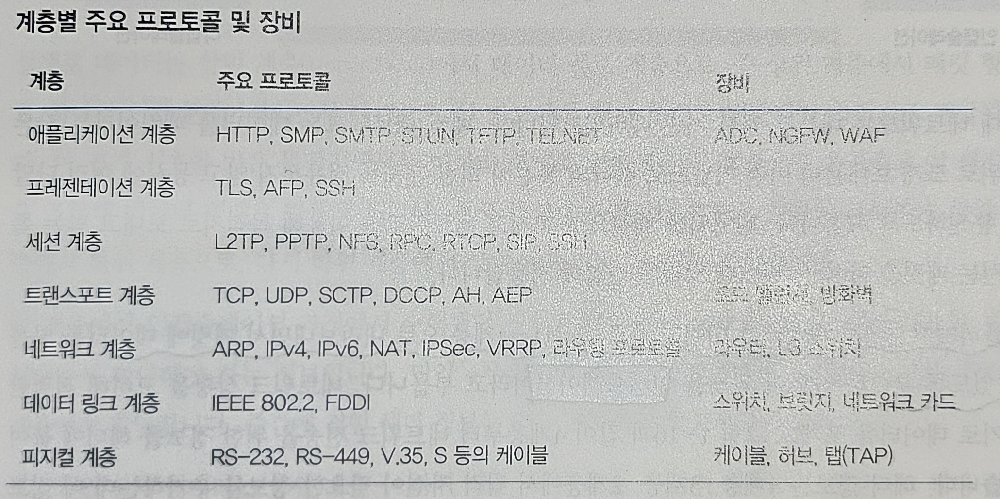
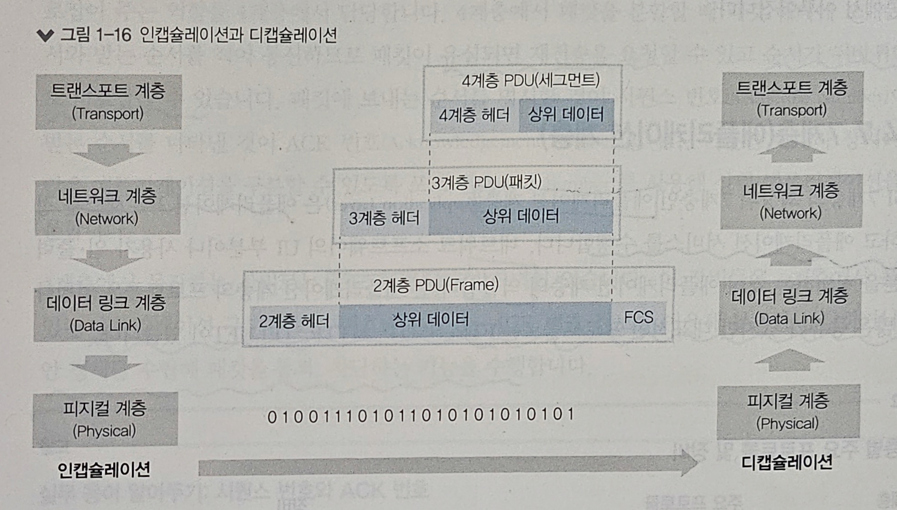
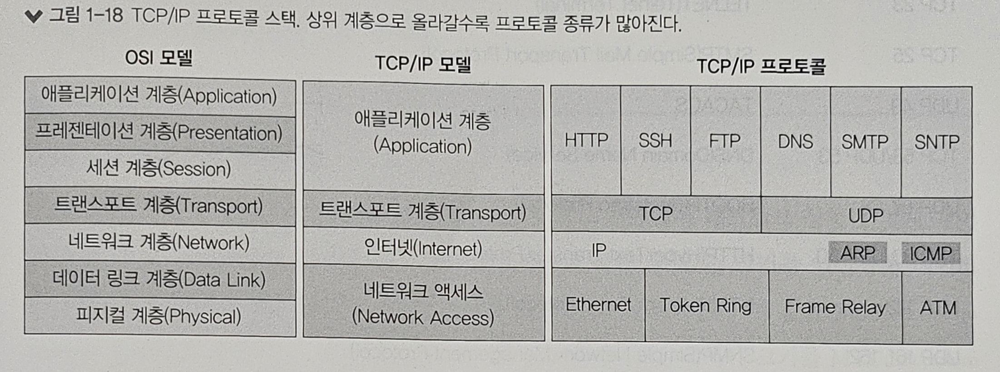
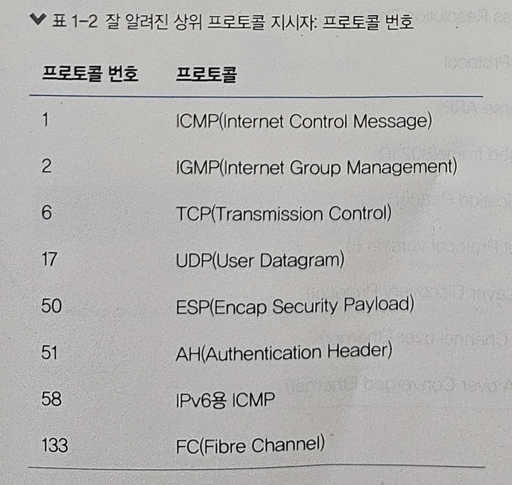
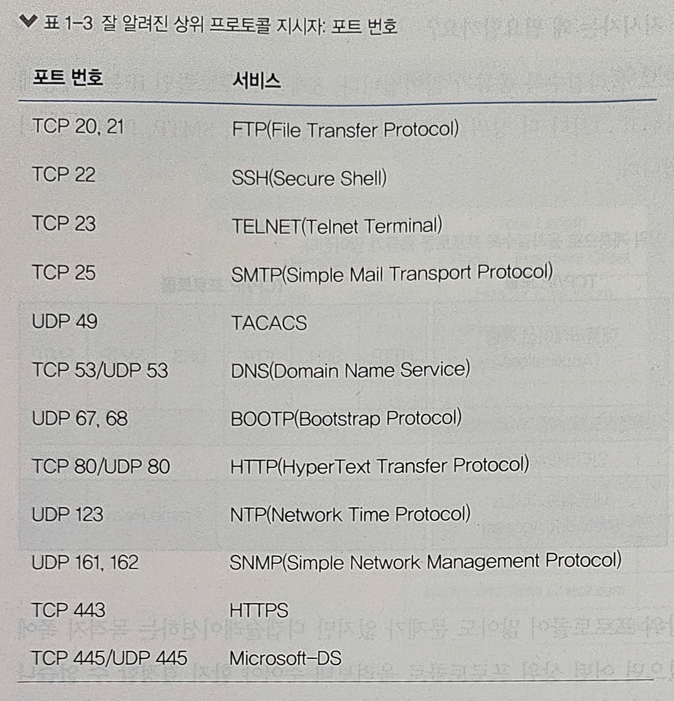
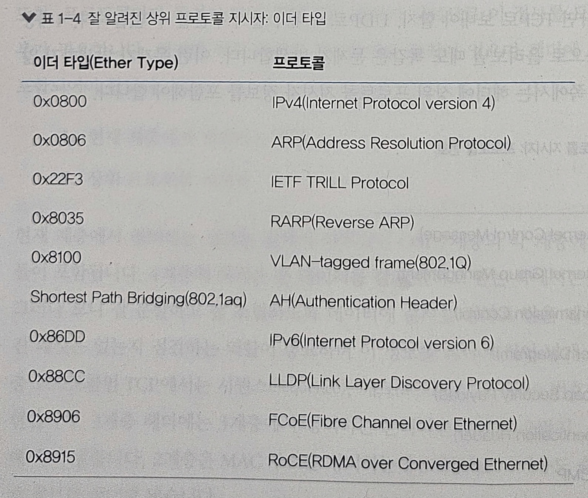

# 1장. 네트워크 시작하기

1) 네트워크 구성도 살펴보기
2) 프로토콜
3) OSI 7계층과 TCP/IP
4) OSI 7계층별 이해하기
5) 인캡슐레이션과 디캡슐레이션

 
---

## 1️⃣ 네트워크 구성도 살펴보기

### 홈 네트워크

- 홈 네트워크 구성은 어떤 인터넷 회선(FTTH, 케이블 인터넷, VDSL 등)을 연결하더라도 같다
- 모뎀, 굥유기, 단말 간에 물리적 연결로 구성된다

### 데이터 센터 네트워크

- 안정적이고 빠른 대용량 서비스 제공을 목표로 구성한다
- 10G, 25G, 40G, 100G, 400G와 같은 고속 이더넷 기술이 사용된다
- 기존에는 3계층 구성이 일반적이었지만, 현대에는 2계층 구성인 스파인-리프 구조를 사용한다  
  _(스파인-리프, TOR, 스파인 스위치, 리프 스위치 등의 데이터 센터 디자인 관련 내용은 13장에서 다룸)_

 
---

## 2️⃣ 프로토콜

프로토콜이란 통신 규약을 뜻한다.  
과거에는 다양한 프로토콜들이 존재했지만 현재 대부분 **이더넷-TCP/IP** 기반 프로토콜을 사용한다.

- 물리적 측면: 데이터 전송 매체, 신호 규약, 회선 규격 등. 이더넷이 널리 쓰임
- 논리적 측면: 장치들끼리 통신하기 위한 프로토콜 규격. TCP-IP가 널리 쓰임

과거 네트워크와 컴퓨팅 자원의 한계로 비트 기반 프로토콜을 사용했지만, 현대에는 문자 기반 프로토콜을 많이 사용한다.  
TCP/IP 프로토콜 스택은 물리 계층, 네트워크 계층, 전송 계층, 애플리케이션 계층으로 총 4개의 부분으로 나뉜다.

 
---

## 3️⃣ OSI 7계층과 TCP/IP

### OSI 7계층

OSI 7계층은 과거 통일되지 않았던 통신 규약에서 하나의 규약으로 표준화되어 통합된 통신 규약이다.  
OSI 7계층은 네트워크 구성 요소들을 계층별로 모듈화하여 독립적인 개발이 가능하다.  
그런데, 현재는 대부분 TCP/IP 프로토콜 스택 기반을 사용하고 있다.

- 5 ~ 7 계층: 애플리케이션 계층 (Application Layer) / 상위 계층 (Upper Layer)
- 1 ~ 4 계층: 데이터 플로 계층 (Data Flow Layer) / 하위 계층 (Lower Layer)

데이터 플로 계층은 데이터를 상대방에게 잘 전달하는 역할을 한다.  
애플리케이션 계층은 애플리케이션 개발자들이 고려해야 할 영역이다.  
즉, 애플리케이션 개발자는 하향식(Top-Down)으로, 네트워크 엔지니어는 상향식(Bottom-Up)으로 네트워크를 인식한다.

### TCP/IP 프로토콜 스택

현대 네트워크는 대부분 TCP/IP와 이더넷으로 이루어져 있다.  
TCP/IP는 이론보다 실용성에 중점을 둔 프로토콜이다.  
OSI 7계층 모델에서 애플리케이션 개발자와 네트워크 엔지니어가 각각 상위 계층과 하위 계층으로 구분지어 집중할 수 있었던 것 처럼 TCP/IP 4계층 모델에서는 이러한 목적성과 구분감이 더 확연히 드러난다.

 
---

## 4️⃣ OSI 7계층별 이해하기

### 1계층 (피지컬 계층, 물리 계층, Physical Layer)

- 1계층은 물리 계층으로 물리적 연결과 관련된 정보를 정의한다.
- 들어온 전기 신호를 그대로 잘 전달하는 것이 목적이며, 들어온 전기 신호를 그대로 재생성하여 내보낸다.
- 1계층 장비는 주소의 개념이 없으며, 전기 신호가 들어온 포트를 제외한 나머지 포트에 동일한 전기 신호를 전송한다.
- 1계층 주요 장비에는 허브(Hub), 리피터(Repeater), 케이블(Cable), 커넥터(Connector), 트랜시버(Tranceiver), 탭(TAP)이 있다
  - 허브, 리피터: 네트워크 통신을 중재하는 장비
  - 케이블, 커넥터: 케이블 본체를 구성하는 요소
  - 트랜시버: 컴퓨터의 랜카드와 케이블을 연결하는 장비
  - 탭: 네트워크 모니터링과 패킷 분석을 위해 전기 신호를 다른 장비로 복제함

### 2계층 (데이터 링크 계층, Data Link Layer)

- 전기 신호를 모아 우리가 잘 알아볼 수 있는 데이터 형태로 처리한다
- 주소 정보를 정의하고, 정확한 주소로 통신이 되도록 하는 데에 중점을 둔다
- 출발지와 도착지 주소를 확인하고, 내게 보낸 것이 맞는지, 내가 처리해야 하는지에 대해 검사한 후 데이터 처리를 수행한다
- 데이터에 대한 에러를 탐지한다
- 받는 사람이 현재 데이터를 받을 수 있는지를 먼저 확인하는 작업을 하며, 이를 플로 컨트롤(Flow Control)이라고 한다
- 2계층에서 동작하는 네트워크 구성 요소는 네트워크 인터페이스 카드(NIC)와 스위치(Switch)가 있다

**네트워크 인터페이스 카드 (NIC)**
- NIC와 스위치 모두 MAC 주소를 이해할 수 있으며, 스위치는 MAC 주소를 통해 통신해야 할 포트를 지정하여 내보내는 역할을 한다
- NIC에는 고유 MAC 주소가 있다. 들어오는 전기 신호를 데이터 형태로 변환하고, 도착지 MAC 주소를 확인한 뒤, 자신에게 들어오는 전기 신호가 맞으면 이 데이터를 상위 계층에서 처리할 수 있도록 메모리에 적재하며, 아니면 해당 신호는 버린다
- _(NIC가 실무에서 사용되는 다양한 명칭으로는 네트워크 카드, 랜 카드, 물리 네트워크 인터페이스, 이더넷 카드, 네트워크 어댑터 등이 있다)_

**스위치 (Switch)**
- 스위치는 단말이 어떤 MAC 주소인지, 연결된 포트는 어느 것인지 주소 습득 과정에서 알 수 있다
- 이 데이터를 기반으로 단말들이 통신할 때 포트를 적절히 필터링하고 정확한 포트로 포워딩을 해준다
- 1계층의 허브와는 달리 스위치의 적절한 필터링과 포워딩 기능으로 필요한 포트에만 통신할 수 있도록 하여 오늘날 이더넷 네트워크 효율성을 크게 향상시킨 역할을 하였다 

### 3계층 (네트워크 계층, Network Layer)

- IP 주소와 같은 논리적인 주소를 정의한다
- IP 주소는 MAC 주소와 달리 사용자가 환경에 맞게 변경하여 사용이 가능하며, 네트워크 주소 부분과 호스트 주소 부분으로 나뉜다
- 3계층에서 동작하는 장비에는 라우터가 있다
- 라우터는 IP 주소를 사용해 최적의 경로를 찾아주고 해당 경로로 패킷을 전송하는 역할을 한다

### 4계층 (트랜스포트 계층, Transport Layer)

- 4개의 하위 계층 중 1 ~ 3 계층은 신호와 데이터를 올바른 위치로 보내고 실제 신호를 잘 만들어 보내는 데 집중한다 
- 4계층은 실제로 해당 데이터들이 정상적으로 잘 보내졌는지 확인하는 역할을 한다
- 데이터를 패킷 단위로 분할하여 전송하는 패킷 네트워크는 중간에 패킷이 유실되거나 순서가 바뀔 수 있다
- 4계층에서 패킷을 분할할 때 패킷 헤더에 보내는 순서와 받는 순서를 기록하여 패킷의 순서를 보장하거나, 유실된 패킷은 재요청을 한다
  - 시퀀스 번호(Sequence Number): 보내는 순서를 명시한 것
  - ACK 번호(Acknowledgement Number): 받는 순서를 명시한 것
- 4계층 장비로는 로드 밸런서와 방화벽이 있다
  - 4계층 장비는 애플리케이션 구분자(포트 번호)와 시퀀스, ACK 번호를 통해 부하를 분산하거나 보안 정책을 수립해 패킷을 통과/차단하는 기능을 수행함

### 5계층 (세션 계층, Session Layer)

- 5계층은 양 끝단의 프로세스가 연결을 성립하도록 도와주고, 연결이 안정적으로 유지되도록 관리하며, 작업 완료 후에는 이 연결을 끊는 역할을 한다
- 흔히 말하는 "세션"을 관리하는 것이 주요 역할로써 TCP/IP 세션을 만들고 없애는 책임을 갖는다
- 또한, 에러로 중단된 통신에 대한 에러 복구와 재전송도 수행한다

### 6계층 (프레젠테이션 계층, Presentation Layer)

- 6계층은 표현 방식이 다른 애플리케이션이나 시스템 간의 통신을 돕기 위해 하나의 통일된 구문 형식으로 변환시키는 기능을 수행한다
- 일종의 번역기나 변환기 역할을 수행하는 것이며, 이는 사용자 시스템의 응용 계층에서 데이터 형식상의 차이를 다루는 부담을 덜어준다
- MIME 인코딩, 암호화, 압축, 코드 변환과 같은 동작이 6계층에서 이루어진다

### 7계층 (애플리케이션 계층, Application Layer)

- 7계층은 애플리케이션 프로세스를 정의하고 애플리케이션 서비스를 수행한다
- 네트워크 소프트웨어의 UI 부분이나 사용자 입출력부분을 정의하는 역할을 한다
- 7계층에 해당하는 프로토콜 종류는 매우 다양하며, 대표적으로 FTP, SMTP, HTTP, TELNET 등이 있다

 
---

## 5️⃣ 인캡슐레이션과 디캡슐레이션

- 현대 네트워크는 대부분 패킷 기반 네트워크이다.
- 패킷 네트워크는 통해 하나의 통신이 회선 전체를 점유하지 않고 동시에 여러 단말이 통신하도록 해준다
- 데이터를 보내는 과정을 인캡슐레이션, 받는 과정을 디캡슐레이션이라고 한다

**인캡슐레이션(Encapsulation)**
- 애플리케이션에서 데이터를를 데이터 플로 계층(1~4계층)으로 내려보내면서 패킷에 데이터를 넣을 수 있도록 분할하는 과정이다
- 4계층부터 1계층까지 순서대로 각각의 네트워크 전송에 필요한 정보를 헤더에 기록하여 전송한다
- 헤더에 기록되는 정보는 문자가 아닌 미리 정의된 비트 단위를 사용한다

**디캡슐레이션(Decapsulation)**
- 반대로 받는 쪽에서는 디캡슐레이션 과정을 수행한다
- 이번에는 1계층부터 4계층까지 순서대로 각 계층에 필요한 헤더를 확인하며, 확인한 헤더는 버린다
- 1계층에서는 받은 전기 신호를 데이터 형태로 만들어 2계층으로 올려보낸다
- 2계층에서는 헤더에 적힌 정보 중 목적지를 확인하여 자신에게 온 패킷이 아니면 버리고, 맞으면 3계층으로 올려보낸다
- 3, 4 계층도 마찬가지로 수행한다

