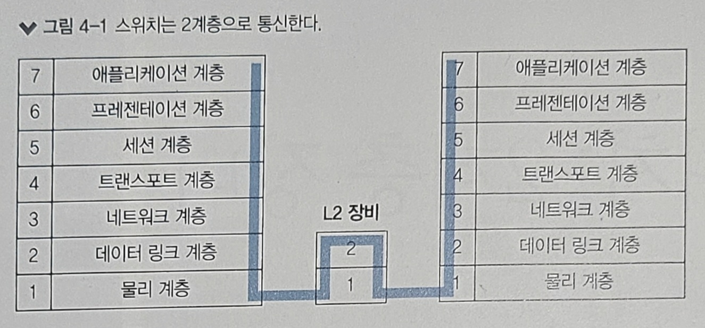
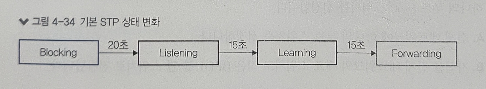
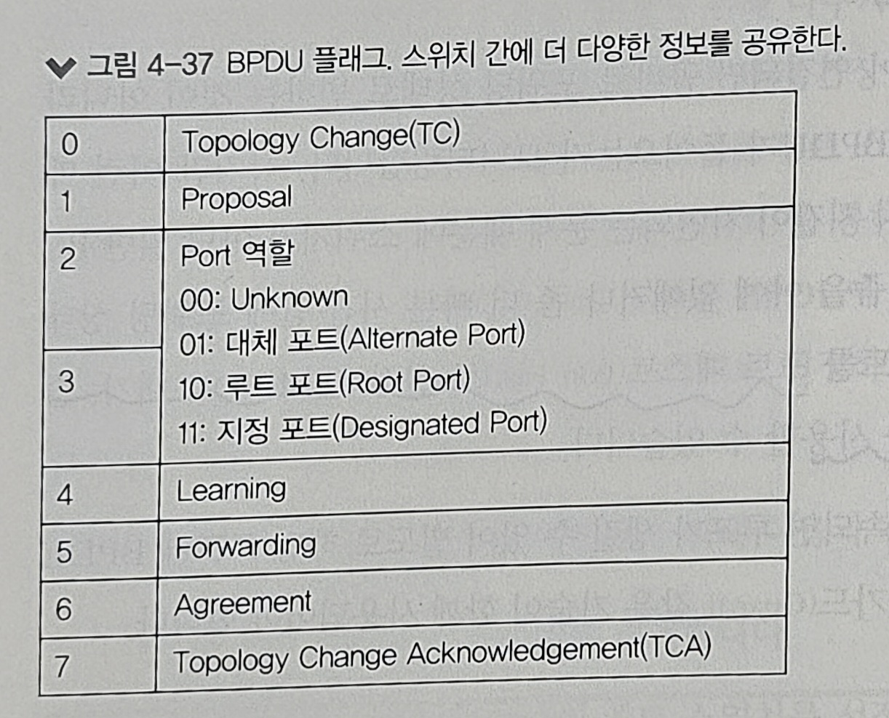

# 4장. 스위치: 2계층 장비

1) 스위치 장비 동작
2) VLAN
3) STP

 
---

- 스위치는 2계층 주소인 MAC 주소를 기반으로 동작한다
- 스위치는 네트워크 중간에서 패킷을 받아 필요한 곳에만 보내주는 네트워크 중재자 역할을 한다
- 스위치는 MAC 주소를 인식하고 패킷을 전달하는 기본 동작 외, 여러 기능이 있다
    - 한 대의 장비에서 논리적으로 네트워크를 분리할 수 있는 VLAN 기능
    - 네트워크 루프를 방지하는 스패닝 트리 프로토콜(STP) 기능
    - 등등

## 1️⃣ 스위치 장비 동작

- 스위치는 네트워크에서 통신을 중재하는 장비이다
- 스위치는 패킷을 동시에 여러 장비가 서로 간섭 없이 통신하도록 도와주는 장비이다
- 핵심 역할은 누가 어느 위치에 있는지 파악하고, 실제 통신이 시작되면 자신이 알고 있는 위치로 패킷을 정확하게 전송하는 기능이다
- 스위치는 2계층에서 사용되는 MAC 주소를 통해 통신을 하며, 이는 **MAC 주소**와 단말이 위치하는 **인터페이스 정보**를 매핑한 **MAC 주소 테이블**을 갖고 있다
- MAC 주소 테이블에 있는 도착지 주소가 들어오면 해당 주소로 매핑된 포트로만 패킷을 전송한다
- MAC 주소 테이블에 없는 도착지 주소가 들어오면 자신을 제외한 모든 포트로 패킷을 전송한다

이러한 스위치의 동작 방식은 다음과 같이 3가지로 정리할 수 있다.

1) **플러딩 (Flooding)**
    - MAC 주소 테이블에 없는 패킷이 들어온 경우, 해당 패킷이 들어온 포트를 제외한 모든 포트에 패킷을 전송하는 것
2) **어드레스 러닝 (Address Learning)**
    - MAC 주소 테이블을 만들고 유지하는 과정
    - 어떤 포트로 패킷이 들어오면, 해당 패킷의 출발지 포트를 MAC 주소 테이블에 기록한다
    - but, 출발지 MAC 주소를 통해 학습하기 때문에 목적지 MAC 주소 필드만 사용하는 브로드캐스트나 멀티캐스트에 대한 MAC 주소를 학습할 수 없다
3) **포워딩/필터링 (Forwarding/Filtering)**
    - 포워딩: 들어온 패킷의 도착지 MAC 주소가 테이블에 있으면, 해당 포트로 패킷을 전송(포워딩)하는 것
    - 필터링: 포워딩을 할 때 다른 포트로는 보내지 않는 것
    - 포워딩과 필터링은 여러 포트에서 동시에 수행될 수 있다
    - 스위치는 일반적인 유니캐스트에 대해서만 포워딩과 필터링 작업을 수행한다
    - BUM 트래픽이라 부르는 언노운 유니캐스트, 멀티캐스트, 브로드캐스트는 출발지 MAC 주소가 사용되지 않으므로 필터링 작업 없이 모두 플러딩한다

 
---

## 2️⃣ VLAN (Virtual Local Area Network)

### ❇️ VLAN 이란?

- VLAN (Virtual Local Area Network)
- 하나의 물리 스위치에서 여러 개의 네트워크를 나누어 사용할 수 있는 기술
- 물리적 배치와 상관없이 LAN을 논리적으로 분할, 구성하는 기술
- 기업과 같이 각 부서별로 네트워크를 분할할 때 사용되며, 이는 과도한 브로드캐스트로 인한 성능 저하, 보안 향상을 위한 차단 용도, 서비스 특성에 따른 정책 적용 등의 이점이 있다
- VLAN을 나누면 하나의 장비를 서로 다른 네트워크를 갖도록 논리적으로 분할한 것이므로 VLAN 간에 통신을 하기 위해서는 3계층 장비가 필요하다

### ❇️ VLAN의 종류와 특징

1) **포트 기반 VLAN (Port Based VLAN)**
    - 스위치를 논리적으로 분할해 사용하는 것이 목적인 VLAN
    - 일반적으로 사용되는 대부분의 VLAN은 포트 기반 VLAN 이다
2) **MAC 기반 VLAN (MAC Based VLAN)**
    - 스위치의 고정 포트에 VLAN을 할당하는 것이 아닌, 스위치에 연결되는 단말의 MAC 주소를 기반으로 VLAN을 할당하는 기술
    - 단말이 연결되면 단말의 MAC 주소를 인식한 스위치가 해당 포트를 지정된 VLAN으로 변경한다
    - 다이나믹 VLAN 이라고도 부른다

### ❇️ VLAN 모드 (Trunk/Access) 동작 방식

- 서로 다른 VLAN 간의 통신을 위해서는 3계층 장비가 필요하다
- 여러 개의 VLAN이 존재하는 상황에서 스위치를 서로 연결해야 하는 경우에는 각 VLAN끼리 통신하려면 VLAN 개수 만큼 포트를 연결해야 한다
- VLAN을 많이 사용하는 중대형 네트워크 환경에서는 포트 낭비가 될 수 있다
- 이 문제를 해결하기 위해 나온 것이 VLAN 태그 기능이다
- 태그 기능은 하나의 포트에 여러 개의 VLAN을 함께 전송할 수 있게 해준다
- 이 포트를 태그(Tagged) 포트 또는 트렁크(Trunk) 포트라고 한다
- 태그 포트는 통신할 때 이더넷 프레임 중간에 VLAN ID 필드를 끼어 넣어 이 정보를 이용한다
- 일반적인 포트를 언태그(Untagged) 포트 또는 액세스(Access) 포트라 한다
- VLAN 정보를 넘겨 여러 VLAN이 한 번에 통신하도록 해주는 포트를 태그(Tagged) 포트 또는 (Trunk) 포트라고 한다
- 언태그 포트로 패킷이 들어올 경우, 같은 VLAN으로만 패킷을 전송한다
- 태그 포트로 패킷이 들어올 경우, 태그를 벗겨내면서 태그된 VLAN 쪽으로 패킷을 전송한다

 
---

## 3️⃣ STP (Spanning Tree Protocol)

- IT 환경에서 하나의 네트워크 장비 고장으로 인해 전체 네트워크가 마비되는 SPoF(Single Point of Failure) 현상을 막기 위해 이중화, 다중화된 네트워크를 디자인하고 구성한다
- 이러한 SPoF 문제를 해결하기 위해 스위치 두 대로 네트워크를 디자인하지만, 이 또한 네트워크 루프(Loop) 현상이 발생할 수 있다

### ❇️ 루프란?

- 루프란 네트워크에 연결된 모양이 고리처럼 되돌아오는 형태로 구성된 상황이다
- 3가지 큰 이유가 있지만, 루프 문제를 발생시키는 대부분의 원인은 브로드캐스트 스톰으로 인한 문제이다

#### 브로드캐스트 스톰

- 루프 구조로 연결된 네트워크에서, 단말에서 브로드캐스트를 발생시키면 패킷이 루프 형태로 계속 플러딩되며 돌아가게 되는데 이를 브로드캐스트 스톰이라 한다

#### 스위치 MAC 러닝 중복 문제

- 동힐한 MAC 주소가 여러 포트에서 학습되면 MAC 테이블이 반복 갱신되어 정상적으로 동작되지 않는데 이러한 현상을 MAC 어드레스 플래닝 (MAC Adress Planning) 이라고 한다
- 이런 현상이 발생하면 스위치에서 학습된 주소의 포트가 계속 변경되므로 스위치가 정상적으로 동작하지 못하고 패킷을 플러딩한다

네트워크 루프가 발생할 경우 루프 구성 포트 중 하나의 포트만 사용하지 못하도록 셧다운을 하여 루프를 예방할 수 있다.  
이를 루프를 자동으로 감지해 포트를 차단하고 장애 떄문에 우회로가 없을 때 차단된 포트를 스위치로 다시 풀어주는 **스패닝 트리 프로토콜**이 개발되었다

### ❇️ STP란?

- 스패닝 트리 프로토콜(STP)은 루프를 확인하고 적절히 포트를 사용하지 못하게 만들어 루프를 예방하는 매커니즘이다
- STP를 이용해 전체 스위치가 어떻게 연결되어 있는지를 알아야 하며, 이는 BPDU(Bridge Protocol Data Unit)이라는 프로토콜을 통해 알 수 있다
- BPUD에는 스위치가 갖고 있는 고유 ID값이 있으며, 이를 통해 스위치 간의 루프 파악이 가능하다
- 이렇게 확인된 루프 지점을 트래픽이 통과하지 못하도록 차단해 루프를 예방한다

#### 스위치 포트의 상태 및 변경 과정

- STP가 동작중인 스위치에서는 루프를 막기 위해 스위치 포트에 신규 스위치가 연결되면 바로 트래픽이 흐르지 않도록 차단한다
- 그리고 해당 포트로 트래픽이 흘러도 되는지 확인하기 위해 BPDU를 기다려 학습하고 구조를 파악한 후, 트래픽을 흘리거나, 루프 구조인 경우 차단 상태를 유지한다
- 차단 상태에서 트래픽이 흐를 때까지의 스위치의 포트 상태는 다음 4가지로 구분된다
    - Blocking
        - 패킷 데이터를 차단한 상태로 상대방이 보내는 BPDU를 기다린다
        - 총 20초인 MAX Age 기간 동안 상대방 스위치에서 BPUD를 받지 못했거나 후순위 BPDU를 받았을 때 포트는 리스닝 상태로 변경된다
        - BPDU 기본 교환 주기는 2초이고 10번의 BPDU를 기다린다
    - Listening
        - 리스닝 상태는 해당 포트가 전송 상태로 변경되는 것을 결정하고 준비하는 단계이다
        - 이 상태부터는 자신의 BPDU 정보를 상대방에게 전송하기 시작한다
        - 총 15초 동안 대기한다
    - Learning
        - 러닝 상태는 이미 해당 포트를 포워딩하기로 결정하고 실제로 패킷 포워딩이 일어날 때, 스위치가 곧바로 동작하도록 MAC 주소를 러닝하는 단계이다
        - 총 15초 동안 대기한다
    - Forwarding
        - 패킷을 포워딩하는 단계이다.
        - 정상적인 통신이 가능하다

스위치에 신규로 장비를 붙이면 통신하는 데 50여 초가 소요된다.  
스위치는 루프를 예방하기 위해 매우 방어적으로 동작하는데, 새로 연결된 단말이 스위치일 가능성이 있어 BPDU를 일정 시간 이상 기다려 스위치 여부를 파악한다

#### STP 동작 방식

STP는 네트워크 상에서 뿌리가 되는 가장 높은 스위치를 선출하고 그 스위치를 통해 모든 BPDU가 교환되도록 하는데, 그 스위치를 **루트 스위치**라고 한다.  
모든 스위치는 처음에 자신을 루트 스위치로 인식해 동작한다.  
BPDU를 통해 2초마다 자신이 루트 스위치임을 광고하며, 새로운 스위치가 들어오면 서로 교환된 BPUD에 들어있는 브릿지 ID 값을 비교한다.  
브릿지 ID 값이 더 적은 스위치를 루트 스위치로 선정하고, 루트 스위치로 선정된 스위치가 BPDU를 다른 스위치 쪽으로 보낸다

스패닝 트리 프로토콜이 루프를 예방하기 위해 다음과 같이 동작한다

1. 하나의 루트(Root) 스위치를 선정한다
    - 전체 네트워크에 하나의 루트 스위치를 선정한다
    - 자신을 전체 네트워크의 대표 스위치로 적은 BPDU를 옆 스위치로 전달한다
2. 루트가 아닌 스위치 중 하나의 루트 포트를 선정한다
    - 루트 브릿지로 가는 경로가 가장 짧은 포트를 루트 포트라고 한다
    - 루트 브릿지에서 보낸 BPDU를 받는 포트이다
3. 하나의 세그먼트에 하나의 지정 포트(designated port)를 선정한다
    - 스위치와 스위치가 연결되는 포트는 하나의 지정 포트를 선정한다
    - 스위치 간의 연결에서 이미 루트 포트로 선정된 경우, 반대쪽이 지정포트로 선정되어 양쪽 모두 포워딩 상티가 된다
    - 스위치 간의 연결에서 아무도 루트 포트가 아닐 경우, 한 쪽은 지정 포트로 선정되고 다른 한 쪽은 대체 포트(Alternate, Non-Designated)가 되어 차단 상태가 된다
    - BPUD가 전달되는 포트이다

### ❇️ 향상된 STP(RSTP, MST)

- 스패닝 트리 프로토콜은 루프를 예방하기 위해 같은 네트워크에 속한 모든 스위치까지 BPDU가 전달되는 시간을 고려한다
- 그러다보니 블로킹 포트가 포워딩 상태로 변경될 때까지 30~50초가 소요된다
- 통신에서 가장 많이 쓰이는 TCP 기반 애플리케이션이 네트워크가 끊겼을 때 30초 이상 기다리지 못하다보니 STP 기반 네트워크에 장애가 생기면 통신이 끊길 수 있다

#### RSTP (Rapid Spanning Tree Protocol)

- 스패닝 트리 프로토콜은 이중화된 스위치 경로 중 정상적인 경로에 문제가 발생할 경우, 백업 경로를 활성화하는 데 30~50초가 걸린다
- RSTP는 2~3초 정도로 절체 시간이 짧아 일반적인 TCP 기반 애플리케이션이 세션을 유지할 수 있다
- 기본적인 구성과 동작 방식은 STP와 같지만, 다양한 BPDU 메시지 형식을 사용한다
- STP는 일반 토폴로지 변경과 관련된 두 가지 메시지(TCN, TCA BPDU)가 있지만, RSTP는 8개 비트를 모두 활용해 다양한 정보를 주변 스위치와 주고 받는다

#### MST (Multiple Spanning Tree)

- 일반 스패닝 트리 프로토콜은 CST(Common Spanning Tree)라고 부른다
- CST는 VLAN 개수와 상관 없이 한 개의 스패닝 트리만 사용한다
- 하나의 스패닝 트리를 사용하기 때문에 스위치의 부하가 적은 대신, 루프가 생기는 토폴로지에서는 한 개의 포트와 회선만 활성화되므로 자원을 효율적으로 활용할 수 없다
- 또한, VALN마다 최적의 경로가 다를 수 있는데, 포트 하나만 사용할 수 있다보니 멀리 돌아 통신해야 되는 경우도 생긴다
- 이러한 단점을 해결하기 위해 각 VLAN마다 다른 스패닝 트리를 사용하는 PVST(Per VLAN Spanning Tree)가 개발되었다
- PVST는 각 VLAN마다 별도의 경로와 트리를 만들어 최적의 경로를 디자인할 수 있고, VLAN마다 별도의 블록 포트를 지정해 네트워크 로드를 셰어링하도록 구성할 수 있게 되었다
- 하지만, PVST는 너무 많은 스패닝 트리를 사용하여 오히려 단점이 되었다.
- CST와 PVST의 단점을 보완하기 위해 MST가 개발되었다
- MST는 여러 개의 VLAN을 그룹으로 묶어서 그룹마다 별도의 스패닝 트리를 관리한다
- PVST보다 훨씬 적은 스패닝 트리 프로토콜을 사용하여 부하를 줄이고, PVST의 장점인 로드 셰어링 기능도 함께 사용할 수 있다
- MST에서는 여러 개의 VLAN을 하나의 리전으로 묶을 수 있고, 리전 하나가 스패닝 트리 하나가 된다