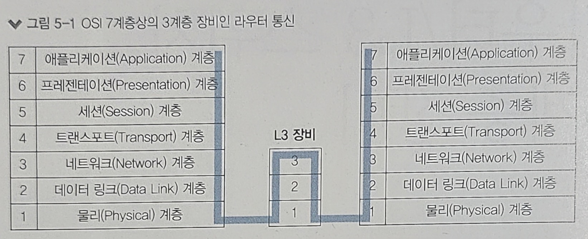
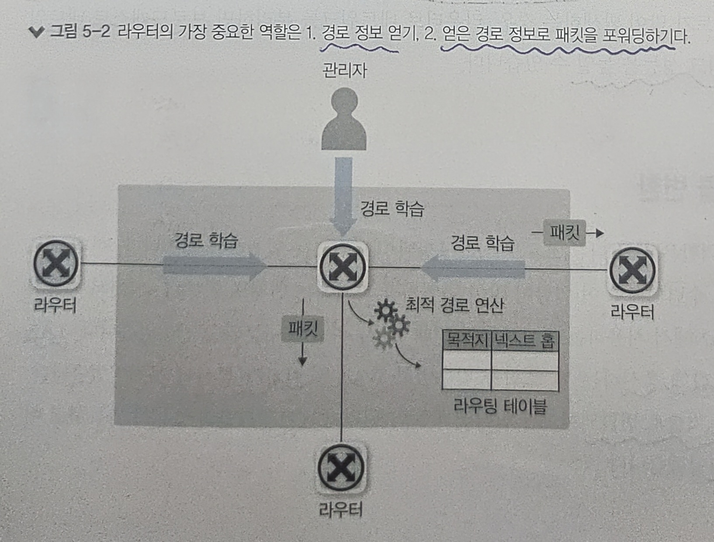
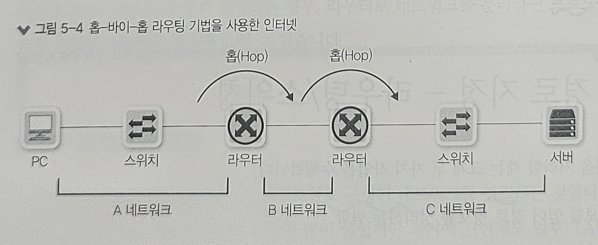
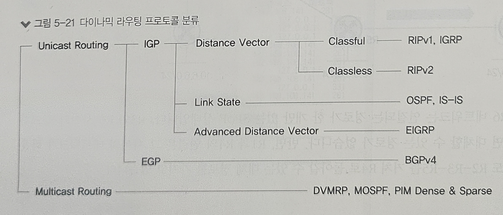

# 5장. 라우터/L3 스위치: 3계층 장비

1) 라우터의 동작 방식과 역할
2) 경로 지정 - 라우팅/스위칭
3) 라우팅 설정 방법

 
---

- 라우터는 3계층에서 동작하며, 네트워크 경로를 지정해주는 장비이다
- 라우터에 들어오는 패킷의 목적지 IP 주소를 확인하고 자신이 가진 경로 정보를 이용해 패킷을 최적의 경로로 포워딩한다

> #### 💡 참고: 라우터? L3 스위치?
> 스위치는 대표적인 2계층 장비이지만, 라우터처럼 3계층에서 동작하는 L3 스위치라고 부르는 장비도 많이 사용되고 있다.  
> 기존에 라우터는 소프트웨어로 구현되고, 스위치는 하드웨어로 구현된 형태로 구분을 많이 하였다.  
> 그러나 최근 기술 발달로 라우터와 L3 스위치를 구분하기 어렵다.  
> 즉, 이번 장에서 설명하는 라우터는 L3 스위치에도 모두 동일하게 적용되는 내용이다.

## 1️⃣ 라우터의 동작 방식과 역할

라우터는 다양한 경로 정보를 수집해 최적의 경로를 라우팅 테이블에 저장한 후 패킷이 라우터에 들어오면 도착지 IP 주소와 라우팅 테이블을 비교해 최선의 경로로 패킷을 내보낸다.  
스위치와는 반대로 라우터는 들어온 패킷의 목적지 주소가 라우팅 테이블에 없으면 패킷을 버린다.  
라우터의 동작 방식에는 크게 경로 지정, 브로드캐스트 컨트롤, 프로토콜 변환이 있다.

### ❇️ 경로 지정

- 라우터의 가장 중요한 역할은 경로 지정이다
- 경로 정보를 모아 라우팅 테이블을 만든다
- 들어온 패킷의 도착지 IP 주소를 확인해 경로를 지정하고 패킷을 포워딩 한다
- IP 주소에서는 네트워크 주소를 확인한다

### ❇️ 브로드캐스트 컨트롤 (Broadcast Control)

- 라우터는 패킷을 원격지로 보내는 것을 목표로 개발되어, 분명한 도착지 정보가 있을 때만 통신을 허락한다
- 그렇기 때문에, 라우터는 기본적으로 멀티캐스트 정보를 습득하지 않고, 브로드캐스트 패킷을 전달하지 않는다.
- 라우터의 이 기능을 이용해 브로드캐스트가 다른 네트워크로 전파되는 것을 막을 수 있으며, 이를 **브로드캐스트 컨트롤/멀티캐스트 컨트롤**이라고 한다

### ❇️ 프로토콜 변환

- 라우터의 또 다른 역할은 서로 다른 프로토콜로 구성된 네트워크를 연결하는 것이다
- 과거 LAN과 WAN의 기술이 달랐던 시절, 라우터를 통해 LAN 기술을 WAN 기술로 변환하여 인터넷과 같은 원격지 네트워크 통신이 가능했다
- 프로토콜 변환 기술은 라우터는 3계층 장비이므로 들어온 2계층의 헤더는 벗겨내고, 다시 내보낼 때 새로운 2계층 헤더를 만들어 내는데, 이러한 특성을 이용하여 만들어진 것이다

 
---

## 2️⃣ 경로 지정 - 라우팅/스위칭

라우터가 패킷을 처리할 때, 크게 두 가지 작업을 수행한다

- 경로 정보를 얻어, 경로 정보를 정리하는 역할
- 정리된 경로 정보를 기반으로 패킷을 포워딩하는 역할

라우터는 다양하고 많은 경로 정보를 얻을 수 있지만, 원하는 목적지 정보와 정확히 일치하지 않는 경우가 더 많다.  
이 떄, 갖고 있는 목적지 중 가장 근접한 목적지를 찾아 패킷을 포워딩한다.

### ❇️ 라우팅 동작과 라우팅 테이블

- 현대 인터넷에서는 단말부터 목적지까지의 경로를 모두 책임지는 것이 아니라, 인접한 라우터까지만 경로를 지정하면 된다.
- 인접 라우터에서는 최적의 경로를 다시 파악한 후 라우터로 패킷을 포워딩한다.
- 이러한 기법을 **홉-바이-홉(Hop-by-Hop) 라우팅**이라고 부르고, 인접한 라우터를 **넥스트 홉(Next Hop)** 이라고 부른다.

넥스트 홉을 지정할 때, 일반적으로 세 가지 방법을 사용할 수 있다

- 다음 라우터의 IP를 지정하는 방법(넥스트 홉 IP 주소)
- 라우터의 나가는 인터페이스를 지정하는 방법
- 라우터의 나가는 인터페이스와 다음 라우터의 IP를 동시에 지정하는 방법

### ❇️ 라우팅 (라우터가 경로 정보를 얻는 방법)

라우터가 경로 정보를 얻는 방법은 매우 다양하지만 다음 3가지 방법으로 크게 구분할 수 있다.

1. 다이렉트 커넥티드
   - IP 주소를 입력할 때 사용된 IP 주소와 서브넷 마스크로 해당 IP 주소가 속한 네트워크 주소 정보를 알 수 있다
   - 라우터나 PC에서는 이 정보로 해당 네트워크에 대한 라우팅 테이블을 자동으로 만드는데, 이를 다이렉트 커넥티드라 부른다
   - 이를 통해 생성되는 경로 정보는 인터페이스에 IP를 설정하면 자동 생성되는 정보이므로, 정보를 강제로 지울 수 없다
   - 지우려면 해당 네트워크 설정을 삭제하거나, 해당 네트워크 인터페이스가 비활성화되어야만 자동으로 사라진다
2. 스태틱 라우팅
   - 관리자가 목적지 네트워크와 넥스트 홉을 라우터에 직접 지정해 경로 정보를 입력하는 것을 스태틱 라우팅이라고 한다
   - 경로를 직접 지정하므로 라우팅 정보를 매우 직관적으로 설정, 관리할 수 있다
   - 다이렉트 커넥티드처럼 연결된 인터페이스 정보가 삭제되거나 비활성화되면 연관된 스태틱 라우팅 정보가 자동 삭제된다
3. 다이나믹 라우팅
   - 대규모 네트워크는 스태틱 라우팅만으로는 관리가 어렵다
   - 스태틱 라우팅은 라우터 너머의 다른 라우터 상태 정보를 파악할 수가 없어서, 라우터 사이의 회선이나 라우터에 장애 발생에 대해 대처할 수가 없다
   - 다이나믹 라우팅은 라우터끼리 자신이 알고 있는 경로 정보나 링크 상태 정보를 교환해 전체 네트워크 정보를 학습한다
   - 주기적으로 또는 상태 정보가 변경될 때 라우터끼리 경로 정보가 자동으로 교환된다
   - 이를 통해 관리자의 개입 없이 장애를 인지하고 트래픽을 우회할 수 있다

### ❇️ 스위칭 (라우터가 경로를 지정하는 방법)

- 패킷이 들어와 라우팅 테이블을 참조하고 최적의 경로를 찾아 라우터 외부로 포워딩하는 작업을 **스위칭**이라고 한다
- 들어온 패킷의 목적지가 라우팅 테이블에 있는 정보와 완벽히 일치할 떄도 있지만, 비슷하게 일치하거나 일치하지 않는 경우도 많이 발생한다
- 전자의 경우 이그잭트 매치(Exact Match) 기법이라고 한다
- 후자의 경우 **롱기스트 프리픽스 매치(Longest Prefix Match) 기법**을 이용해 갖고 있는 경로 정보 중 가장 가까운 경로를 선택한다
- 롱기스트 프리픽스 매치 기법은 많은 리소스가 소모되는 작업으로, 이를 최소화 하는 기술을 차용하는 것이 중요하다

### ❇️ 라우팅, 스위칭 우선순위

- 라우팅 테이블은 가장 좋은 최적의 경로 정보만 모아놓은 핵심 정보이다
- 일반적인 경로를 모아놓은 것은 토폴로지 테이블이며, 여기에서 거리와 기준에 따라 우선순위를 분류하여 라우팅 테이블이 만들어진다

목적지 네트워크 정보가 동일한 서브넷을 사용하는 경우 정보를 얻은 소스에 따라 가중치를 정하게 되며, 다음과 같이 우선순위가 부여된다

1) 내가 갖고 있는 네트워크 (다이렉트 커넥티드)
2) 내가 경로를 직접 지정한 네트워크 (스태틱 라우팅)
3) 경로를 전달받은 네트워크 (다이나믹 라우팅)

기본적인 우선순위는 미리 정해져 있지만 필요에 따라 관리자가 우선순위를 조정할 수 있는데, 이를 AD(Administrative Distance, 관리 거리)라고 부르며, 라우터 생산업체마다 AD 값이 조금씩 다르다.  
경로 정보를 얻은 소스가 같아 가중치 값이 동일한 경우에는 코스트(Cost) 값으로 우선순위를 정한다.  
코스트 값까지 동일한 경우에는 ECMP(Equal-Cost Multi-Path) 기능으로 트래픽을 분산한다.  

패킷을 스위칭할 때는 롱기스트 프리픽스 매치 기법으로 우선순위를 정한다.  
롱기스트 프리픽스 매치는 가려는 목적지와 가장 유사한 라우팅 경로를 선택하는 알고리즘이다.  

 
---

## 3️⃣ 라우팅 설정 방법

위에서 라우터가 경로를 얻을수 있는 방법 3가지(다이렉트 커텍티드, 스태틱 라우팅, 다이나믹 라우팅)에 대해 간단하게 소개를 했었다.  
이번 챕터에서는 이 3가지 방법에 대해 조금 더 자세히 라우팅 우선순위와 각각의 라우팅 설정 방법에 대해 알아보자.  

### ❇️ 다이렉트 커넥티드

- 이미 위에서 설명했지만 라우터나 PC에 IP주소, 서브넷 마스크를 입력하면 다이렉트 커넥티드 라우팅 테이블이 생성된다
- 목적지가 다이렉트 커넥티드라면 라우터는 L2(ARP 요청을 직접 보내는)으로 목적지에 도달한다
- 외부 네트워크와 통신하려면 다이렉트 커넥티드 외에 스태틱 라우팅이나 다이나믹 라우팅에서 얻은 원격지 네트워크에 대한 적절한 라우팅 정보가 필요하다
- 반대로 외부 네트워크 주소가 있더라도 다이렉트 커넥티드 정보가 잘못되면 통신이 불가능하다  
  (외부 네트워크로 나가는 첫 번쨰 길목이 다이렉트 커넥티드이기 때문이다) 

### ❇️ 스태틱 라우팅

- 원격지 네트워크와 통신하기위해 관리자가 직접 라우터에 연결되지않은 원격지 네트워크 정보를 입력하는 것을 스태틱 라우팅이라 한다
- 다이렉트 커넥티드 다음으로 우선순위가 높다

### ❇️ 다이나믹 라우팅

라우터끼리 정보를 교환해 경로 정보를 최신으로 유지할 수 있는 다이나믹 라우터는 RIP, OSPF, IS-IS IGRP, EIGRP, BGP같은 다양한 라우팅 프로토콜이 있는데 최근에는 OSPF와 BGP프로토콜이 주로 사용된다.  

#### 역할에 따른 분류

일반적으로 라우팅 프로토콜은 유니캐스트 라우팅 프로토콜을 말한다.  
이를 분류하는 방법은 여러가지있는데 보통 역할과 동작 원리에 따라 구분한다.  
인터넷에는 AS(Autonomous System)라는 자율 시스템이 있는데 SKT, KT, LGU+같은 인터넷 사업자가 한 개 이상의 AS를 운영한다. AS내부에서 사용하는 라우팅 프로토콜을 IGP(Interio Gateway Protocol)라고 하고 AS간 통신에 사용하는 라우팅 프로토콜을 EGP(Exterior Gateway Protocol)이라 한다.

- IGP : AS내에서 사용하는 라우팅 프로토콜
- EGP: AS간 통신에 사용하는 라우팅 프로토콜

#### 동작에 따른 분류

IGP 라우팅 프로토콜은 동작 원리에 따라 크게 디스턴스 벡터와 링크 스테이트로 나뉜다. 

- 디스턴스 벡터
  - 인접한 라우터에서 경로 정보를 습득하는 라우팅 프로토콜
- 링크 스테이트
  - 라우터에 연결된 링크 상태를 서로 교환하고 각 네트워크 맵을 그리는 라우팅 프로토콜