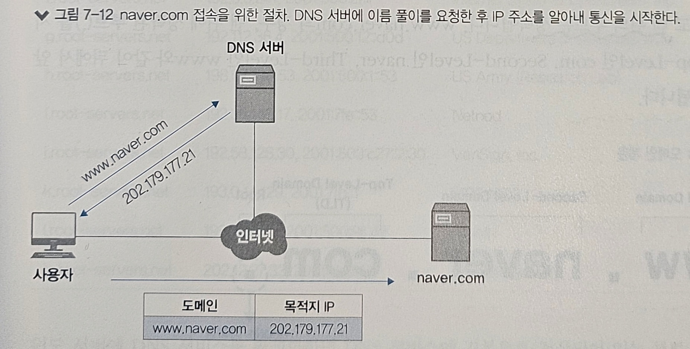
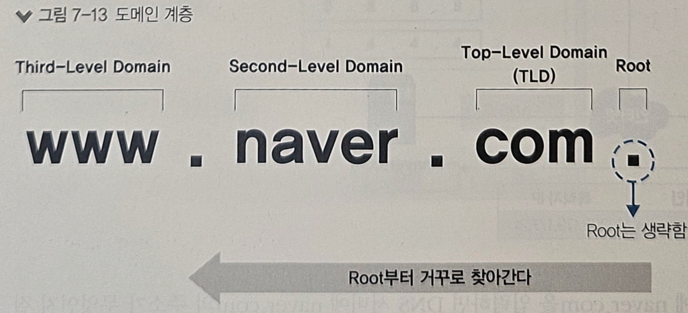
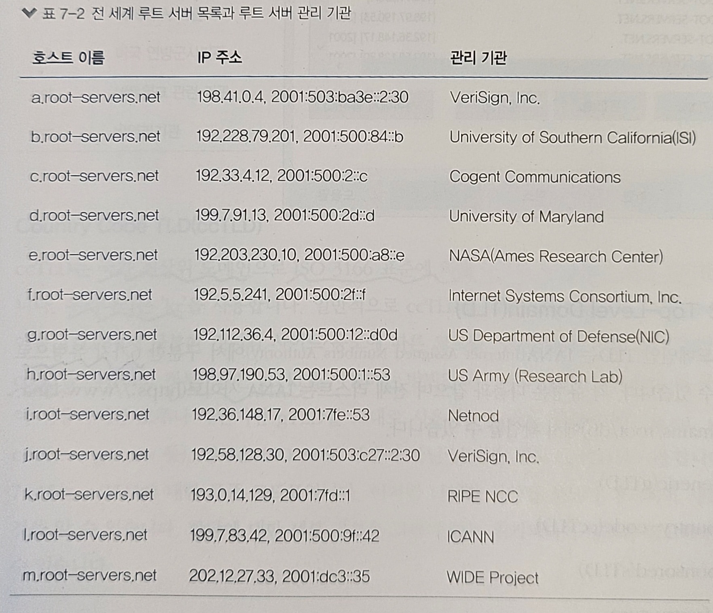
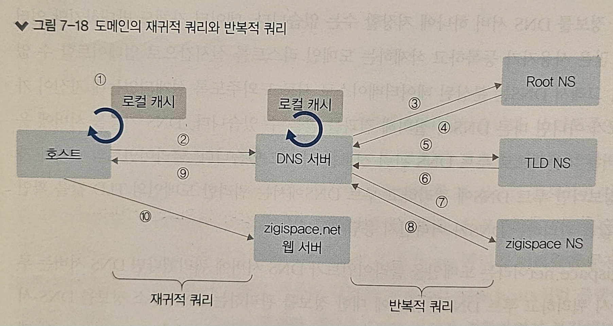
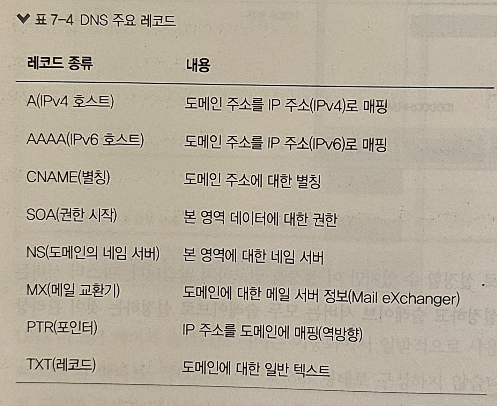
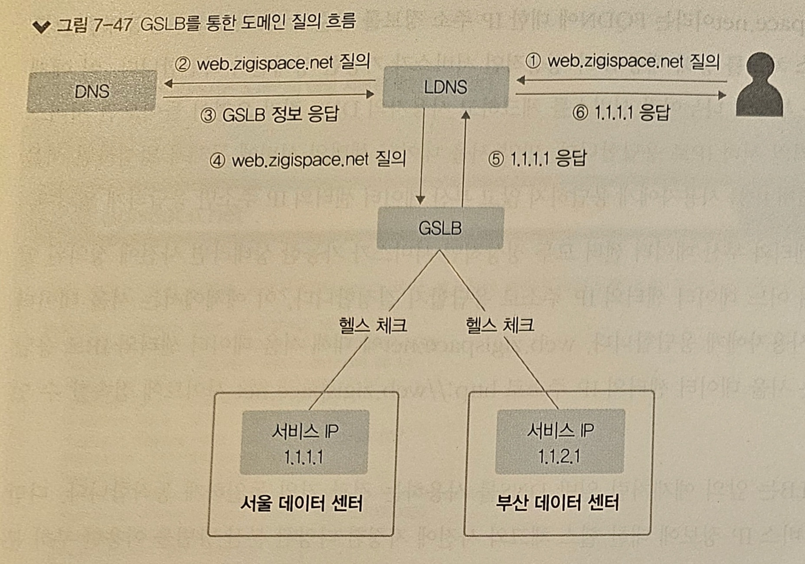
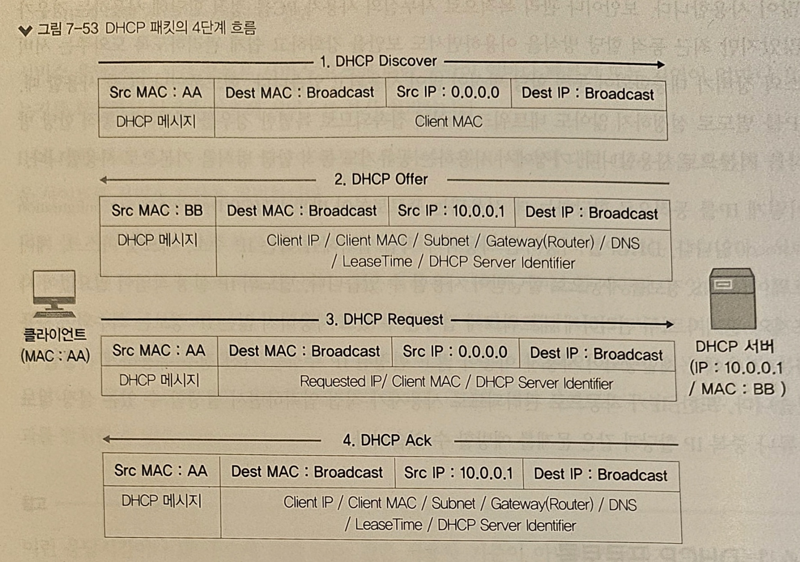
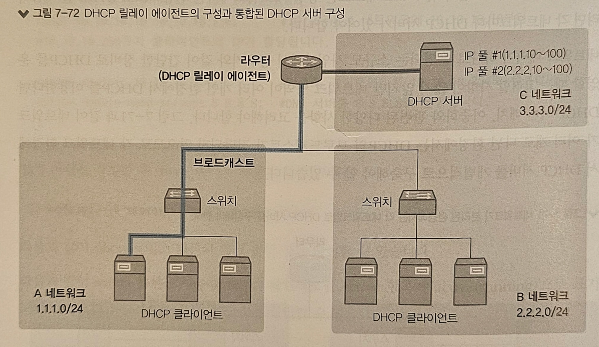

# 7장. 통신을 도와주는 네트워크 주요 기술

1) NAT/PAT
2) DNS
3) GSLB
4) DHCP

---
 

## 1️⃣ NAT/PAT

- NAT(Network Address Translation, 네트워크 주소 변환)
- NAT은 **네트워크 주소를 변환하는 기술**이다
- 즉, NAT은 IP주소를 다른 IP주소로 변환해 라우팅을 원활히 해주는 기술이다
- 기본적으로는 하나의 네트워크 주소에 다른 하나의 네트워크 주소로 변환하는 1:1 변환을 해준다
- IP 주소의 고갈 문제를 해결하기 위해, 여러 개의 IP를 하나의 IP로 변환하기도 한다
- 여러 개의 IP를 하나의 IP로 변환하는 기술의 공식 용어는 NAPT(Network Address Port Translation, RFC2663)이며, 실무에서는 PAT(Port Address Translation)이라는 용어를 더 많이 사용함
- 사설IP -> 공인IP, 공인IP -> 사설IP, 사설IP -> 사설IP, 공인IP -> 공인IP 모두 가능하며, NAT에서 가장 많이 사용되는 경우는 사설IP -> 공인IP 변환이다

### ❇️ NAT/PAT의 용도와 필요성

1) IPv4 주소 고갈문제의 솔루션으로 사용
   - 인터넷 대중화로 폭증한 IP주소 고갈문제를 위해 단기, 중기, 장기의 3단계 IP주소 보존과 전환전략을 수립함
   - 단기전략(서브네팅), 중기전략(NAT와 사설IP체계), 장기전략(IPv6로 전환)
2) 보안 강화
   - 외부에서는 공인IP, 내부에서는 사설IP를 사용함으로써 내부에서 사용되는 사설IP를 외부로부터 숨길 수 있다
3) IP주소 체계가 같은 두 개의 네트워크 간 통신을 가능하게 해줌
   - 공인IP는 네트워크상에서 유일해야하지만, 사설IP는 서로 다른 망에서는 중복이 가능하다
4) 불필요한 설정 변경을 줄임
   - NAT/PAT을 이용해 내부 네트워크를 구성하면 서버와 PC의 IP주소 변경 없이 회선과 IDC 사업자 이전이 가능하다
   - 물론, 외부에 서비스하던 공인IP주소가 변경되므로 DNS 서비스나 NAT을 수행하는 네트워크 장비 설정은 변경해야하지만, 내부 서버나 PC 설정 변경을 최소화할 수 있다

### ❇️ SNAT과 PNAT

NAT을 사용해 네트워크 주소를 변환할 때, 어떤 IP 주소를 변환하는지에 따라 두 가지로 구분된다

1) SNAT(Source NAT): 출발지 주소를 변경하는 NAT
   - 사설에서 공인으로 통신할 때 많이 사용된다
   - 보안상 SNAT을 사용할 때 많이 사용된다
   - 로드 밸런서의 구성에 따라 SNAT을 사용하기도 한다
2) DNAT(Destination NAT): 도착지 주소를 변경하는 NAT
   - 로드 밸런서에서 많이 사용한다

### ❇️ 동적 NAT과 정적 NAT

1) 동적 NAT
   - 동적 NAT은 출발지나 목적지 어느 경우든 사전에 정해지지 않고 NAT을 수행할 때 IP를 동적으로 변경하는 NAT이다
   - 다수의 IP 풀에서 정해지므로 최소한 출발지나 목적지 중 한 곳이 다수의 IP로 구성된 IP 풀이나 레인지(Range)로 설정되어 있다
   - 동적 NAT의 설정은 서비스 흐름을 고려해 적용해야 한다
2) 정적 NAT
   - 정적 NAT은 출발지와 목적지의 IP를 미리 매핑하여 고정해놓은 NAT이다
   - 1:1 NAT이라고도 부른다
   - 사전에 IP가 고정되어 매핑되어 있으므로 서비스 방향을 고려할 필요가 없다

---
 

## 2️⃣ DNS

- 네트워크 프로토콜은 실제로 데이터를 나르는 데이터 프로토콜과, 이 데이터 프로토콜이 잘 동작하도록 도와주는 컨트롤 프로토콜로 크게 두 가지로 나뉜다
- 컨트롤 프로토콜은 통신에 직접 관여하지 않지만 처음 통신 관계를 맺거나 유지하는데 큰 역할을 한다
- TCP/IP 프로토콜 체계를 유지하기 위한 주요 컨트롤 프로토콜에는 ARP, ICMP, DNS가 있다

### ❇️ DNS 소개

- DNS(Domain Name System)는 도메인 주소를 IP주소로 변환하는 역할을 한다
- 사용자가 도메인 주소를 통해 서비스를 요청하면 DNS 서버로 질의를 보내고, 그 결괏값으로 도메인에 대한 IP주소를 응답 받게 된다

### ❇️ DNS 구조와 명명 규칙

- 도메인은 계층 구조로써 수많은 인터넷 주소 중 원하는 주소를 효율적으로 찾아갈 수 있다
- 역트리 구조로 최상위 루트부터 Top-Level 도메인, Second-Level 도메인, Third-Level 도메인과 같이 하위 레벨로 원하는 주소를 단계적으로 찾아간다
- 각 계층의 경계는 "."으로 표시하고 뒤에서부터 앞으로 해석한다
- Third.second.top.과 같은 형태로 표현하고 맨 뒤의 루트는 생략된다

- 도메인 계층은 최대 128계층까지 구성할 수 있다
- 계층별 길이는 최대 63바이트까지 사용할 수 있다
- 구분자 "."를 포함한 전체 도메인 네임의 길이는 최대 255바이트까지 사용할 수 있다
- 문자는 알파벳, 숫자, "-"만 사용할 수 있고, 대소문자 구분이 없다

#### 루트 도메인

- 루트 도메인은 도메인을 구성하는 최상위 영역이다
- 만약 DNS 서버에 사용자가 요청한 도메인의 정보가 없을 경우, 루트 도메인을 관리하는 루트 DNS에 쿼리하게 된다
- 루트 DNS는 전 세계에 13개가 있고, DNS 서버를 설치하면 루트 DNS의 IP 주소를 기록한 힌트(Hint) 파일을 가지고 있어 루트 DNS 관련 정보를 별도로 설정할 필요가 없다

#### Top-Level Domain (TLD)

- 최상위 도메인인 TLD는 IANA(Internet Assigned Numbers Authority)에서 구분한 6가지 유형으로 구분할 수 있다
- 각 유형은 다으과 같으며, 전체 리스트는 IANA 사이트에서 확인할 수 있다
  - Generic TLD (gTLD)
    - 특별한 제한없이 일반적으로 사용되는 최상위 도메인
    - 세 글자 이상으로 구성하며, 대표적으로 .com, .edu, .gov, .int, .mil, .net, .org 등이 있다
  - Country Code TLD (ccTLD)
    - 국가 최상위 도메인으로 ISO 3166 표준에 의해 규정된 두 글자의 국가 코드를 사용
    - 대한민국은 'kr'
    - 일반적으로 ccTLD를 사용하는 경우, Second Level TLD에는 gTLD에서 구분한 것처럼 사이트 용도에 따른 코드를 같이 사용한다
    - 가령, 일반 회사는 co.kr을 사용하고 정부기관은 go.kr을 사용한다
  - sponsered TLD (sTLD)
    - 특정 목적을 위한 스폰서를 두고 있는 최상위 도메인
    - 스폰서는 특정 민족공동체, 전문가 집단, 지리적 위치 등이 속할 수 있다
    - sTLD 종류에는 .aero, .asia, .edu, .museum 등이 있다
  - infrastructure
    - 운용상 중요한 인프라 식별 공간을 지원하기 위해 전용으로 사용되는 최상위 도메인
    - 대표적인 것으로 '.arpa'는 인터넷 안정성을 유지하기 위해 새로운 모든 인프라 하위 도메인이 배치될 도메인 공간 역할을 한다
  - generic-restricted (grTLD)
    - 특정 기준을 충족하는 사람이나 단체가 사용할 수 있는 최상위 도메인
    - .biz, .name, .pro 가 있다
  - test (tTLD)
    - 개발 프로세스에서 테스트 목적으로 사용하는 최상위 도메인
    - .test 가 있다

### ❇️ DNS 동작 방식

#### 클라이언트 관점

- 도메인을 IP주소로 변환하려면 DNS 서버에 도메인 쿼리하는 과정을 거쳐야 한다
- but, DNS 서버 없이 로컬에 도메인과 IP주소를 직접 설정해 사용할 수도 있는데, 이 IP주소를 관리하는 파일을 hosts 파일이라고 한다
- hosts 파일에 도메인과 IP주소를 설정해두면 해당 도메인 리스트는 항상 DNS 캐시에 저장된다
- DNS 서버에 요청하기 전에 먼저 로컬에 DNS 캐시를 확인하고, 만약 캐시에 없다면 DNS 서버로 IP를 요청하는 방식이다
- 윈도에서 DNS 캐시 확인 명령어는 'ipconfig/displaydns' 이다

#### DNS 서버 관점

- 전 세계 도메인 정보는 너무 많기 때문에 여러 개의 분산된 DNS 서버를 통해 관리한다
- 요청 받은 쿼리의 도메인 정보가 없다면 루트 DNS에 요청을 하고, 루트 DNS에서는 해당 쿼리의 TLD를 관리하는 DNS로 다시 요청한다
- 즉, 클라이언트에서 처음 질의를 받은 DNS가 중심이 되어 책임지고, 루트 DNS부터 상위 DNS에 차근차근 쿼리를 보내 결괏값을 알아낸 후 최종 결괏값만 클라이언트에 응답한다
- 호스트가 DNS 서버에 질의했던 방식을 재귀적 쿼리, DNS 서버가 루트 NS와 TLS NS, 아무개 NS에 질의한 방식을 반복적 쿼리라고 한다

### ❇️ 마스터와 슬레이브

- DNS 서버는 마스터(Master, Primary) 서버와 슬레이브(Slave, Secondary) 서버로 나눌 수 있다
- 마스터와 슬레이브는 도메인에 대한 존(Zone) 파일을 직접 관리하는지 여부로 구분한다
- 마스터 서버는 존 파일을 직접 생성해 도메인 관련 정보를 관리하고, 슬레이브 서버는 마스터에 만들어진 존 파일을 복제한다
- 이 과정을 영역 전송(Zone Transfer)이라고 한다

### ❇️ DNS 주요 레코드

도메인에는 다양한 내용을 매핑할 수 있는 레코드가 있는데, 주로 사용되는 레코드는 다음과 같다.

- A(IPv4) 레코드
  - 도메인 주소를 IP 주소로 변환하는 디폴트 레코드이다
- AAAA(IPv6) 레코드
  - IPv6 주소 체계에서 사용되는 레코드로써, 역할은 A 레코드와 같다
- CNAME(Canonical Name) 레코드
  - 별칭 이름을 사용하게 해주는 레코드이다
  - 레코드 값에 IP주소를 매핑하는 A레코드와는 달리, CNAME 레코드는 도메인 주소를 매핑한다
  - 네임 서버가 CNAME 레코드에 대한 질의를 받으면 CNAME 레코드에 설정된 도메인 정보를 내부적으로 다시 질의한 결과 IP값으로 응답한다
  - CNAME 레코드의 대표적인 예로 'www'가 있다 (naver.com과 www.naver.com 이 같은 ip를 반환하는 사례)
- SOA(Start Of Authority) 레코드
  - 도메인 영역에 대한 권한을 나타내는 레코드
  - 현재 네임 서버가 이 도메인 영역에 대한 관리 주체임을 의미하여, 해당 도메인에 대해서는 다른 네임 서버로 질의하지 않고 직접 응답한다
  - 도메인 영역 선언 시 SOA 레코드는 필수 항목으로 반드시 만들어야 한다
- NS(Name Server) 레코드
  - 도메인에 대한 권한이 있는 네임 서버 정보를 설정하는 레코드
  - 하위 도메인에 대한 권한을 다른 네임 서버로 위임하는 역할로도 많이 사용된다
- MX(Mail eXchange) 레코드
  - 메일 서버를 구성할 때 사용되는 레코드
  - 해당 도메인을 메일 주소로 갖는 메일 서버를 MX 레코드를 통해 선언한다
- PTR(Pointer) 레코드
  - IP 주소에 대한 질의를 도메인 주소로 응답하기 위한 레코드
  - A 레코드의 역방향 조회용 레코드로써, A 레코드와는 달리 하나의 IP 주소에 대해 하나의 도메인 주소만 가질 수 있다
  - PTR 레코드는 주로 화이트 도메인 구성용으로 사용된다
- TXT(TeXT) 레코드
  - 도메인에 대한 설명과 같이 간단한 텍스트를 입력할 수 있는 레코드
  - 주로 화이트 도메인을 위한 SPF 레코드에 사용된다
  - 공백 포함 가능, 대소문자 구분, 최대 255자까지 가능

### ❇️ DNS에서 알아두면 좋은 내용

- 도메인 위임 (DNS Delegation)
  - 네임 서버 자신이 가진 도메인 관리 권한을 다른 곳으로 일부 위임하는 것
  - 도메인은 계층 구조로써, 특정 계층의 레코드를 위임하면 해당 레코드의 하위 계층도 함께 위임 처리 된다
  - 특정 영역에 대한 관리 주체를 분리하는 용도로 사용할 수 있어서, 계열사에서 특정 도메인을 분리하거나 GSLB 등 다양한 용도로 사용할 수 있다
- TTL (Time To Live)
  - 도메인의 TTL 값은 DNS에 질의해 응답받은 결괏값을 로컬 캐시에서 유지하는 시간이다
  - TTL 값이 크면 DNS 재귀적 쿼리로 인한 응답 시간을 줄일 수 있다
  - TTL 값이 작으면 도메인 관련 정보가 변경되었을 때, 정보 갱신을 빠르게 할 수 있다
- 화이트 도메인
  - 불법적인 방법으로 발송되는 스팸메일을 차단하기 위해 정상적인 도메인을 인증, 관리하는 제도이다
  - 이를 위해 한국인터넷진흥원(KISA)에서 화이트 도메인 등록제를 운영하고 있으며, 실시간 블랙리스트(RBL)을 통해 스팸메일을 발송하는 사이트를 차단해준다
- 한글 도메인
  - 도메인 주소는 영문 외에도 유니코드가 지원하는 모든 언어를 도메인으로 사용할 수 있다
  - 이 때, 도메인을 한글로 사용하려면 해당 문자열을 "퓨니코드"로 변경하고 이 퓨니코드로 DNS에 도메인을 생성해야 한다

---
 

## 3️⃣ GSLB

- DNS는 동일한 레코드 이름으로 서로 다른 IP주소를 동시에 설정할 수 있었다
- 이를 통해, 도메인 질의에 따라 응답받는 IP 주소를 나누어 로드밸런싱 할 수 있었다
- 그러나, DNS만 이용한 로드밸런싱은 서비스 상태의 정상 여부를 체크하지 않은 채 진행하기 때문에 문제가 발생할 수 있다
- GSLB는 DNS와 동일하게 도메인 질의에 응답해주는 역할과 동시에, 로드밸런서처럼 등록된 도메인에 연결된 서비스가 정상적인지 헬스 체크를 수행한 뒤 정상인 레코드에 대해서만 응답한다

### ❇️ GSLB 동작 방식

1. 사용자가 DNS에 질의한다
2. LDNS는 해당 메인을 관리하는 NS 서버를 찾기 위해 root부터 순차 질의한다
3. 해당 도메인을 관리하는 NS 서버로 다시 질의한다
4. DNS 서버는 GSLB로 해당 도메인의 레코드를 위임했으므로 GSLB 서버가 NS 서버라고 LDNS에 응답한다
5. LDNS는 다시 GSLB로 도메인의 레코드에 대해 질의한다
6. GLSB는 질의에 대한 IP 주솟값 중 현재 설정된 분산 방식에 따라 응답하며, 헬스 체크를 한 뒤 정상적인 값만 응답한다
7. GSLB에서 결괏값을 응답받은 LDNS는 사용자에게 최종 응답한다

### ❇️ GSLB 구성 방식

GSLB를 사용한 도메인 설정 방법은 크게 두 가지가 있다

1. 도메인 자체를 GSLB로 사용
   - 해당 도메인에 속하는 모든 레코드를 GSLB에서 설정한다
   - 즉, 도메인에 대한 네임 서버를 GSLB로 지정하고 GSLB에서 도메인에 대한 모든 레코드를 등록해 처리하는 방식으로, GSLB 자체가 도메인의 네임 서버 역할을 하는 경우이다
   - 이 경우 모든 레코드에 대한 질의가 GSLB를 통해 이루어지므로 GSLB에 부하를 주게 된다
2. 도메인 내의 특정 레코드만 GSLB를 사용
   - DNS에서 도메인 설정 시 GSLB를 사용하려는 레코드에 대해서만 GSLB로 처리하도록 설정하는 것이다
   - 회사 대표 도메인에 속한 레코드 중 GSLB 적용이 꼭 필요한 특정 도메인에 대해서만 GSLB로 처리를 이관하는 방식을 사용한다
   - 이 방식에는 별칭(CNAME 레코드)를 사용하는 방식과 위임(NS 레코드)을 사용 방식으로 나뉜다

### ❇️ GSLB 분산 방식

GSLB를 이용해 서비스를 분산하면 다음과 같은 주요 목적을 달성할 수 있다

- 서비스 제공의 가능 여부를 체크해 트래픽 분산
- 지리적으로 멀리 떨어진 다른 데이터 센터에 트래픽 분산
- 지역적으로 가까운 서비스에 접속해 더 빠른 서비스 제공이 가능하도록 분산

---
 

## 4️⃣ DHCP (Dynamic Host Configuration Protocol)

- DHCP는 IP를 동적으로 할당하는 데 사용되는 프로토콜이다
- DHCP를 사용하면 사용자가 직접 입력해야 하는 IP 주소, 서브넷 마스크, 게이트웨이, DNS 정보를 자동으로 할당받아 사용할 수 있다
- 별도의 IP 설정 작업이 필요 없어서 사용자와 관리자 모두 편리하게 네트워크에 접속할 수 있으며, IP가 자동으로 관리되므로 사용자가 직접 입력하면서 발생할 수 있는 오류나 중복 IP 할당과 같은 문제를 예방할 수 있다
- DHCP는 BOOTP(Bootstrap Protocol)라는 프로토콜을 기반으로 한다
- DHCP는 BOOTP와 유사하게 동작하지만 BOOTP에서 지원되지 않는 몇 가지 기능이 추가된 확장 프로토콜이다

### ❇️ DHCP 동작 방식

호스트가 IP를 DHCP 서버로부터 자동으로 할당받는 과정은 다음과 같이 4단계로 진행된다

1. DHCP Discover
   - DHCP 클라이언트는 DHCP 서버를 찾기 위해 DHCP Discover 메시지를 브로드캐스트로 전송한다
2. DHCP Offer
   - DHCP Discover를 수신한 DHCP 서버는 클라이언트에 할당할 IP 주소와 서브넷, 게이트웨이, DNS 정보, Lease Time 등의 정보를 포함한 DHCP 메시지를 클라이언트로 전송한다
3. DHCP Request
   - DHCP 서버로부터 제안 받은 IP 주소와 DHCP 서버 정보를 포함한 DHCP 요청 메시지를 브로드캐스트로 전송한다
4. DHCP Acknowledgement
   - DHCP 클라이언트로부터 IP 주소를 사용하겠다는 요청을 받으면 DHCP 서버에 해당 IP를 어떤 클라이언트가 언제부터 사용하기 시작했는지 정보를 기록하고, DHCP Request 메시지를 정상적으로 수신했다는 응답을 전송한다

### ❇️ DHCP 서버 구성

DHCP 서버는 윈도 서버의 DHCP 서비스를 사용하거나 리눅스의 DHCP 데몬을 사용해 구성할 수 있다.  
또한, 스위치, 라우터, 방화벽, VPN과 같은 네트워크, 보안 장비에서도 DHCP 서비스가 가능하다.  
DHCP 서버를 구성할 때 주로 설정하는 값은 다음과 같다.

- IP 주소 풀(IP 범위)
  - 클라이언트에 할당할 IP 주소 범위
- 예외 IP 주소 풀(예외 IP 범위)
  - 클라이언트에 할당할 IP 주소로 선언된 범위 중 예외적으로 할당하지 않을 대역
- 임대 시간
  - 클라이언트에 할당할 IP 주소의 기본 임대 시간
- 서브넷 마스크
  - 클라이언트에 할당할 IP 주소의 서브넷 마스크 정보
- 게이트웨이(Router)
  - 클라이언트에 할당할 게이트웨이 정보
- DNS
  - 클라이언트에 할당할 DNS 주소

### DHCP 릴레이

- DHCP 클라이언트와 DHCP 서버 간에 전송되는 패킷은 **모두 브로드캐스트**이다
- 브로드캐스트는 동일 네트워크에서만 전송되므로 DHCP를 사용하려면 **각 네트워크마다 DHCP 서버가** 있어야 한다
- 이러한 여러 네트워크를 가진 환경에서 **DHCP 릴레이 에이전트**를 사용하면 DHCP 서버 한 대로 여러 네트워크 대역에서 IP 풀을 관리할 수 있다
- 즉, DHCP 릴레이 에이전트는 DHCP 패킷을 중간에서 중계(Relay)하는 역할을 해주는 서버(라우터)이다
- 즉, DHCP 릴레이 에이전트를 이용하면 DHCP 서버를 네트워크마다 구성하지 않고 중앙 DHCP 서버만으로도 여러 네트워크에서 DHCP 환경을 운영할 수 있다