# 13장. 네트워크 디자인

1) 2계층/3계층 네트워크
2) 3-Tier 아키텍처
3) 2-Tier 아키텍처
4) 데이터 센터 Zone/PoD 내부망/DMZ망/인터넷망
5) 케이블링과 네트워크

> - 컴퓨터 네트워크(혹은 컴퓨터망)란 분산된 컴퓨터를 통신망으로 연결하는 것이다
> - 네트워크는 정의 그대로 호스트와 호스트 간 통신을 위해 연결된 망이다
> - 네트워크를 구성하는 방법에는 호스트와 호스트 사이를 케이블로 직접 연결, 스위치를 통한 연결, 라우터/L3 스위치를 통한 연결 등이 있다
> - 이번 장에서는 데이터 센터 네트워크에 대한 이해를 돕기 위해 전반적인 네트워크 디자인 관련 부분을 다룬다

---
 

## 1️⃣ 2계층/3계층 네트워크

### ❇️ 2계층 네트워크

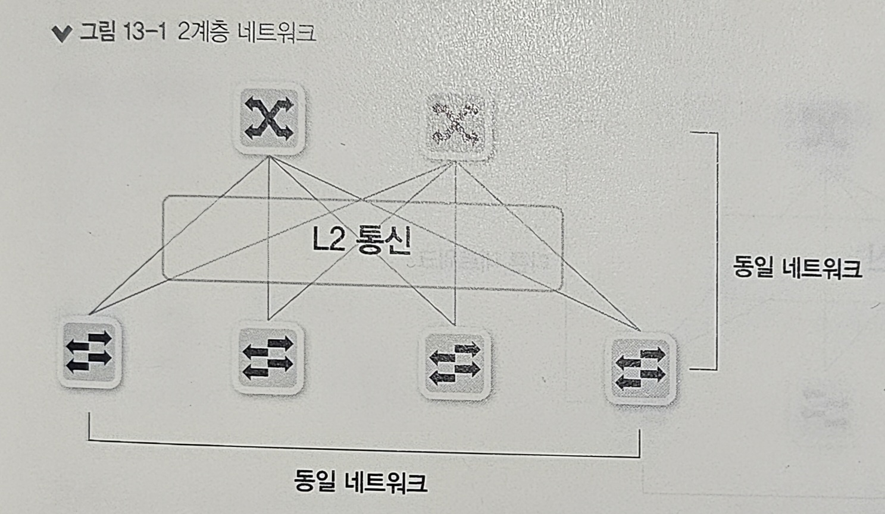

#### 정의

- 2계층 네트워크는 호스트 간 통신이 직접 2계층 통신만으로 이루어지는 네트워크 디자인이다
- 2계층 통신을 하려면 통신할 호스트가 동일한 네트워크여야 한다
- 동일한 네트워크 간의 통신이므로 게이트웨이를 거치지 않고 직접 호스트 간 통신이 가능한 구조이다

#### 특징

- 2계층 네트워크는 하나의 브로드캐스트 도메인이 되고 루프 구조가 생기면 문제가 발생하므로 스패닝 트리 프로토콜(STP)을 사용해 문제를 해결한다
- STP를 사용하면 블록 포인트가 생기게 되어 전체 인프라의 대역폭을 사용하지 못하게 되는 문제가 발생할 수 있다
- 이를 위해 MC-LAG와 같은 기술을 이용해 루프를 제거하고 논블로킹 구조를 구현할 수 있다

### ❇️ 3계층 네트워크

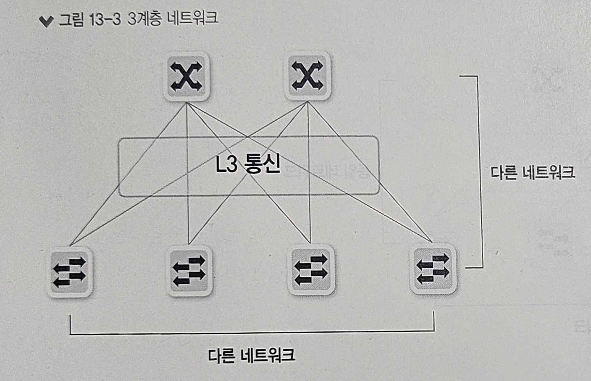

#### 정의

- 3계층 네트워크는 호스트 간 통신이 IP 라우팅과 같은 3계층 통신으로 이루어지는 네트워크 디자인이다
- 3계층 네트워크는 호스트 간 연결이 서로 다른 네트워크가 되기도 한다

#### 특징

- 라우팅으로 구성된 네트워크 구조이므로 루프 문제가 발생하지 않는다
- ECMP(Equal-Cost Multi-Path) 라우팅 기술을 사용하면 전체 네트워크 인프라의 대역폭을 모두 사용할 수 있다
- 즉, 브로드캐스트로 상대방 호스트를 직접 찾을 수 없어 이런 형태의 통신이 필요하다면 3계층 기반 디자인을 사용할 수 없다
- 그러나 VxLAN과 같은 오버레이 네트워크 기술을 사용하면 하단 호스트간에 동일 네트워크를 사용하면서도 네트워크 장비 간에 3계층 통신을 하도록 구성할 수 있다

---
 

## 2️⃣ 3-Tier 아키텍처

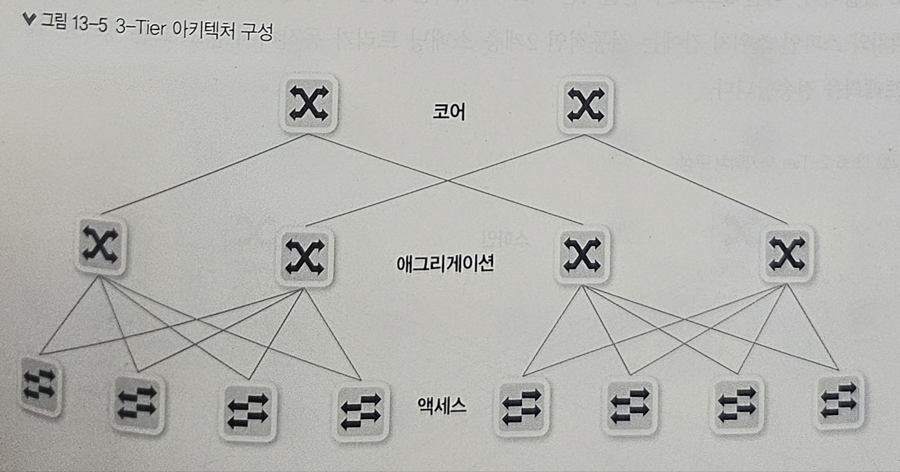

#### 정의

- 3-Tier 아키텍처란 코어(Core)-애그리게이션(Aggregation)-액세스(Access) 구조의 3계층으로 이루어진 전통적인 네트워크 아키텍처이다
- 호스트와 직접 연결된 액세스 계층에 스위치가 있고 액세스 스위치를 중간에서 집선하는 애그리게이션 스위치가 그 상단에 있다
- 코어 계층 스위치는 애그리게이션 스위치를 다시 모아 서로 통신할 수 있게 연결해준다
- 전통적인 데이터 센터와 일반적인 캠퍼스 네트워크 디자인 기법이며 현재도 많이 사용되고 있다

#### 특징

- 상위 레이어로 올라갈 수록 장비들이 집선되므로 높은 대역폭이 필요하다
- 집선 구간의 대역폭을 확보하지 못하면 병목현상이 발생할 수 있으므로 각 레이어 상단과의 연결 구성인 업링크(Uplink)에서는 오버서브스크립션 비율(Oversubscription Ratio)을 잘 산정해 구성해야 한다
- 3-Tier 네트워크 디자인은 서버 간 통신보다 **사용자로부터 서비스를 요청받고 서버에서 사용자의 요청에 응답하는 North-South 트래픽이 대부분인 경우**에 적합한 구조이다

---
 

## 3️⃣ 2-Tier 아키텍처

### ❇️ 스파인-리프(Spine-Leaf) 구조

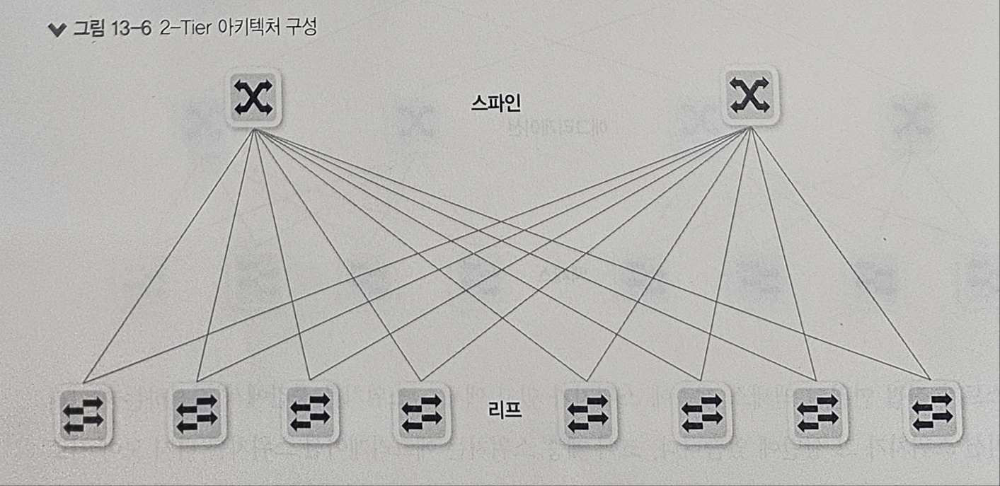

#### 정의

- 몇 년 전부터 데이터 센터에 많이 적용되고 있는 네트워크 디자인이다
- 스파인-리프 구조는 하단 호스트가 연결되는 리프 스위치는 상단 스파인 스위치와 연결된다
- 리프 스위치와 스파인 스위치 간에는 전통적인 2계층 스패닝 트리가 동작하지 않고 모든 링크를 사용해 트래픽을 전송한다

#### 특징

- 과거와 달리 대용량 분산 처리 기술이 많이 사용되고 있고, East-West 트래픽(데이터 센터 내부의 서버 간 통신량)이 급증하게 되면서 많은 현대 네트워크에서는 스파인-리프 디자인 기법을 이용하고 있다
- 네트워크 흐름에 대한 홉 수가 짧아지고 트래픽 흐름이 일정해진다는 장점이 있다
- 스파인-리프 스위치 사이의 모든 링크를 사용할 수 있으며, 이를 2계층 네트워크나 3계층 네트워크로 구성할 수 있다

> #### 💡 참고: North-South 트래픽에서 East-West 트래픽 추세로 변한 이유 3가지
> 
> 

> 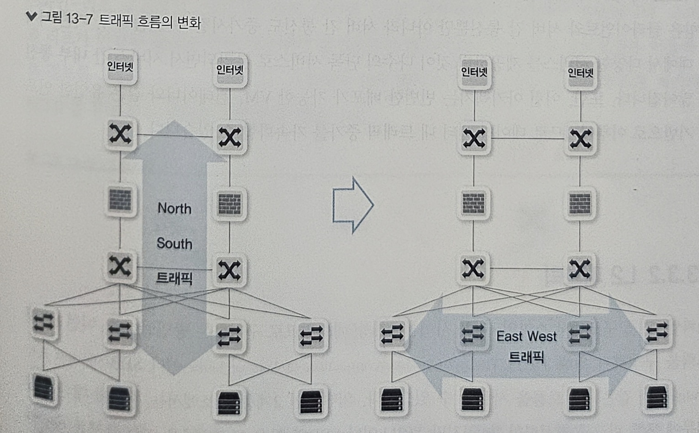
> 

> 
> 1) 서버 가상화
>    - 서버 가상화로 인해 서버 호스트 하나에 다수의 가상머신(VM)이 운영된다
>    - 서버 가상화를 사용하면 동일한 네트워크에 속한 서버들이 하나의 리프 스위치에 연결되지 않고, 다양한 스위치에 연결되어 서버들의 통신이 스파인 스위치를 거쳐 통신이 되어야 한다
> 2) 빅데이터 대중화
>    - 빅데이터 기술들은 기본적으로 분산 처리를 하므로 컨트롤 노드와 데이터 저장 노드로 분리되어 있고, 이는 서버 간 트래픽이 많아지게 되는 원인이다
>    - 빅데이터에서 널리 쓰이는 하둡(Hadoop)은 동일한 데이터를 기본적으로 3카피를 하여 데이터 노드에 저장하므로 대량의 트래픽이 데이터 센터에서 흐르게 된다
> 3) 애플리케이션 아키텍처와 개발 방법의 변화
>    - MSA(Micro Service Architecture)와 같은 서비스 아키텍처의 변화로 서버 간 트래픽이 증가되고 있다
>    - 기존에는 서버 한 대에서 다양한 서비스를 제공하던 것이, 다수의 단독 서비스로 분리되면서 서비스 간 내부 통신이 많아지게 되었다
>    - 또한, 이런 아키텍처는 빈번한 배포가 가능한 VM, 컨테이너와 같은 유연한 인프라 기반으로 이루어지므로 데이터 센터 내 트래픽 증가를 가속화 할 수 있다

### ❇️ L2 패브릭

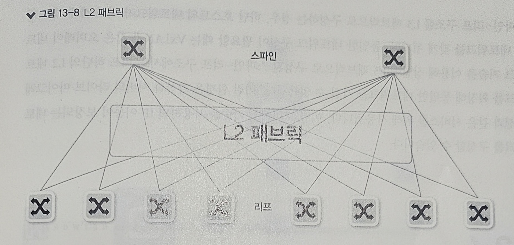

- L2 패브릭은 스파인-리프 구조에서 스파인-리프 사이를 2계층 네트워크로 구성하는 방법이다
- L2 패브릭을 구성하기 위해 TRILL(TRansparent Interconnection of Lots of Links)이나 SPB(Shortest Path Bridging)와 같은 프로토콜을 사용할 수 있다
- 일반적인 2계층 구조에서는 루프에 대한 제약 때문에 모든 링크를 활성화할 수 없지만, TRILL이나 SPB와 같은 프로토콜은 이런 문제를 해결하도록 구현되어 있다
- L2 패브릭을 구성할 수 있게하는 대표적인 기술로는 시스코의 Fabric Path나 익스트림의 VCS Fabric 등이 있다

---
 

### ❇️ L3 패브릭

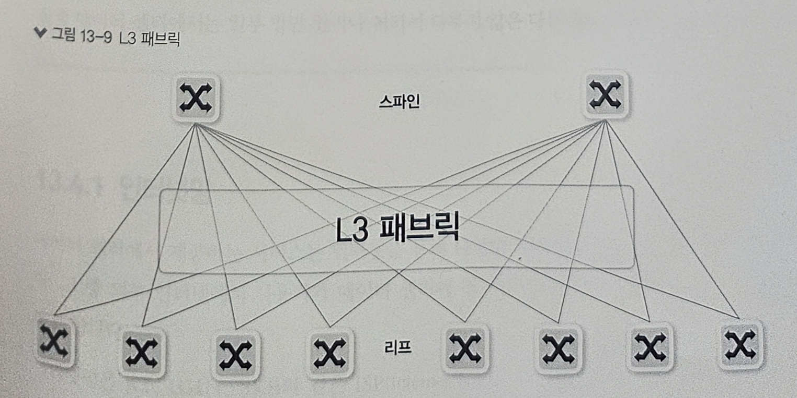

- L3 패브릭은 스파인-리프 구조에서 스파인과 리프 사이를 3계층 네트워크로 구성하는 방법이다
- 스파인과 리프가 연결된 링크는 각각 라우팅이 활성화되어 있고, 일반적인 라우팅 프로토콜을 이용해 경로 정보를 교환한다
- 라우팅으로 구성되어 있어 별도의 특별한 기술 없이도 루프를 제거하고 ECMP를 통해 모든 링크를 사용할 수 있다
- L3 패브릭으로 구성하는 경우, 하단 호스트의 네트워크가 리프 간에 서로 다른 네트워크를 갖게 된다
- 만약, 동일한 네트워크 구성이 필요한 경우에는 VxLAN과 같은 오버레이 네트워크 기술을 이용해 상단에 L3 패브릭으로 구성된 스파인-리프 구조에서도 리프 하단의 L2 네트워크를 확장해 동일한 네트워크를 가질 수 있다

## 4️⃣ 데이터 센터 Zone/PoD 내부망/DMZ망/인터넷망

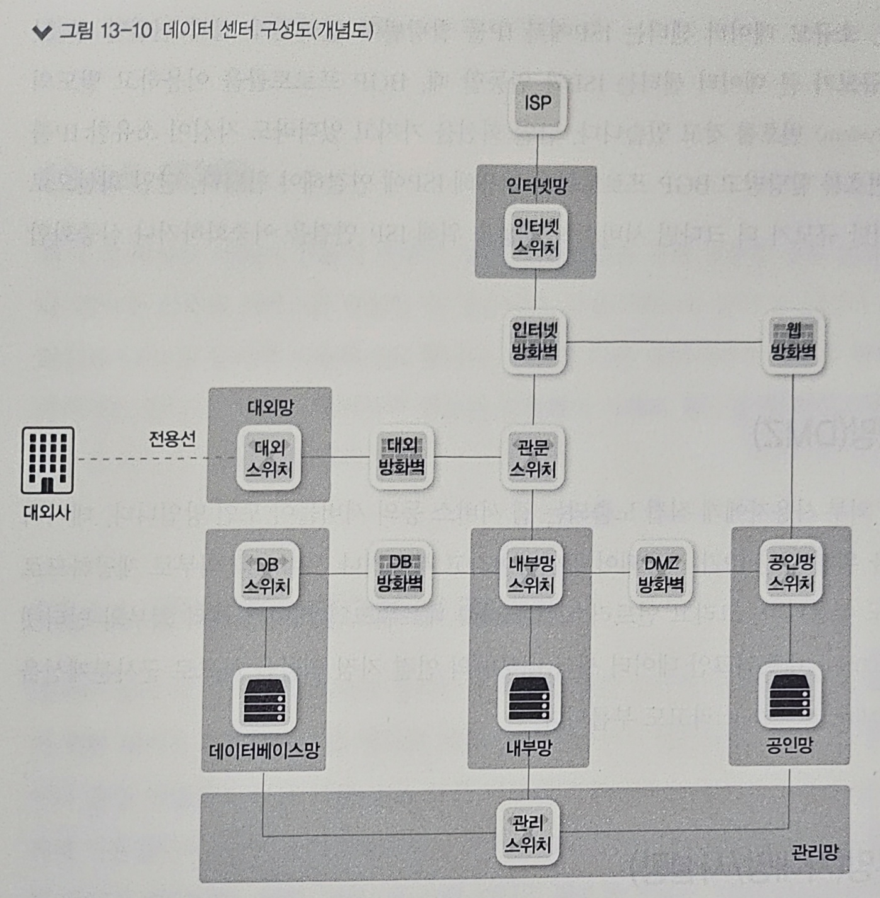

### ❇️ 인터넷망

- 인터넷망은 데이터 센터에서 제공하는 서비스 중 외부 인터넷에서 사용자가 데이터 센터에 접근할 수 있도록 구성된 영역이다
- 인터넷망은 KT, LGU+, SKB와 같은 ISP(Internet Service Provider)에서 인터넷 회선을 받아 연동되어 있다
- 소규모 데이터 센터는 ISP에서 IP를 할당 받아 인터넷에 쉽게 연결할 수 있지만, 규모가 큰 데이터 센터는 ISP와 연동할 때 BGP 프로토콜을 이용하고 별도의 AS(Autonomous System) 번호를 갖고 있다

### ❇️ 공인망(DMZ)

- 공인망은 데이터 센터에서 외부 사용자에게 직접 노출되는 웹 서비스 등의 서버들이 모인 망이다
- 데이터 센터 외부 접근을 위해 공인 IP가 사용되어 공인망이라고 부르거나 서비스를 외부로 제공하므로 서비스망이라고도 부른다
- 또한, 언트러스트(Untrust) 네트워크인 데이터 센터 외부의 인터넷 구간과, 트러스트(Trust) 네트워크인 내부망의 연결 지점 역할을 하므로 군사분계선을 뜻하는 DMZ(DeMilitarized Zone)라고도 부른다

### ❇️ 내부망(사내망/사설망)

- 내부망은 공인망이나 DMZ망과 달리 데이터 센터 내부나 사내에서만 접근할 수 있는 네트워크 영역이다
- 내부망은 일반적으로 사설 대역의 IP로 구성하므로, 인터넷을 통한 외부망에서는 직접 접근할 수 없다
- 내부망 중 데이터 센터 관리나 내부 직원용 서버팜인 경우, 보안상 외부망과의 연결을 단절하거나 최소화해야 한다
- 외부망과 통신할 때는 사설 IP로 통신할 수 없으므로, 중간에 공인 IP로 변환해주는 NAT가 필요하다
- 원격지에 있는 내부망 간의 연결은 VPN이나 전용선으로 연결할 수 있다

### ❇️ 데이터베이스망

- 데이터베이스망은 개인정보를 취급하는 경우가 많아 보안을 강화하기 위해 내부망에 별도로 구성된 영역이다
- 공인망으로부터 내부망을 보호하기 위해 방화벽을 두듯이, 데이터베이스망도 내부망에 접근할 때 추가로 방화벽을 두고 별도 망을 구성할 수 있다
- 서버 간 통신이 아니면 보안을 더 강화하기 위한 접근 통제 시스템을 운영하고 데이터베이스에 접속할 때는 접근 통제 시스템을 통해야만 가능하도록 구성한다

### ❇️ 대외망

- 대외망은 회사 대 회사로 서비스 연동이 필요한 경우, 인터넷망을 통해 연동할 수도 있지만 별도 전용선이나 VPN을 이용해 서비스를 연동하게 되는 경우에 연결되는 네트워크망이다
- 금융서비스와 같이 보안이 더 필요한 경우에 전용 회선과 VPN을 동시에 사용하기도 한다
- 이렇게 다른 대외사와의 연동을 할 때 별도 망으로 분리하기도 하는데, 이는 대외사와의 연동된 지점에서 사내로 접근할 때 최소한의 접근만 허용하기 위해서이다

### ❇️ 관리망/OoB(Out of Band)

- 관리망은 데이터 센터 내 서버나 네트워크 장비를 관리하기 위한 관리용 인터페이스가 연결된 망이다
- 네트워크 관리망과 서버 관리망은 목적이나 운영 방법에서 조금 다르다
- 보통 네트워크 관리망은 장비 운용을 위한 CLI나 웹 접속을 위해 사용된다
- 일반 서비스망으로도 장비에 접근할 수 있어 관리망과 별도 서비스망 접근에는 큰 차이가 없으나, 서비스망에 문제가 발생하더라도 관리망을 통해 장비에 접근할 수 있어야 하기 때문에 서비스망과 관리망을 별도로 분리해야 한다
- 서버 관리망은 일반적인 서비스망과 다르며, 하드웨어 자체를 관리하기 위한 별도의 환경이다

---
 

## 5️⃣ 케이블링과 네트워크

데이터 센터 내에는 네트워크 장비는 물론 서버, 스토리지와 같은 장비를 수용할 수 있는 랙(Rack)이 많이 있다.  
ToR과 EoR은 데이터 센터 내에서 스위치와 서버 간 케이블링 구성 방식에 따라 구분된다.

### ❇️ ToR(Top of Rack)

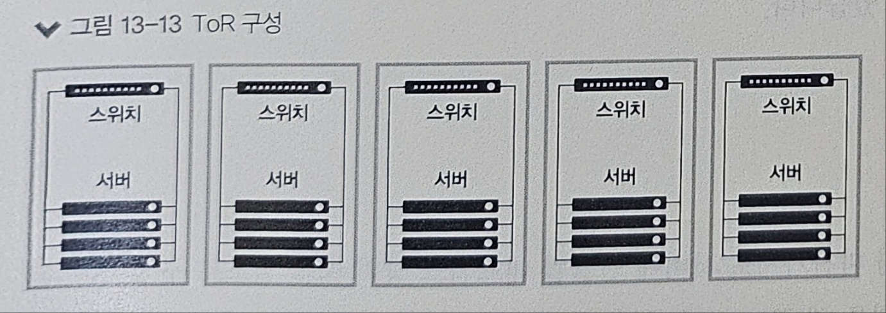

- ToR은 스위치가 랙 상단에 개별적으로 설치되는 구성을 말한다
- 일반적으로 각 랙의 최상단에 ToR 스위치를 구성하고, 해당 랙에 있는 서버들을 연결한다
- 랙 내에서의 서버 집적도, 물리적 네트워크 분리, 이중화 요건에 따라 랙 내 스위치는 두 대 이상이 될 수도 있고, 반대로 랙 두 개를 묶어 하나의 스위치를 관리할 수도 있다
- 즉, 세부 구성과 상관없이 ToR 스위치는 랙 안에 설치된 서버들을 직접 연결하고, 이 스위치를 통해 상단 네트워크 장비에 모두 연결되는 구성을 말한다
- ToR 구성은 서버가 스위치와 동일한 랙에 있으므로 케이블링의 길이나 복잡성이 줄어든다
- 하지만, ToR 구성은 EoR 구성보다 스위치가 더 많이 필요하므로 네트워크 장비에 대한 관리사항이 늘어난다
- 늘어난 스위치 수량 때문에 전력이나 냉각비용도 따라 늘면서 전체적인 운영비용이 증가할 수 있다
- 또한, 랙별로 사전에 스위치를 구성해야 하므로 미사용 중인 포트가 늘어 포트의 직접도가 떨어질 수 있다

### ❇️ EoR(End of Row)

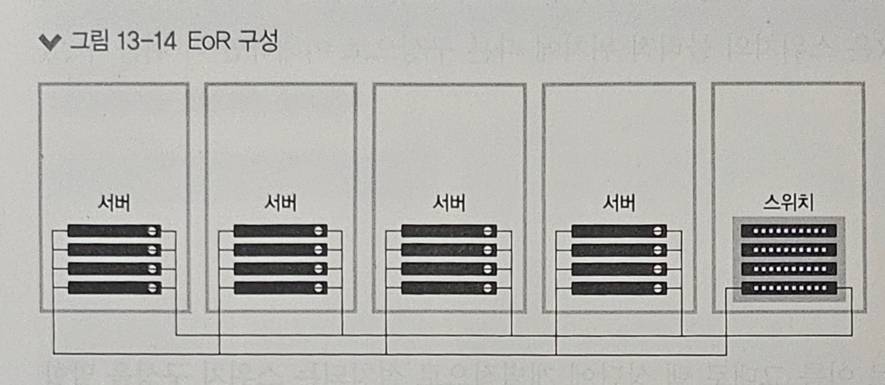

- EoR은 랙이 있는 행 끝에 네트워크 장비를 두고, 각 랙에 있는 서버는 네트워크 장비가 있는 랙까지 케이블로 연결되는 구성이다
- 즉, 서버가 있는 랙과 네트워크 장비가 있는 랙을 분리한 구성이다
- ToR과 달리 EoR은 네트워크 장비 랙에서 케이블이 서버로 직접 연결되므로, 각 랙마다 별도의 개별 스위치를 증설하는 것이 아니라 대형 섀시(Chassis) 스위치에서 라인 카드를 추가하는 방식으로 포트 수를 증가시킬 수 있어 ToR보다 필요한 스위치 장비 수가 줄어든다
- 따라서, 관리하는 장비 수와 통과하는 스위치 수가 줄어 대기시간이나 지연에 유리하다
- 그러나, 서버와의 케이블 구성이 더 멀어지므로 복잡도가 늘어나고 케이블이 길어진다
- 케이블 구축 비용이 증가하고, 이후 서버와 스위치 간 인터페이스를 업그레이드 해야 하는 경우 케이블 교체 비용이 발생할 수 있다

### ❇️ MoR(Middle of Row)

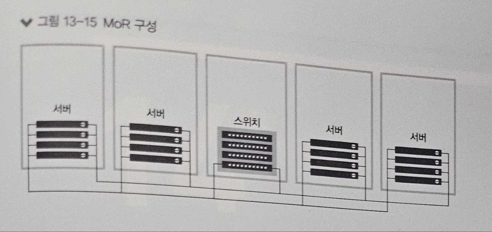

- MoR은 EoR과 마찬가지로 서버에 연결된 네트워크 장비 랙을 별도로 구성하는 점은 같지만, 네트워크 장비의 랙을 행 끝이 아닌 중간에 두는 경우이다
- 전체적인 내용은 EoR과 같지만, 네트워크 장비 랙이 중간에 있어서 케이블 길이가 전반적으로 감소하는 장점이 있다