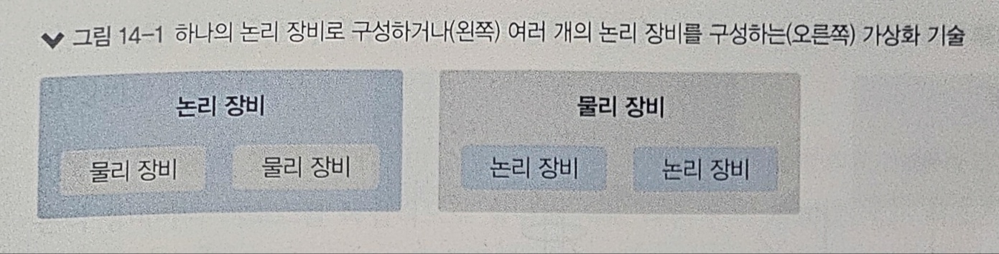
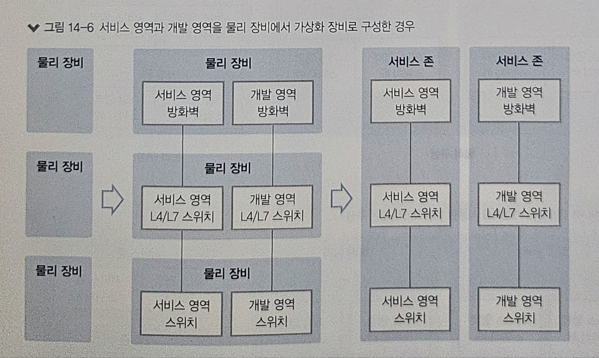

# 14장. 가상화 기술

1) 장비 가상화 기술이란?
2) 벤더별 장비 가상화 기술: 하나의 논리 장비로 만드는 가상화
3) 벤더별 장비 가상화 기술: 여러 개의 논리 장비로 만드는 가상화

> - 네트워크에서 대중적으로 잘 알려진 가상화 기술은 VLAN이다
> - VLAN 외에도 다양한 가상화 기술이 사용되고 있다
> - 가상화 기술을 이요하면 리소스를 더 효율적으로 사용할 수 있고, 운영 비용이나 도입 비용도 줄일 수 있으며, 기존 레거시 환경이 가진 문제점을 해결할 수도 있다

---
 

## 1️⃣ 장비 가상화 기술이란?

> #### 위키백과-가상화
> 가상화(Virtualization)는 컴퓨터에서 컴퓨터 리소스의 추상화를 일컫는 광범위한 용어이다.  
> 다른 시스템, 응용 프로그램, 최종 사용자들이 리소스와 상호작용하는 방식으로부터 컴퓨터 리소스의 물리적 특징을 감추는 기술로 정의할 수 있다.  
> 이것은 다중 논리 리소스 기능을 하는 것처럼 보이는 서버, 운영체제, 응용 프로그램, 저장 자치와 같은 하나의 단일 물리적 리소스를 만들어낸다.  
> 또는 단일 논리적 리소스처럼 보이는 저장 장치나 서버와 같은 여러 개의 물리적 리소스를 만들어낼 수 있다.

즉, 가상화는 리소스의 추상화를 뜻한다.  
장비 가상화 기술은 다음 두 가지로 크게 분류할 수 있다

- 여러 개의 물리 장비를 하나의 논리 장비로 합치는 기술
- 하나의 물리 장비를 여러 개의 논리 장비로 나누는 기술

### 여러 개의 물리 장비를 하나의 논리 장비로 합치는 기술

- 여러 개의 물리 박스 스위치를 묶어 한대의 논리적 스위치로 만드는 것
- 하나로 가상화된 논리 스위치는 큰 섀시형 장비처럼 볼 수 있다

#### 장점

- 첫째, 다수의 장비를 하나의 장비처럼 관리할 수 있어 운영자의 관리부하를 줄여준다
- 둘째, 이중화 경로를 효율적으로 사용하고 루프 문제를 제거할 수 있다

2계층의 이중화 경로는 루프 발생 위험성 때문에 스패닝 트리 프로토콜(STP)을 이용해 루프 구조를 제거한 단일 경로만 사용한다.  
전체적인 안정성은 보장되지만 인프라를 효율적으로 사용할 수 없고, 장애 발생 시의 페일오버(Fail-Over) 시간도 다른 프로토콜보다 긴 시간이다.  
하지만, 이 기술을 사용하면 루프 구조에서 벗어날 수 있고, 이중화된 경로에 장애가 발생하더라도 별도의 긴 페일오버 시간이 필요 없게 된다.

### 하나의 물리 장비를 여러 개의 논리 장비로 나누는 기술

- 이 유형의 대표적인 가상화 기술은 VMware의 ESXi, VLAN 기술 등이 있다
- 이렇게 가상화를 통해 나뉜 장비는 하나의 물리적 리소스를 공용으로 사용하는 경우도 있지만, 각 논리 장비마다 리소스를 독립적으로 할당해 서로 다른 논리 장비 간에는 리소스 사용을 침범하지 않게 하여 논리 장비 간 영향을 미치지 않도록 구성한다
- 또한, 여러 대로 가상화된 장비는 데이터 센터 내 장비를 영역별로 나눌 때 사용할 수 있다
- 데이터 센터 내에는 다양한 목적에 따라 영역(Zone)을 구분해 네트워크를 구성하는데, 각 네트워크 영역을 구성하기 위해 공통적으로 필요한 장비들이 있다
- 데이터 센터 내의 영역별로 물리 장비를 각각 구성할 수도 있지만 하나의 물리 장비를 논리적으로 가상화해 영역별로 배치해 사용할 수도 있다

#### 장점

- 운용 시 관리 포인트 감소
  - 각 서비스 영역에 대해서는 개별적으로 동작하더라도 운영 면에서는 하나의 장비로 관리할 수 있어 관리부하를 줄일 수 있다
- 자원활용률 증가
  - 서버 가상화처럼 기존 유휴자원을 다른 영역에서 나누어 사용하게 함으로써 네트워크 장비의 자원을 효율적으로 사용할 수 있게 된다
- 도입비용과 운영비용 절감(Capex & Opex)
  - 물리 장비 대신 논리 장비로 구성하면서 전체 장비 물량이 줄어 도입비용과 운용비용이 절감된다

#### 유의사항

- 여려 영역에 들어갈 장비를 하나의 물리 장비에서 논리적으로 나누려면 각 영역이 요구하는 성능을 물리 장비에서 제공할 수 있어야 한다
- 특히 물리 장비에서 제공하는 성능을 가상화로 나누면 '전체 용량/가상화 수'에 정확히 맞추어 성능이 나누어지는 것이 아니라, 성능이 저하되는 부분이 있으므로 용량 산정에 더 신경써야 한다
- 또한, 방화벽이나 L4/L7 스위치와 같이 하나의 물리 장비에서 제공되는 인터페이스가 많지 않은 경우에는 인터페이스 수도 고려해야 한다

---
 

## 2️⃣ 벤더별 장비 가상화 기술: 하나의 논리 장비로 만드는 가상화

### ❇️ 시스코 시스템즈의 가상화 기술

- VSS(Virtual Switching System)
  - VSS는 VSL(Virtual Switching Link)로 장비를 연결해 하나의 가상 스위치를 만든다
  - VSS 기술은 Cisco Catalyst 6500/6800과 Cisco Catalyst 4500 제푼군에서 지원되며, VSS를 통해 최대 두 대의 물리 장비를 한 대의 가상 스위치로 구성할 수 있다
  - VSS는 시스템에서 운영할 수 있는 대역폭을 확장하고 가용성을 증대시킨다
- StackWise/FlexStack
  - StackWise는 Cisco Catalyst 3750-X/3850 제품군에서 지원되는 가상화 기술이다
  - StackWise와 동일하게 Cisco Catalyst 2960-X/2960-XR에서 지원되는 FlexStack이라는 가상화 기술도 있다
  - VSS는 최대 두 대의 장비를 하나의 가상 스위치로 구성할 수 있지만, 지원되는 StackWise나 FlexStack은 최대 8~9대의 스위치를 하나의 가상 스위치로 구성할 수 있다
  - StackWise나 FlexStack과 같은 스택 구성은 일반 포트를 사용하지 않고 스위치 후면에 있는 별도 스택 구성용 모듈이나 케이블을 사용해 데이지 체인 형태로 구성한다
- FEX(Fabric Extender)
  - VSS나 Stack과 같은 기술이 동일한 장비를 하나의 가상 장비로 구성한다면, 하느의 스위치를 다른 장비의 모듈 형태로 구성하는 FEX 기술도 있다
  - FEX는 하나의 스위치가 다른 스위치의 모듈 형태로 구성되는 구조이며 FEX 장비에는 별도의 운영체제가 없고 상단 스위치의 운영체제 그대로 사용한다

### ❇️ 주니퍼(Juniper)의 가상화 기술

- 가상 섀시(Virtual Chassis)
  - 가상 섀시는 EX와 QFX 시리즈 스위치에서 지원되는 가상화 기술이다
  - 여러 개의 스위치를 링 형태로 토폴로지로 연결해 하나의 장비처럼 관리할 수 있다
  - 장비 모델에 따라 다르지만 최대 10대의 장비를 스택으로 구성할 수 있다
- VCF(Virtual Chassis Fabric, 가상 섀시 패브릭)
  - 가상 섀시와 마찬가지로 EX와 QFX 시리즈 스위치에서 지원되는 가상화 기술이다
  - VCF는 여러 개의 물리 스위치를 하나의 가상 섀시 패브릭 장비로 구성한다
  - 스파인-리프 형태로 디자인하고 스파인은 2~4대를 포함해 최대 20대의 장비를 패브릭 멤버로 구성할 수 있다
  - VCF는 16개 랙 규모의 PoD(Point of Delivery) 사이즈에 적합하다
- 주노스 퓨전(Junos Fusion)
  - 주노스 퓨전은 VCF보다 대규모에 적용될 수 있다
  - 주노스 퓨전은 유형에 따라 다음 3가지 아키텍처로 나뉘며 각 기술에 따라 지원되는 장비 모델이 다르다
    - Junos Fusion Provider Edge
    - Junos Fusion Data Center
    - Junos Fusion Enterprise

### ❇️ 익스트림(Extreme)의 가상화 기술

- 익스트림에는 여러 개의 스위치를 하나의 클러스터 형태의 가상 스위치로 구성하는 VCS(Virtual Cluster Switching)라는 가상화 기술이 있다
- 하나의 클러스터로 구성되는 VCS 로지컬 섀시는 최대 48개의 브로케이드 VCS 패브릭을 한 대의 가상 스위치로 만들어 관리할 수 있다

### ❇️ HP 엔터프라이즈의 가상화 기술

- HP 네트워크에는 IRF(Intelligent Resilient Fabric)라는 스위치 가상화 기술이 있다
- 다른 벤더는 하나의 가상 스위치로 구성할 수 있는 제품이 제한적이었던 반면, HP IRF는 모든 제품에서 스위치 가상화를 지원하고 있다
- 다만, IRF로 구성할 때는 동일한 모델끼리 구성해야 한다
- IRF를 구성할 때, 스탠드 얼론 형태의 박스형 장비는 최대 9대까지 하나의 가상 스위치로 구성할 수 있으며, 섀시형 장비는 최대 4대까지 구성할 수 있다

---
 

## 3️⃣ 벤더별 장비 가상화 기술: 여러 개의 논리 장비로 만드는 가상화

### ❇️ 시스코 시스템즈의 가상화 기술

- 데이터 센터 스위치인 Nexus 7000/7700 제품군에서 VDC(Virtual Device Context) 기능으로 하나의 물리 스위치를 최대 8개의 논리 스위치로 나누어 사용할 수 있다
- VDC별로 독립적인 설정과 소프트웨어 프로세스가 동작하며 전체 리소스를 VDC별로 분할해 사용한다
- 각 VDC에 별도로 권한을 부여해 관리할 수 있고, 가상으로 나눈 VDC마다 관리자를 부여할 수도 있다

### ❇️ 시트릭스의 가상화 기술

- 시트릭스의 L4/L7 NetCaler 제품군에는 MPX와 VPX가 있다
- MPX는 기존 일반 하드웨어로 제공되는 제품군이며 VPX는 소프트웨어로 제공되는 제품군이다
- 그리고 SDX 제품군이 있는데, 이 제품은 하이퍼바이저인 Xen이 설치된 하드웨어 박스이다
- SDX 제품군에 소프트웨어로 제공되는 VPX를 설치해 하나의 물리 박스의 L4/L7 스위치를 여러 개의 가상 논리 L4/L7로 구성해 사용할 수 있는 멀티 테넌트 플랫폼을 제공할 수 있다

### ❇️ F5의 가상화 기술

- F5 제품군은 vCMP(Virtual Clustered Multi Processing) 가상화 기술을 지원한다
- vCMP는 F5 제품군 중 모델명이 'v'로 끝나는 시리즈이거나 i5800 이상인 모델에서는 기본적으로 지원한다
- vCMP를 사용해 나누어지는 개별 가상화 장비를 Guest라고 하며, 각 Guest 장비에는 개별적으로 CPU 코어를 할당할 수 있고 할당된 CPU 자원을 독립적으로 사용할 수 있다
- 해당 자원은 가상화 장비 간에 독립적으로 동작하므로 특정 가상화 장비의 사용량이 늘더라도 다른 가상화 장비에 영향을 미치지 않는다
- 또한, 가상화 장비 간에 다른 버전의 운영체제를 사용할 수도 있다

### ❇️ 포티넷의 가상화 기술

- 포티넷의 포티게이트(Fortigate) 제품군에서는 VDOM 가상화 기술을 사용해 물리 장비를 여러 대의 논리 장비로 나눌 수 있다
- 두 개의 클러스터를 이용해 이런 논리적 VDOM을 그룹화해 관리할 수 있다
- VDOM은 Virtual Domain의 약자로, 최근 네트워크 가상화에서 유행하는 전 가상화 시스템과, 과거부터 많이 사용해온 VRF(Virtual Routing and Forwarding)의 중간 수준의 가상화 기능을 제공한다
- 일반 네트워크 장비는 VRF를 이용해 라우팅을 분리하는 것만으로도 다양한 효과를 얻을 수 있지만, 방화벽은 일반 네트워크 장비와 달리 네트워크 부분과 정책 관리 및 적용 부분으로 나누어져 있어 라우팅 분리만으로는 부족하다
- VDOM은 라우팅뿐만 아니라 정책 단위로 시스템 전체를 가상화한다
- 