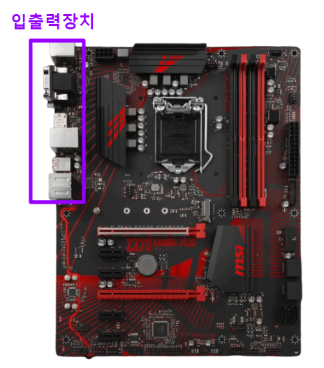

# Chapter 01. 컴퓨터 구조 시작하기

## 01 - 1 컴퓨터 구조를 알아야 하는 이유

개발에 있어서 코드상의 문제만 발생하진 않는다. 이런 문제 해결 능력 갖추기 위해서 컴퓨터 구조를 이해해야함

입출력에만 집중하는 개발을 넘어 성능, 용량, 비용까지 고려하는 개발자가 될 수 있음

전공자와 비전공자의 큰 차이는 컴퓨터구조를 제대로 학습했냐 안했냐로 차이가 생김

## 01 - 2 컴퓨터 구조의 큰 그림

### 컴퓨터가 이해하는 정보

#### 데이터
- 숫자, 문자,이미, 동영상과 같은 정적인 정보
- 컴퓨터와 주고받는 정보나 컴퓨터에 저장된 정보를 가리킬 때 편하게 데이터라고도 불림
- 0과 1로 숫자와 문자를 표현하는 방법(2장)

#### 명령어
- 컴퓨터를 작동시키는 정보
- 데이터는 명령어를 위해 존재하는 재료

 

### 컴퓨터의 4가지 핵심 부품

### 4가지 핵심 부품 메모리

일반적으로 CPU 우측에서 가까이 위치해있고 현재 실행되는 프로그램의 명령어와 데이터를 저장하는 부품이다. (임시창고)

명령어와 데이터들은 메모리에 저장되게 되고 CPU는 메모리에 저장된 명령어를 읽어오기 때문에 중구난방으로 저장되어있으면 빠르게 작동하지 못한다.

그래서 메모리는 빠르고 효율적인 접근을 위해 주소라는 개념을 사용하여 저장한다.

- 프로그램이 실행되기 위해서는 반드시 메모리에 저장되어야 함
- 메모리는 현재 실행되는 프로그램의 명령어와 데이터를 저장한다.
- 메모리에 저장된 값의 위치는 주소로 알 수 있다.

메모리에 명령어와 데이터가 저장되기 때문에 작업하는데 필요한 공간보다 적을경우에는 문제가 발생한다. 이 경우에는 보조기억장치를 RAM처럼 활용하는 가상메모리 기술을 활용하기 때문에 속도는 늦어지지만 컴퓨터가 멈추거나 꺼지진않는다.

사무용, 가벼운 게임은 4 ~ 8GB
작업용, 무거운 게임은 16GB 이상을 추천한다.

### 4가지 핵심 부품 CPU

- 사람의 뇌와 같음(모든 컴퓨터의 작업들은 CPU를 통하게됨)
- 트랜지스터의 집합체라고 할수있음(최근 CPU는 10억개 이상의 트랜지스터가 있음)
- CPU 성능 (동작속도, 코어, 스레드)
CPU 내부의 일꾼들이 얼마나 빠르게 일을하냐 : 동작속도(클럭)

과거의 CPU안에는 1개의 코어가 존재했지만 기술의 발전으로 점점 많은 코어를 탑재할 수 있게 되었다.

또한 1코어를 2개의 소프트웨어적으로 가상에서 분리한 스레드 또한 점점 늘어나고있다.

CPU에 코어와 스레드가 많으면 다중작업에 있어서 성능이 좋아진다.

그러나 동작속도가 높고 코어와 스레드가 많다고해서 좋은 CPU는 아니다. 제조사 모델마다 용도에 맞는 최적화된 속도가 다르기 때문이다.

CPU를 정할때는 본인의 쓰임새에 맞는 CPU를 선택해야한다.

### CPU의 내부구조

- ALU : 산술논리연산장치(계산기)
- 레지스터 : CPU 내부의 작은 저장장치
- 제어장치 : 제어 신호를 내보내고, 명령어를 해석하는 장치

CPU가 메모리에 저장된 값을 읽고 싶을 땐 메모리를 향해 메모리 읽기라는 제어 신호를 보냄

CPU가 메모리에 어떤 값을 저장하고 싶을 땐 메모리를 향해 메모리 쓰기라는 제어 신호를 보냄

- CPU가 메모리에 있는 1번지에 있는 명령어를 실행하기위해서는 제어장치가 메모리 1번지를 통해 메모리 읽기 제어신호를 보낸다.

- 메모리는 1번지에 저장된 명령어를 CPU에 건네주고, 레지스터에 저장된다. 
- 제어장치는 읽어 들인 명령어를 해석한뒤 3번지와 4번지에 저장된 데이터가 필요하다고 판단한다.
- 제어장치는 3번지와 4번지에 저장된 데이터를 읽어 들이기 위해 메모리 읽기 제어 신호를 보낸다.

- 메모리는 3번지와 4번지에 저장된 데이터를 CPU에 건네주고, 이 데이터들은 서로 다른 레지스터에 저장된다.
- ALU(산술연산장치)는 이 데이터로 연산을 수행한뒤에 계산된 결과값을 레지스터에 저장한다.

### 보조기억장치
메모리는 용량당 가격이 비싸고, 전원이 꺼지면 저장된 내용을 잃는다는 단점이 있기 때문에 이를 보완하는 장치인 보조기억장치가 나오게되었다.

하드 디스크, SSD, USB 메모리 등 같은 저장장치가 보조기억장치의 일종이다.

### 입출력장치

마이크, 스피커, 프린터, 마우스, 키보드 처럼 컴퓨터 외부에 연결되어 컴퓨터 내부와 정보를 교환하는 장치를 의미한다.

### 시스템 버스

- 메인보드에 연결된 부품들은 서로 정보를 주고 받을 수 있는데, 이는 메인보드 내부에 버스라는 통로가 있기 때문
- 여러 버스가운데 가장 중요한 시스템 버스라는 통로를 통해서 정보를 주고 받는다.

주소 버스 : 주소를 주고 받는 통로
데이터 버스 : 명령어와 데이터를 주고 받는 통로
제어 버스 : 제어 신호를 주고 받는 통로