# Chapter 04. CPU의 작동원리

## 04 - 1 ALU와 제어장치

CPU 내부에는 ALU, 제어장치, 레지스터라는 구성요소가 존재한다.

- ALU : 산술논리연산장치(계산기)
- 레지스터 : CPU 내부의 작은 저장장치
- 제어장치 : 제어 신호를 내보내고, 명령어를 해석하는 장치

### ALU가 받아들이고 내보내는 정보

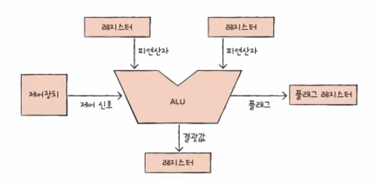

ALU가 계산을 하기위해서는 피연산자와 수행할 연산이 필요하다.

ALU는 레지스터를 통해 피연산자를 받아들이고, 제어장치로 부터 수행할 연산을 알려주는 제어 신호를 받아들인다.

연산을 수행한 결과는 바로 메모리에 저장되지않고 일시적으로 레지스터에 저장된다.

CPU가 메모리에 접근하는 속도보다 레지스터에 접근하는 속도가 훨씬 빠르기 때문에 CPU의 성능을 위해 레지스터에 우선저장하는 것

또한 ALU는 계산결과와 더불어 플래그(연산 결과에 대한 추가적인 상태 정보)라는 부가 정보를 내보낸다.

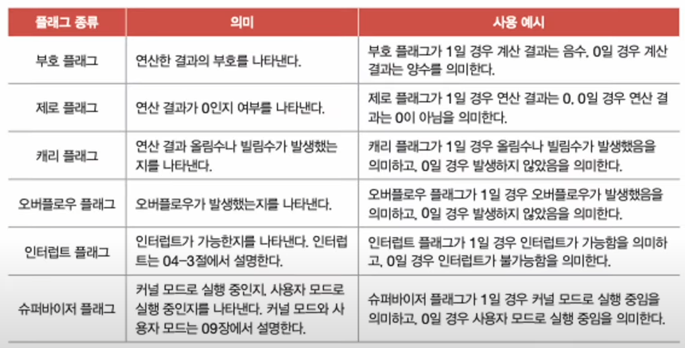

이러한 플래그는 플래그 레지스터에 저장된다.

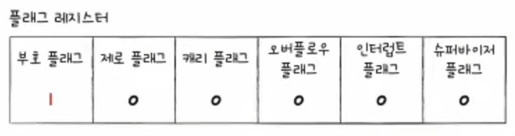

### 제어장치가 받아들이고 내보내는 정보

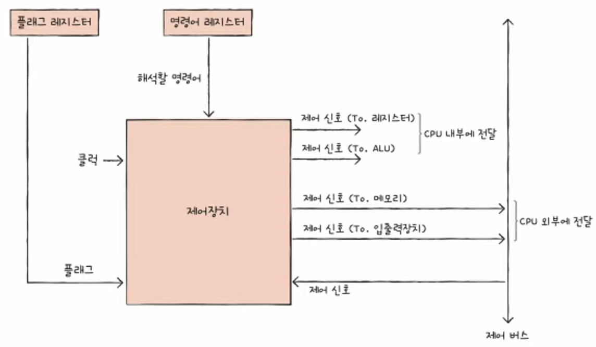

1. 클럭신호 : 컴퓨터의 모든 부품을 일사불란하게 움직일 수 있게 하는 시간 단위

2. 해석할 명령어 : 명령어 레지스터라는 특별한 레지스터에 저장된다.

3. 플래그 : ALU 연산에 대한 추가 상태 정보를 받아들인다.

4. 제어신호 : 제어 신호는 CPU뿐만 아니라 CPU 외부 장치도 발생시킨다. 제어 버스를 통해 외부로부터 전달된 제어 신호를 받아들인다.

 
 

## 04 - 2 레지스터

레지스터는 CPU 내부의 작은 임시저장장치로 프로그램 속 명령어와 데이터는 실행 전후로 레지스터에 저장된다.

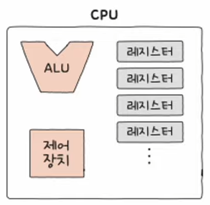

### 반드시 알아야 할 레지스터

1. 프로그램 카운터
2. 명령어 레지스터
3. 메모리 주소 레지스터
4. 메모리 버퍼 레지스터
5. 플래그 레지스터
6. 범용 레지스터
7. 스택 포인터
8. 베이스 레지스터

#### 프로그램 카운터(PC: Program Counter)
메모리에서 가져올 명령어의 주소, 메모리에서 읽어 들일 명령어의 주소를 저장한다. 명령어포인터(IP: Instruction Pointer)라고 부르는 CPU도 존재

#### 명령어 레지스터(IR: Instruction Register)
해석할 명령어, 메모리에서 읽어 들인 명령어를 저장하는 레지스터. 제어장치는 명령어 레지스터 속 명령어를 받아들이고 이를 해석한뒤 제어 신호를 내보낸다.

#### 메모리 주소 레지스터(MAR: Memory Address Register)
메모리의 주소를 저장하는 레지스터. CPU가 읽어 들이고자 하는 주소 값을 버스로 보낼 때 메모리 주소 레지스터를 거치게 된다.

#### 메모리 버퍼 레지스터(MBR: Memory Buffer Register)
메모리와 주고받을 값을 저장하는 레지스터. 메모리에 쓰고 싶은 값이나 메모리부터 전달받은 값은 메모리 버퍼 레지스터를 거친다.

### 4개 레지스트의 흐름

PC에 첫 메모리 주소값인 1000이 저장된다.
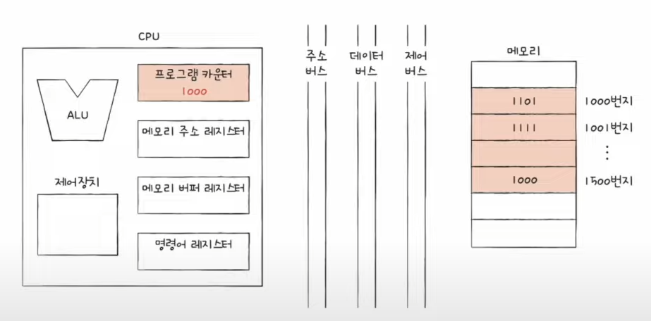

PC에 저장된 주소값을 주소 버스로 보내기 위해 메모리 주소 레지스터에 주소를 저장한다.
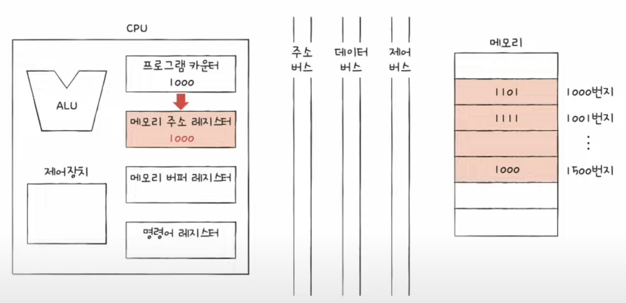

주소 버스를 통해 주소 레지스터 값이, 제어 버스를 통해 메모리 읽기 제어 신호를 통해 메모리로 보내진다.
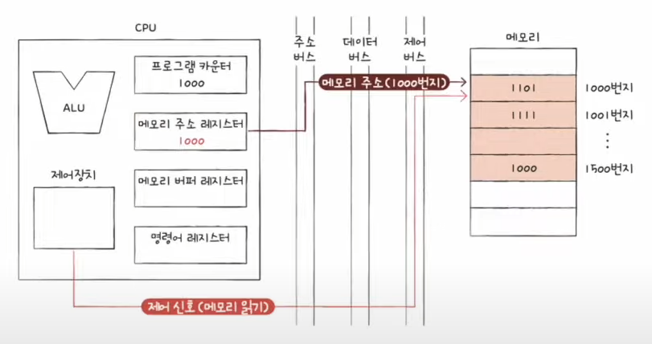

메모리는 1000번지에 저장된 값을 데이터버스를 통해 메모리 버퍼 레지스터에 저장되고 PC값은 1이 증가된다.

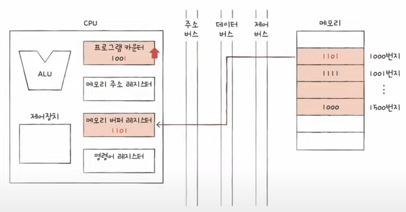

가지고온 1101 명령어는 제어장치가 해석하기위해 명령어 레지스터에 복사하게 된다.

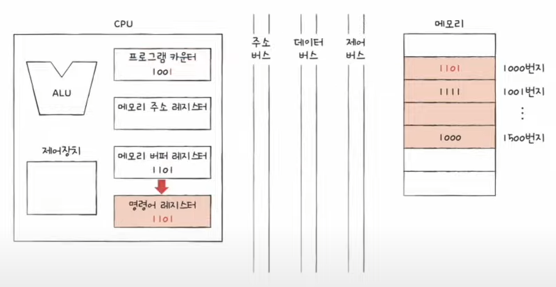

PC는 지속적으로 값이 증가하면서 순차적으로 다음 명령어를 읽어 들일 준비를 한다.

예외적으로 순차적인 실행 흐름이 끊기는 경우
- 특정 메모리 주소로 실행 흐름을 이동하는 명령어가 실행됐을때
- 인터럽트가 발생했을때

#### 범용 레지스터
다양하고 일반적인 상황에서 자유롭게 사용할 수 있는 레지스터. 데이터와 주소를 모두 저장할 수 있다.

#### 플래그 레지스터
연산 결과 또는 CPU 상태에 대한 부가적인 정보를 저장하는 레지스터

### 특정 레지스터를 이용한 주소 지정 방식(1) : 스택 주소 지정 방식

스택 주소 지정 방식 : 스택과 스택 포인터를 이용한 주소 지정 방식
스택포인터 : 스택에 마지막으로 저장한 값의 위치를 저장하는 레지스터

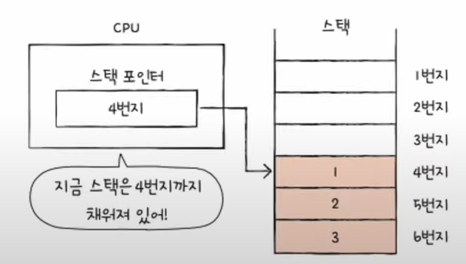

스택은 메모리 안에 스택처럼 사용할 영역이 정해져 있으며 해당 영역을 스택 영역이라고 부른다.

### 특정 레지스터를 이용한 주소 지정 방식(2) : 변위 주소 지정 방식

변위 주소 지정 방식 : 오퍼랜드 필드의 값(변위)과 특정 레지스터의 값을 더하여 유효 주소 얻기

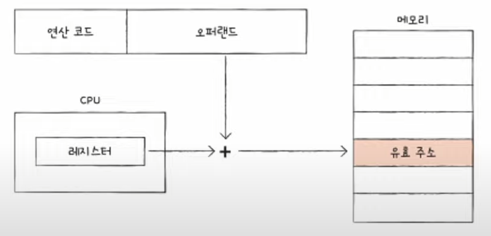

 

- 상대 주소 지정 방식 : 오퍼랜드 필드의 값(변위)과 특정 레지스터의 값을 더하여 유효 주소를 얻는 방식

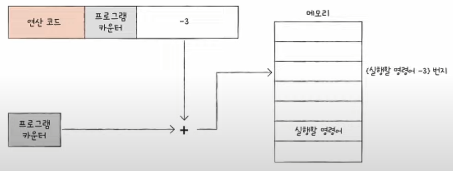

 

- 베이스 레지스터 주소 지정 방식 : 오퍼랜드 필드의 값(변위)과 베이스 레지스터의 값을 더하여 유효 주소를 얻는 방식

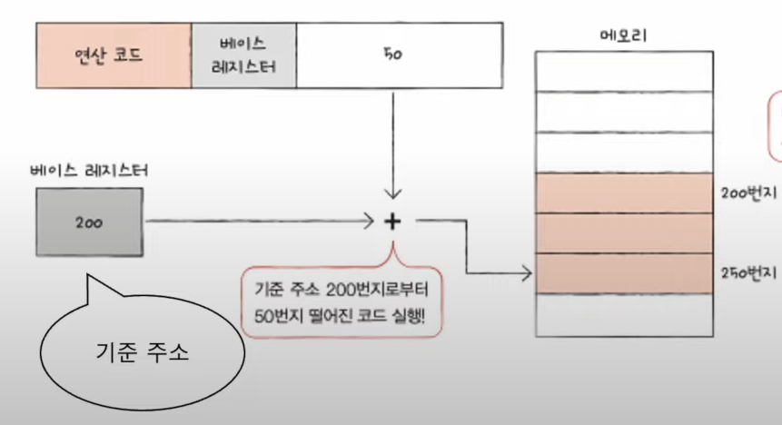

## 04 - 3 명령어 사이클과 인터럽트

### 명령어 사이클
CPU는 명령어들을 하나씩 실행한다. 이때 프로그램 속 각각의 명령어들은 일정한 주기가 반복되며 실행되는데, 이 주기를 명령어 사이클이라고 한다.

#### 인출 사이클 
메모리에 있는 명령어를 CPU로 가지고 오는 단계

#### 실행 사이클
CPU로 가져온 명령어를 실행하는 단계

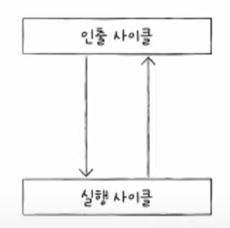

예외적으로 인출하자마자 실행할 수 없는 경우도 있다. 간접 주소 지정 방식의 경우 오퍼랜드 필드에 유효 주소의 주소를 명시하기 때문에 메모리 접근을 한 번 더 해야하기 때문. 이 단계를 간접사이클 이라고 부른다.

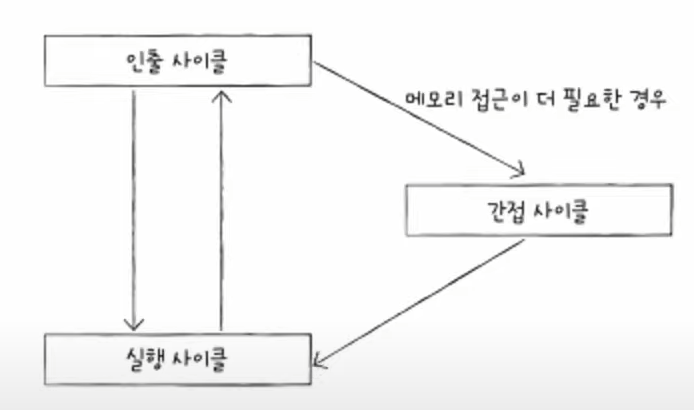

일반적으로 이와같은 흐름으로 명령어 사이클이 진행되지만 인터럽트가 이 흐름을 방해한다.

## 인터럽트
CPU의 작업을 방해하는 신호이다.
인터럽트의 종류에는 동기 인터럽트와 비동기 인터럽트가 있다.

### 동기 인터럽트
CPU가 명령어들을 수행하다가 예상치 못한 상황에 마주쳤을 때, 프로그래밍상의 오류와 같은 예외적인 상황에 마주쳤을 때 발생하는 인터럽트 예외라고 부른다.

### 비동기 인터럽트
주로 입출력 장치에 의해 발생하는 인터럽트, 알림과 같은 역할 하드웨어 인터럽트라고 부른다.
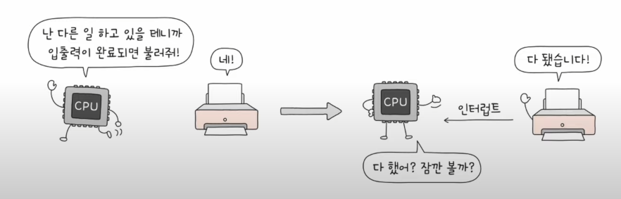

하드웨어 인터럽트는 입출력 작업 도중에도 효율적으로 명령어를 처리하기 위해 사용한다.

해당 인터럽트가 없다면 입출력장치의 완료여부시점을 모르기 때문에 지속적으로 완료여부를 확인해야하여 CPU 사이클 낭비가 된다.

### 인터럽트 처리 순서
- 인터럽트 요청 신호
- 인터럽트 플래그
- 인터럽트 벡터
- 인터럽트 서비스 루틴

1. CPU의 정상적인 실행 흐름을 끊는 것이기에 다른 누군가가 인터럽트하기 전에는 CPU에게 물어봐야한다. 이를 인터럽트 요청 신호라고 한다. 입출력 장치는 CPU에 이 신호를 보낸다.

2. CPU가 인터럽트 요청을 수용하기 위해서는 플래그 레지스터의 인터럽트 플래그을 확인한다. CPU가 중요한 작업을 처리해야 하거나 어떤 방해도 받지 않아야 할 때 인터럽트 플래그는 불가능으로 설정된다.   예외적으로 일부 인터럽트를 플래그로 막을 수 있는 것은 아니다. 정전이나 하드웨어 고장으로 인한 인터럽트가 이에 해당한다. (non maskable interrupt)

3. CPU가 인터럽트 요청을 받아들이기로 했다면 CPU는 인터럽트 서비스 루틴이라는 프로그램을 실행한다.   인터럽트 서비스 루틴도 프로그램이기에 메모리에 저장된다.      
  
CPU는 각기 다른 인터럽트 서비스 루틴을 구분하기 위해 인터럽트 벡터를 이용한다. 이것을 통해 특정 인터럽트 서비스 루틴을 처음부터 실행할 수 있다.

 

만약 인터럽트 서비스 루틴이 실행되기 전까지 레지스터에 저장되어 있었던 값을 어떻게 처리될까

지금까지 작업 내역은 스택에 백업한다. 그 후 인터럽트 서비스 루틴이 모두 실행되고 난 후 스택에 저장해 둔 값을 불러온다.

### 최종 명령어 사이클

