# Chapter 05. CPU 성능 향상 기법

## 05 - 1 빠른 CPU를 위한 설계 기법

### 클럭
컴퓨터 부품들은 '클럭 신호'에 맞춰 일사불란하게 움직인다.  
CPU는 명령어 사이클이라는 정해진 흐름에 맞춰 명령어을 실행한다.

실제로 클럭 속도가 높은 CPU는 일반적으로 성능이 좋다.

### 클럭속도
헤르츠(Hz) 단위로 측정되며 이는 1초에 클럭이 몇 번 반복되는지를 나타낸다.

오늘날의 CPU는 1초에 25억번, 최대 49억번 반복한다.

클럭속도가 무지막지하게 높이면 무조건 CPU가 좋아지지는 않는다. 발열 문제 때문

### 코어와 멀티 코어
### 코어(Core)란?
CPU의 정의로 알고 있었던 '명령어를 실행하는 부품'은 오늘날 코어라는 용어로 사용된다.

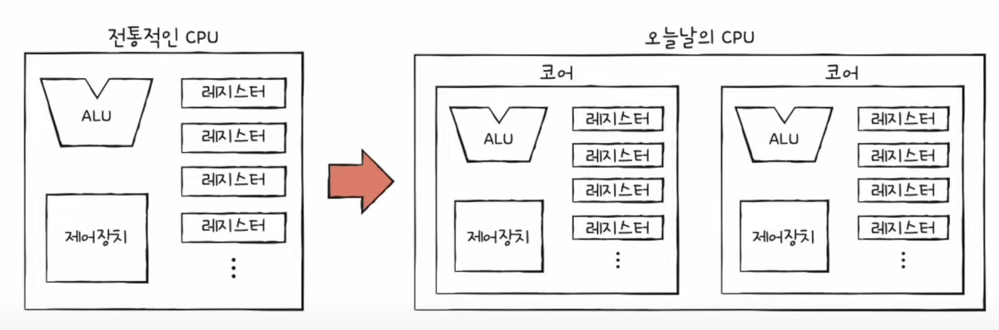

코어를 여러 개 포함하고 있는 CPU를 멀티코어 CPU 또는 멀티코어 프로세서라고 부른다.

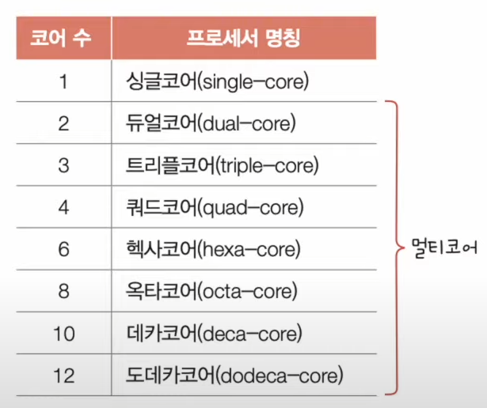

코어도 많이 늘리면 연산 속도도 빨라질까? 꼭 그렇진 않다. 중요한 것은 코어마다 처리할 명령어들을 얼마나 적절하게 분배하느냐 이다.

### 스레드와 멀티스레드
### 스레드
'실행 흐름의 단위' , 스레드는 하드웨어적 스레드, 소프트웨어적 스레드가 존재한다.

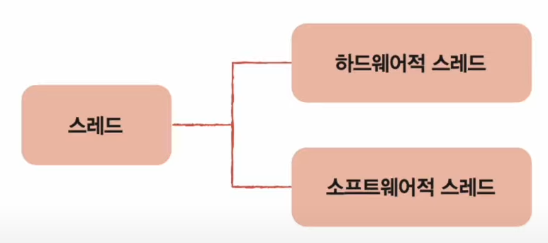

#### 하드웨어 스레드 : 하나의 코어가 동시에 처리하는 명령어 단위
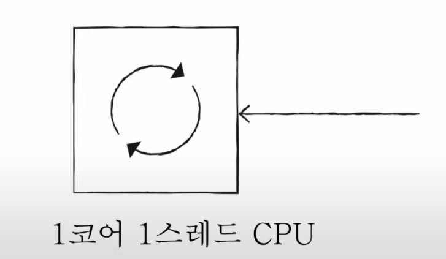
   
멀티 스레드 프로세서, 멀티스레드 CPU

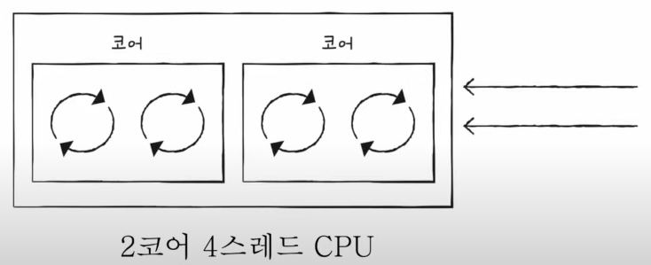

#### 소프트웨어 스레드 : 하나의 프로그램에서 독립적으로 실행되는 단위

아래의 기능이 동시에 수행되기를 원한다고 가정

1. 사용자로부터 입력받은 내용을 화면에 보여 주는 기능
2. 사용자가 입력한 내용이 맞춤법에 맞는지 검사하는 기능
3. 사용자가 입력한 내용을 수시로 저장하는 기능

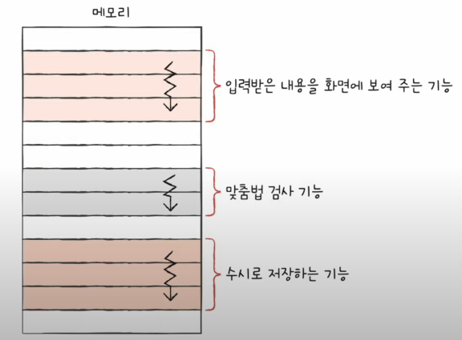

소프트웨어 스레드를 여러개를 만들면 하나의 프로그램을 동시에 여러기능을 수행할 수 있다.

용어의 혼동을 방지하기위해 소프트웨어적으로 정의된 스레드는 스레드, CPU에서 사용되는 스레드는 하드웨어 스레드라고 지칭한다.

### 멀티스레드 프로세서
멀티스레드 프로세서를 실제로 설계하는 일은 매우 복잡하지만, 가장 큰 핵심은 레지스터이다.

PC, 스택포인터, 데이터 버퍼레지스터, 데이터 주소 레지스터와 같이 하나의 명령어를 처리하기 위해 꼭 필요한 레지스터를 여러개 가지고 있으면 여러 명령어를 한번에 실행할 수 있다.

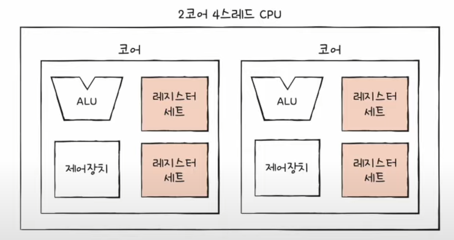

#### 코어는 명령어를 실행할 수 있는 '하드웨어 부품'이고, 스레드는 '명령어를 실행하는 단위'이다. 

#### 멀티코어 프로세서는 명령어를 실행할 수 있는 하드웨어 부품이 CPU 안에 두 개 이상 있는 CPU를 의미하고, 멀티스레드 프로세서는 하나의 코어로 여러개의 명령어를 실행할 수 있는 CPU를 의미한다.

## 05 - 2 명령어 병렬 처리 기법
### 명령어 파이프라인
명령어 처리과정을 클럭 단위로 나누어 보면 일반적으로 다음과 같이 나눌 수 있다.
1. 명령어 인출
2. 명령어 해석
3. 명령어 실행
4. 결과 저장

같은 단계가 겹치지만 않는다면 CPU는 각 단계를 동시에 실행할 수 있다.

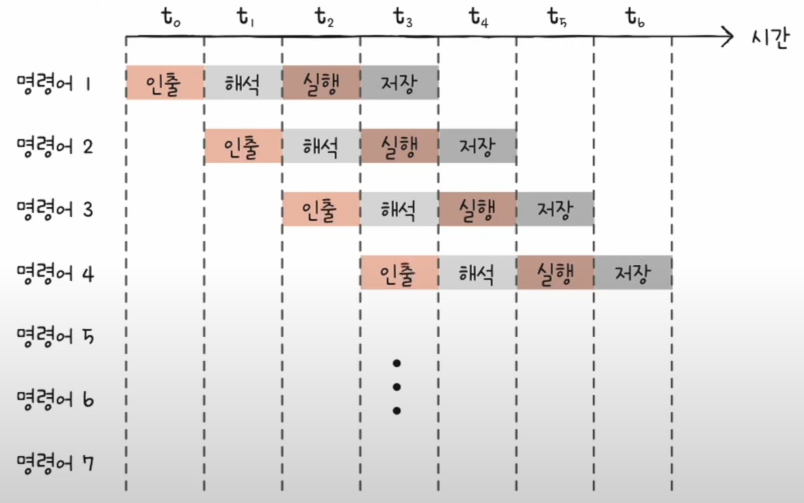

이처럼 명령어들을 명령어 파이프라인에 넣고 동시에 처리하는 기법을 명령어 파이프라이닝이라고 한다.

#### 명령어 파이프라인이 성능 향상에 실패하는 경우
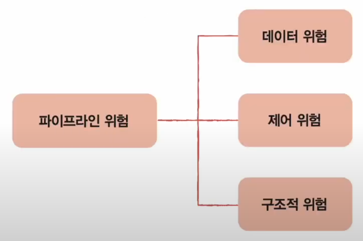

#### 데이터 위험
명령어 간 '데이터 의존성'에 의해 발생한다. 이전 명령어를 끝까지 실행해야만 비로소 실행할 수 있는 경우

#### 제어 위험
프로그램 카운터의 갑작스러운 변화에 의해 발생한다.

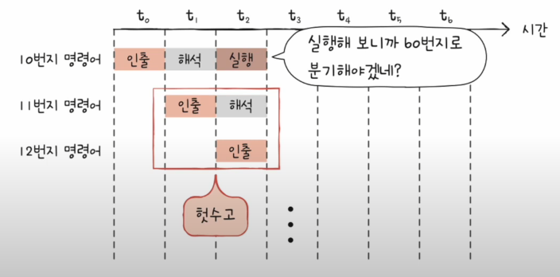

이를 위해 사용하는 기술 중 하나가 분기 예측이다. 어디로 분기할지 미리 예측한 후 그 주소를 인출하는 기술

#### 구조적 위험
명령어들을 겹쳐 실행하는 과정에서 서로 다른 명령어가 동시에 ALU, 레지스터 등과 같은 CPU 부품을 사용하려고 할 때 발생한다. 자원 위험이라고도 부른다.

#### 슈퍼스칼라
CPU 내부에 여러 개의 명령어 파이프라인을 포함한 구조를 슈퍼스칼라라고 부른다.

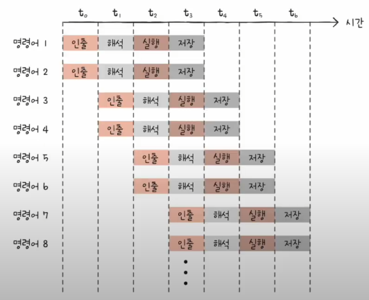

이론적으로는 파이프라인 개수에 비례하여 처리 속도가 증가하지만 파이프라인 위험도의 증가로 인해 개수에 비례하여 처리 속도가 증가하지 않는다.

#### 비순차적 명령어 처리
파이프라인 중단을 방지하기 위해 명령어를 순차적으로 처리하지 않는 기법

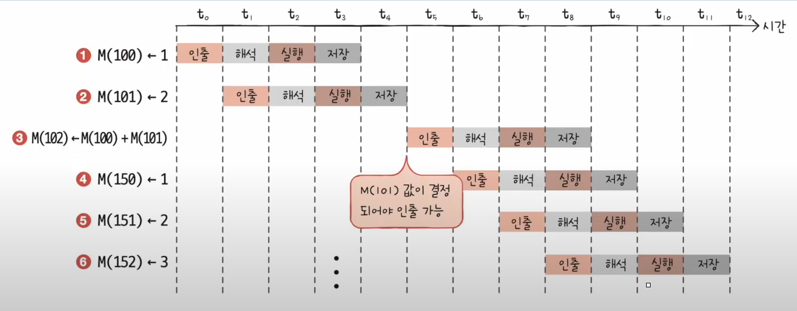

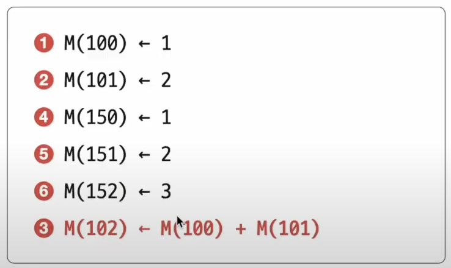

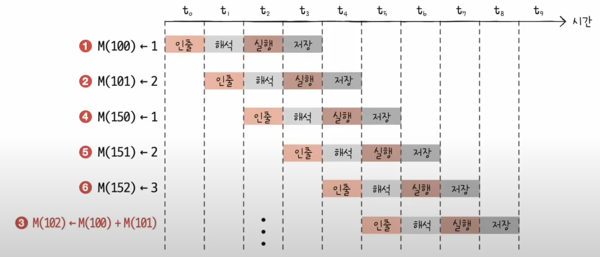

비순차적 명령어 처리가 가능한 CPU는 명령어들이 어떤 명령어와 데이터 의존성을 가지고 있는지, 순서를 바꿔 실행할 수 있는 명령어에는 어떤 것들이 있는지를 판단할 수 있어야 한다.

## 05 - 3 CISC와 RISC
명령어 파이프라이닝 하기 쉬운 명령어가 뭘까? 이와 관련해 CPU 언어인 CISC와 RISC를 학습해보자.

### 명령어 집합
CPU가 이해할 수 있는 명령어들의 모음을 명령어 집합 또는 명령어 집합구조(ISA)라고 한다. 명령어들은 CPU마다 조금씩 차이가 있기 떄문에 인텔을 사용하는 컴퓨터와 아이폰은 서로의 명령어를 이해할 수 없다.

명령어 병렬 처리 기법들을 사용하기 유리한 명령어 집합들이 있고, 그렇지 못한 명령어 집합이 있다. 이런 병렬 처리 기법을 도입하기 유리한 ISA인 CISC와 RISC에 대해 알아보도록 하겠다.

### CISC(Complex Instruction Set Computer)
복잡한 명령어 집합을 활용하는 컴퓨터(CPU)

복잡하고 다양한 명령어를 활용하기 때문에 형태와 크기가 다양한 '가변 길이 명령어'를 활용한다.

다양하고 강력한 명령어를 활용한다는 것은 상대적으로 적은 수의 명령어로 프로그램을 실행할 수 있다는 것을 의미하기 때문에 메모리를 최대한 아끼며 개발해야 했던 시절에는 인기가 높았다.

그러나 복잡한 명령어 때문에 명령어 하나를 실행하는 데에 여러 클럭 주기를 필요로 했다. 이 때문에 명령어 파이프라이닝이 불리하다는 치명적인 단점이 있다.

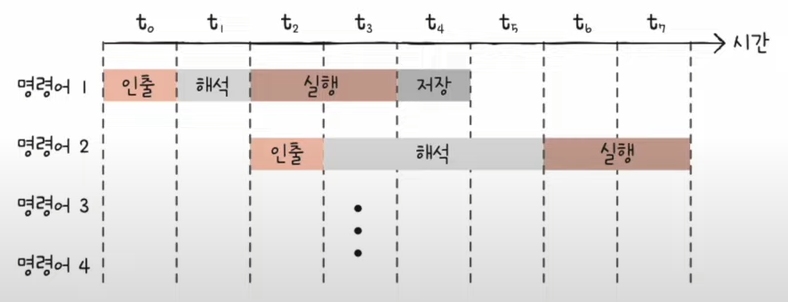

 

### RISC(Reduced Instruction Set Computer)
명령어가 종류가 적고, 짧고 규격화된 명령어 사용  
메모리 접근 최소화(load, store), 레지스터 십분 활용

CISC에 비해서는 더 많은 명령어가 사용되는 단점이 있다.

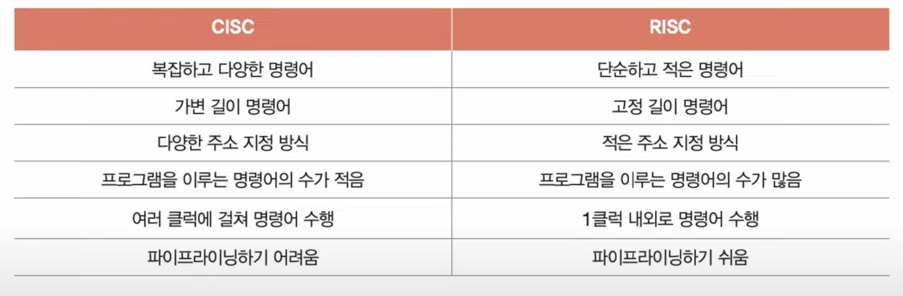