# Chapter 06. 메모리와 캐시 메모리

## 06 - 1 RAM의 특징과 종류

### '메모리'라는 용어로 지칭했던 저장 장치인 RAM을 자세히 알아 보자.

### RAM의 특징

RAM에는 실행할 프로그램의 명령어와 데이터가 저장된다.

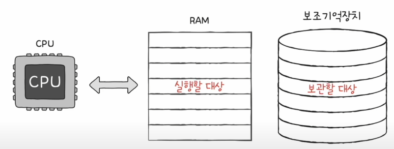

전원이 꺼지면 저장된 내용이 사라진다. (휘발성 저장 장치)  
전원이 꺼져도 저장된 내요이 유지되는 저장 장치 (비휘발성 저장 장치)

보조기억장치인 비휘발성 저장 장치에는 '보관할 대상을 저장',  휘발성 저장장치인 RAM에는 '실행할 대상'을 저장한다.

### RAM의 용량과 성능

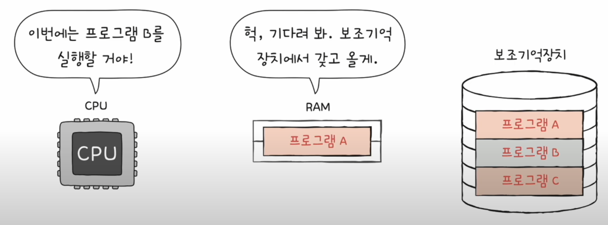

RAM의 용량이 프로그램 A, B, C 중 하나만 저장할 수 있는 크기라면, B와 C를 실행하고 싶을때는 보조기억장치에서 RAM으로 복사해서 가져와야한다.

RAM의 용량이 크다면 A, B, C를 보조기억장치에서 가져오는 프로세스를 줄 일 수 있다.

### RAM의 종류 (DRAM, SRAM, SDRAM, DDR SDRAM)

#### DRAM (Dynamic RAM) 
- 저장된 데이터가 동적으로 사라지는 RAM
- 데이터의 소멸을 막기 위해 일정 주기로 데이터를 재활성화(다시 저장) 해야 한다.
- 일반적으로 사용하는 RAM은 DRAM이다. 소비 전력이 비교적 낮고, 저렴, 집적도가 높기 때문에 대용량으로 설계하기가 용이하기 때문

#### SRAM (Static RAM) 
- 저장된 데이터가 정적인 (사라지지 않는) RAM
- 데이터를 재활성화할 필요가 없어서 DRAM보다 속도가 더 빠르다
- 상대적으로 소비전력 및 가격이 높고 집적도가 낮아 대용량으로 만들어질 필요는 없지만 속도가 빨라야하는 저장 장치에 사용된다 (캐시 메모리)

#### SDRAM (Synchronous DRAM)
- DRAM의 발전된 형태
- 클럭 신호와 동기화된 DRAM이다.
- 클럭마다 CPU와 정보를 주고받을 수 있는 DRAM이다. 

#### DDR SDRAM (Double Data RATE SDRAM)
- 최근 가장 대중적으로 사용하는 RAM
- 대역폭을 넓혀 속도를 빠르게 만든 SDRAM
- SDR SDRAM(Single Data Rate SDRAM)과 DDR SDRAM
 

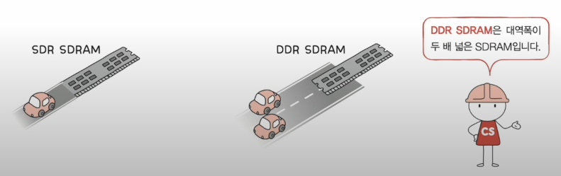

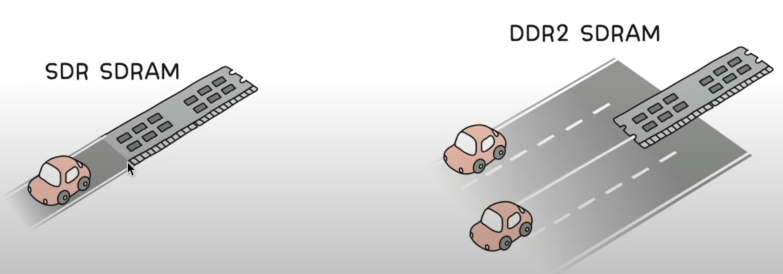

- DDR2, DDR3, DDR4 두 배 씩 넓은 SDRAM이다.

 
 

## 06 - 2 메모리의 주소 공간

### 물리 주소와 논리 주소

두 종류의 주소로 나뉘게 된 배경과 및 각 주소의 개념, 논리 주소를 물리 주소로 변환하는 방법에 대해 알아보자.

CPU와 실행 중인 프로그램은 현재 메모리 몇 번지에 무엇이 저장되어 있는지 다 알고 있을까?

#### "NO" 메모리에 저장된 값들은 시시각각 변하기 때문에

이를 극복하기위해 물리 주소와 논리 주소로 나누었다.

 

#### 물리 주소
- 정보가 실제로 저장된 하드웨어상의 주소

#### 논리 주소
- CPU와 실행 중인 프로그램 각각에게 부여된 0번지부터 시작되는 주소

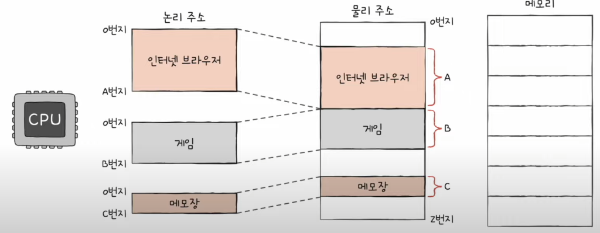

메모리가 사용하는 주소는 하드웨어상의 실제 주소인 물리 주소이고, CPU와 실행 중인 프로그램이 사용하는 주소는 각각의 프로그램에 부여된 논리주소이다.

### 물리 주소와 논리 주소의 변환

CPU가 메모리와 상호작용하려면 주소 변환이 이루어져야 한다.

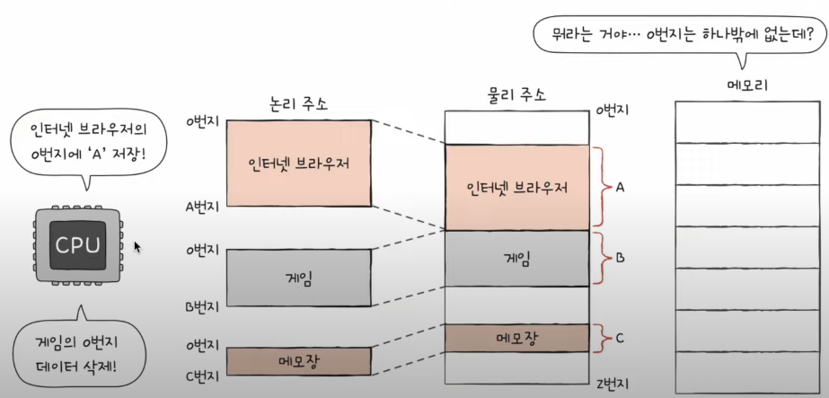

 

### MMU(메모리 관리 장치)

- CPU와 주소 버스 사이에 위치한 MMU라는 하드웨어에 의해 논리 주소는 물리 주소로 변환된다.

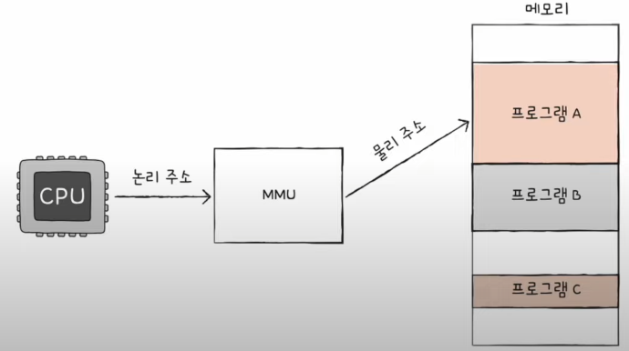

### 변환 방법

MMU는 CPU가 발생시킨 논리 주소에 베이스 레지스터 값을 더하여 논리 주소를 물리 주소로 변환한다.

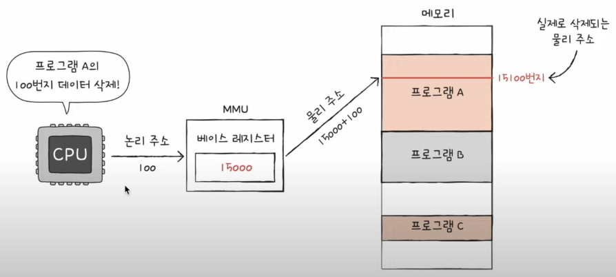

베이스 레지스터는 프로그램의 가장 작은 물리주소, 즉 프로그램의 첫 물리 주소를 저장하는 셈이고, 논리 주소는 프로그램의 시작점으로부터 떨어진 거리인 셈이다.

### 메모리 보호

해당 명령어가 실행되면 어떻게 될까?

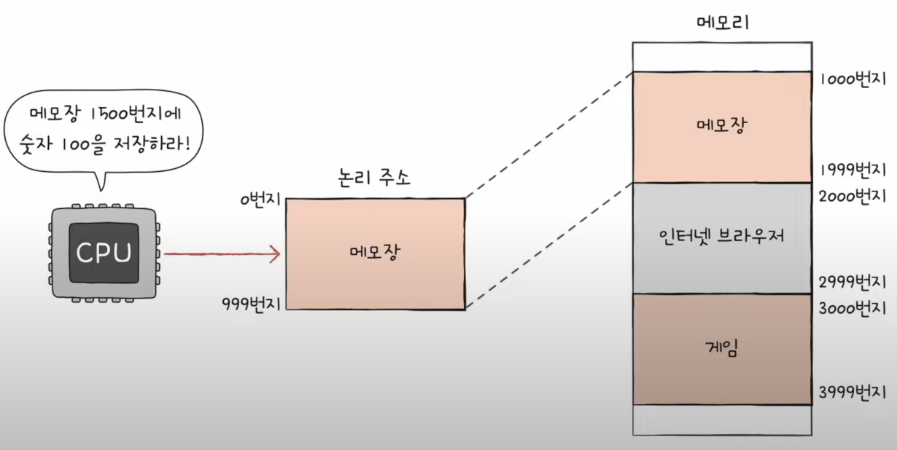

위와 같은 명령어는 프로그램의 논리 주소 영역을 벗어나 다른 프로그램의 영역을 침범할 수 있기 때문에 이런 명령어 실행은 방지해야한다.

이를 위해 
한계 레지스터(Limit Register) 가 명령어의 실행을 막는다.

### 한계 레지스터
- 프로그램의 영역을 침범하는 명령어의 실행을 막는다.
- 베이스 레지스터가 실행 중인 프로그램의 가장 작은 물리주소를 저장한다면, 한계 레지스터는 논리 주소의 최대 크기를 저장한다.

 

CPU가 접근하려는 논리 주소는 한계 레지스터가 저장한 값보다 커서는 안된다.

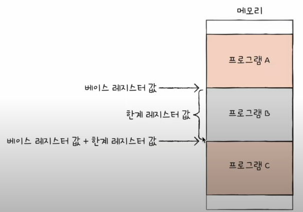

 

베이스 레지스터에 100, 한계 레지스터에 150이 저장되어 있다고 가정

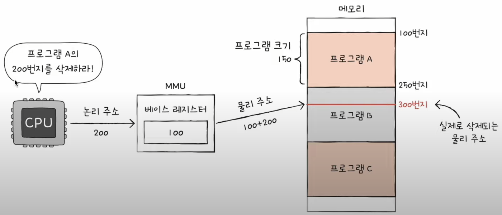

### 결론

CPU는 메모리에 접근하기 전 논리 주소가 한계 레지스터보다 작은지를 항상 검사한다.

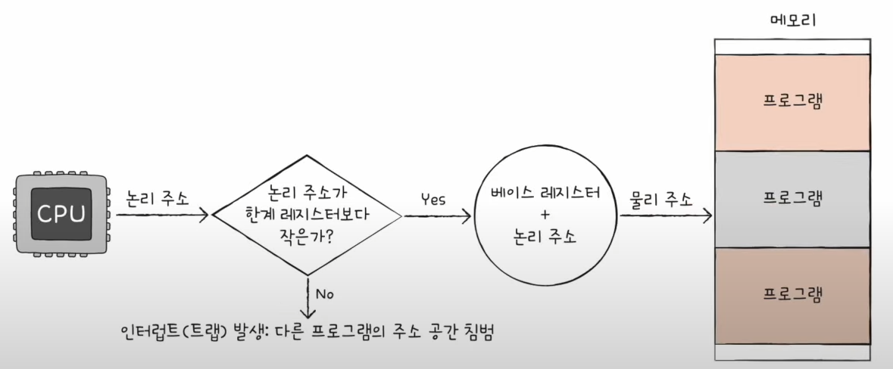

실행 중인 프로그램의 독립적인 실행 공간을 확보하고 하나의 프로그램이 다른 프로그램을 침범하지 못하게 보호할 수 있다.

 

## 06 - 3 캐시 메모리

CPU가 메모리에 접근하는 시간은 CPU의 연산 속도보다 느리다. 이를 극복하기 위한 저장 장치가 바로 캐시메모리이다.

캐시 메모리의 탄생 배경과 특징을 이해하기 위해 저장 장치 계층 구조를 이해해보자.

### 저장 장치 계층 구조

- CPU와 가까운 저장 장치는 빠르고, 멀리 있는 저장 장치는 느리다.
- 속도가 빠른 저장 장치는 저장 용량이 적고, 가격이 비싸다

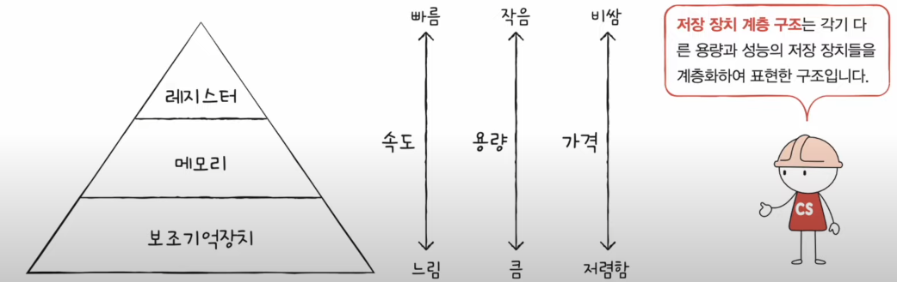

### 캐시 메모리

- CPU와 메모리 사이에 위치하고, 레지스터보다 용량이 크고 메모리보다 빠른 SRAM 기반의 저장장치이다.
- CPU의 연산 속도와 메모리 접근 속도의 차이를 조금이나마 줄이기 위해 탄생
- 메모리에서 CPU가 사용할 일부 데이터를 미리 캐시 메모리로 가져와서 사용

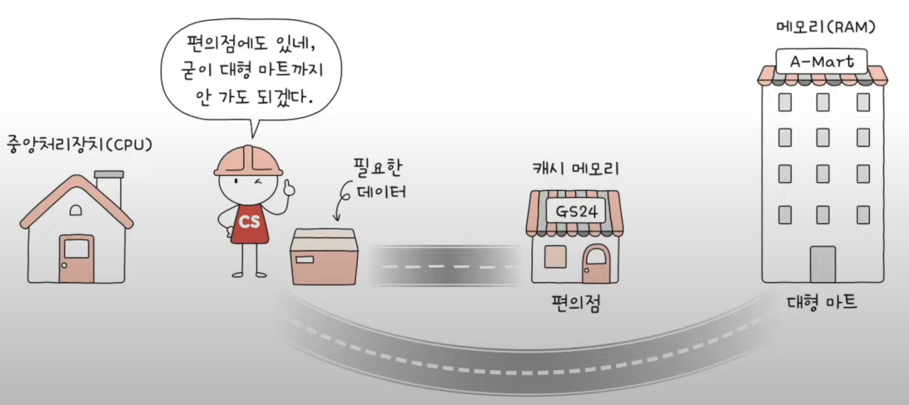

 

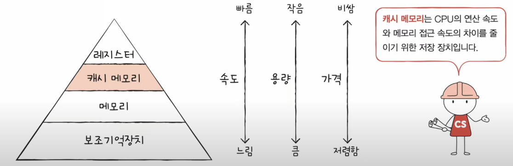

 

#### 계층적 캐시 메모리

L1 - L2 - L3 캐시

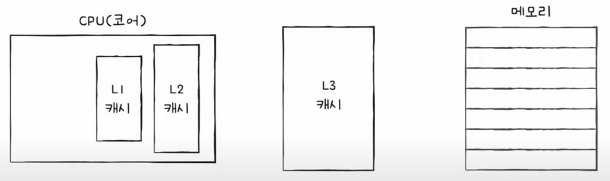

L1 캐시와 L2 캐시는 코어 내부에, L3 캐시는 코어 외부에 위치해 있다.

#### 멀티코어 프로세서의 캐시 메모리

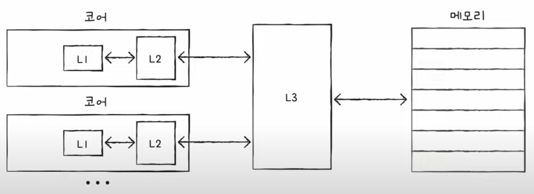

#### 분리형 캐시

L1 캐시는 조금이라도 접근 속도를 빠르게 만들기 위해 명령어만을 저장하는 L1l 캐시, 데이터만을 저장하는 L1D 캐시로 분리하는 경우가 있다. 이를 분리형 캐시라고 한다.

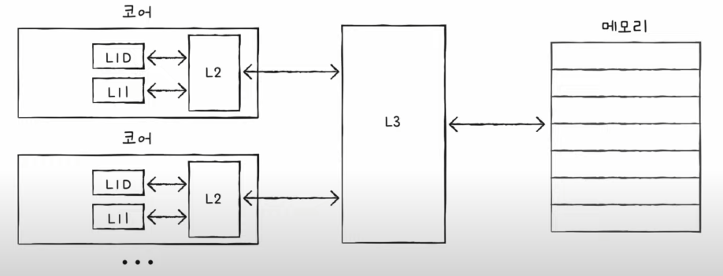

### 참조 지역성의 원리

캐시 메모리는 메모리보다 용량이 작기 때문에 메모리의 모든 내용을 저장할 수 없다. 무엇을 저장해야 할까?

CPU가 자주 사용할 법한 내용을 예측하여 저장한다. 이 예측이 맞아 CPU에서 활용될 경우를 캐시 히트라고 한다.

반대로 예측이 틀렸을 경우 캐시 미스라고 한다.

 

#### 캐시 적중률

- 캐시 히트 횟수 / (캐시 히트 횟수 + 캐시 미스 횟수)
- 최근 우리가 사용하는 컴퓨터의 캐시 적중률은 85~95%이다.

 

CPU가 사용할 법한 데이터를 예측하는 방법이 바로 참조 지역성의 원리라고 할 수 있다.

### 참조 지역성의 원리
- CPU는 최근에 접근했던 메모리 공간에 다시 접근하려는 경향이 있다.
- CPU는 접근한 메모리 공간 근처를 접근하려는 경향이 있다.

 

최근에 접근했던 메모리 공간에 다시 접근하려는 경향

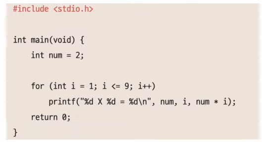

 

접근한 메모리 공간 근처를 접근하려는 경향 (공간 지역성)

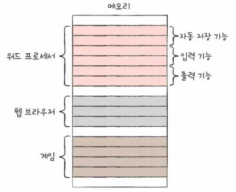

CPU가 워드 프로세서 프로그램을 실행할 때는 워드 프로세서 프로그램이 모여 있는 공간 근처를 접근할 것이고, 입력을 할 적에는 입력 기능이 모여 있는 공간 근처를 집중적으로 접근할 것이다. 이를 공간 지역성이라고 한다.