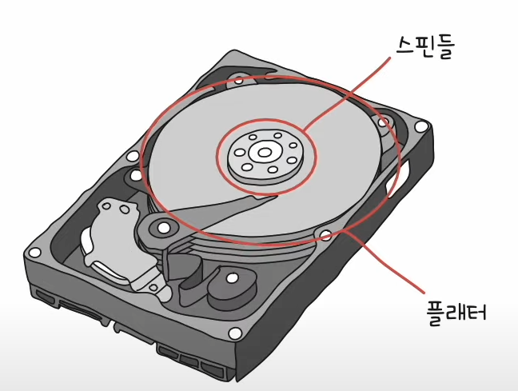
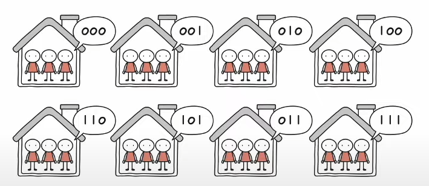

# Chapter 07. 보조기억장치

## 07 - 1 다양한 보조기억장치

### 가장 대표적으로 사용되는 하드 디스크와 플래시 메모리에 대해서 알아보자.

### 하드디스크
- 자기적인 방식으로 데이터를 저장하는 보조기억장치

#### 플래터
- 실질적으로 데이터가 저장되는 곳 그림 속 동그란 원판
- 자기 물질로 덮여 있어 수많은 N극과 S극을 저장한다. N극과 S극은 0과 1의 역할을 수행

#### 스핀들
- 플래터를 회전시키는 구성 요소
- 스핀들이 플래터를 돌리는 속도는 분당 회전수를 나타내는 RPM 단위로 표현

 

#### 헤드
- 플래터 위에서 미세하게 떠 있는 채로 데이터를 읽고 쓰는, 바늘같이 생긴 부품
- 헤드는 원하는 위치로 헤드를 이동시키는 디스크 암이 부착되어 있다.

   

플래터는 트랙과 섹터라는 단위로 데이터를 저장한다.

 

#### 실린더
- 여러 겹의 플래터 상에서 같은 트랙이 위치 한 곳을 모아 연결한 논리적 단위
- 연속된 정보는 한 실린더에 기록 ( 디스크 암을 움직이지 않고 바로 데이터에 접근할 수 있기 때문 )

### 데이터 접근 과정

#### 탐색 시간
- 접근하려는 데이터가 저장된 트랙까지 헤드를 이동시키는 시간

 

#### 회전 지연
- 헤드가 있는 곳으로 플래터를 회전시키는 시간

 

#### 전송 시간
- 하드 디스크와 컴퓨터 간에 데이터를 전송하는 시간

AI를 주도하고 있는 제프 딘의 프로그래머가 꼭 알아야 할 컴퓨터 시간들

ns(나노초)는 10^-9초, 패킷이란 네트워크의 기본적인 전송 단위

150,000,000ns는 0.15초이다.

하드디스크가 작동되는 영상링크
https://www.youtube.com/watch?v=p-JJp-oLx58

### 플래시 메모리
- 전기적으로 데이터를 읽고 쓰는 반도체 기반 저장 장치
- 보조기억장치 범주에만 속한다기보다는 다양한 곳에서 널리 사용하는 저장 장치고 보는 것이 옳다.

### NAND 플래시 메모리와 NOR 플래시 메모리
NAND 플래시가 많이 사용되기 때문에 별도의 언급이 없다면 책에서는 NAND 플래시 메모리를 지칭한다.

### CELL
- 플래시 메모리에서 데이터를 저장하는 가장 작은 단위
- 하나의 셀에 몇 비틀르 저장할 수 있느냐에 따라 플래시 메모리 종류가 나뉜다.
- SLC : 1비트를 저장할 수 있는 플래시 메모리
- MLC : 2비트를 저장할 수 있는 플래시 메모리
- TLC : 3비트를 저장할 수 있는 플래시 메모리

SLC : 한집에 한명  
MLC : 한집에 두명  
TLC : 한집에 세명

### SLC
- 홀로 거주하는 집에 제약 없이 출입이 가능하듯 MLC나 TLC 타입에 비해 비트의 빠른 입출력이 가능
- 한 셀로 두 개의 정보를 표현
- 수명도 더 길기때문에 수만에서 수십만 번 가까이 데이터를 쓰고 지울 수 있다.
- 용량 대비 가격이 높다.
- 데이터를 읽고 쓰기가 매우 많이 반복되며 고성능의 빠른 저장 장치가 필요한 경우에 사용한다.

### MLC
- 한 셀로 네 개의 정보를 표현할 수 있다. ( 대용량화 유리 SLC대비)
- SLC 보다 속도와 수명이 떨어진다.
- SLC 보다 용량대비 가격이 저렴
- 시중에서 많이 사용

### TLC
- 한 셀로 여덟 개의 정보 표현 ( 대용량화 유리 MLC 대비)
- MLC보다 속도와 수명이 떨어진다.
- MLC보다 용량대비 가격이 저렴
- 시중에서 많이 사용

### 결론

### CELL보다 더 큰 단위
- 셀들이 모여 만들어진 단위 페이지(PAGE)
- 페이지가 모여 만들어진 단위 블록(BLOCK)
- 블록이 모여 플레인(PLANE)
- 플레인이 모여 다이(DIE)

#### 읽기/쓰기 단위와 삭제 단위는 다르다
읽기/쓰기는 페이지 단위로 이루어지지만 삭제는 페이지보다 큰 블록 단위로 이루어진다. 이것이 플래시 메모리의 가장 큰 특징 중 하나이다.

이때 페이지는 세개의 상태를 가질 수 있다.

#### Free 상태
- 어떠한 데이터도 저장하고 있지 않아 새로운 데이터를 저장할 수 있는 상태

#### Valid 상태
- 이미 유효한 데이터를 저장하고 있는 상태

#### Invalid 상태
- 유효하지 않은 데이터(쓰레기값)를 저장하고 있는 상태

플래시 메모리는 하드 디스크와는 달리 덮어쓰기가 불가능하여 Valid 상태인 페이지에는 새 데이터를 저장할 수 없다.
 

### 플래시 메모리의 간단한 동작 예시
각각의 네모가 페이지라고 가정

블록 X에 데이터 C를 저장하면 읽기와 쓰기 단위는 페이지기 때문에 하나의 페이지에 데이터 C가 저장된다.

 

새롭게 저장된 C와 기존에 저장되어 있는 B는 그대로 둔채 A를 A`로 수정하고 싶다면?

플래시 메모리에서 덮어쓰기는 불가능하기 때문에 A는 Invalid 상태가 되어 유효하지 않은 쓰레기 값이 되고, 새로운 A` 데이터가 저장된다. 

이 때 사용하지 않을 공간을 A가 차지하고 있기 때문에 용량낭비가 일어나고있고 삭제는 블록단위로 일어나기 때문에 A만 지울수는 없다. 이를 정리하기 위해 가비지 컬렉션 기능을 제공한다.

- 유효한 페이지들만을 새로운 블록으로 복사
- 기존의 블록을 삭제

## 07 - 2 RAID의 정의와 종류
보조기억장치를 더욱 안전하고 빠르게 활용하는 방법인 RAID에 대해 알아보자.

1TB를 4개를 묶어쓰는것과 4TB 한개를 쓰는것과 어떤것이 더 좋을까
 
1TB 하드 디스크 네 개로 RAID를 구성하면 4TB 하드 디스크 한 개의 성능과 안전성을 능가할 수 있다

### RAID(Redundant Array of Independent Disks)
- 데이터의 안전성 혹은 높은 성능을 위해 여러 물리적 보조기억장치를 마치 하나의 논리적 보조기억장치처럼 사용하는 기술

### RAID 레벨
- RAID0, 1, 2, 3, 4, 5, 6 그로 부터 파생된 10, 50 등이 있다.
- 이 중 자주 사용되는 0, 1, 4, 5, 6에 대해 알아보자

#### RAID 0
- 데이터를 단순히 나누어 저장하는 구성 방식
- 스트라입(STRIPE) : 마치 줄무늬처럼 분산되어 저장된 데이터
- 스트라이핑(STRIPING) : 분산하여 저장하는 것

 

- 장점 : 입출력 속도의 향상

- 단점 : 저장된 정보가 안전하지 않음

 

### RAID 1
- 복사본을 만드는 방식 (미러링이라고도 불림)
- 데이터를 쓸 때 원본과 복사본 두 군데에 쓴다. ( 느린 쓰기 속도 )
- 장점 : 복구가 매우 간단하다. 하나가 문제가 발생해도 상관없다.

- 단점 : 하드 디스크 개수가 한정되었을 때 사용 가능한 용량이 적어짐 ( 비용 증가로 이어진다 )

### RAID 4
- RAID 1처럼 완전한 복사본을 만드는 대신 오류를 검출하고 복구하기 위한 정보를 저장한다(패리티 비트).

- 장점 : RAID 1보다 적은 하드 디스크로도 데이터를 안전하게 보관한다.
- 단점 : 패리티 디스크의 병목

새로운 데이터가 저장될 때 마다 패리티를 저장하는 디스크에도 데이터를 쓰게되므로 패리티를 저장하는 장치에 병목현상이 발생한다.

 

### RAID 5
- 패리티 정보를 분산하여 저장하는 방식
- 패리티를 분산하였기 때문에 병목현상 해소

### RAID 6
- 두 종류의 패리티를 쓰기 때문에 RAID 5보다 안전
- 쓰기는 RAID 5보다 느리다.

