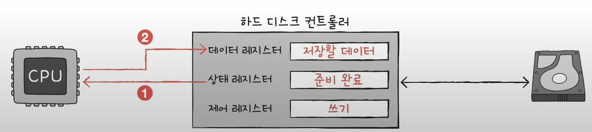
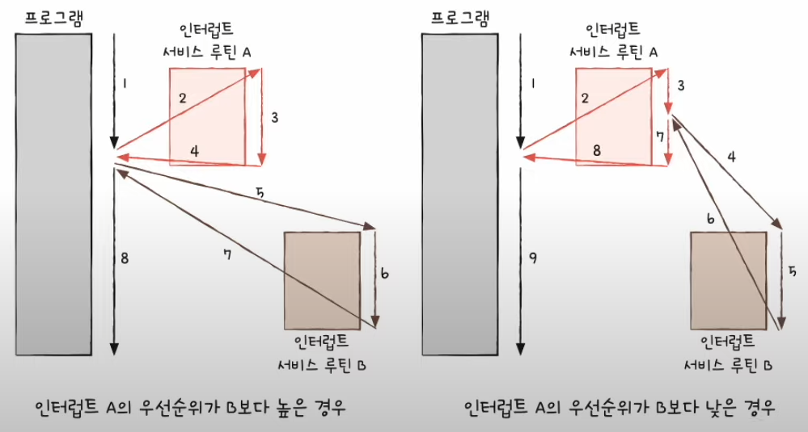
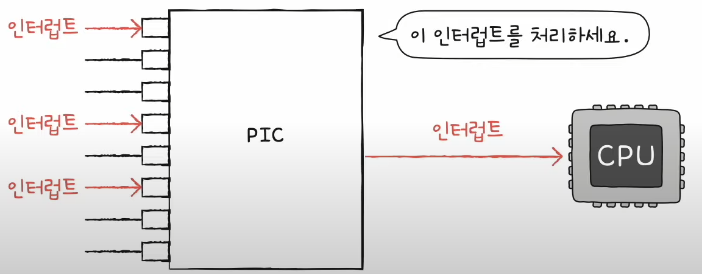
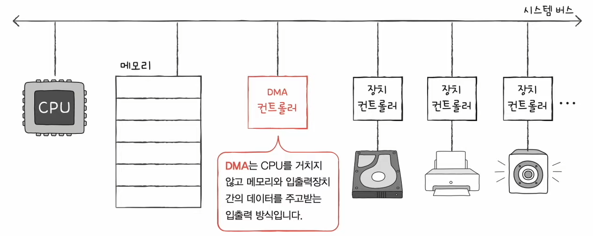

# Chapter 08. 입출력장치

## 08 - 1 장치 컨트롤러와 장치 드라이버

입출력장치들은 컴퓨터 내부와 어떻게 연결되어 있을까?

입출력 장치의 종류가 너무나도 많고 ( 규격화 어려움 ), 데이터의 전송률이 낮기 때문에 CPU, 메모리보다 다루기가 더 까다롭다.

### 장치 컨트롤러

- 입출력장치는 장치 컨트롤러를 통해 컴퓨터와 연결된다.

- CPU와 입출력장치 간의 통신중개
- 오류 검출
- 데이터 버퍼링

#### 버퍼링
- 전송률이 높은 장치와 낮은 장치 사이에 주고 받는 데이터를 버퍼라는 임시 저장 공간에 저장하여 전송률을 비슷하게 맞추는 방법

### 장치 컨트롤러 내부 구조

#### 데이터 레지스터
- CPU와 입출력장치 사이에 주고받을 데이터가 담기는 레지스터(버퍼역할)
- RAM을 사용하기도 한다.

#### 상태 레지스터
- 입출력장치가 입출력 작업을 할 준비가 되었는가
- 입출력 작업이 완료되었는가
- 입출력장치에 오류는 없는지 등의 상태 정보를 저장한다.

#### 제어 레지스터
- 입출력장치가 수행할 내용에 대한 제어 정보

### 장치 드라이버
- 장치 컨트롤러의 동작을 감지하고 제어함으로써 장치 컨트롤러가 컴퓨터 내부와 정보를 주고받을 수 있게 하는 프로그램
- 소프트웨어적인 통로라고 할 수 있다.

장치드라이버를 인식하고 실행하는 주체는 운영체제이다. 즉 운영체제가 장치 드라이버를 인식하고 실행할 수 있다면 그 장치는 컴퓨터 내부와 정보를 주고받을 수 있다.

  

## 08 - 2 다양한 입출력 방법

### 세가지 입출력 방식
- 프로그램 입출력
- 인터럽트 기반 입출력
- DMA 입출력

### 프로그램 입출력
- 입출력 명령어로써 장치 컨트롤러와 상호작용

메모리에 저장된 정보를 하드 디스크에 백업하는 상황을 생각해보자.

1. CPU는 하드디스크 컨트롤러의 제어 레지스터에 쓰기 명령을 보낸다.

2. 하드 디스크 컨트롤러는 하드 디스크 상태를 확인한다. ( 준비완료표시 )

3. CPU는 상태 레지스터를 주기적으로 읽어보며 하드 디스크의 준비 여부를 확인, 하드 디스크가 준비됐음을 CPU가 알게 되면 백업할 메모리의 정보를 데이터 레지스터에 쓴다.

CPU는 입출력장치들의 주소를 어떻게 아는 걸까? ( 장치 컨트롤러의 레지스터들을 어떻게 아는걸까?)

### 프로그램 입출력 방식
- 메모리 맵 입출력과 고립형 입출력

### 메모리 맵 입출력 방식
- 메모리에 접근하기 위한 주소 공간과 입출력장치에 접근하기 위한 주소 공간을 하나의 주소 공간으로 간주하는 방법

1024개 전부 메모리 주소를 표현하는데 사용하지 않고. 512개는 메모리주소, 512개는 장치 컨트롤러의 레지스터를 표현하기 위해 사용한다.

메모리 접근 명령어 == 입출력장치 접근 명령어

### 고립형 입출력
- 메모리를 위한 주소 공간과 입출력 장치를 위한 주소 공간을 분리하는 방법

- 입출력 전용 명령어를 사용해야함 

### 결론

### 인터럽트 기반 입출력
- 장치 컨트롤러에 의하여 하드웨어 인터럽트를 발생시킨다.

#### 동시다발적인 인터럽트 : 입출력장치가 많을 때를 가정

- 인터럽트가 발생한 순서대로 인터럽트를 처리하는 방법
- 플래그 레지스터 속 인터럽트 비트를 비활성화한 채 인터럽트를 처리하는 경우

그러나 모든 인터럽트를 전부 순차적으로 해결할 수 없는 경우가 있다.
더 빨리 처리해야하는 인터럽트( 우선순위가높은 )가 있을 수 있기 때문

무시할 수 없는 인터럽트인 NMI(Non Maskable Interrupt)가 발생한 경우

#### 우선순위를 반영한 인터럽트 중 PIC(Programmable Interrupt Controller)라는 하드웨어를 사용한다.

- CPU가 우선적으로 처리해야할 인터럽트를 알려준다.

 

### DMA 입출력

프로그램 입출력, 인터럽트 기반 입출력의 공통점 : 입출력장치와 메모리 간의 데이터 이동은 CPU가 주도하고, 이동하는 데이터도 반드시 CPU를 거친다.

그러나 입출력장치와 메모리 사이에 전송되는 모든 데이터가 CPU를 반드시 거치게된다면 이 때문에 시간을 뺏기게 된다. 

그래서 입출력장치와 메모리가 CPU를 거치지 않고도 상호작용할 수 있는 DMA 입출력방식이 등장하게 됐다.

1. CPU는 DMA 컨트롤러에 입출력 작업을 명령

2. DMA 컨트롤러는 CPU 대신 장치 컨트롤러와 상호작용하며 입출력 작업을 수행

3. 백업이 끝나면 DMA 컨트롤러는 CPU에게 인터럽트를 걸어 작업이 끝났음을 알린다.

CPU는 입출력 작업의 시작과 끝만 관여하게 된다.

#### 문제점
DMA 컨트롤러는 시스템 버스로 메모리에 직접 접근이 가능하지만 시스템 버스는 공용 자원이기 때문에 동시 사용이 불가능하다.

CPU가 시스템 버스를 사용할때 DMA 컨트롤러는 시스템 버스를 사용할 수 없고 그 반대도 마찬가지다.

DMA 컨트롤러는 CPU가 시스템 버스를 이용하지 않을 때 마다 이용하거나 CPU에게 허락을 받고 시스템 버스를 이용한다. 이것을 사이클 스틸링 이라고 부른다.

### 입출력 버스
시스템 버스를 두 번 이용하는 DMA 컨트롤러의 문제를 해결하기 위해
입출력 버스를 통해 시스템 버스의 이용 빈도 낮추게 되었다.

최근에는 메모리에 직접 접근할 뿐만 아니라 입출력 명령어를 직접 인출하고, 해석하고, 실행까지 하는 일종의 입출력 전용 CPU가 만들어지기도 하였다.