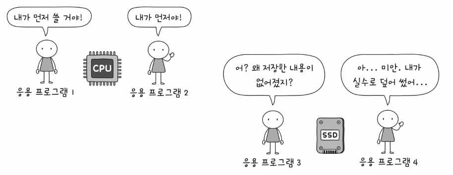
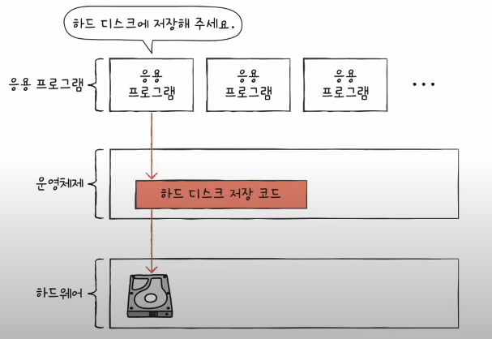

# Chapter 09. 운영체제 시작하기

## 09 - 1 운영체제를 알아야하는 이유

### 운영체제
프로그램 실행에 마땅히 필요한 요소들을 가리켜 시스템 자원, 혹은 줄여서 자원이라고 한다. 우리가 학습한 CPU, 메모리, 보조기억장치, 입출력장치 등과 같은 컴퓨터 부품들은 모두 자원이라고 볼 수 있다.

실행할 프로그램에 필요한 자원을 할당하고, 올바르게 실행되도록 돕는 특별한 프로그램이 바로 운영체제이다.

 

#### N번지에 어떤 프로그램을 배치하는지는 누가 하는걸까?

#### 운영체제는 CPU 관리

여러개가 번갈아가면서 실행하여 동시에 실행되고 있는 것처럼 보이는 상황에서 어떤 프로그램을 먼저 실행할지 결정한다.

 

#### 운영체제의 입출력장치 관리

#### 결론

응용프로그램과 하드웨어 사이에서 응용 프로그램에 필요한 자원을 할당하고, 올바르게 실행되도록 관리하는 역할을 한다.

주로 정부에 많이 비유된다.

국내 자원을 효율적으로 배분하고, 국민들이 지켜야 할 규칙을 만들어 나라 전체를 관리하는 것처럼. 운영체제도 컴퓨터 시스템 전체를 관리한다.

또한 정부에 여러 부서가 나누어져 있는 것처럼 운영체제 또한 관리할 자원별로 기능이 나누어져 있다.

개발자 입장에서는 운영체제가 하드웨어를 조작하고 관리하는 기능을 제공하기 때문에 하드웨어를 조작하는 코드를 직접 작성할 필요 없이 운영체제의 도움을 받아 간편하게 개발을 할 수 있다.

## 09 - 2 운영체제의 큰 그림
- 커널이란?
- 응용프로그램이 어떻게 실행되는가?
- 응용프로그램에 어떤 서비스를 제공하는가?

### 운영체제의 심장 커널
운영체제의 핵심 서비스를 담당하는 부분을 커널(kernel)이라고 한다.

 

운영체제에는 속하는데 커널에는 속하지 않는 기능
- 유저 인터페이스(UI; User Interface)
- 사용자와 컴퓨터 간의 통로일 뿐 운영체제의 핵심기능은 아니다.

### 이중모드와 시스템 호출

운영체제는 사용자가 실행하는 응용 프로그램이 하드웨어 자원에 직접 접근하는 것을 방지하여 자원을 보호한다.

만약 응용 프로그램이 하드 디스크에 접근하려한다면

#### 이중 모드
- CPU가 명령어를 실행하는 모드를 크게 사용자 모드와 커널 모드로 구분하는 방식

 

- 사용자 모드
  - 운영체제 서비스를 제공받을 수 없는 실행 모드
  - 커널 영역의 코드를 실행할 수 없는 실행 모드
  - 자원 접근 불가

 

- 커널 모드
  - 운영체제의 서비스를 제공받을 수 있는 실행 모드
  - 자원 접근을 비롯한 모든 명령어 실행 가능

#### 시스템 호출
- 커널 모드로 전환하여 실행하기 위해 호출
- 일종의 소프트웨어 인터럽트

- 시스템 호출이 처리되는 방식은 하드웨어 인터럽트 처리 방식과 유사하다.

일반적으로 응용 프로그램은 실행 과정에서 운영체제 서비스들을 매우 빈번하게 이용한다. 사용자 모드와 커널 모드를 오가며 실행된다.

### 운영체제의 핵심 서비스
- 프로세스 관리
- 자원 접근 및 할당
- 파일 시스템 관리

### 프로세스 관리
- 실행 중인 프로그램(프로세스)
- 동시다발적으로 생성/실행/삭제되는 다양한 프로세스를 일목요연하게 관리
- 프로세스와 스레드, 프로세스 동기화, 교착상태 해결

### 자원 접근 및 할당
- CPU
- 메모리
- 입출력장치

#### CPU 
- 일반적으로 메모리에는 여러 프로세스가 적재되고, 하나의 CPU는 한 번에 하나의 프로세스만 실행 할 수 있다. 그래서 하나의 프로세스가 CPU를 이용하고 있다면 다른 프로세스는 기다려야한다.
- 운영체제는 프로세스들에 공정하게 CPU를 할당하기 위해 어떤 프로세스부터 CPU를 이용하게 할 것인지, 얼마나 오래 CPU를 이용하게 할지를 결정해야한다. 이를 CPU 스케줄링이라고한다.

#### 메모리
- 운영체제는 새로운 프로세스가 적재될 때 마다 어느 주소에 적재해야 할지를 결정해야 한다.
- 운영체제가 프로세스에게 어떻게 메모리를 할당하는지, 그리고 메모리가 부족할 경우 이를 어떻게 극복하는지 14장에서 알아보자.

#### 입출력장치
- 입출력장치가 CPU에 하드웨어 인터럽트 요청 신호를 보내면 CPU는 하던 일을 잠시 백업한 뒤 커널 영역에 있는 인터럽트 서비스 루틴을 실행한다.
- 이처럼 운영체제는 인터럽트를 처리하는 프로그램, 즉 인터럽트 서비스 루틴을 제공함으로써 입출력 작업을 수행한다.

#### 파일 시스템관리
- 컴퓨터를 사용할 때 파일을 열고, 생성하고, 삭제하곤 한다.
- 파일들을 한데 묶어 디렉토리(폴더)로 관리한다.
- 이것을 파일 시스템이라하고 운영체제가 지원하는 핵심 서비스이다.