# Chapter 10. 프로세스와 스레드

## 10 - 1 프로세스 개요

프로그램은 실행되기 전까지는 그저 보조기억장치에 있는 데이터 덩어리일 뿐이지만, 보조기억장치에 저장된 프로그램을 메모리에 적재하고 실행하는 순간 그 프로그램은 프로세스가 된다. 

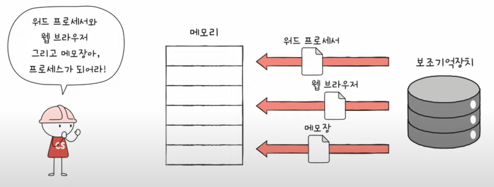

#### 프로세스 종류
- 포그라운드 프로세스 : 사용자가 볼 수 있는 공간에서 실행되는 프로세스
  
- 백그라운드 프로세스 : 사용자가 볼 수 없는 공간에서 실행되는 프로세스
  - 사용자와 직접 상호작용하는 백그라운드 프로세스
  - 사용자와 상호작용하지 않고 정해진 일만 사용하는 프로세스(데몬, 서비스)

### 프로세스 제어 블록
- 모든 프로세스는 실행을 위해 CPU가 필요하지만, CPU 자원은 한정되어있다.
- 한정된 시간만큼만 CPU를 이용한다.

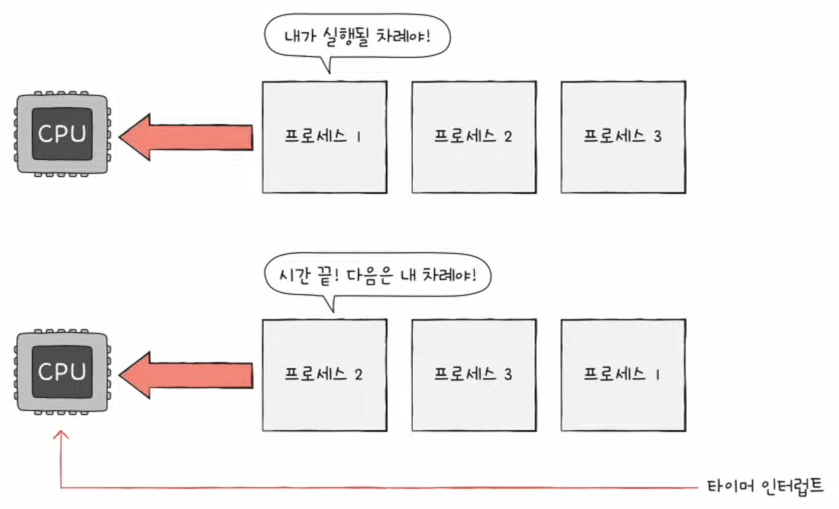

- 빠르게 번갈아 수행되는 프로세스를 관리해야하는데 이를 위해 프로세스 제어 블록 ( PCB ) 자료구조를 사용한다.

#### PCB
- 프로세스를 식별하기 위한 꼭 필요한 정보들이 저장된다.

#### PCB에 담기는 대표적인 정보
- 프로세스 ID
  - 특정 프로세스를 식별하기 위한 고유한 번호
- 레지스터 값
  - 프로세스는 자신의 실행 차례가 오면 이전까지 사용한 레지스터 중간값들을 모두 복원한다.
  - 이전까지 진행했던 작업들을 그대로 이어 실행해야 하기 때문
- 프로세스 상태
  - 입출력 장치를 사용하기 위해 기다리는 상태, CPU를 사용하기 위해 기다리고 있는 상태, CPU를 이용하고 있는 상태
- CPU 스케줄링 정보
  - 프로세스가 언제, 어떤 순서로 CPU를 할당받을지에 대한 정보
- 메모리 정보
  - 프로세스가 어느 주소에 저장되어 있는지에 대한 정보
  - 페이지 테이블 정보 ( 14장 )
- 사용한 파일과 입출력장치 정보
  - 어떤 입출력장치가 이 프로세스에 할당되었는지
  - 어떤 파일들을 열었는지에 대한 정보

### 문맥 교환(Context Switch)
하나의 프로세스에서 다른 프로세스로 실행 순서가 넘어가면 어떤 일이 일어날까?

  
  프로세스A가 운영체제로부터 CPU를 할당받아 실행되다가 시간이 다 되어 프로세스 B에 CPU 사용을 양보한다고 가정해보자.

  이 상황에 직전까지 실행되는 프로세스 A는 PC를 비롯한 각종 레지스터값, 메모리 정보, 입출력장치 등 지금까지의 중간 정보를 백업해야한다.

  그래야만 다음 차례가 왔을 때 이전까지 실행했던 내용에 이어 다시 실행을 재개 할 수 있기 때문

- 이러한 중간 정보, 즉 하나의 프로세스 수행을 재개하기 위해 기억해야 할 정보를 문맥(context)이라고 한다.

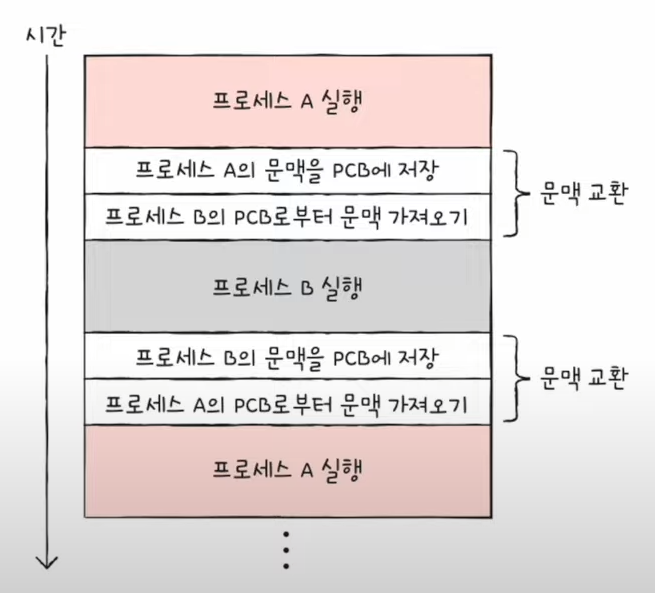

이처럼 기존의 실행 중인 프로세스 문맥을 PCB에 백업하고, 새로운 프로세스 실행하기 위해 문맥을 PCB로 부터 복구하여 새로운 프로세스를 실행하는 것을 문맥 교환(Context switching)이라고 한다.

### 프로세스의 메모리 영역
- 사용자 영역에는 프로세스가 어떻게 배치될까?

- 크게 코드 영역, 데이터 영역, 힙 영역, 스택 영역으로 나뉘어 저장된다.

#### 코드 영역 ( 텍스트 영역 )
- 실행할 수 있는 코드, 기계어로 이루어진 명령어 저장
- 데이터가 아닌 CPU가 실행할 명령어가 담기기에 쓰기가 금지된 영역 읽기 전용 공간이다.

#### 데이터 영역
- 잠깐 썻다가 없앨 데이터가 아닌 프로그램이 실행되는 동안 유지할 데이터 저장
- 전역변수가 대표적이다.

코드 영역과 데이터 영역은 그 크기가 변하지 않고 고정된 영역이라는 점에서 정적 할당 영역이라고 부른다.

#### 힙 영역
- 프로그램을 만드는 사용자, 즉 프로그래머가 직접 할당할 수 있는 저장공간
- 프로그래밍 과정에서 힙 영역에 메모리 공간을 할당했다면 언젠가는 해당 공간을 반환해야하는데 최근에는 일부 프로그래밍 언어에서 GC가 이 역할을 해준다.
- 메모리 공간을 반환하지 않는다면 메모리 낭비를 초래하게 되는데 이를 메모리 누수라고 한다.

#### 스택 영역
- 데이터가 일시적으로 저장되는 공간
- 잠깐 쓰다가 말 값들이 저장되는 공간
- 매개 변수, 지역 변수

이 두개의 영역은 동적으로 크기가 변하기 때문에 동적 할당 영역이라고 부르며, 힙 영역은 낮은 주소에서 높은 주소, 스택 영역은 높은 주소에서 낮은 주소로 할당된다.

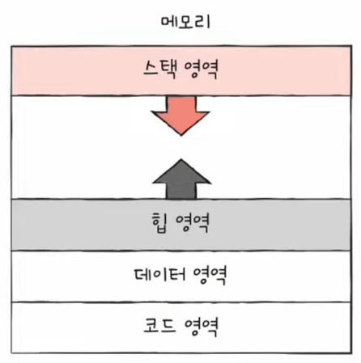

## 10 - 2 프로세스 상태와 계층 구조

운영체제는 프로세스의 상태를 PCB에 기록하여 관리하며 이처럼 동시에 실행되는 수많은 프로세스를 계층적으로 관리한다. 

프로세스들의 상태와 계층적 관리에 대해 알아보자.

### 프로세스 상태
- 생성 상태
- 준비 상태
- 실행 상태
- 대기 상태
- 종료 상태

#### 생성 상태
- 이제 막 메모리에 적재되어 PCB를 할당 받은 상태
- 실행할 준비가 완료된 프로세스는 준비 상태가 된다.

#### 준비 상태
- 당장이라도 CPU를 할당받아 실행할 수 있지만, 아직 차례를 기다리고 있는 상태
- 차례가 되면 CPU를 할당받아 실행 상태가 된다. (실행 상태로 전환되는 것을 디스패치라고 한다.)

#### 실행 상태
- CPU를 할당 받아 실행 중인 상태
- 할당된 시간 모두 사용 시(타이머 인터럽트 발생 시) 준비 상태로 바뀜
- 실행 도중 입출력장치를 사용하면 입출력 작업이 끝날 때까지 대기 상태로 바뀐다.

#### 대기 상태
- 프로세스가 실행 도중 입출력장치를 사용하는 경우
- 입출력 작업은 CPU에 비해 느리기에 이 경우 대기 상태로 만든다.
- 입출력 작업이 끝나면 (입출력 완료 인터럽트를 받으면) 준비 상태로 변환한다.

#### 종료 상태
- 프로세스가 종료된 상태
- PCB, 프로세스의 메모리 영역 정리

#### 프로세스 상태 다이어그램
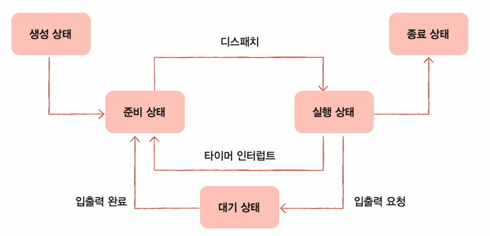

### 프로세스 계층 구조
- 프로세스 실행 도중 시스템 호출을 통해 다른 프로세스 생성 가능
- 새 프로세스를 생성한 프로세스 : 부모 프로세스
- 부모 프로세스에 의해 생성된 프로세스 : 자식 프로세스

부모 프로세스와 자식 프로세스는 각기 다른 PID를 가진다.
일부 운영체제에서는 자식 프로세스의 PCB에 부모 프로세스의 PID인 PPID가 기록되기도 한다.

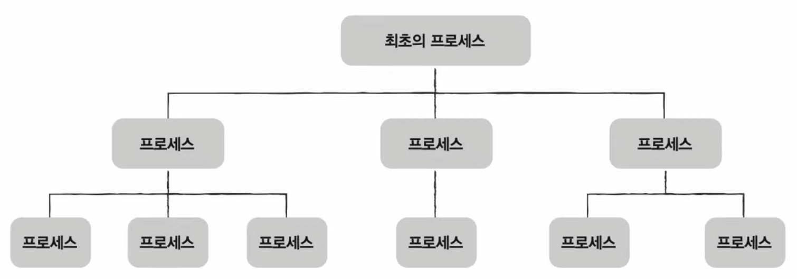

 
 

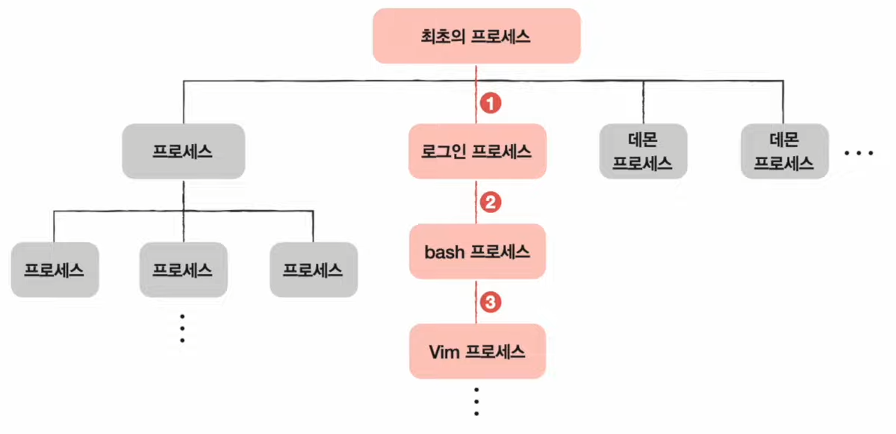

### 프로세스 생성 기법
- 부모 프로세스는 자식 프로세스를 어떻게 만들어 내고
- 자식 프로세스는 어떻게 자신만의 코드를 실행하는지 알아보자.

부모 프로세스는 fork 시스템 호출을 통해 자신의 복사본을 자식 프로세스로 생성

자식 프로세스는 exec 시스템 호출을 통해 자신의 메모리 공간을 다른 프로그램으로 교체

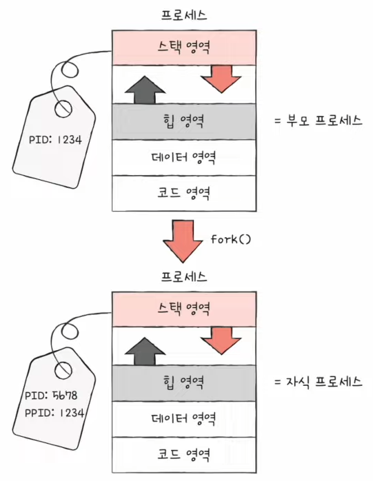

fork를 통해 복사본이 만들어진 뒤 자식 프로세스는 exec 시스템 호출을 통해 새로운 프로그램으로 전환된다.

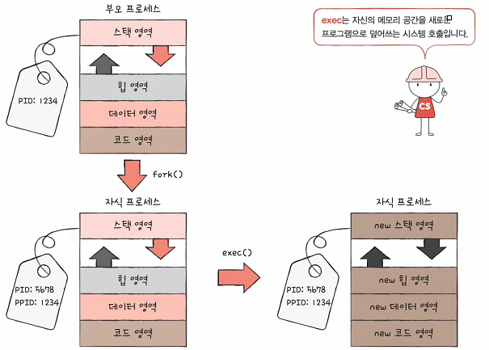

  

## 10 - 3 스레드

스레드는 프로세스를 구성하는 실행의 흐름 단위이다. 이 문장의 의미와 멀티스레드와 멀티프로세스의 차이를 알아보자.

#### 스레드(thread)는 프로세스를 구성하는 실행 흐름의 단위이므로 하나의 프로세스는 하나 이상의 스레드를 가질 수 있다.

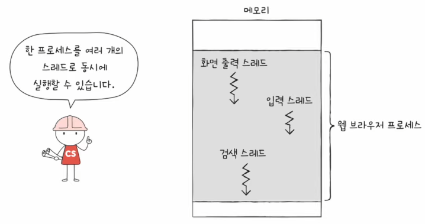

 

### 프로세스와 스레드

#### 실행 흐름 단위가 하나인 프로세스 (단일 스레드 프로세스)

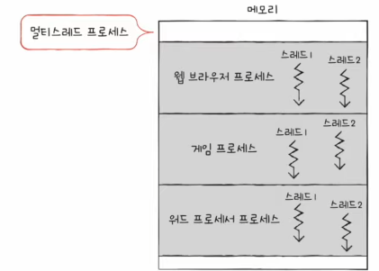

#### 실행 흐름이 여러 개인 프로세스 (멀티 스레드 프로세스)

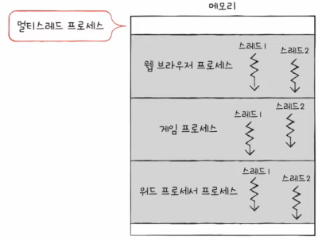

 

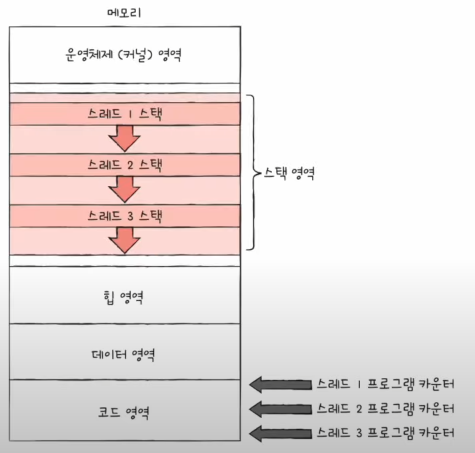

프로세스를 이루는 스레드는 실행 흐름의 단위이다. 스레드는 각기 다른 스레드 ID, PC를 비롯한 레지스터 값, 스택으로 구성되어있다. 각각의 다른 구성 요소를 가지고 있기 때문에 각기 다른 코드를 실행할 수 있다.

여기서 중요한 점은 프로세스의 스레드들은 실행에 필요한 최소한의 정보만을 유지한 채 프로세스 자원을 공유하며 실행된다.

### 멀티 프로세스와 멀티 스레드

동일한 작업을 수행하는 단일 스레드 프로세스 여러개 실행하는 것과 하나의 프로세스를 여러 스레드로 실행하는 것이 어떤 차이가 있을까?

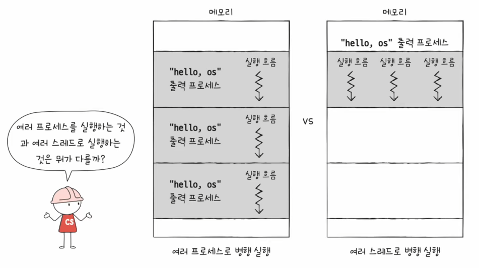

프로세스끼리는 기본적으로 자원을 공유하지 않지만, 스레드끼리는 같은 프로세스 내의 자원을 공유한다.

- 프로세스를 fork하면 코드/데이터/힙 영역 등 모든 자원이 복제되어 저장된다

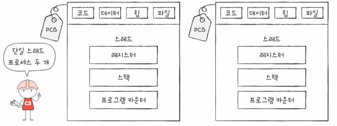

- 스레드들은 프로세스가 가지는 자원을 공유한다

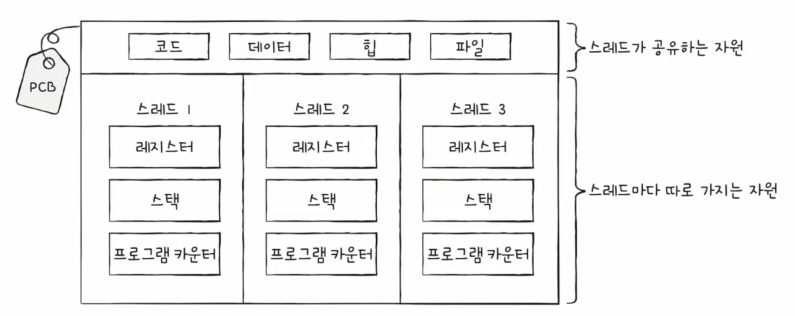

- 서로 다른 프로세스는 서로가 남남처럼 독립적으로 실행된다.
- 스레드는 프로세스의 자원을 공유하기 때문에 협력과 통신에 유리하다.

  
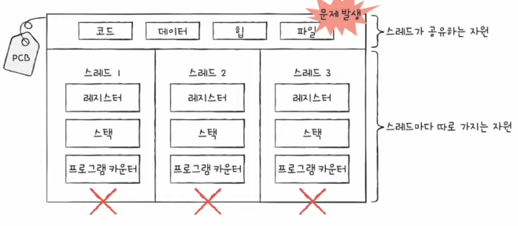

- 멀티스레드 환경에서 하나의 스레드에 문제가 생기면 프로세스 전체에 문제가 생길 수 있다.
- 모든 스레드는 프로세스의 자원을 공유하고, 하나의 스레드에 문제가 생기면 다른 스레드도 영향을 받기 때문

 

기본적으로 프로세스끼리는 자원을 공유하지 않지만 자원을 공유하고 데이터를 주고 받을 수 있다. 이를 IPC라고 부른다.