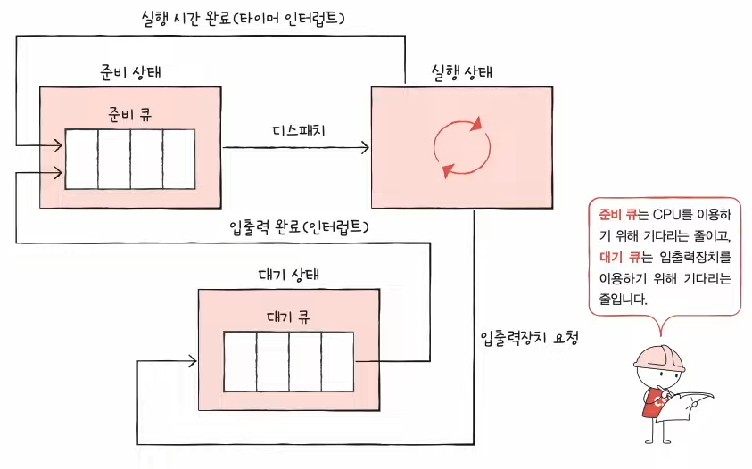
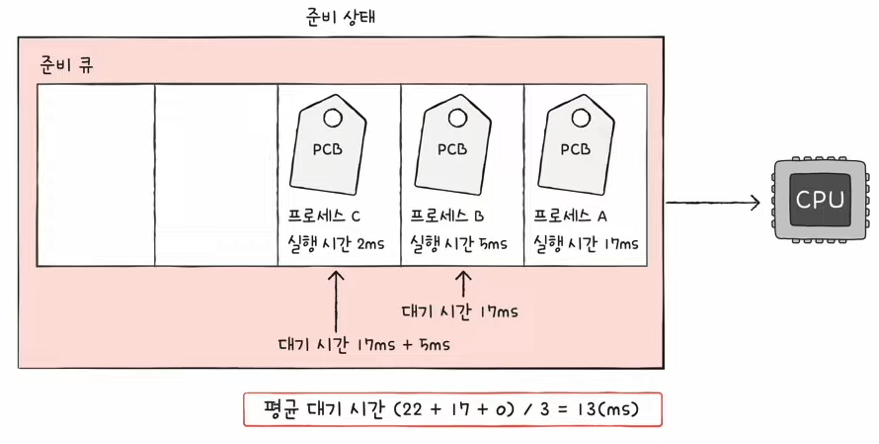

# Chapter 11. CPU 스케줄링

## 11 - 1 CPU 스케줄링 개요

운영체제는 CPU를 어떻게 프로세스에 배분하는지 알아보자.

### CPU 스케줄링이란?
- 운영체제가 프로세스들에게 공정하고 합리적으로 CPU 자원을 배분하는 것

### 프로세스 우선순위
가장 공정한 CPU 스케줄링은 무엇일까?

빠르게 처리해야하는 프로세스가 있고, 비교적 늦게 처리해야하는 프로세스가 있기 때문에 (우선순위가 높은 프로세스 부터 빠르게 처리해야한다.)

#### 대표적으로 입출력 작업이 많은 프로세스가 우선순위가 높다.

왜 그럴까?

대부분의 프로세스 들은 CPU와 입출력장치를 모두 사용하며 실행된다.

BUT 프로세스 종류마다 입출력장치를 이용하는 시간과 CPU를 이용하는 시간의 양에 차이가 있다.

비디오 재생 및 디스크 백업 작업과 같은 입출력 작업이 많은 프로세스
복잡한 수학 연산, 컴파일, 그래픽 처리 작업을 담당하는 프로세스와 같이 CPU 작업이 많은 프로세스도 존재한다.

전자를 <u><strong>입출력 집중 프로세스</strong></u>라고 하고, 후자를 <u><strong>CPU 집중 프로세스</strong></u>라고 한다.

결과적으로 입출력 집중 프로세스를 가능한 빨리 실행시켜 입출력 장치를 끊임없이 작동시키고, 그 다음 CPU 집중 프로세스에 집중적으로 CPU를 할당하는 것이 효율적이다.

운영체제는 프로세스마다 우선순위를 부여하여 PCB에 우선순위를 명시하고, PCB에 적힌 우선순위를 기준으로 먼저 처리할 프로세스를 결정한다.

### 스케줄링 큐

PCB에 우선순위가 적혀 있지만, 운영체제가 모든 프로세스의 PCB를 뒤적거리는것은 비효율적이다. 그래서 운영체제는 프로세스들에 '줄을 서서 기다릴 것'을 요구하는데 이 줄을 <u><strong>스케줄링 큐</strong></u>로 구현하고 관리한다.

#### 준비 큐와 대기 큐

준비 큐 : CPU를 이용하고 싶은 프로세스들이 서는 줄

대기 큐 : 입출력장치를 이용하기 위해 대기 상태에 접어든 프로세스들이 서는 줄

우선순위가 낮은 프로세스들이 먼저 큐에 삽입되어 줄을 섰다고 할지라도 우선순위가 높은 프로세스가 먼저 처리될 수 있다.

#### 큐를 포함한 프로세스 상태 다이어그램

### 선점형과 비선점형 스케줄링

CPU를 잘 사용하고있는 프로세스가 있는 도중에 갑자기 다른 급한 프로세스가 CPU를 지금 당장 사용하길 원한다면?

### 선점형 스케줄링

- 프로세스가 CPU를 비롯한 자원을 사용하고 있더라도 운영체제가 프로세스로부터 자원을 강제로 빼앗아 다른 프로세스에 할당할 수 있는 스케줄링 방식

장점 : 어느 한 프로세스의 자원 독점을 막고 프로세스들에 골고루 자원을 배분할 수 있다.

단점 : 문맥 교환 과정에서 오버헤드가 발생할 수 있다.

### 비선점형 스케줄링

- 프로세스가 자원을 사용하고 있다면 그 프로세스가 종료되거나 스스로 대기 상태에 접어들기 전까진 다른 프로세스가 끼어들 수 없는 스케줄링 방식

장점 : 문맥 교환 과정에서 발생하는 오버헤드가 적다
단점 : 모든 프로세스가 골고루 자원을 이용하기 어렵다.

 

## 11 - 2 CPU 스케줄링 알고리즘

### 스케줄링 알고리즘의 종류

### 선입 선처리 스케줄링 (FCFS)
- 단순히 준비 큐에 삽입된 순서대로 처리하는 비선점 스케줄링
- 먼저 CPU를 요청한 프로세스부터 CPU 할당
- 프로세스들이 기다리는 시간이 매우 길어질 수 있다 ( 호위 효과 )

### 최단 작업 우선 스케줄링 (SJF)
- CPU 사용이 긴 프로세스는 나중에 실행, CPU 사용 시간이 짧은 프로세스는 먼저 실행
- CPU 사용 시간이 가장 짧은 프로세스부터 처리하는 프로세스

### 라운드 로빈 스케줄링 (RR)
- 선입 선처리 스케줄링과 타임 슬라이스 개념이 더해진 스케줄링 방식
- 타임 슬라이스 : 각 프로세스가 CPU를 사용할 수 있는 정해진 시간
- 정해진 타임 슬라이스만큼의 시간 동안 돌아가며 CPU를 이용하는 선점형 스케줄링

타임슬라이스가 지나치게 크다면 선입 선처리 스케줄링과 다를 바 없어 호위 효과가 생길 여지가 있고, 타임슬라이스가 지나치게 작으면 문맥 교환에 발생하는 비용이 커 CPU는 프로세스를 처리하는 일보다 프로세스를 전환하는데에 힘을 다 쓰게된다.

 

### 최소 잔여 시간 우선 스케줄링 (SRT)
- 최단 작업 우선 스케줄링과 라운드 로빈 스케줄링이 합쳐진 스케줄링

최소 잔여 시간 우선 스케줄링 하에서 프로세스들은 정해진 타임 슬라이스만큼 CPU를 사용하되, CPU를 사용할 다음 프로세스로는 남아있는 작업 시간이 가장 적은 프로세스가 선택된다.

 

### 우선순위 스케줄링
- 프로세스들에 우선순위를 부여하고, 우선순위 높은 프로세스부터 실행
- 우선순위가 같은 프로세스들은 선입 선처리로 스케줄링

기아(starvation) 현상 우선순위가 높은 프로세스만 실행하기 때문에 우선순위가 낮은 프로세스는 계속 실행이 연기된다.

에이징(agin) 기아현상을 방지하기 위한 기법 오래 대기한 프로세스의 우선순위를 점차 높이는 방식

### 다단계 큐 스케줄링
- Multilevel queue 스케줄링
- 우선순위 스케줄링의 발전된 형태
- 우선순위별로 준비 큐를 여러 개 사용하는 스케줄링 방식

프로세스들이 큐 사이를 이동할 수 없기 때문에 우선순위가 낮은 프로세스는 계속 연기되어 기아 현상이 발생할 수 있다.

 

### 다단계 피드백 큐 스케줄링
- Multilevel feedback queue 스케줄링
- 큐 간의 이동이 가능한 다단계 큐 스케줄링
- 다단계 큐 스케줄링의 문제를 해결하기위해 등장

어떤 프로세스의 CPU 시간이 길면 우선순위가 낮아지고 어떤 프로세스가 낮은 우선순위 큐에서 너무 오래 기다리면 우선순위를 높이는 방식이라고 할 수 있다.

가장 일반적인 CPU 스케줄링 알고리즘이다.