# Chapter 12. 프로세스 동기화

## 12 - 1 동기화란

운영체제의 프로세스 관리 서비스 중 가장 중요한 두 가지를 꼽자면 스케줄링과 동기화이다. 이번에는 동기화에 대해 알아보자.

### 동기화의 의미

<u><strong>프로세스 동기화</strong></u> : 프로세스들 사이의 수행 시기를 맞추는 것

수행시기를 맞추는 두가지
- 실행 순서 제어 : 프로세스를 올바른 순서대로 실행하기
- 상호 배제 : 동시에 접근해서는 안 되는 자원에 하나의 프로세스만 접근하게 하기


### 실행순서 제어를 위한 동기화

Writer : Book.txt 파일에 값을 저장하는 프로세스
Reader : Book.txt 파일에 저장된 값을 읽어들이는 프로세스

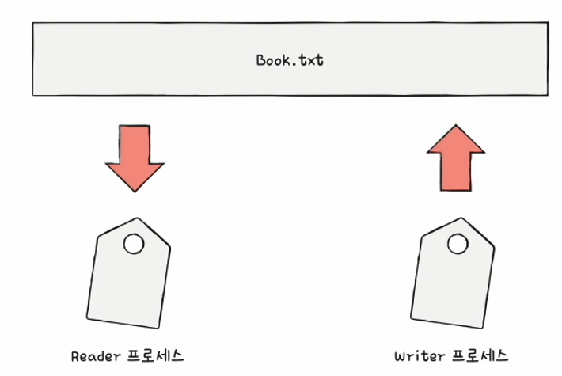

Reader와 Writer는 실행의 순서가 있기 때문에 아무렇게나 실행되어선 안된다.

Reader 프로세스는 'Book.txt 안에 값이 존재한다'는 특정 조건이 만족되어야함

<hr>

### 상호 배제를 위한 동기화 : Bank account problem

공유가 불가능한 자원의 동시 사용을 피하기 위한 동기화

한 번에 하나의 프로세스만 접근해야 하는 자원에 동시 접근을 피하기 위한 동기화

현재 계좌에 10만원이 있다고 가정

프로세스A : 현재 잔액에 2만원을 추가
프로세스B :현재 잔액에 5만원을 추가

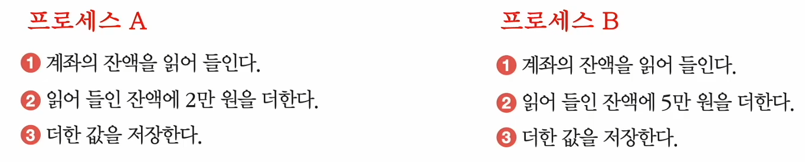

프로세스 A와 B가 동시에 실행됐다고 가정해 보자.

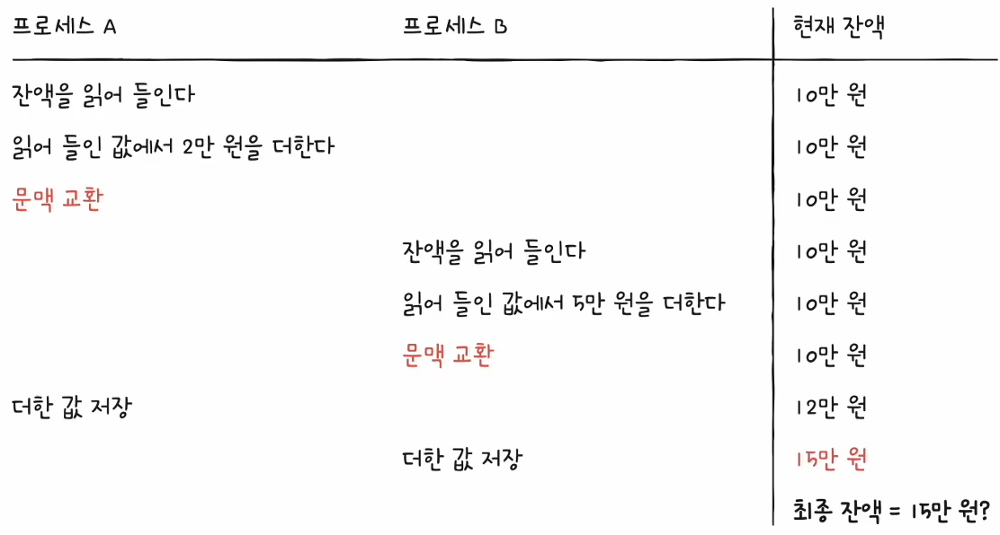

#### 동기화가 이루어진 경우

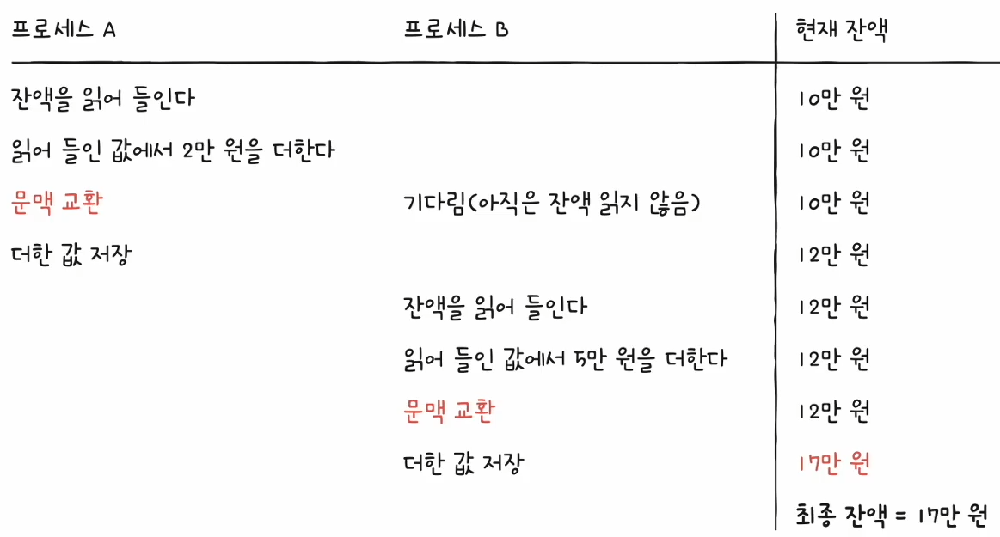

<hr>

### 생산자와 소비자 문제

물건을 계속해서 생산하는 생산자(producer)

물건을 계속해서 소비하는 소비자(consumer)

'총합' 변수 공유 하고있다고 가정

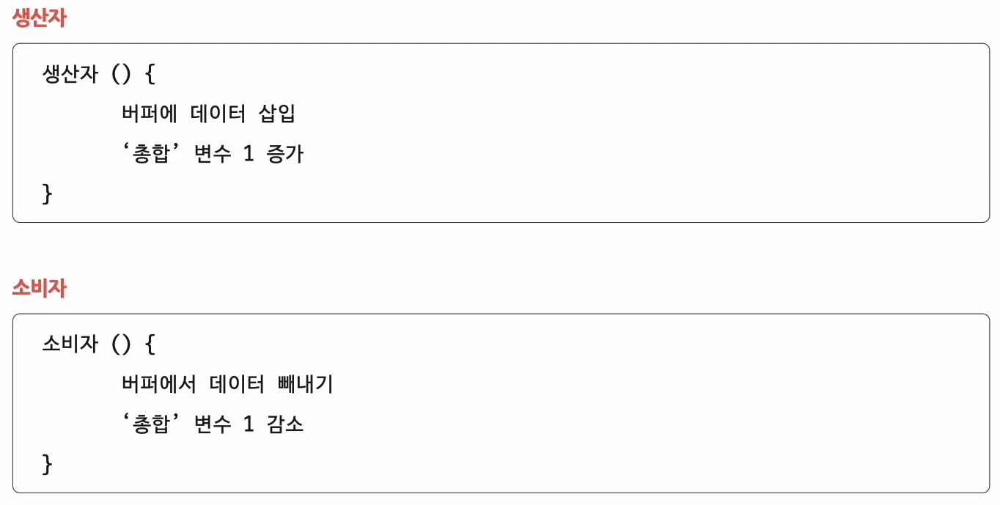

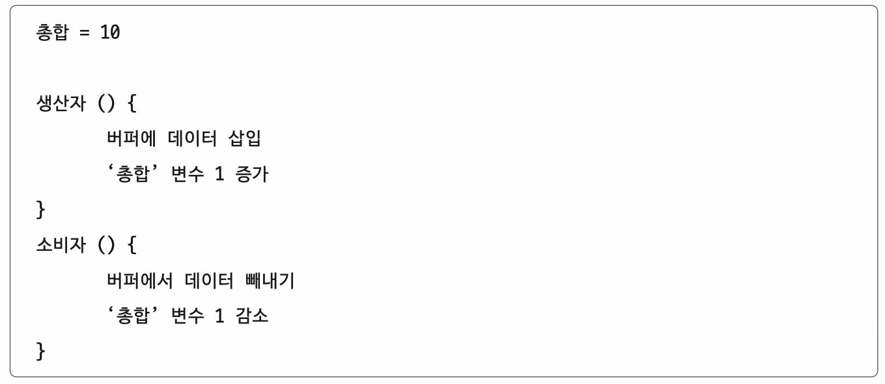

이 상태에서 생산자를 10만번, 소비자를 10만번을 실행하면 총합은?

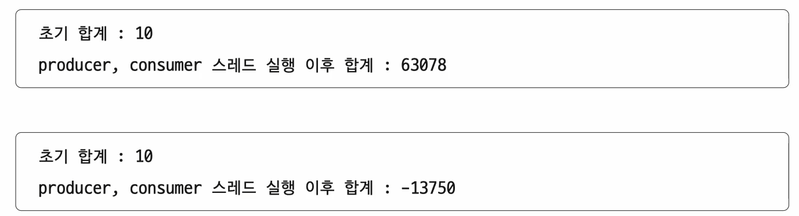

이러한 문제는 동시에 접근해서는 안 되는 자원에 동시에 접근했기에 발생한 문제이다.

동시에 접근하면 안되는 자원이란 무엇일까?

<hr>

### 공유자원과 임계 구역

#### 공유 자원 : 여러 프로세스 혹은 스레드가 공유하는 자원
- 전역 변수, 파일, 입출력장치

#### 임계 구역 : 동시에 실행하면 문제가 발생하는 자원에 접근하는 코드 영역
- '총합' 변수, '잔액' 변수

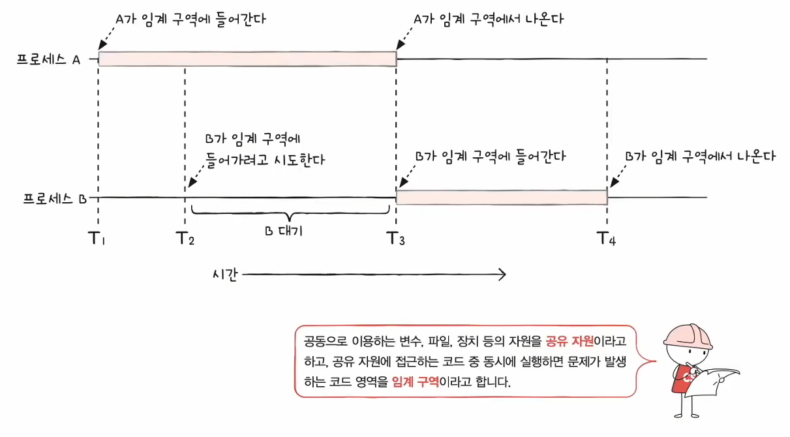

임계 구역에 동시에 접근하면 자원의 일관성이 깨질 수 있다. 이를 <u><strong>레이스 컨디션(race condition)</strong></u>이라고 한다.


#### 상호 배제를 위한 동기화를 위한 세 가지 원칙

1. 상호 배제 : 한 프로세스가 임계 구역에 진입했다면 다른 프로세스는 들어 올 수 없다.
2. 진행 : 임계 구역에 어떤 프로세스도 진입하지 않았다면 진입하고자 하는 프로세스는 들어갈 수 있어야 한다.
3. 유한 대기 : 한 프로세스가 임계 구역에 진입하고 싶다면 언젠가는 임계 구역에 들어올 수 있어야 한다.

<hr>

## 12 - 2 동기화 기법

동기화 기법 중 뮤텍스 락, 세마포, 모니터에 대해 알아보자.

### 뮤텍스 락
상호 배제를 위한 동기화 도구(자물쇠 역할)

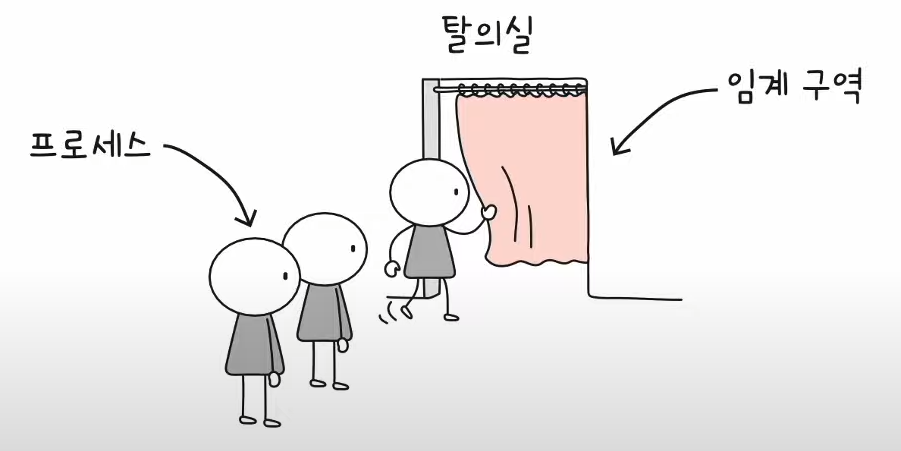

뮤텍스 락의 단순한 형태

- 자물쇠 역할 : 프로세스들이 공유하는 전역 변수 Lock
- 임계 구역을 잠그는 역할 : acquire 함수
- 임계 구역의 잠금을 해제하는 역할 : release 함수

acquire 함수
- 프로세스가 임계 구역에 진입하기 전에 호출
- 임계 구역이 잠겨 있다면
  - 임계 구역이 열릴 때 까지(Lock이 false가 될 때까지) 임계 구역을 반복적으로 확인
- 임계 구역이 열려 있다면
  - 임계 구역을 잠그기(Lock을 True로)

release 함수
- 임계 구역에서의 작업이 끝나고 호출
- 현재 잠긴 임계 구역을 열기(lock을 false로 바꾸기)

무한히 탈의실 문이 잠겨 있는지 반복하여 확인하는 것을 바쁜 대기라고 한다.

<hr>

### 세마포
- 뮤텍스 락과 비슷하지만 조금 더 일반화된 도구
- 공유자원이 여러 개 있는 경우에도 적용 가능
- 이진 세마포, 카운팅 세마포로 나뉘어짐 이 책에서는 카운팅 세마포를 다루고 있음

임계 구역 앞에서 멈춤 신호를 받으면 잠시 기다리기

임계 구역 앞에서 가도 좋다는 신호를 받으면 다시 움직임

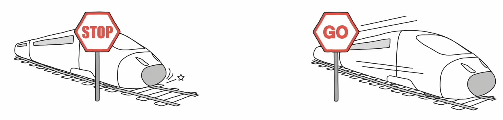

- 임계 구역에 진입할 수 있는 프로세스의 개수(공유 자원 개수)를 나타내는 전역 변수 S
- 임계구역에 들어가도 좋은지, 기다려야 할지를 알려주는 wait 함수
- 임계구역 앞에서 기다리는 프로세스에 '이제 가도 좋다'고 신호를 주는 signal 함수

```
wait()
// 임계구역
signal()
```

```
wait () {
    while ( S <= 0 )
    ;
    S--;
}
```
- 임계 구역에 진입할 수 있는 프로세스 개수가 0 이하라면
- 사용할 수 있는 자원이 있는지 반복적으로 확인
- 임계 구역에 진입할 수 있는 프로세스 개수가 하나 이상이면 S를 1 감소시키고 임계 구역 진입

```
signal () {
    S++
}
```
- 임계 구역에서의 작업을 마친 뒤 S를 1 증가시킨다.


#### Busy waiting
```
wait () {
    while ( S <= 0 ) // CPU 사이클 낭비
    ;
    S--;
}
```

해결방법
- 사용할 수 있는 자원이 없을 경우 대기 상태로 만든다.
- 사용할 수 있는 자원이 생겼을 경우 대기 큐의 프로세스를 준비 상태로 만듦

```
wait () {
    S--;
    if ( S < 0 ){
        add this proces to Queue;
        sleep();
    }
}
```
- 해당 프로세스 PCB를 대기 큐에 삽입한다.
- 대기 상태로 접어든다.

```
signal(){
    S++
    if ( S <= 0 ){
        remove a process p from Queue
        wakeup(p)
    }
}
```
- 대기 큐에 있는 프로세스 p를 제거한다.
- 프로세스 p를 대기 상태에서 준비 상태로 만든다.

<br>


매번 임계구역 앞뒤로 wait(), signal()을 호출해야하나?

실수시에 디버깅이 어렵다.

모니터의 등장

### 모니터
- 사용자(개발자)가 다루기에 편한 동기화 도구

#### 상호 배제를 위한 동기화
- 인터페이스를 위한 큐
- 공유자원에 접근하고자 하는 프로세스를 (인터페이스를 위한) 큐에 삽입
- 큐에 삽입된 순서대로 ( 한 번에 하나의 프로세스만 ) 공유 자원 이용

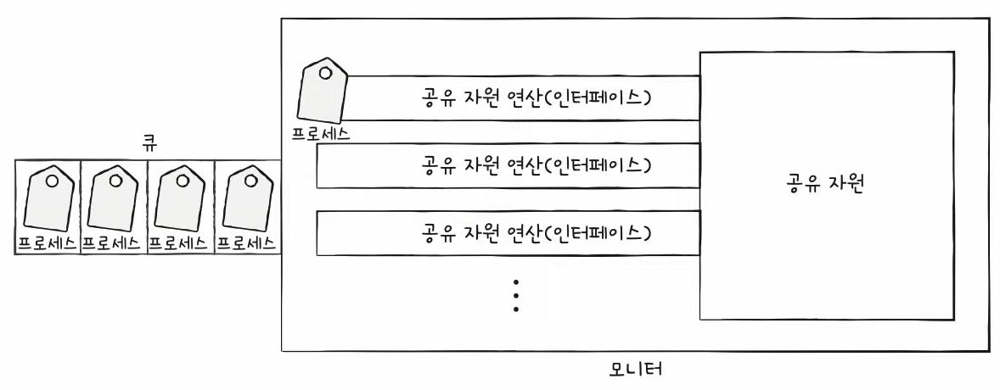

#### 실행 순서 제어를 위한 동기화
- 조건 변수이용 : 프로세스나 스레드의 실행 순서를 제어하기 위해 사용하는 특별한 변수

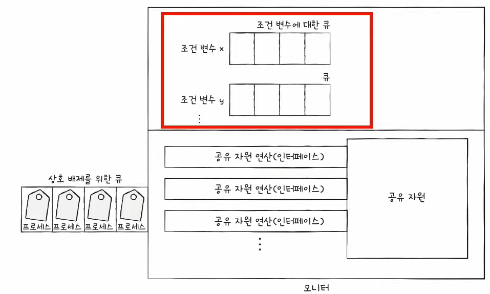

- 조건변수.wait() : 대기 상태로 변경, 조건 변수에 대한 큐에 삽입
- 조건변수.signal() : wait()으로 대기 상태로 접어든 조건변수를 실행 상태로 변경

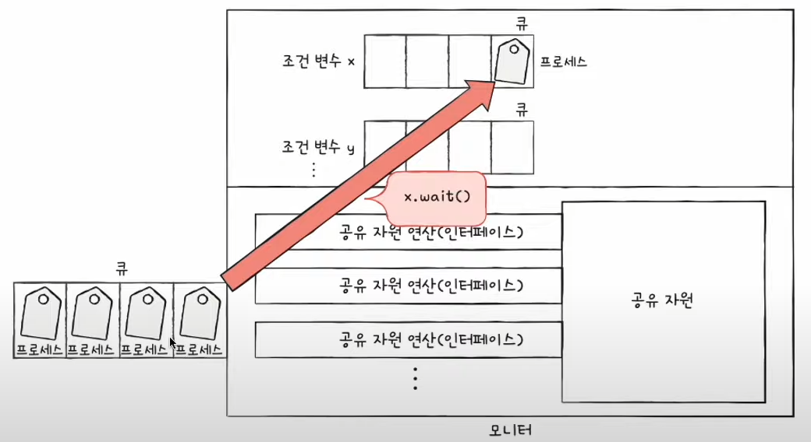

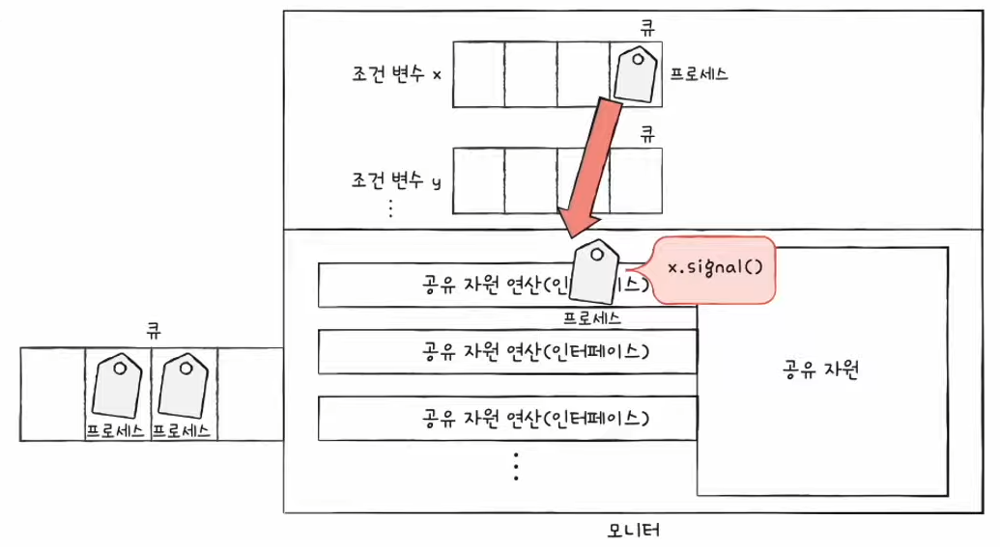

모니터 안에는 하나의 프로세스만이 있을 수 있다.
- wait()를 호출했던 프로세스는 signal()을 호출한 프로세스가 모니터를 떠난 뒤에 수행을 재개
- signal()을 호출한 프로세스의 실행을 일시 중단하고 자신이 실행된 뒤 다시 signal()을 호출한 프로세스의 수행을 재개