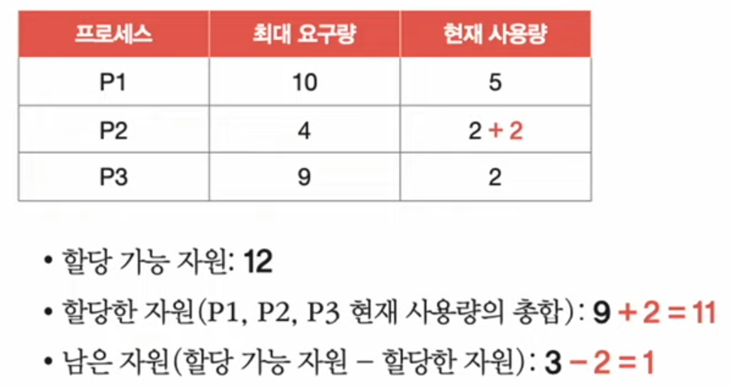

# Chapter 13. 교착 상태

## 13 - 1 교착 상태란?

### 식사하는 철학자 문제

식사를 하기위해서는 꼭 두 개의 포크를 사용해야한다.

모든 철학자가 밑과 같은 순서로 식사를 시작하게된다면 어떻게 될까?

1. 계속 생각을 하다가 왼쪽 포크가 사용 가능하면 집어든다.
2. 계속 생각을 하다가 오른쪽 포크가 사용 가능하면 집어든다.
3. 왼쪽과 오른쪽 포크를 모두 집어들면 정해진 시간동안 식사를 한다.
4. 식사 시간이 끝나면 오른쪽 포크를 내려놓는다.
5. 오른쪽 포크를 내려놓은 뒤 왼쪽 포크를 내려놓는다.
6. 다시 1번부터 반복한다.

#### 교착 상태를 해결하기 위해서는?
- 교착 상태가 발생했을 때의 상황을 정확히 표현하기

### 자원 할당 그래프

1. 프로세스는 원으로, 자원의 종류는 사각형으로 표현
2. 사용할 수 있는 자원의 개수는 자원 사각형 내에 점으로 표현

3. 프로세스가 어떤 자원을 할당 받아 사용 중이라면 자원에서 프로세스를 향해 화살표를 표시

4. 프로세스가 어떤 자원을 기다리고 있다면 프로세스에서 자원으로 화살표를 표시

교착 상태가 발생한 상황은 원의 형태를 띄고 있다.

### 교착 상태 발생 조건
- 상호 배제 : 한 프로세스가 사용하는 자원을 다른 프로세스가 사용할 수 없는 상태
- 점유와 대기 : 자원을 할당 받은 상태에서 다른 자원을 할당받기 기다리고 있는 상태
- 비선점 : 어떤 프로세스도 다른 프로세스의 자원을 강제로 빼앗지 못하는 상태
- 원형 대기 : 프로세스들이 원의 형태로 자원을 대기하는 상태

### 13 - 2 교착 상태 해결 방법

- 예방, 회피, 검출 후 회복

### 교착 상태 예방
- 애초에 교착 상태가 발생하지 않도록 하는 방법
- 교착 상태 발생 조건 중 하나를 없애버리기

#### 상호 배제를 없애면?
- 모든 자원을 공유하게 만든다.
- 현실적으로 모든 상호작용을 없앨 순 없기에 어렵다.

#### 점유와 대기를 없애면?
- 특정 프로세스에 자원을 모두 할당하거나, 아예 할당하지 않는 방식으로 배분
- 자원의 활용률이 낮은 단점이 있다.

#### 비선점 조건을 없애면?
- 선점이 가능한 자원에 한해 효과적
- 모든 자원이 선점 가능한 것은 아니다.

#### 원형 대기 조건을 없애면?
- 자원에 번호를 붙이고 오름차순으로 할당하면 원형 대기는 발생하지 않음
- 모든 자원에 번호를 붙이는 것은 어렵다.
- 어떤 자원에 어떤 번호를 붙이느냐에 따라 활용률이 달라진다.

### 교착 상태 회피
- 교착 상태를 무분별한 자원 할당으로 인해 발생했다고 간주
- 교착 상태가 발생하지 않을 만큼 조심 조심 할당하기
- 배분할 수 있는 자원의 양을 고려하여 교착 상태가 발생하지 않을 만큼만 자원 배분

#### 안전 순서열
- 교착 상태 없이 안전하게 프로세스들에 자원을 할당할 수 있는 순서

컴퓨터 시스템에 총 12개의 자원이 있다고 가정

프로세스 P1, P2, P3가 각각 5개, 2개, 2개의 자원을 할당받아 실행 중
- 운영체제가 배분할 수 있는 자원의 개수는 3개

프로세스 P1, P2, P3는 각각 최대 10개, 4개, 9개 자원을 요구할 수 있다고 가정

#### 최악의 상황을 가정해보자
- P1, P2, P3 모두 최대로 자원을 요구

### 교착 상태 검출 후 회복
- 교착 상태의 발생을 인정하고 사후에 조치하는 방식
- 프로세스가 자원을 요구하면 일단 할당, 교착 상태가 검출되면 회복
- 선점을 통한 회복, 프로세스 강제 종료를 통한 회복

#### 선점을 통한 회복
- 교착 상태가 해결될 때까지 한 프로세스씩 자원을 몰아주는 방식

#### 프로세스 강제 종료를 통한 회복
- 교착 상태에 놓인 프로세스 모두 강제 종료 > 작업 내역 잃을 위험
- 교착 상태가 해결될 때까지 한 프로세스씩 강제 종료 > 오버헤드