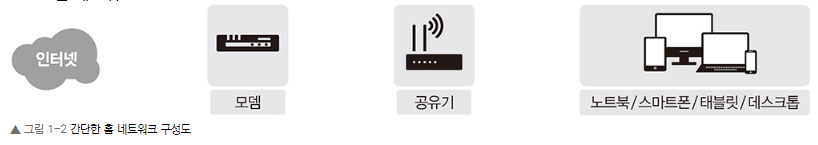
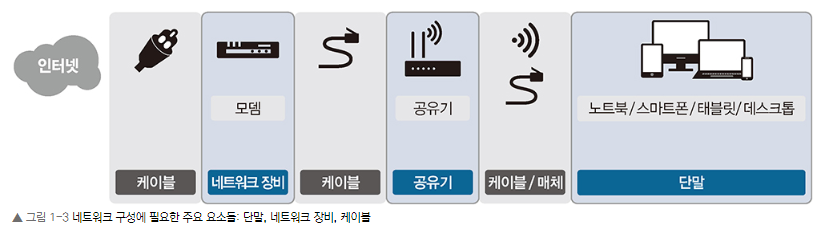
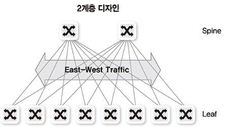
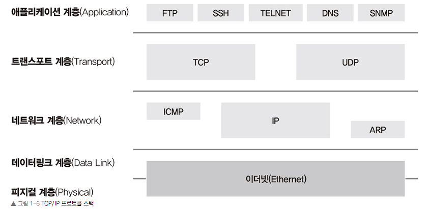
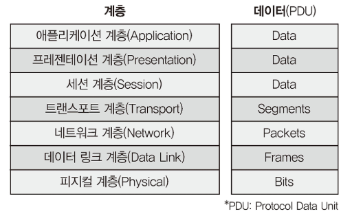
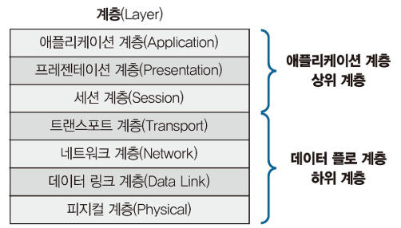
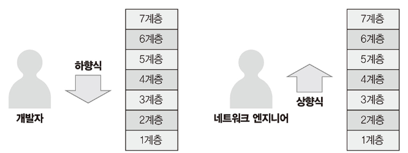
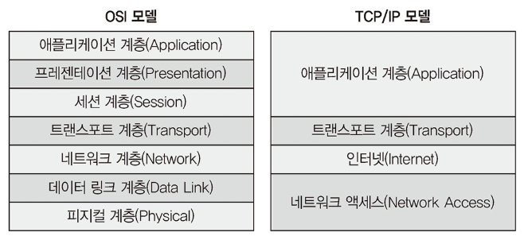
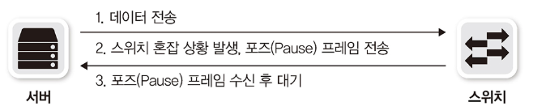
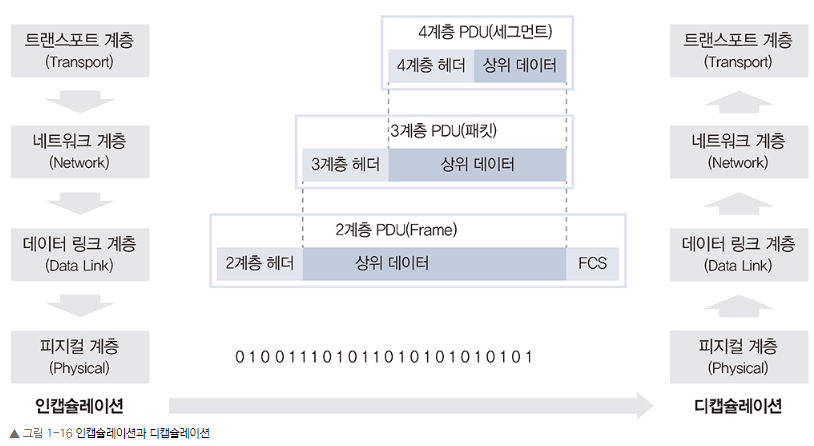

# Chatper 01. 네트워크 시작하기

### Chapter 1.1 네트워크 구성도 살펴보기

#### 1.1.1 홈 네트 워크

홈 네트워크 구성은 어떤 인터넷 회선을 연결하더라도 같다. 최근에는 대부분의 가정에서 공유기를 사용하고 있어 전문가가 아닌 일반 사용자도 손쉽게 홈 네트워크를 구성 할 수 있다.

홈 네트워크를 구성하는 모뎀, 공유기, 단말 간에 물리적 연결이 필요하다. 무선 연결은 무선 랜 카드와 무선 신호를 보낼 수 있는 매체(공기)가 필요하고 유선 연결은 유선 랜 카드(이더넷 랜 카드), 랜 케이블이 필요하다.

#### 1.1.2 데이터 센터 네트워크
데이터 센터 네트워크는 안정적이고 빠른 대용량 서비스 제공을 목표로 구성한다. 안정적인 서비스 제공을 위해 다양한 이중화 기술을 사용, 높은 통신량 수용 이를 위해 고속 이더넷 기술이 사용된다.

데이터 센터 구성은 기존에는 3계층 구성이 일반적이었지만 가상화 기술과 높은 대역폭을 요구하는 스케일 아웃 기반의 애플리케이션과 서비스가 등장하면서 2계층 구성인 스파인-리프(Spine_Leaf) 구조로 데이터 센터 네트워크가 변화하였다.

스파인-리프 구조는 서버 간 통신이 늘어나는 최근 트래픽 경향을 지원하기 위해 제안되었다. 

### Chapter 1.2 프로토콜

규정이나 규약과 관련된 내용을 언급할 때 프로토콜이라는 용어를 사용한다. 네트워크에서도 통신할 때의 규약을 프로토콜이라는 용어를 사용한다.

한정된 자원으로 통신을 수행해야 하다 보니 최대한 적은 데이터를 이용해 효율적인 프로토콜을 정의하고 사용해야 했다. 기존에는 적은 컴퓨팅 자원과 매우 느린 네트워크 속도를 이용했기 때문에 효율을 위해 2진수 비트기반으로 만들어졌다.

물리 애플리케이션 레벨의 프로토콜은 비트 기반이 아닌 문자 기반 프로토콜이 많이 사용되고 있다. HTTP, SMTP가 대표적

TCP/IP는 프로토콜이라고 부르지않고 프로토콜 스택이라고 부른다. 총 4개 부분으로 나뉜다.

### Chapter 1.3 OSI 7계층과 TCP/IP ★★★

네트워크 이해에는 OSI 7계층과 TCP/IP 스택의 공부가 필수이다.

#### 1.3.1 OSI 7계층
과거에는 통신용 규약이 표준화되지 않았고 각 벤더에서 별도로 개발했기 때문에 호환되지 않는 시스템이나 애플리케이션이 많아서 통신이 불가능했다. 

이를 하나로 규약으로 통합하려는 노력이 현재의 OSI 7계층으로 남아있다. 바로 이것이 네트워크의 주요 레퍼런스 모델로 활용되고 있지만 현재는 대부분의 프로토콜이 TCP/IP 프로토콜 스택 기반으로 되어있다.

OSI 7계층은 다시 두 가지 계층으로 나눌 수 있다.
- 1~4계층 : 데이터 플로 계층 / 하위 계층
- 5~7계층 : 애플리케이션 계층 / 상위 계층

계층 분류는 계층의 역할과 목표에 따른 것이다. 데이터 플로 계층은 데이터를 상대방에게 잘 전달하는 역할을 가지고있다. 애플리케이션 개발자는 애플리케이션 계층 프로토콜을 개발할 때 하위 데이터 플로계층을 고려하지 않고 데이터를 표현하는 데 초점을 맞춘다. 반면 네트워크 엔지니어는 이 부분에 대해서는 일반적으로 심각하게 고려하지 않는다. 이러한 이유로 애플리케이션 개발자는 하향식(Top-Down) 형식으로 네트워크를 바라보고 네트워크 엔지니어는 상향식(Bottom-Up) 형식으로 네트워크를 인식한다.

#### 1.3.2 TCP/IP 프로토콜 스택
현대 네트워크의 대부분은 TCP/IP와 이더넷으로 이루어져있다. 

TCP/IP는 4계층으로 구분되어있다. 상위 3개 계층을 하나의 애플리케이션 계층으로 묶고 1, 2계층 즉 물리 계층과 데이터 링크 계층을 하나의 네트워크 계층으로 구분하였다. 현실에 쉽게 반영하도록 간단히 구분하는 성향인것이다.

### Chapter 1.4 OSI 7계층별 이해하기

#### 1.4.1 1계층(피지컬 계층)
물리적 연결과 관련된 정보를 정의한다. 주로 전기 신호를 전달하는데 초점이 맞추어져 있다. 

1계층의 주요 장비(허브, 리피터, 케이블, 커넥터, 트랜시버, 탭) 허브, 리피터는 네트워크 통신을 중재하는 네트워크 장비이다. 케이블과 커넥터는 케이블 본체를 구성하는 요소이고 트랜시버는 컴퓨터의 랜카드와 케이블을 연결하는 장비이다. 탭은 네트워크 모니터링과 패킷 분석을 위해 전기 신호를 다른 장비로 복제해 준다.

전기 신호가 1계층 장비에 들어오면 이 전기 신호를 재생성하여 내보낸다. 주소의 개념이 없기 때문에 전기 신호가 들어온 포트를 제외하고 모든 포트에 같은 전기 신호를 전송한다.

#### 1.4.2 2계층(데이터 링크 계층)
전기 신호를 모아 우리가 알아볼 수 있는 데이터 형태로 처리한다. 출발지와 도착지 주소를 확인하고 내게 보낸 것이 맞는지, 또는 내가 처리해야 하는지에 대해 검사한 후 데이터 처리를 수행한다.

주소 체계가 생기면서 여러 통신이 한꺼번에 이루어지는 것을 구분하기 위한 기능이 주로 정의되어있다. 데이터에 대한 에러를 탐지 및 고치는 역할을 수행한다.

주소 체계가 생긴다는 것은 동시에 여려 명과 통신할 수 있다는 것이므로 받는 사람이 현재 데이터를 받을 수 있는지 확인하는 작업이 필요하다 이 것을 플로 컨트롤(Flow Control)이라고 한다.

2계층의 가장 중요한 특징은 MAC 주소라는 주소 체계가 있다는 점이다. 2계층에서 동작하는 네트워크 인터페이스 카드와 스위치 모두 MAC 주소를 이해할 수 있고 스위치는 MAC 주소를 보고 통신해야 할 포트를 지정해 내보내는 능력이 있다.

네트워크 인터페이스 카드에는 고유 MAC 주소가 있다. 입력되는 전기 신호를 데이터 형태로 만들고 데이터에서 도착지 MAC 주소를 확인한 후 자신에게 들어오는 전기 신호가 맞는지 확인한다. 자신에게 들어오는 전기 신호가 아니면 버리고 자신에게 들어오는 전기 신호가 맞으면 이 데이터를 상위 계층에서 처리할 수 있도록 메모리에 적재한다.

스위치는 단말이 어떤 MAC 주소인지, 연결된 포트는 어느 것인지 주소 습득 과정에서 알 수 있다. 이 데이터를 기반으로 단말들이 통신할 때 포트를 적절히 필터링하고 정확한 포트로 포워딩한다. 스위치의 적절한 필터링과 포워딩 기능으로 통신이 필요한 포트만 사용하고 네트워크 전체에 불필요한 처리가 감소하면서 이더넷 네트워크 효율성이 크게 향상되어 이더넷 기반 네트워크가 급증하는 계기가 되었다.

#### 1.4.3 3계층(네트워크 계층)
IP 주소와 같은 논리적인 주소가 정의된다. 데이터 통신을 할 때는 두가지 주소가 사용된다. 2계층의 물리적인 MAC 주소와 3계층의 논리적인 IP 주소이다.

MAC 주소와 달리 IP 주소는 사용자가 환경에 맞게 변경해 사용할 수 있고 네트워크 주소 부분과 호스트 주소 부분으로 나뉜다.

3계층에서 동작하는 장비는 라우터이다. 라우터는 3계층에서 정의한 IP 주소를 이해할 수 있다. 라우터는 IP 주소를 사용해 최적의 경로를 찾아주고 해당 경로로 패킷을 전송하는 역할을 한다.

#### 1.4.4 4계층(트랜스포트 계층)
하위 계층인 1, 2, 3계층은 신호와 데이터를 올바른 위치로 보내고 실제 신호를 잘 만들어 보내는 데 집중하였다면 4계층은 실제로 해당 데이터들이 정상적으로 잘 보내지도록 확인하는 역할을 한다.

패킷 네트워크는 데이터를 분할해 패킷에 실어보내다 보니 중간에 패킷이 유실되거나 순서가 바뀌는 경우가 생길 수 있다. 이 문제를 해결하기 위해 패킷이 유실되거나 순서가 바뀌었을 때 바로잡아 주는 역할을 4계층에 담당한다.

패킷을 분할할 때 패킷 헤더에 보내는 순서와 받는 순서를 적어 통신하여 바로 잡을 수 있다. 패킷에 보내는 순서를 명시한 것이 시퀀스 번호이고 받는 순서를 나타낸 것이 ACK 번호이다.

4계층에서 동작하는 장비로는 로드 밸런서와 방화벽이 있다. 애플리케이션 구분자(포트 번호)와 시퀀스, ACK 번호 정보를 이용해 부하를 분산시키거나 보안 정책을 수립해 패킷을 통과, 차단하는 기능을 수행한다.

#### 1.4.5 5계층(세션 계층)
양 끝단의 응용 프로세스가 연결을 성립하도록 도와주고 연결이 안정적으로 유지되도록 관리하고 작업이 완료 후에는 이 연결을 끊는 역할을 한다. "세션"을 관리하는 것이 주요 역할인 세션 계층은 TCP/IP 세션을 만들고 없애는 책임을 진다. 또한 에러로 중단된 토잇ㄴ에 대한 에러 복구와 재전송도 수행한다.

#### 1.4.6 6계층(프레젠테이션 계층)
시스템 간의 통신을 돕기 위해 하나의 통일된 구문 형식으로 변환시키는 기능을 수행한다. 일종의 번역기나 변환기 역할을 수행하는 계층이고 이런 기능은 사용자 시스템의 응용 계층에서 데이터의 형식상 차이를 다루는 부담을 덜어준다. MIME 인코딩이나 암호화, 압축, 코드 변환과 같은 동작이 이 계층에서 이루어진다.

#### 1.4.7 7계층(애플리케이션 계층)
애플리케이션 프로세스를 정의하고 애플리케이션 서비스를 수행한다.

네트워크 소프트웨어의 UI 부분이나 사용자 입, 출력 부분을 정의하는 것이 애플리케이션 계층의 역할이다. 대표적인 프로토콜로는 FTP, SMTP, HTTP, TELNET이 있다.

### Chapter 1.5 인캡슐레이션과 디캡슐레이션

상위 계층에서 하위 계층으로 데이터를 보내면 물리 계층에서 전기 신호 형태로 네트워크를 통해 신호를 보낸다. 받는 쪽에서는 다시 하위 계층에서 상위 계층으로 데이터를 보낸다. 

이렇게 데이터를 보내는 과정을 인캡슐레이션, 받는 과정을 디캡슐레이션이라고 부른다.

애플리케이션에서 데이터를 데이터 플로 계층(1~4계층)으로 내려보내면서 패킷에 데이터를 넣을 수 있도록 분할하는데 이 것을 인캡슐레이션이라고 부른다.

반대로 받는 쪽에서는 디캡슐레이션 과정을 수행한다. 

- 인캡슐레이션, 디캡슐레이션 과정을 통해 데이터가 전송되는 과정
- 각 계층 헤더를 이용해 송신자 계층과 수신자 계층 간의 논리적 통신 과정

데이터를 인캡슐레이션하는 과정에서 헤더에 넣는 정보들이 꽤 많아 모두 이해하기는 힘들다 그러나 이런 복잡한 정보들에도 규칙이 있으며 헤더에 두 가지 정보는 반드시 포함시켜야한다.
- 현재 계층에서 정의하는 정보
- 상위 프로토콜 지시자

상위 프토토콜 지시자를 정의하지않으면 어떤 상위 프로토콜로 올려보내 주어야 할지 결정할 수 없다.