# Chatper 03. 네트워크 통신하기

### Chapter 3.1 유니캐스트, 멀티캐스트, 브로드캐스트, 애니캐스트

네트워크에서 출발지에서 목적지로 데이터를 전송할 때 사용하는 통신 방식에는 유니캐스트(Unicast), 브로드캐스트(Broadcast), 멀티캐스트(Multicast), 애니캐스트(Anycast)가 있다. 

각 통신 방식에 대해서 자세히 알아보자.

#### 유니캐스트(Unicast)
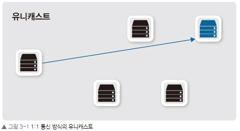
- 유니캐스트는 출발지와 목적지가 명확히 하나로 정해져 있는 1:1 통신 방식입니다. 실제로 사용하는 대부분의 통신은 유니캐스트 방식을 사용합니다.

#### 브로드캐스트(Broadcast)
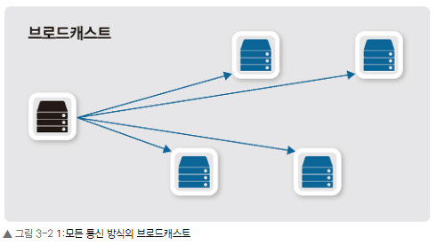
- 브로드캐스트는 목적지 주소가 모든으로 표기되어 있는 통신 방식입니다. 유니캐스트로 통신하기 전, 주로 상대방의 정확한 위치를 알기 위해 사용됩니다. 주소 체계에 따라 브로드캐스트를 다양하게 분류할 수 있지만 기본 동작은 로컬 네트워크 내에서 모든 호스트에 패킷을 전달해야 할 때 사용됩니다.

#### 멀티캐스트(Multicast)
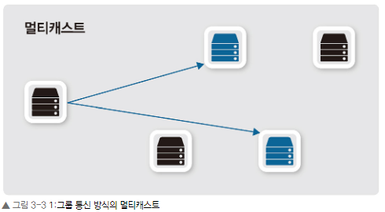
- 멀티캐스트는 멀티캐스트 그룹 주소를 이용해 해당 그룹에 속한 다수의 호스트로 패킷을 전송하기 위한 통신 방식입니다. IPTV와 같은 실시간 방송을 볼 때 이 멀티캐스트 통신 방식을 사용합니다. 사내 방송이나 증권 시세 전송과 같이 단방향으로 다수에게 동시에 같은 내용을 전달해야 할 때 사용됩니다.

#### 애니캐스트(Anycast)
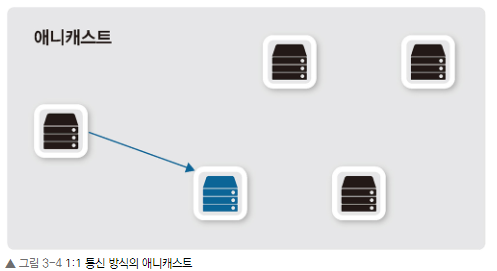
- 최종 통신은 1:1로 유니캐스트와 애니캐스트가 동일하지만 통신할 수 있는 후보자는 서로 다릅니다. 유니캐스트는 출발지와 목적지가 모두 한 대씩이지만 애니캐스트는 같은 목적지 주소를 가진 서버가 여러 대여서 통신 가능한 다수의 후보군이 있습니다. 

- 현재 주로 사용되는 네트워크 주소 체계는 IPv4 기반입니다. 일부 모바일 네트워크와 대규모 데이터 센터 위주로 새로운 IPv6 기반 주소 체계가 사용되고 있습니다. IPv6에서는 브로드캐스트가 존재하지 않고 링크 로컬 멀티캐스트로 대체되어 사용됩니다.

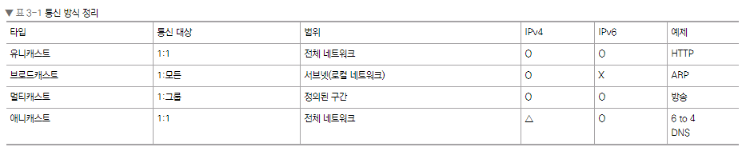

### Chapter 3.2 MAC 주소

MAC 주소는 Media Access Control의 줄임말로 2계층(데이터 링크 계층)에서 통신을 위해 네트워크 인터페이스에 할당된 고유 식별자이다. 이더넷과 와이파이를 포함한 대부분의 IEEE 802 네트워크 기술에서 2계층 주소로 사용된다. 네트워크에 접속하는 모든 장비는 MAC 주소라는 물리적인 주소가 있어야 하고 이 주소를 이용해 서로 통신하게 됩니다.

 

#### 3.2.1 MAC 주소 체계

모든 네트워크 장비 제조업체에서 장비가 출하될 때마다 MAC 주소를 할당하게 되는데 매번 이 주소의 할당 여부를 확인할 수 없으므로 한 제조업체에 하나 이상의 주소 풀을 주고 그 풀 안에서 각 제조업체가 자체적으로 MAC 주소를 할당합니다. 이렇게 네트워크 장비 제조업체에 주소 풀을 할당하는 것을 제조사 코드(Vendor Code)라고 부르며 이 주소는 국제기구인 IEEE가 관리합니다.

MAC 주소는 48비트의 16진수 12자리로 표현됩니다. 48비트의 MAC 주소는 다시 다음과 같이 앞의 24비트와 뒤의 24비트로 나누어 구분하는데 앞에서 언급한 ‘제조사 코드’가 MAC 주소 앞의 24비트인 ‘OUI’ 값입니다. 뒤의 24비트의 값인 ‘UAA’는 각 제조사에서 자체적으로 할당하여 네트워크에서 각 장비를 구분할 수 있게 해줍니다.

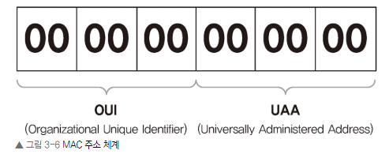

이렇게 MAC 주소는 각 네트워크 장비 제조업체 코드와 제조업체가 자체적으로 할당한 값으로 구성됩니다. 네트워크 카드나 장비를 생산할 때 하드웨어적으로 정해져 나오므로 MAC 주소를 BIA(Burned-In Address)라고도 부릅니다.

#### 3.2.2 MAC 주소 동작
NIC은 자신의 MAC 주소를 가지고 있고 전기 신호가 들어오면 2계층에서 데이터 형태(패킷)로 변환하여 내용을 구분한 후 도착지 MAC 주소를 확인합니다. 만약 도착지 MAC 주소가 자신이 갖고 있는 MAC 주소와 다르면 그 패킷을 폐기합니다. 패킷의 목적지 주소가 자기 자신이거나 브로드캐스트, 멀티캐스트와 같은 그룹 주소이면 처리해야 할 주소로 인지해 패킷 정보를 상위 계층으로 넘겨줍니다

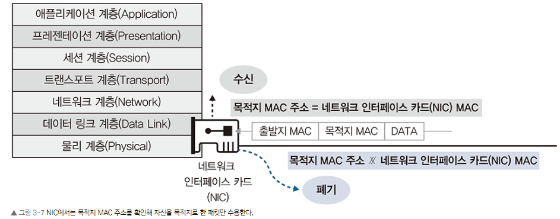

### 3.3 IP 주소
OSI 7계층에서 주소를 갖는 계층은 2계층과 3계층입니다. 2계층은 물리 주소인 MAC 주소를 사용하고 3계층은 논리 주소인 IP 주소를 사용합니다. 대부분의 네트워크가 TCP/IP로 동작하므로 IP 주소 체계를 이해하는 것이 네트워크 이해에 매우 중요합니다. 이번 장에서는 3계층 주소인 IP 주소에 대해 알아보겠습니다.

IP 주소를 포함한 다른 프로토콜 스택의 3계층 주소는 다음과 같은 특징이 있다.

1. 사용자가 변경 가능한 논리 주소입니다.

2. 주소에 레벨이 있습니다. 그룹을 의미하는 네트워크 주소와 호스트 주소로 나뉩니다.

 
#### 3.3.1 IP 주소 체계
우리가 흔히 사용하는 IP 주소는 32비트인 IPv4 주소입니다. IP는 v4, v6 두 체계가 사용되며 IPv6 주소는 128비트입니다. IPv4 주소를 표기할 때는 4개의 옥텟(Octet)이라고 부르는 8비트 단위로 나누고 각 옥텟은 “.”으로 구분합니다. 2계층의 MAC 주소가 16진수로 표기된 것과 달리 IP 주소는 10진수로 표기하므로 8비트 옥텟은 0~255의 값을 쓸 수 있습니다.

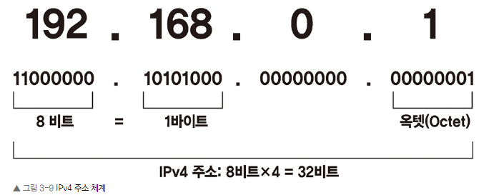

2계층 주소인 MAC 주소가 제조업체 코드인 OUI와 제조업체별 일련 번호인 UAA의 두 부분으로 나뉘는 것과 목적이 다르지만 3계층 주소인 IP 주소도 네트워크 주소와 호스트 주소 두 부분으로 나뉩니다.

• 네트워크 주소

호스트들을 모은 네트워크를 지칭하는 주소. 네트워크 주소가 동일한 네트워크를 로컬 네트워크라고 함.

• 호스트 주소

하나의 네트워크 내에 존재하는 호스트를 구분하기 위한 주소

IP 주소 체계는 필요한 호스트 IP 개수에 따라 네트워크의 크기를 다르게 할당할 수 있는 클래스(Class) 개념을 도입했습니다

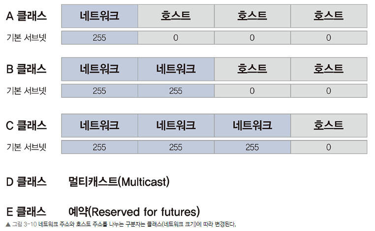

IP 주소가 도입한 클래스 개념은 다른 고정된 네트워크 주소 체계에 비해 주소를 절약할 수 있다는 장점이 있습니다. 네트워크의 크기가 모두 같은 경우, 큰 네트워크를 필요로 하는 조직은 네트워크를 여러 개 확보해야 하는 어려움이 있고 연속된 네트워크를 할당받기 어렵습니다. 작은 네트워크가 필요한 조직의 입장에서는 너무 많은 IP를 가져가므로 IP가 낭비됩니다.

A 클래스는 네트워크 주소를 표현하는 부분이 1개의 옥텟, 호스트 주소를 나타낼 수 있는 부분이 3개의 옥텟이기 때문에 28(256)개의 네트워크와 한 네트워크 당 224(16,777,216)개의 호스트 주소를 갖게 됩니다.

B 클래스는 네트워크 주소 부분이 2개의 옥텟, 호스트 주소가 2개의 옥텟이기 때문에 216(65,536) 개의 네트워크와 1개의 네트워크에 216(65,536)개의 IP를 가질 수 있습니다.

마지막으로 C 클래스는 세 번째 “.”에 네트워크 주소와 호스트 주소를 나누는 구분자가 있고 224(16,777,216)개의 네트워크와 1개의 네트워크 당 28(256)개의 호스트를 가질 수 있습니다.

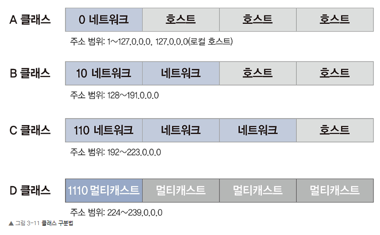

A, B, C 클래스는 맨 앞 옥텟의 주소만 보고 구분할 수 있는데 앞 옥텟의 주소가 0~127의 범위이면 이 주소는 A 클래스입니다. 첫 옥텟을 이진수로 표기했을 때 2진수 8자리 중 맨 앞 자리가 0인 주소가 A 클래스입니다. 좀 더 풀어서 설명하면 2진수로 첫 옥텟이 0 0000000~0 1111111인 주소가 A 클래스가 됩니다. 127만 예외로 자신을 의미하는 루프백(Loopback) 주소로 사용되므로 실제로 A 클래스로 사용할 수 있는 주소는 1.0.0.0~126.255.255.255까지입니다.

B 클래스는 첫 옥텟을 2진수로 표기했을 때 첫 번째 자리가 1이고 두 번째 자리가 0인 주소가 B 클래스입니다. 2진수로 첫 옥텟이 10 00000~10 111111인 수를 10진수로 표현하면 128부터 191까지이고 이 수를 갖는 IP는 B 클래스가 됩니다.

C 클래스는 첫 옥텟을 2진수로 표기했을 때 2진수 8자리 중 첫 번째, 두 번째 자리가 1이고 세 번째 자리가 0인 주소가 C 클래스입니다. 첫 옥텟이 110 00000~110 11111, 10진수로는 192~223까지 IP인 경우, C 클래스입니다.

클래스 기반의 네트워크 분할 기법은 과거에 사용했던 개념으로 현재는 위에서 설명한 것처럼 클래스 기반으로 네트워크를 분할하지 않습니다. 보다 네트워크 주소를 세밀하게 분할하고 할당하기 위해 필요한 네트워크의 크기에 맞추어 1비트 단위로 네트워크를 상세히 분할하는 방법을 사용합니다.

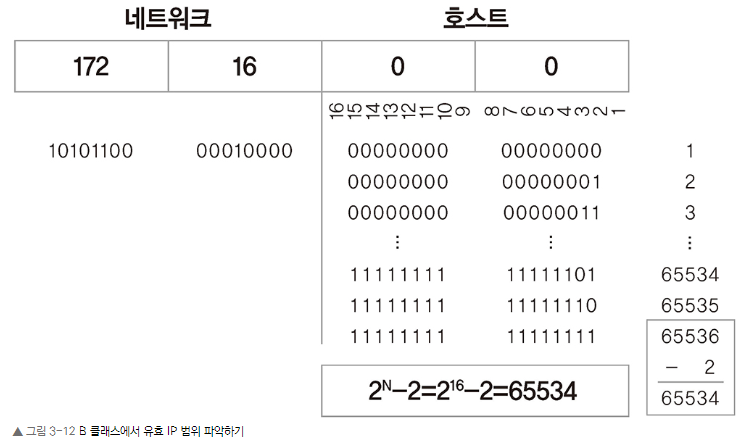

IP 네트워크에서는 네트워크 크기가 변경되므로 하나의 네트워크에서 사용 가능한 호스트 개수와 사용 가능한 유효 IP 범위를 파악하는 것이 중요합니다. 클래스 단위로 네트워크가 분할되는 경우, 우리가 쉽게 인지할 수 있는 10진수 형태로 표현되어 이해하는 데 큰 무리가 없지만 뒷장에서 다룰 클래스리스(Classless) 네트워크인 경우, 유효 IP 범위 파악이 매우 중요해집니다.

일반적으로 표현할 수 있는 모든 수의 개수는 진수자릿수 형태로 계산할 수 있습니다. 예를 들어 우리가 사용하는 10진수 4자리가 나타낼 수 있는 총 수는 104개입니다. 0000부터 9999까지 총 10,000개의 숫자를 표현할 수 있습니다.

IP는 2진수로 나타내므로 2자릿수 형태로 표현할 수 있는 IP 숫자를 구할 수 있습니다. 한 옥텟이 2진수 8자리이므로 A 클래스는 224개, B 클래스는 216개, C 클래스는 28개의 IP를 표현할 수 있습니다. 하지만 IP 체계에서 맨 앞의 숫자를 네트워크 주소로, 맨 뒤의 숫자를 브로드캐스트 주소로 사용하므로 실제로 사용할 수 있는 IP는 A 클래스는 224-2, B 클래스는 216-2, C 클래스는 28-2가 됩니다.

#### 3.3.2 클래스풀과 클래스리스
3.3.1 IP 주소 체계에서 설명한 클래스(Class) 기반의 IP 주소 체계를 클래스풀(Classful)이라고 부릅니다. IP 주소 체계를 처음 만들었을 때는 클래스 개념을 도입한 것이 확장성이 있고 주소 낭비가 적은 최적의 조건을 만들 수 있었던 좋은 선택이었습니다. 이 주소 체계에서는 네트워크 주소와 호스트 주소를 구분짓는 구분자(서브넷 마스크)가 필요없습니다. 맨 앞자리 숫자만 보면 자연스럽게 이 주소가 어느 클래스에 속해 있는지 구분할 수 있고 주소 구분자를 적용할 수 있었습니다.

#### 3.3.2.1 클래스리스 네트워크의 등장

인터넷이 상용화되면서 인터넷에 연결되는 호스트 숫자가 폭발적으로 증가했다. 기존 클래스풀 기반의 주소 체계는 확장성과 효율성을 모두 잡는 좋은 주소 체계였지만 기하급수적으로 늘어나는 IP 주소 요구를 감당하기에는 너무 부족했습니다. IP 주소 부족과 낭비 문제를 해결하기 위해 3가지 보존, 전환전략을 만들어냄 

첫 번째 단기 대책은 클래스리스, CIDR(Classless Inter-Domain Routing) 기반의 주소 체계. 

두 번째 중기 대책은 NAT와 사설 IP 주소, 

세 번째 장기 대책은 차세대 IP인 IPv6

IPv4의 가장 큰 문제는 주소 자체의 부족도 있지만 상위 클래스(A Class)를 할당받은 조직에서 이 주소들을 제대로 사용하지 못하면서 낭비하는 것이었습니다. 인터넷 초창기에 여러 회사에서 미래를 위해 IP를 많이 확보할 수 있는 A 클래스를 할당받았지만 실제로는 수천, 수만 개만 사용하는 곳이 대부분이었고 나머지 수천만 개의 IP는 사용되지 못했습니다. 클래스풀에서는 한 개의 클래스 네트워크가 한 조직에 할당되면 아무리 비어 있는 주소라도 IP를 분할해 다른 기관이 사용하도록 할 수 없습니다. 이 문제를 해결하기 위해 클래스 개념 자체를 버리는데 이를 클래스리스라고 부릅니다. 현재 우리가 사용하는 주소 체계는 클래스 개념을 적용하지 않는 클래스리스 기반 주소 체계입니다.

클래스리스 네트워크에서는 별도로 네트워크와 호스트 주소를 나누는 구분자를 사용해야 하는데 이 구분자를 서브넷 마스크(Subnet Mask)라고 부릅니다.

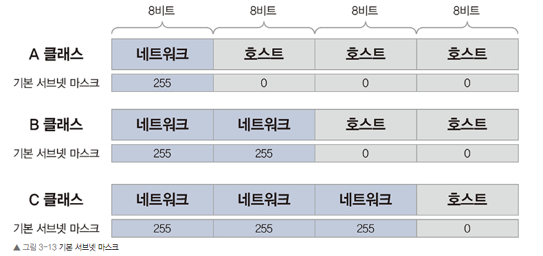

서브넷 마스크는 IP 주소와 네트워크 주소를 구분할 때 사용하는데 2진수 숫자 1은 네트워크 주소, 0은 호스트 주소로 표시합니다. 보통 우리가 편하게 받아들일 수 있는 10진수를 사용해 255.0.0.0 255.255.0.0 255.255.255.0와 같이 표현합니다. 2진수 11111111을 10진수로 표현하면 255가 되어 255는 네트워크 주소 부분, 0은 호스트 주소 부분으로 구분됩니다.

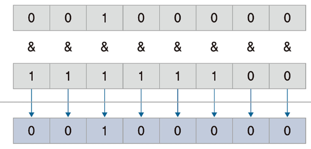

만약 103.9.32.146 주소에 255.255.255.0 서브넷 마스크를 사용하는 IP는 네트워크 주소가 103.9.32.0이고 호스트 주소는 0.0.0.146이 됩니다. 서브넷 마스크가 2진수 1인 부분(10진수 255인 부분)은 IP 숫자가 그대로 연산 결과가 되고 서브넷 마스크가 0인 부분은 모두 0으로 변경됩니다.

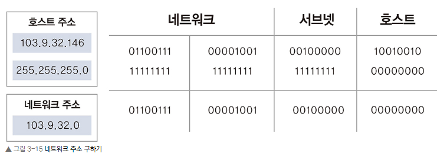

#### 3.3.3 서브네팅

원래 부여된 클래스의 기준을 무시하고 새로운 네트워크-호스트 구분 기준을 사용자가 정해 원래 클래스풀 단위의 네트워크보다 더 쪼개 사용하는 것을 서브네팅(Subnetting)이라고 합니다. 부여된 주소를 다시 잘라 사용해 서브네팅이라고 부르는데 현대 클래스리스 네트워크의 가장 큰 특징입니다. 옥텟 단위로 구분되는 서브네팅은 이해와 운영이 쉽지만 실제로는 옥텟 단위보다 더 잘게 네트워크를 쪼개 2진수의 1비트 단위로 네트워크를 분할하므로 서브네팅을 이해하기 어렵습니다. 특히 IP 네트워크를 처음 접하는 사람들은 네트워크 체계를 이해하는 데 가장 큰 장애물로 서브네팅을 꼽습니다.

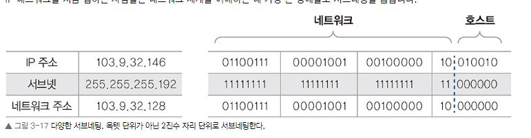

실무에서 서브네팅에 대해 고민해야 하는 경우는 두 가지입니다. 네트워크 디자인 단계에서 네트워크 설계자가 네트워크를 효율적으로 어떻게 분할할 것인지 계획하는 경우와 이미 분할된 네트워크에서 사용자가 자신의 네트워크와 원격지 네트워크를 구분해야 하는 경우입니다. 상황에 따라 고려해야 할 요소와 범위가 달라집니다.

• 네트워크 사용자 입장

네트워크에서 사용할 수 있는 IP 범위 파악

기본 게이트웨이와 서브넷 마스크 설정이 제대로 되어 있는지 확인

• 네트워크 설계자 입장

네트워크 설계 시 네트워크 내에 필요한 단말을 고려한 네트워크 범위 설계

#### 3.3.3.1 네트워크 사용자의 서브네팅

네트워크 사용자는 이미 설계되어 있는 네트워크에서 사용할 수 있는 IP 주소 범위를 파악해야 합니다. 주어진 네트워크 범위 밖의 IP를 할당하거나 서브넷 마스크를 잘못 입력하면 로컬 네트워크의 특정 범위에 속해있는 단말과 통신에 문제가 생기거나 외부 네트워크 전체에 통신하지 못하는 상황이 발생합니다. 기존 클래스 단위처럼 옥텟 단위의 네트워크를 사용할 경우, 모든 수가 10진수 단위로 표현되므로 관리자나 사용자가 이해하기 쉽지만 대부분의 서브네팅은 비트 단위로 분할되므로 이런 환경에 속해 있을 경우, 어떤 IP 범위가 내가 속한 네트워크이고 어떤 IP 범위가 원격지 네트워크인지 판단하기 어렵습니다.

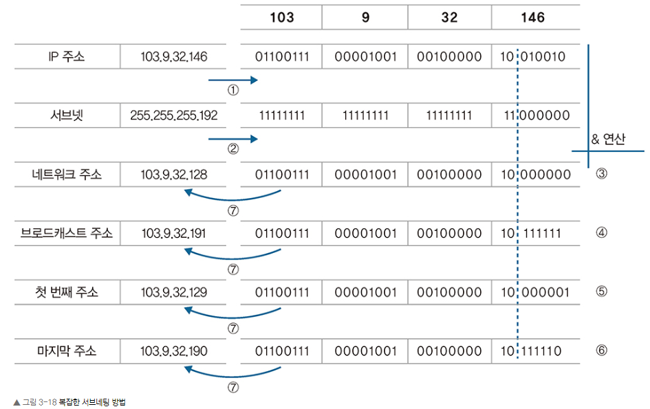

IP 주소 체계는 컴퓨터가 처리하므로 2진수로 되어 있습니다. 2진수에 익숙하거나 서브네팅이 옥텟 단위로 되어 있는 경우, 암산으로 내가 속한 네트워크 크기와 IP 범위를 쉽게 알아낼 수 있지만 그림 3-18처럼 1비트 단위로 서브네팅된 경우, 유효한 네트워크 범위를 알아내기 어렵습니다. 일반적으로 자신이 속한 네트워크의 유효 범위를 파악하는 방법은 다음과 같습니다.

1. 내 IP를 2진수로 표현한다.

2. 서브넷 마스크를 2진수로 표현한다.

3. 2진수 AND 연산으로 서브네팅된 네트워크 주소를 알아낸다.

4. 호스트 주소 부분을 2진수 1로 모두 변경해 브로드캐스트 주소를 알아낸다.

5. 유효 IP 범위를 파악한다. 서브네팅된 네트워크 주소+1은 유효 IP 중 가장 작은 IP이다.

6. 브로드캐스트 주소-1은 유효 IP 중 가장 큰 IP이다.

7. 2진수로 연산되어 있는 결괏값을 10진수로 변환한다

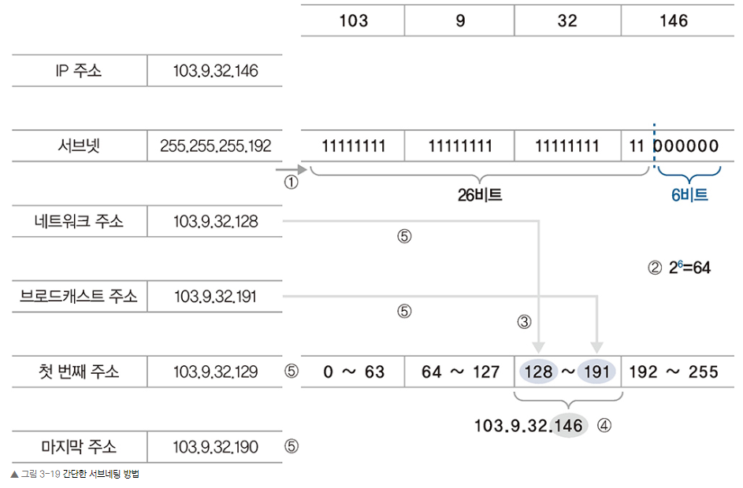

1. 서브넷 마스크를 2진수로 변환한다.

2. 현재의 서브넷이 가질 수 있는 최대 IP 개수 크기를 파악한다. 26=64

3. 64의 배수로 나열하여 기준이 되는 네트워크 주소를 파악한다. 첫 블록은 0부터 시작한다. 각 네트워크의 마지막 주소가 브로드캐스트 주소가 된다. 이 주소는 다음 블록 네트워크 주소의 -1 수이다.

- 0~63/64~127/128~191/192~255

4. 103.9.32.146에서 호스트 주소 146이 속한 네트워크를 선택한다.

- 128~191

5. 필요한 주소를 정리한다.

- 네트워크 주소: 103.9.32.128(첫 번째 숫자)

- 브로드캐스트 주소: 103.9.32.191(마지막 숫자)

- 유효 IP 범위: 103.9.32.129 ~ 103.9.32.190(네트워크 주소와 브로드캐스트 주소 사이)

#### 3.3.3.2 네트워크 설계자 입장

두 번째는 네트워크 설계자의 입장에서 서브넷 마스크에 대해 고려해야 할 내용을 다루어보겠습니다. 네트워크를 새로 구축하는 경우, 네트워크 사용자와 반대로 설계자는 서브넷 마스크가 지정되어 주어지는 것이 아니라 네트워크의 크기를 고민해 서브넷 마스크를 결정하고 설계에 반영해야 합니다. 네트워크 설계자가 IP를 설계할 때 고민해야 할 부분은 다음과 같습니다.

• 서브넷된 하나의 네트워크에 IP를 몇 개나 할당해야 하는가?(또는 PC는 몇 대나 있는가?)

• 그리고 서브넷된 네트워크가 몇 개나 필요한가?

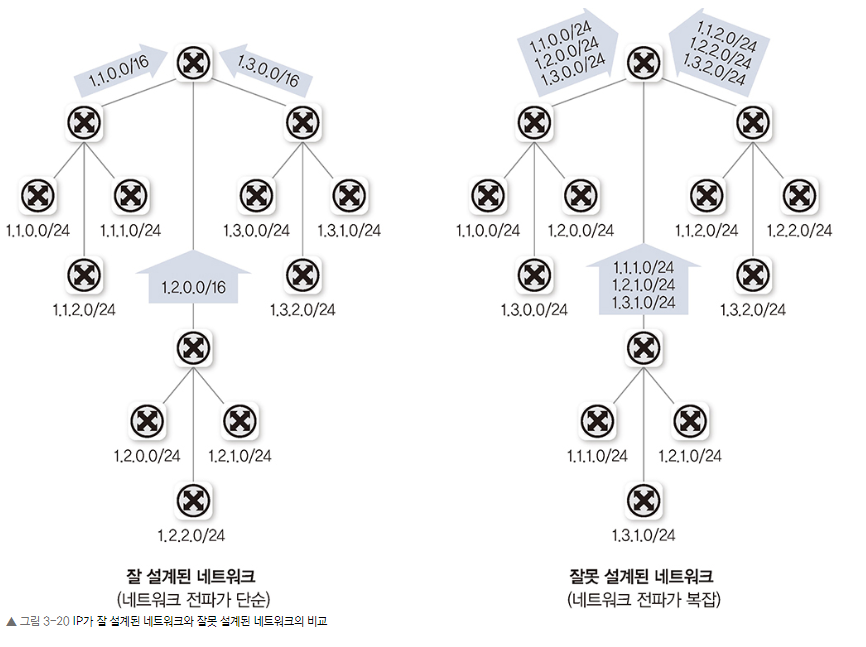

잘 설계된 왼쪽 네트워크는 네트워크 전체의 성능이 향상되고 관리가 편해지는 반면, IP 주소가 낭비됩니다. 왼쪽 라우터에 10.1.0.0/16 네트워크가 할당되었지만 실제로 사용하는 네트워크가 3개밖에 없을 경우, 나머지 253개 네트워크를 다른 곳에서 사용하지 못하므로 주소가 낭비될 수 있습니다. 그래서 잘 설계된 네트워크를 디자인하려면 IP를 여유있게 사용할 수 있는 사설 IP 대역으로 네트워크를 설계해야 합니다.

#### 3.3.4 공인 IP와 사설 IP
인터넷에 접속하려면 IP 주소가 있어야 하고 이 IP는 전 세계에서 유일해야 하는 식별자입니다. 이런 IP 주소를 공인 IP라고 합니다. 하지만 인터넷에 연결하지 않고 개인적으로 네트워크를 구성한다면 공인 IP 주소를 할당받지 않고도 네트워크를 구축할 수 있습니다. 이때 사용하는 IP 주소를 사설 IP 주소라고 합니다. 인터넷에 접속하려면 통신사업자로부터 IP 주소를 할당받거나 IP 할당기관(한국의 경우, KISA)에서 인터넷 독립기관 주소(Autonomous System Number, ASN)를 할당받은 후 독립 IP를 할당받아야 하므로 절차가 복잡합니다. 인터넷에 접속하지 않거나 NAT(Network Address Translation, 네트워크 주소 변환) 기술을 사용할 경우(공유기나 회사 방화벽을 사용하는 경우)에는 사설 IP 주소를 사용할 수 있습니다. 이 주소들은 인터넷 표준 문서인 RFC에 명시되어 있습니다. 사설 IP를 사용하면 인터넷에 직접 접속하지 못하지만 IP를 변환해주는 NAT 장비에서 공인 IP로 변경한 후에는 인터넷 접속이 가능합니다. 가정에서 많이 사용하는 공유기는 NAT 장비의 역할을 하는 대표적인 예입니다.

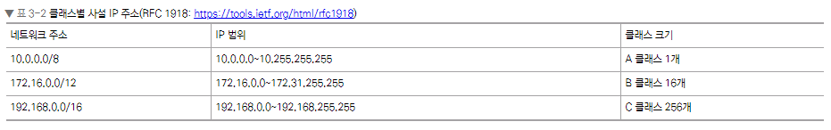

아래 그림의 C 회사처럼 20.0.0.0/24 네트워크로 회사 내부의 사설 IP를 할당한 경우, NAT를 거쳐 공인 IP로 아무리 변환되더라도 실제 인터넷 구간에 존재하는 A 회사의 20.0.0.0/24 네트워크로는 통신이 불가능합니다. C 회사의 20.0.0.10 서버에서 인터넷에서 서비스하는 A 회사의 20.0.0.20 서버로 접근을 시도할 경우, C 회사의 서버는 A 회사의 서버가 같은 네트워크에 존재하는 것으로 인식하고 A 회사 서버인 20.0.0.20과 통신하기 위해 브로드캐스트합니다. 실제로 A 회사와 C 회사는 인터넷 구간을 거쳐 통신해야 하므로 원격지와 통신 시도를 서로 인식해야만 정상적인 통신이 가능하지만 현재 네트워크 구조에서는 같은 네트워크로 인식하므로 정상적인 통신이 불가능합니다.

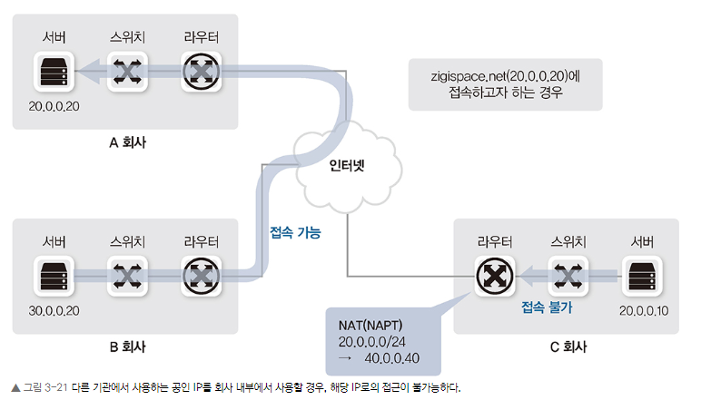