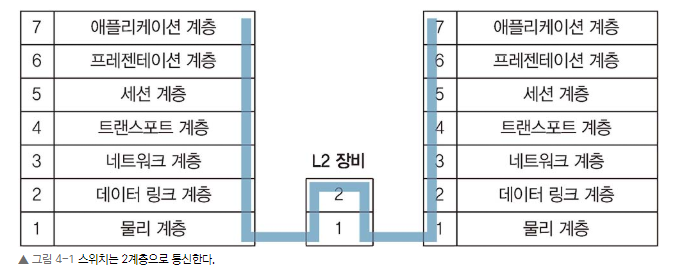
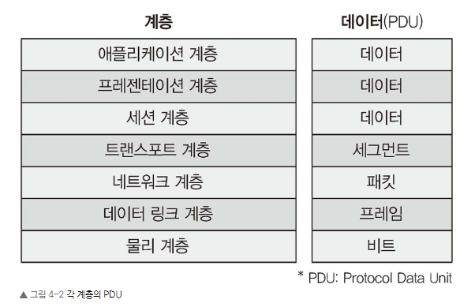
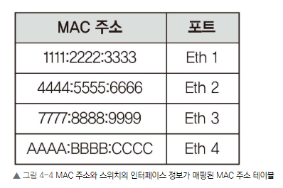
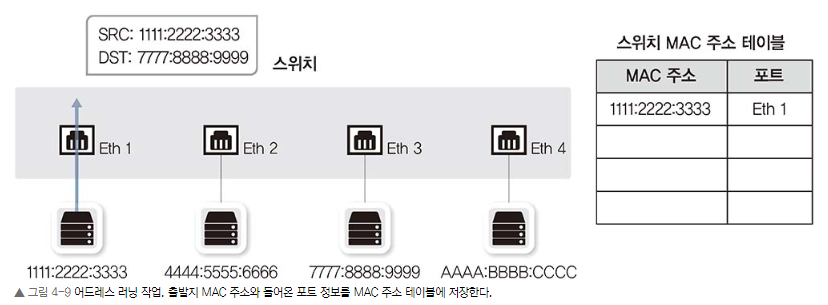
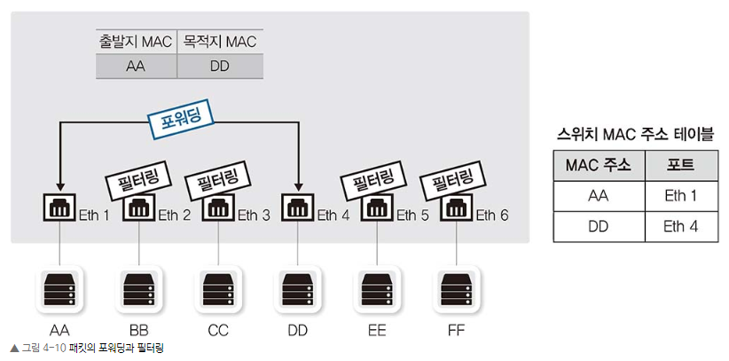
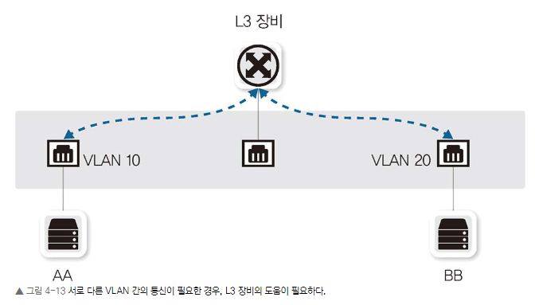
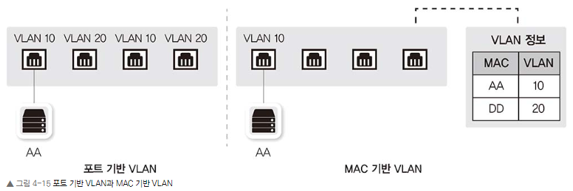
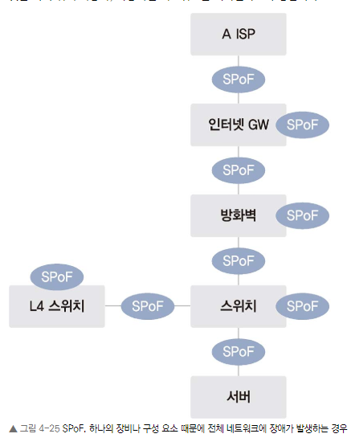
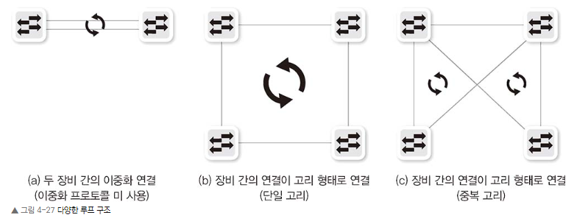
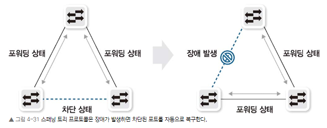

# Chatper 04. 스위치: 2계층 장비

### Chapter 4.1 스위치 장비 동작

네트워크의 가장 핵심장비인 스위치는 2계층 주소인 MAC 주소를 기반으로 동작한다. 이번장에서 스위치가 어떻게 MAC 주소를 이해하고 활용하는지 알아보자.

스위치는 네트워크 중간에서 패킷을 받아 필요한 곳에만 보내주는 네트워크 중재자 역할을 한다.

스위치의 패킷 처리를 위한 필수 기능에 대해서 다뤄보자.

참고 : 각 계층마다 패킷을 뜻하는 것이 다르다.

스위치가 없던 이더넷 네트워크에서는 패킷을 전송할 때 서로 경합해 그로 인한 네트워크 성능 저하가 컸다. 이런 경쟁을 없애고 패킷을 동시에 여러 장비가 서로 간섭 없이 통신하게 도와주는것이 스위치이다.

스위치의 핵심 역할은 누가 어느 위치에 있는지 파악하고 실제 통신이 시작되면 자신이 알고 있는 위치로 패킷을 정확히 전송하는 것이다. 이 행위가 가능한 이유는 2계층 주소를 이해하고 단말의 주소인 MAC 주소와 단말이 위치하는 인터페이스 정보를 매핑한 MAC 주소 테이블을 갖고 있어서 가능하다.

### 스위치의 동작 방식 3가지
1. 플러딩(Flooding)
2. 어드레스 러닝(Address Learning)
3. 포워딩/필터링(Forwarding/Filtering)

#### 4.1.1 플러딩
스위치 부팅시 네트워크 관련 정보가 아무 것도 없기 때문에 자신의 역할을 하지 못하고 허브처럼 동작한다. 허브는 패킷이 들어온 포트를 제외하고 모든 포트로 패킷을 전달한다. 이 처럼 허브와 같이 모든 포트로 패킷을 흘리는 동작 방식을 플러딩이라고 한다.

스위치는 패킷이 들어오면 MAC 주소 테이블에서 해당 MAC 주소가 있는지 확인한다. 만약 매칭되는 목적지 MAC 주소 정보가 없다면 모든 포트에 같은 내용의 패킷을 전달하는 것이다.

이런 플러딩 동작은 정상적인 동작이지만 이런 동작이 많아지면 스위치가 제 역할을 못하게 된다. 패킷이 스위치에 들어오면 해당 패킷 정보의 MAC 주소를 보고 이를 학습해 MAC 주소 테이블을 만든 후 이를 통해 패킷을 전송한다.

#### 4.1.2 어드레스 러닝
스위치의 동작을 정상 수행하기 위해서는 MAC 주소 테이블을 만들고 유지해야 한다. 이런 MAC 주소 테이블을 만들고 유지하는 과정을 어드레스 러닝이라고 한다.

어드레스 러닝은 출발지의 MAC 주소 정보를 사용하므로 브로드캐스트나 멀티캐스트에 대한 MAC 주소를 학습할 수 없다. 두 가지 목적지 MAC 주소 필드에서만 사용하기 때문이다.

#### 4.1.3 포워딩/필터링

스위치의 동작은 매우 간단하다. 패킷이 스위치에 들어온 경우, 도착지 MAC 주소를 확인하고 자신이 가진 MAC 테이블과 비교해 맞는 정보가 있으면 매치되는 해당 포트로 패킷을 포워딩한다. 이때 다른 포트로는 해당 패킷을 보내지 않으므로 이 동작을 필터링이라고 한다.

스위치는 일반적으로 유니캐스트에 대해서만 포워딩과 필터링 작업을 수행한다.

### 4.2 VLAN

지난 20년간 가상화는 IT 트렌드에서 많은 비중을 차지하는 키워드 중 하나였다. 네트워크에서도 다양한 가상화 기술이 쓰이고 있는데 스위치는 VLAN이라는 가상화 기술을 사용해왔다. 하나의 물리 스위치에서 여러 개의 네트워크를 나누어 사용할 수 있는 VLAN에 대해서 알아보자.

#### 4.2.1 VLAN이란?
VLAN은 물리적 배치와 상관없이 LAN을 논리적으로 분할, 구상하는 기술이다. VLAN을 나누면 하나의 장비를 서로 다른 네트워크를 갖도록 논리적으로 분할한 것이므로 유니캐스트뿐만 아니라 브로드캐스트도 VLAN 간에 통신할 수 없다. VLAN간의 통신을 하기 위해서는 3계층 장비가 필요하다.

#### 4.2.2 VLAN의 종류와 특징
VLAN 할당 방식에는 포트 기반의 VLAN과 MAC 주소 기반의 VLAN이 있습니다. VLAN 개념이 처음 도입되었을 때는 스위치가 고가였고 여러 허브를 묶는 역할을 스위치가 담당했으므로 스위치를 분할해 여러 네트워크에 사용하는 것이 VLAN 기능을 적용하는 목적이었습니다.

스위치를 논리적으로 분할해 사용하는 것이 목적인 VLAN을 포트 기반 VLAN이라고 부르고 우리가 일반적으로 언급하는 대부분의 VLAN은 포트 기반 VLAN이다.

사용자들의 자리 이동이 많아지면서 MAC 기반 VALN이 개발되었다. 스위치의 고정 포트에 VLAN을 할당하는 것이 아니라 스위치에 연결되는 단말의 MAC 주소를 기반으로 VLAN을 할당하는 기술이다. 단말이 연결되면 단말의 MAC 주소를 인식한 스위치가 해당 포트를 지정된 VLAN으로 변경합니다. 단말에 따라 VLAN 정보가 바뀔 수 있어 다이나믹 VLAN(Dynamic VLAN)이라고도 부릅니다.

#### 4.2.3 VLAN 모드(Trunk/Access) 동작 방식

포트 기반 VLAN에서는 스위치의 각 포트에 각각 사용할 VLAN을 설정하는데 한 대의 스위치에 연결되더라도 서로 다른 VLAN이 설정된 포트 간에는 통신할 수 없습니다. VLAN이 다르면 별도의 분리된 스위치에 연결된 것과 같으므로 VLAN 간 통신이 불가능합니다. 서로 다른 VLAN 간 통신을 위해서는 3계층 장비를 사용해야 합니다. VLAN으로 구분된 네트워크에서는 브로드캐스트인 ARP 리퀘스트가 다른 VLAN으로 전달될 수 없으므로 3계층 장비를 이용해 통신해야 합니다.

### 4.3 STP

IT 환경에서는 SPoF로 인한 장애를 피하기 위해 다양한 노력을 한다. SPoF란 하나의 시스템이나 구성 요소에서 고장이 발생했을 때 전체 시스템의 작동이 멈추는 요소를 말한다. 네트워크에서도 하나의 장비 고장으로 전체 네트워크가 마비되는 것을 막기 위해 이중화, 다중화된 네트워크를 디자인하고 구성한다.

이런 SPoF를 피하기 위해 스위치 두 대로 네트워크를 디자인하지만 두 대 이상의 스위치로 디자인하면 패킷이 네트워크를 따라 계속 전송되므로 네트워크를 마비시킬 수 있다. 이런 상황을 네트워크 루프라고 한다.

#### 4.3.1 루프란?
네트워크에 연결된 모양이 고리처럼 되돌아오는 형태로 구성된 상황 루프가 발생했다면 대부분 브로드캐스트 스톰으로 인한 문제이다.

#### 4.3.1.1 브로드캐스트 스톰
루프 구조로 네트워크가 연결된 상태에서 단말에서 브로드캐스트를 발생시키면 스위치는 이 패킷을 패킷이 유입된 포트를 제외한 모든 포트로 플러딩한다. 루프 구조 상태에서는 이 패킷이 계속 돌아가는데 이것을 브로드캐스트 스톰이라고 한다.

브로드캐스트 스톰이 발생하면
1. 네트워크에 접속된 단말의 속도가 느려집니다(많은 브로드캐스트를 처리해야 하므로 CPU 사용률이 높아집니다).

2. 네트워크 접속 속도가 느려집니다(거의 통신 불가능 수준이 됩니다).

3. 네트워크에 설치된 스위치에 모든 LED들이 동시에 빠른 속도로 깜빡입니다.

#### 4.3.1.2 스위치 MAC 러닝 중복 문제
브로드캐스트뿐만 아니라 유니캐스트도 문제를 일으킨다. 스위치는 출발지 MAC 주소를 학습하는데 직접 전달되는 패킷과 스위치를 돌아 들어간 패킷 간의 포트가 달라 MAC 주소를 정상적으로 학습할 수 없습니다. 스위치 MAC 주소 테이블에서는 하나의 MAC 주소에 대해 하나의 포트만 학습할 수 있으므로 동일한 MAC 주소가 여러 포트에서 학습되면 MAC 테이블이 반복 갱신되어 정상적으로 동작하지 않습니다. 이 현상을 MAC 어드레스 플래핑(MAC Address Flapping)이라고 부릅니다.

이런 현상을 예방하기 위해 경고메시지를 관리자에게 알려주거나 수시로 일어나는 플래핑 현상을 학습하지 않도록 자동으로 조치한다.

하나의 포트만 사용하지 못하도록 셧다운되어 있어도 루프를 예방할 수 있다.

하지만 사용자가 적극적으로 개입하는 방법으로는 네트워크 장애에 적절히 대응할 수 없다. 이런 이유로 루프를 자동 감지해 포트를 차단하고 장애 때문에 우회로가 없을 때 차단된 포트를 스위치 스스로 다시 풀어주는 스패닝 트리 프로토콜이 개발되었다.

#### 4.3.2 STP란?
스패닝 트리 프로토콜은 루프를 확인하고 적절히 포트를 사용하지 못하게 만들어 루프를 예방하는 매커니즘이다.

이를 위해서는 전체 스위치가 어떻게 연결되는지 알아야하는데 이를 위해 스위치는 BPDU라는 프로토콜을 통해 스위치 간에 정보를 전달하고 이렇게 수집된 정보를 이요해 전체 네트워크 트리를 만들어 루프 구간을 확인한다.

#### 4.3.2.1 스위치 포트의 상태 및 변경과정
차단 상태에서 트래픽이 흐를 때까지 스위치 포트의 상태는 다음 4가지로 구분할 수 있다.

• Blocking

- 패킷 데이터를 차단한 상태로 상대방이 보내는 BPDU를 기다립니다.

- 총 20초인 Max Age 기간 동안 상대방 스위치에서 BPDU를 받지 못했거나 후순위 BPDU를 받았을 때 포트는 리스닝 상태로 변경됩니다.

- BPDU 기본 교환 주기는 2초이고 10번의 BPDU를 기다립니다.

• Listening

- 리스닝 상태는 해당 포트가 전송 상태로 변경되는 것을 결정하고 준비하는 단계입니다. 이 상태부터는 자신의 BPDU 정보를 상대방에게 전송하기 시작합니다.

- 총 15초 동안 대기합니다.

• Learning

- 러닝 상태는 이미 해당 포트를 포워딩하기로 결정하고 실제로 패킷 포워딩이 일어날 때 스위치가 곧바로 동작하도록 MAC 주소를 러닝하는 단계입니다.

- 총 15초 동안 대기합니다.

• Forwarding

- 패킷을 포워딩하는 단계입니다. 정상적인 통신이 가능합니다.

