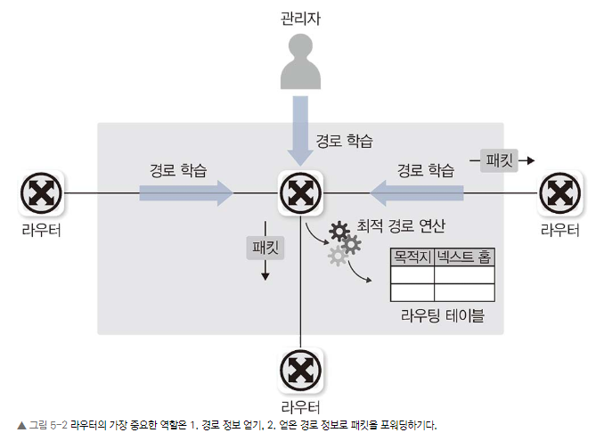
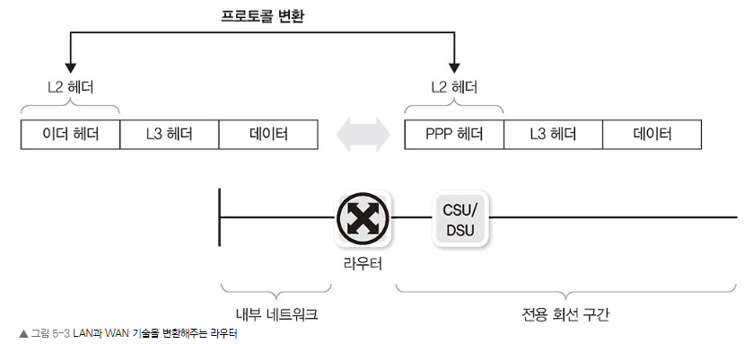
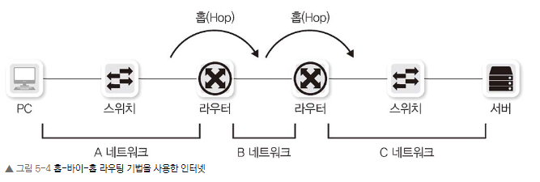
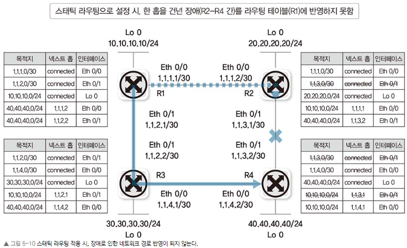
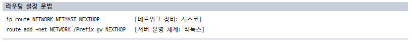
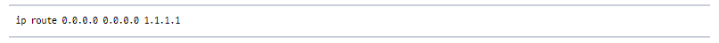
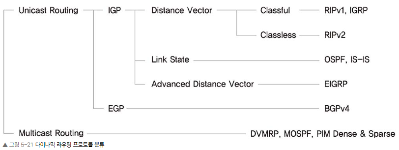

# Chapter 05. 라우터/L3 스위치: 3계층 장비
### Chapter 5.1 라우터의 동작 방식과 역할

라우터는 3계층에서 동작하는 여러 네트워크 장비의 대표격으로 경로를 지정해주는 장비이다. 라우터에 들어오는 패킷의 목적지 IP 주소를 확인하고 자신이 경로 정보를 이용해 패킷을 최적의 경로로 포워딩한다. 

스위치와 반대로 라우터는 들어온 패킷의 목적지 주소가 라우팅 테이블에 없으면 패킷을 버린다. 

#### 5.1.1 경로지정
라우터의 가장 중요한 역할은 경로 지정입니다. 경로 정보를 모아 라우팅 테이블을 만들고 패킷이 라우터로 들어오면 패킷의 도착지 IP 주소를 확인해 경로를 지정하고 패킷을 포워딩합니다. 

라우터는 경로를 지정해 패킷을 포워딩하는 역할을 두 가지로 구분해 수행합니다. 
1. 경로 정보를 얻는 역할 
2. 얻은 경로 정보를 확인하고 패킷을 포워딩하는 역할 

라우터는 자신이 얻은 경로 정보에 포함되는 패킷만 포워딩하므로 정확한 목적지 경로를 얻는 것이 매우 중요합니다.  

1. IP 주소를 입력하면서 자연스럽게 인접 네트워크 정보를 얻는 방법 
2. 관리자가 직접 경로 정보를 입력하는 방법
3. 라우터끼리 서로 경로 정보를 자동으로 교환하는 방법이 있습니다.

#### 5.1.2 브로드캐스트 컨트롤(Broadcast Control)
스위치는 패킷의 도착지 주소를 모르면 어딘가에 존재할지 모를 장비와의 통신을 위해 플러딩해 패킷을 모든 포트에 전송합니다. LAN 어딘가에 도착지가 있을 수 있다고 가정하고 패킷을 전체 네트워크에 플러딩하는 것이 쓸모없는 패킷이 전송되어 전체 네트워크의 성능에 무리가 갈 수 있다고 생각할 수 있지만 LAN은 크기가 작아 플러딩에 대한 영향이 작고 도착지 네트워크 인터페이스 카드(NIC)에서 자신의 주소와 패킷의 도착지 주소가 다르면 패킷을 버리기 때문에 이런 플러딩 작업은 네트워크에 큰 무리를 주지 않습니다.

반면, 라우터는 3계층에서 동작하고 분명한 도착지 정보가 있을 때만 통신을 허락합니다. 인터넷 연결은 대부분 지정된 대역폭만 빌려 사용하므로 쓸모없는 통신이 네트워크를 차지하는 것을 최대한 막으려고 노력합니다. 만약 LAN에서 스위치가 동작하는 것처럼 목적지가 없거나 명확하지 않은 패킷이 플러딩된다면 인터넷에 쓸모 없는 패킷이 가득 차 통신불능 상태가 될 수 있습니다.

라우터는 바로 연결되어 있는 네트워크 정보를 제외하고 경로 습득 설정을 하지 않으면 패킷을 포워딩할 수 없습니다. 

라우터의 기본 동작은 멀티캐스트 정보를 습득하지 않고 브로드캐스트 패킷을 전달하지 않습니다. 라우터의 이 기능을 이용해 브로드캐스트가 다른 네트워크로 전파되는 것을 막을 수 있습니다. 

이 기능을 “브로드캐스트 컨트롤/멀티캐스트 컨트롤”이라고 합니다. 네트워크에 브로드캐스트가 많이 발생하는 경우, 라우터로 네트워크를 분리하면 브로드캐스트 네트워크를 분할해 네트워크 성능을 높일 수 있습니다.

#### 5.1.3 프로토콜 변환
라우터의 또 다른 역할은 서로 다른 프로토콜로 구성된 네트워크를 연결하는 것입니다. 

현대 네트워크는 이더넷으로 수렴되므로 이 역할이 많이 줄었지만 과거에는(현재도 일부) LAN에서 사용하는 프로토콜과 WAN에서 사용하는 프로토콜이 전혀 다른, 완전히 구분된 공간이었습니다. 

LAN은 다수 컴퓨터가 함께 통신하는 데 초점을 맞추었고 WAN은 원거리 통신이 목적이었습니다. LAN 기술이 WAN 기술로 변환되어야만 인터넷과 같이 원격지 네트워크와의 통신이 가능했고 이 역할을 라우터가 담당했습니다.

### 5.2 경로 지정 - 라우팅/스위칭
라우터가 패킷을 처리할 때는 크게 두 가지 작업을 수행합니다.

1. 경로 정보를 얻어 경로 정보를 정리하는 역할

2. 정리된 경로 정보를 기반으로 패킷을 포워딩하는 역할

라우터는 자신이 분명히 알고 있는 주소가 아닌 목적지를 가진 패킷이 들어오면 해당 패킷을 버리므로 패킷이 들어오기 전에 경로 정보를 충분히 수집하고 있어야 라우터가 정상적으로 동작합니다. 

라우터는 많은 경로 정보를 얻어 최적의 경로 정보인 라우팅 테이블을 적절히 유지해야 합니다.

라우터는 서브넷 단위로 라우팅 정보를 습득하고 라우팅 정보를 최적화하기 위해 서머리(Summary) 작업을 통해 여러 개의 서브넷 정보를 뭉쳐 전달합니다. 

그래서 라우터에 들어온 패킷의 목적지 주소와 라우터가 갖고 있는 라우팅 테이블 정보가 정확히 일치하지 않더라도(Exact Match가 아니더라도) 수많은 정보 중 목적지에 가장 근접한 정보를 찾아 패킷을 포워딩해야 합니다.

#### 5.2.1 라우팅 동작과 라우팅 테이블

현대 인터넷에서는 단말부터 목적지까지의 경로를 모두 책임지는 것이 아니라 인접한 라우터까지만 경로를 지정하면 인접 라우터에서 최적의 경로를 다시 파악한 후 라우터로 패킷을 포워딩합니다. 

- 네트워크를 한 단계씩 뛰어넘는다는 의미로 이 기법을 홉-바이-홉(Hop-by-Hop) 라우팅

- 인접한 라우터를 넥스트 홉(Next Hop)이라고 부릅니다. 

라우터는 패킷이 목적지로 가는 전체 경로를 파악하지 않고 최적의 넥스트 홉을 선택해 보내줍니다.

넥스트 홉을 지정하는 일반적인 세 가지 방법

• 다음 라우터의 IP를 지정하는 방법(넥스트 홉 IP 주소)

• 라우터의 나가는 인터페이스를 지정하는 방법

• 라우터의 나가는 인터페이스와 다음 라우터의 IP를 동시에 지정하는 방법

    라우터에서 넥스트 홉을 지정할 때는 일반적으로 상대방 라우터의 인터페이스 IP 주소를 지정하는 방법을 사용합니다. 

    특수한 경우에만 라우터의 나가는 인터페이스를 지정하는 방법을 쓸 수 있는데 상대방 넥스트 홉 라우터의 IP를 모르더라도 MAC 주소 정보를 알아낼 수 있을 때만 사용할 수 있습니다. 

    WAN 구간 전용선에서 PPP(Point-to-Point)나 HLDC(High Level Datalink Control)와 같은 프로토콜을 사용해 상대방의 MAC 주소를 알 필요가 없거나 상대방 라우터에서 프록시 ARP가 동작해 정확한 IP 주소를 모르더라도 상대방의 MAC 주소를 알 수 있을 때와 같이 한정된 조건에서만 사용할 수 있습니다. 이런 경우는 특수한 경우이므로 상대방 IP 주소를 넥스트 홉으로 지정해야 합니다.

인터페이스를 설정할 때는 라우터의 나가는 물리 인터페이스를 지정하는 것이 일반적이지만 IP 주소와 인터페이스를 동시에 사용할 때는 VLAN 인터페이스와 같은 논리적인 인터페이스를 사용할 수 있습니다.

라우터가 패킷을 어디로 포워딩할지 경로를 선택할 때는 출발지를 고려하지 않습니다. 출발지와 상관없이 목적지 주소와 라우팅 테이블을 비교해 어느 경로로 포워딩할지 결정합니다. 그래서 라우팅 테이블을 만들 때는 목적지 정보만 수집하고 패킷이 들어오면 목적지 주소를 확인해 패킷을 넥스트 홉으로 포워딩합니다.

라우팅 테이블에 저장하는 데이터에는 다음과 같은 정보가 포함됩니다.

- 목적지 주소 
- 넥스트 홉 IP 주소, 나가는 로컬 인터페이스(선택 가능)

라우터에서 패킷의 출발지 주소를 이용해 라우팅하도록 PBR(Policy-Based Routing) 기능을 사용할 수 있지만 목적지 주소만 수집하는 라우팅 테이블로는 이 기능을 활성화할 수 없고 라우터 정책과 관련된 별도 설정이 필요합니다. 

이 경우, 다른 라우터로의 전파가 어렵고 라우터에 일반적이지 않은 별도 동작이 필요합니다. 소스 라우팅(Source Routing)이나 줄여서 폴리시 라우팅(Policy Routing)이라고 불리는 이 기능은 관리가 어려워지고 문제가 발생하면 해결이 어려우므로 특별한 목적으로만 사용합니다.

#### 5.2.2 라우팅(라우터가 경로 정보를 얻는 방법)

라우터가 경로 정보를 얻는 방법은 매우 다양하지만 다음 3가지 방법으로 크게 구분할 수 있습니다.

1. 다이렉트 커넥티드

2. 스태틱 라우팅

3. 다이나믹 라우팅

위의 3가지 방법을 이용해 경로 정보를 수집하고 수집된 경로 정보 중 목적지에 대한 최적의 경로를 선정해 라우팅 테이블을 만듭니다. 

#### 5.2.2.1 다이렉트 커넥티드

IP 주소를 입력할 때 사용된 IP 주소와 서브넷 마스크로 해당 IP 주소가 속한 네트워크 주소 정보를 알 수 있습니다. 라우터나 PC에서는 이 정보로 해당 네트워크에 대한 라우팅 테이블을 자동으로 만듭니다. 

이 경로 정보를 다이렉트 커넥티드(Direct Connected)라고 부릅니다. 다이렉트 커넥티드로 생성되는 경로 정보는 인터페이스에 IP를 설정하면 자동 생성되는 정보이므로 정보를 강제로 지울 수 없고 해당 네트워크 설정을 삭제하거나 해당 네트워크 인터페이스가 비활성화되어야만 자동으로 사라집니다.

#### 5.2.2.2 스태틱 라우팅

관리자가 목적지 네트워크와 넥스트 홉을 라우터에 직접 지정해 경로 정보를 입력하는 것을 스태틱 라우팅(Static Routing)이라고 합니다. 

스태틱 라우팅은 관리자가 경로를 직접 지정하므로 라우팅 정보를 매우 직관적으로 설정, 관리할 수 있습니다. 스태틱 라우팅은 다이렉트 커넥티드처럼 연결된 인터페이스 정보가 삭제되거나 비활성화되면 연관된 스태틱 라우팅 정보가 자동 삭제됩니다. 다만 물리 인터페이스가 아닌 논리 인터페이스는 물리 인터페이스가 비활성화되더라도 함께 비활성화되지 않는 경우도 있어 라우팅 테이블에서 사라지지 않을 수 있습니다.

#### 5.2.2.3 다이나믹 라우팅

스태틱 라우팅은 관리자가 변화가 적은 네트워크에서 네트워크를 손쉽게 관리할 수 있는 좋은 방법이지만 큰 네트워크는 스태틱 라우팅만으로는 관리가 어렵습니다. 

스태틱 라우팅은 라우터 너머의 다른 라우터의 상태 정보를 파악할 수 없어 라우터 사이의 회선이나 라우터에 장애가 발생하면 장애 상황을 파악하고 대체 경로로 패킷을 보낼 수 없기 때문입니다.

예를 들어 그림 5-10처럼 R1에서 40.40.40.0/24 네트워크로 가는 경로가 R2의 1.1.1.2로 보내도록 라우팅 테이블이 설정되어 있습니다. R2와 R4 사이의 링크가 다운되더라도 R1과 R3에서는 이 상황을 파악할 수 없어 R1은 40.40.40.0/24에 대한 경로를 변경하지 못하고 패킷을 R2로 계속 포워딩하고 40.40.40.0/24에 대한 경로가 사라진 R2는 이 패킷을 드롭합니다.

다이나믹 라우팅(Dynamic Routing)은 스태틱 라우팅의 이런 단점을 보완해줍니다. 라우터끼리 자신이 알고 있는 경로 정보나 링크 상태 정보를 교환해 전체 네트워크 정보를 학습합니다. 

주기적으로 또는 상태 정보가 변경될 때 라우터끼리 경로 정보가 교환되므로 라우터를 연결하는 회선이나 라우터 자체에 장애가 발생하면 이 상황을 인지해 대체 경로로 패킷을 포워딩할 수 있습니다. 관리자의 개입 없이 라우터끼리의 정보교환만으로 장애를 인지하고 트래픽을 우회할 수 있으므로 대부분의 네트워크에서 다이나믹 라우팅이 사용됩니다.

#### 5.2.3 스위칭(라우터가 경로를 지정하는 방법)

위에서 설명했듯이 다양한 방법으로 경로 정보를 얻고 그 정보 중 최적의 경로로 생각되는 경로를 라우팅 테이블에 올려 유지하는 과정을 라우팅이라고 부릅니다. 

이런 최적 경로 정보를 유지하는 것은 라우터에 패킷이 들어왔을 때 라우터가 최선의 경로로 패킷을 빨리 포워딩하는 것을 도와주기 위해서입니다. 패킷이 들어와 라우팅 테이블을 참조하고 최적의 경로를 찾아 라우터 외부로 포워딩하는 작업을 스위칭이라고 합니다. 이 스위칭은 2계층의 스위치와 이름은 비슷하지만 다른 용어이며 3계층 장비인 라우터가 패킷 경로를 지정해 보내는 작업을 말합니다.

패킷을 최선의 경로로 내보낼 때도 여러 가지를 고려해야 합니다. 들어온 패킷의 목적지가 라우팅 테이블에 있는 정보와 완벽히 일치할 때도 있지만 비슷하게 일치하거나 일치하지 않는 경우도 생길 수 있기 때문입니다.

#### 5.2.4 라우팅, 스위칭 우선순위
라우팅 테이블은 가장 좋은 경로 정보만 모아놓은 핵심정보입니다. 일반적인 경로 정보를 모아놓은 토폴로지 테이블에서 좋은 경로 정보의 우선순위는 경로 정보를 받은 방법과 거리를 기준으로 정합니다.

목적지 네트워크 정보가 동일한 서브넷을 사용하는 경우, 정보를 얻은 소스에 따라 가중치를 정하게 됩니다. 이 가중치 값은 라우팅 정보의 분류와 마찬가지로 크게 3가지로 나눌 수 있습니다.

- 내가 갖고 있는 네트워크(다이렉트 커넥티드)

- 내가 경로를 직접 지정한 네트워크(스태틱 라우팅)

- 경로를 전달받은 네트워크(다이나믹 라우팅)

3가지 경로 수집 방법 중 우선순위가 가장 높은 것은 라우터에 바로 연결된 네트워크입니다. 다이렉트 커넥티드라고 불리는 이 네트워크 정보는 라우터에 바로 붙은 대역이어서 경로 선정 시 우선순위가 가장 높습니다.

다음은 관리자가 목적지 네트워크에 대한 경로를 직접 지정하는 스태틱 라우팅입니다. 비록 로컬 네트워크는 아니지만 목적지 네트워크에 대한 경로 정보를 관리자가 직접 입력하면 신뢰도가 높아 로컬 네트워크 다음으로 우선순위가 높습니다.

마지막으로 라우팅 프로토콜로부터 경로를 전달받은 네트워크입니다. 이 경우는 로컬이나 관리자가 지정한 스태틱 라우팅처럼 경로 정보를 직접 얻은 것이 아니라 다른 라우터를 통해 경로를 전달받았기 때문에 우선순위가 낮습니다. 라우팅 프로토콜 중에서도 어떤 라우팅 프로토콜을 통해 경로 정보를 얻었는가에 따라 우선순위가 다릅니다.

### 5.3 라우팅 설정 방법

#### 5.3.1 다이렉트 커넥티드
앞에서 설명했듯이 라우터나 PC에 IP 주소, 서브넷 마스크를 입력하면 다이렉트 커넥티드 라우팅 테이블이 생성됩니다.

라우팅 테이블을 확인해 목적지가 다이렉트 커넥티드라면 라우터는 앞 장에서 배웠던 L2 통신(ARP 요청을 직접 보내는)으로 목적지에 도달합니다. 목적지가 외부 네트워크인데 다이렉트 커넥티드 라우팅 테이블 정보만 있으면 외부 네트워크와 통신이 불가능합니다. 외부 네트워크로 통신하려면 다이렉트 커넥티드 외에 스태틱 라우팅이나 다이나믹 라우팅에서 얻은 원격지 네트워크에 대한 적절한 라우팅 정보가 있어야 합니다.

커넥티드 라우팅 정보만 있는 경우뿐만 아니라 외부 네트워크에 대한 라우팅 정보가 있더라도 다이렉트 커넥티드 정보를 잘못 입력하면 외부 네트워크와 통신할 수 없습니다. 외부 네트워크로 나가는 첫 번째 길목이 바로 다이렉트 커넥티드이기 때문입니다. IP 주소를 잘못 설정하거나 서브넷 마스크를 정상 범위보다 크거나 작게 설정하면 다이렉트 커넥티드 라우팅 정보가 잘못 입력되는데 이는 외부 네트워크와 단절된 독립된 네트워크가 되거나 특정 네트워크와 통신할 수 없는 상태를 만듭니다.

#### 5.3.2 스태틱 라우팅

원격지 네트워크와 통신하려면 라우터에 직접 연결되지 않은 네트워크 정보를 입력해야 합니다. 네트워크 정보를 쉽게 추가하고 경로를 직접 제어할 수 있는 가장 강력한 방법은 스태틱 라우팅입니다. 앞에서 다룬 것처럼 다이렉트 커넥티드를 제외하고 라우팅 우선순위가 가장 높습니다. 스태틱 라우팅은 네트워크 관리자뿐만 아니라 서버 담당자도 경로 관리에 사용하는 경우가 많으므로 서버 관리자도 스태틱 라우팅을 잘 알아두면 좋습니다. 스태틱 라우팅 정보를 넣을 때 네트워크 장비나 서버의 운영 체제에 따라 문법이 일부 다르지만 대부분 다음과 같은 문법 체계를 따릅니다.

스태틱 라우팅 문법을 우리가 알아들을 수 있는 말로 이해하기 쉽게 표현하면

“목적지(네트워크/호스트 - 서스넷/서브넷 마스크)로 가려면 패킷을 넥스트 홉으로 보내야 한다.”입니다.

모든 인터넷 경로 정보를 받아 처리하는 것은 부적절합니다. 이런 경우, 스태틱 라우팅을 확장한 디폴트 라우팅을 사용하면 문제를 쉽게 해결할 수 있습니다.

위와 같이 목적지 주소의 서브넷 마스크가 모두 0인 스태틱 라우팅을 디폴트 라우팅이라고 합니다. 서브넷 마스크를 이용해 네트워크 주소를 뽑아내는 데 2진수 and 연산을 사용합니다. 서브넷 마스크 1은 체크, 0은 IP 주소와 상관없이 연산 결과가 모두 0이므로 체크하지 않는다는 의미입니다. 모든 네트워크 정보를 체크하지 않는다는 의미를 확장하면 “모든 네트워크”라는 의미가 됩니다.

#### 5.3.3 다이나믹 라우팅
네트워크가 몇 개 없는 간단한 네트워크 구조에서는 스태틱 라우팅으로 망을 유지하는 것이 가능하지만 일반적으로 IT 환경을 구축할 때는 SPoF(Single Point of Failure: 단일 장애점)2를 없애기 위해 두 개 이상의 경로를 유지하는데 이 경우, 대체 경로에 대한 고민이 필요합니다. 

이런 대체 경로가 필요한 네트워크를 스태틱 라우팅만으로 구성하면 한 홉이 넘어간 네트워크 상태가 변경될 때 신속히 대응할 수 없습니다. 중간 경로에 네트워크 회선이 끊기거나 라우터에 장애가 발생하면 관리자가 이를 파악해 경로 정보를 수동으로 수정해주어야 하기 때문입니다.

다이나믹 라우팅 프로토콜을 사용하면 관리자의 직접적인 개입 없이 라우터끼리 정보를 교환해 경로 정보를 최신으로 유지할 수 있습니다. 라우터끼리 경로 정보를 수집하고 전달하므로 관리자가 라우팅 정보를 직접 입력해줄 필요가 없습니다. 

다이나믹 라우팅 뒤에 프로토콜이 붙는 것은 라우터끼리 자신들만의 프로토콜로 정보를 교환하기 때문입니다. 주기적으로나 특별한 변화가 있으면 경로 정보를 교환하므로 중간 경로에 문제가 발생하더라도 대체 경로를 찾는 작업이 자동으로 수행됩니다. 

다이나믹 라우팅 프로토콜은 네트워크나 주변 기술의 변화에 맞추어 다양한 라우팅 프로토콜이 사용되어 왔습니다.

