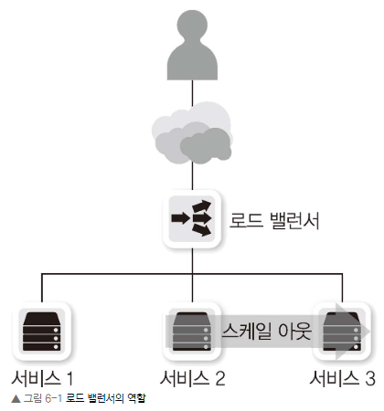
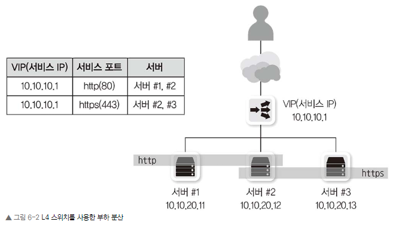
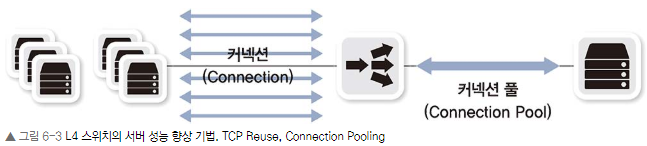
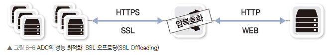
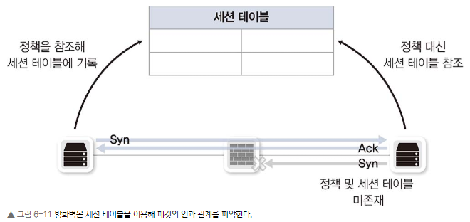
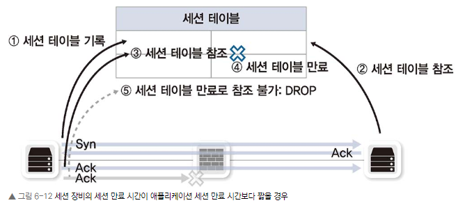

# Chapter 06. 로드 밸런서/방화벽: 4계층 장비(세션 장비)
### Chapter 6.1 4계층 장비의 특징

4계층 장비는 TCP와 같은 4계층 헤더에 있는 정보를 이해하고 이 정보들을 기반으로 동작한다.

기존 네트워크 장비와 다른 점을 이해해야 하는데 세션 테이블과 그 안에서 관리하는 세션 정보가 가장 중요하다. 그래서 4계층 이상에서 동작하는 로드 밸런서, 방화벽과 같은 장비를 '세션 장비'라고 부르기도 한다.

세션 장비의 최우선적으로 고려할 요소

- 세션 테이블
- Symmetric(대칭) 경로 요구
- 정보 변경(로드 밸런서의 경우)

### Chapter 6.2 로드밸런서

서버나 장비의 부하를 분산하기 위해 사용하는 장비를 흔히 로드 밸런서라고 부릅니다. 트래픽을 분배해주는 기능 때문인데 4계층 이상에서 동작하면서 IP 주소나 4계층 정보, 애플리케이션 정보를 확인, 수정하는 기능이 있습니다. 

가장 많이 쓰이는 분야는 웹 서버의 부하 분산입니다. 사용자 천 명의 요청을 동시에 처리해주는 서버보다 사용자 5천 명의 요청을 동시에 처리해주는 서버의 가격은 5배가 아니라 이보다 훨씬 비쌉니다. 

내부 부품을 이중화하거나 용량이 더 큰 부품을 사용하면 가격이 크게 올라가므로 작은 장비 여러 대를 묶어 사용하는 방법을 선호합니다. 이런 시스템 확장 방법을 스케일 아웃이라고 하고 상세한 서비스 확장 방법은 이번 장 마지막의 ‘시스템 확장 방법: 스케일 업과 스케일 아웃’에 자세히 설명되어 있습니다.

작은 시스템 여러 대를 운영하더라도 사용자는 서버 배치와 상관없이 하나의 서비스로 보여야 합니다. 로드 밸런서가 서비스에 사용되는 대표 IP 주소를 서비스 IP로 갖고 그 밑에 시스템이 늘어나면 로드 밸런서가 각 시스템의 실제 IP로 변경해 요청을 보냅니다. 이런 로드 밸런서는 웹, 애플리케이션뿐만 아니라 FWLB(FireWall Load Balancing: 방화벽 로드 밸런싱), VPNLB(VPN Load Balancing: VPN 로드 밸런싱)와 같이 다양한 서비스를 위해 사용될 수 있습니다.

로드 밸런서는 동작하는 계층에 따라 보통 4계층과 7계층으로 나뉜다.
- L4 로드 밸런싱

일반적인 로드 밸런서가 동작하는 방식 TCP, UDP 정보(특히 포트 넘버)를 기반으로 로드 밸런싱을 수행합니다.

- L7 로드 밸런싱

HTTP, FTP, SMTP와 같은 애플리케이션 프로토콜 정보를 기반으로 로드 밸런싱을 수행합니다. HTTP 헤더 정보나 URI와 같은 정보를 기반으로 프로토콜을 이해한 후 부하를 분산할 수 있습니다. 일반적으로 이런 장비를 ADC(Application Delivery Controller)라고 부르며 프록시(Proxy) 역할을 수행합니다. 스퀴드(Squid)나 Nginx에서 수행하는 리버스 프록시(Reverse Proxy)와 유사한 기능을 갖고 있습니다.

#### 6.2.1 L4 스위치
4계층에서 동작하면서 로드 밸런서 기능이 있는 스위치입니다.

부하 분산, 성능 최적화, 리다이렉션 기능을 제공합니다.

L4 스위치가 동작하려면 가상 서버(Virtual Server), 가상 IP(Virtual IP), 리얼 서버(Real Server)와 리얼 IP(Real IP)를 설정해야 합니다.

가상 서버는 사용자가 바라보는 실제 서비스이고 가상 IP는 사용자가 접근해야 하는 서비스 IP 주소입니다. 

리얼 서버는 실제 서비스를 수행하는 서버이고 리얼 IP는 실제 서버의 IP입니다. 여기서 L4 스위치는 가상 IP를 리얼 IP로 변경해주는 역할을 합니다.

사용자는 L4 스위치의 가상 IP를 목적지로 서비스를 요청하고 L4 스위치가 목적지로 설정된 가상 IP를 리얼 IP로 다시 변경해 보내줍니다. 이 과정에서 부하를 어떤 방식으로 분산할지 결정할 수 있습니다. L4 스위치 부하 분산 방식 및 동작 방식에 대한 세부적인 내용은 12장 로드 밸런서에서 다루겠습니다

#### 6.2.2 ADC

ADC(Application Delivery Controller)는 애플리케이션 계층에서 동작하는 로드 밸런서입니다. 

4계층에서 동작하는 L4 스위치와 달리 애플리케이션 프로토콜의 헤더와 내용을 이해하고 동작하므로 다양한 부하 분산, 정보 수정, 정보 필터링이 가능합니다. 

ADC는 이런 상세한 동작을 위해 프락시로 동작합니다. 일부 소프트웨어 ADC를 제외한 대부분의 ADC는 L4 스위치의 기능을 포함하고 있습니다. 대부분의 ADC는 4계층에서 애플리케이션 계층까지 로드 밸런싱 기능을 제공하고 페일오버(Failover, 장애극복 기능), 리다이렉션(Redirection) 기능도 함께 수행합니다. 

이 외에도 애플리케이션 프로토콜을 이해하고 최적화하는 다양한 기능을 제공합니다. 캐싱(Caching), 압축(Compression), 콘텐츠 변환 및 재작성, 인코딩 변환 등이 가능하고 애플리케이션 프로토콜 최적화 기능도 제공합니다.

플러그인 형태로 보안 강화 기능을 추가로 제공해 WAF(Web Application Firewall) 기능이나 HTML, XML 검증과 변환을 수행할 수 있습니다.

#### 6.2.3 L4 스위치 vs ADC
L4 스위치는 4계층에서 동작하면서 TCP, UDP 정보를 기반으로 부하를 분산합니다. 부하 분산뿐만 아니라 TCP 계층에서의 최적화와 보안 기능도 함께 제공할 수 있습니다. TCP 레벨의 간단한 DoS(Denial of Service) 공격을 방어하거나 서버 부하를 줄이기 위해 TCP 세션 재사용과 같이 보안과 성능을 높여주는 기능도 함께 제공할 수 있습니다.

ADC는 애플리케이션 프로토콜을 이해하고 애플리케이션 내용에 대한 분산, 리다이렉션, 최적화를 제공해 L4 스위치보다 더 다양한 기능을 사용할 수 있습니다.

ADC는 성능 최적화를 위해 서버에서 수행하는 작업 중 부하가 많이 걸리는 작업을 별도로 수행합니다. 그 중 하나가 이미지나 정적 콘텐츠 캐싱(Caching) 기능입니다.

최근 SSL 프로토콜을 사용하는 비중이 늘면서 웹 서버에 SSL 암복호화 부하가 늘고 있습니다. 개인정보 보호를 위해 개인정보가 전달되는 일부 페이지에서만 SSL을 사용해왔지만 보안 강화를 위해 웹사이트 전체를 SSL로 처리하는 추세입니다. 

ADC에서는 SSL의 엔드 포인트로 동작해 클라이언트에서 ADC까지의 구간을 SSL로 처리해주고 ADC와 웹 서버 사이를 일반 HTTP를 이용해 통신합니다. 대부분 이런 기능을 사용할 때는 웹 서버 여러 대의 SSL 통신을 하나의 ADC에서 수용하기 위해 ADC에 전용 SSL 가속 카드를 내장합니다.

### Chapter 6.3 방화벽
네트워크 중간에 위치해 해당 장비를 통과하는 트래픽을 사전에 주어진 정책 조건에 맞추어 허용(Permit)하거나 차단(Deny)하는 장비를 방화벽이라고 부릅니다. 

네트워크에서 보안을 제공하는 장비를 넓은 의미에서 모두 방화벽의 일종으로 불러왔지만 일반적으로 네트워크 3, 4계층에서 동작하고 세션을 인지, 관리하는 SPI(Stateful Packet Inspection) 엔진을 기반으로 동작하는 장비를 방화벽이라고 부릅니다.

### Chapter 6.4 4계층 장비를 통과할 때의 유의점(세션관리)

애플리케이션의 세션 시간과 서비스 방향성을 고려하고 비대칭 경로를 피하는 것이 매우 중요합니다. 네트워크에서 세션 장비가 중간에 있을 때 생기는 대부분의 문제는 이런 부분을 고려하지 않아서 발생합니다. 이런 문제는 세션 장비에서 설정을 변경하거나 애플리케이션 로직을 변경해 해결할 수 있습니다.

 

#### 6.4.1 세션 테이블 유지, 세션 정보 동기화

종단 장비에서 통신을 시작하면 중간에 있는 세션 장비는 해당 세션 상태를 테이블에 기록합니다. 통신이 없더라도 종단 장비 간 통신이 정상적으로 종료되지 않았다면 일정 시간 동안 세션 테이블을 유지합니다. 

하지만 이런 세션 테이블은 메모리에 저장되므로 메모리 사용률을 적절히 유지하기 위해 일정 시간만 세션 정보를 저장합니다. 

또한, 악의적인 공격자가 과도한 세션을 발생시켜 정상적인 세션 테이블 생성을 방해하는 세션 공격으로부터 시스템을 보호하기 위해 타임아웃값을 더 줄이기도 합니다. 

여러 가지 이유로 세션 장비는 세션 정보를 무제한으로 저장할 수 없고 여러 가지 애플리케이션 통신을 관리하므로 일반적인 애플리케이션에 맞추어 적당한 세션 타임아웃값을 유지합니다.

하지만 일부 애플리케이션은 세션을 한 번 연결해놓고 다음 통신이 시도될 때까지 세션이 끊기지 않도록 세션 타임아웃값을 길게 설정하기도 합니다.

이런 종류의 애플리케이션이 통신할 때, 세션 장비의 세션 타임아웃값이 애플리케이션의 세션 타임아웃값보다 짧으면 통신에 문제가 생깁니다. 

중간 세션 장비의 세션 유지 시간이 지나 세션 테이블에 있는 세션 정보가 사라졌는데도 양쪽 단말에서는 세션이 유지되고 있다면 다시 통신이 시작되어 데이터를 보낼 때 중간 세션 장비에서 막히는 문제가 발생합니다. 

세션 장비의 세션 테이블에 세션이 없는 상황에서 SYN이 아닌 ACK로 표시된 패킷이 들어오면 세션 장비에서는 비정상 통신으로 판단해 패킷을 차단하고 그런 종류의 패킷을 통과시키는 옵션을 설정해 패킷을 강제로 통과시키더라도 반대 방향으로 데이터가 들어오면 정책에 막힐 수 있습니다.

이런 문제를 해결하기 위해 세션 장비와 애플리케이션(또는 시스템)에서 각각 적용할 수 있는 설정이 있습니다. 다음은 이런 문제의 해결 방법이며 이 중 하나만 적용되어도 서비스는 정상적으로 동작할 수 있습니다.

#### 6.4.1.1 세션 장비 운영자 입장

가. 세션 만료 시간 증가

세션 장비 운영자가 애플리케이션에 맞게 세션 만료 시간을 늘리는 방법이 있습니다. 이 경우, 애플리케이션의 세션 유지 시간보다 방화벽 세션 유지 시간이 길어야 합니다. 대부분의 세션 장비는 포트 번호나 IP 주소마다 별도의 세션 만료 시간을 설정할 수 있어 전체 세션 유지 시간이 길어져 시스템 메모리가 고갈되는 문제를 예방할 수 있습니다. 하지만 세션 장비 운영자가 정확한 정보를 얻어 설정할 수 있도록 애플리케이션측 개발자나 관리자가 애플리케이션 고유의 세션 유지 시간을 미리 알려주어야 합니다.

 

나. 세션 시간을 둔 채로 중간 패킷을 수용할 수 있도록 방화벽 설정(세션 장비 중 방화벽에 해당)

세션 테이블에 정보가 없는 ACK 패킷이 방화벽에 들어오면 방화벽은 패킷을 차단하지만 방화벽 옵션을 조정해 세션 테이블에 정보가 없는 ACK 패킷이 들어오더라도 세션을 새로 만들어 통과시킬 수 있는 옵션이 있습니다. 하지만 이런 해결책은 전체적인 보안이 취약해지는 기능이므로 

여러 가지 고려가 필요하고 가능하면 적용하지 않는 것이 좋습니다.

 
다. 세션 장비에서 세션 타임아웃 시 양 단말에 세션 종료 통보

이 기능은 양 종단 장비의 세션 정보와 중간 세션 장비의 세션 정보가 일치하지 않아 발생하는 문제를 해결하기 위해 사용하는 기능입니다. 

세션 상태 정보를 강제로 공유하기 위해 세션 장비에서는 세션 타임아웃 시 세션 정보를 삭제하는 것이 아니라 세선 정보에 있는 양 종단 장비에 세션 정보 만료(RST)를 통보합니다. 

TCP의 RST 플래그를 1로 세팅해 양 종단 장비에 전송하면(A를 출발지로 B를 도착지로, B를 출발지로 A를 도착지로) 양 종단 장비에서는 세션이 비정상적으로 종료된 것으로 판단해 해당 세션을 끊습니다. 애플리케이션에서 통신이 필요하면 새로운 세션을 맺어 통신합니다.

#### 6.4.2 비대칭 경로 문제

네트워크의 안정성을 높이기 위해 네트워크 회선과 장비를 이중화합니다. 

이때 패킷이 지나가는 경로가 2개 이상이므로 인바운드 패킷과 아웃바운드 패킷의 경로가 같거나 다를 수 있습니다. 

인바운드 패킷과 아웃바운드 패킷이 같은 장비를 통과하는 것을 대칭 경로(Symmetric Path)라고 하고 다른 장비를 통과하는 것을 비대칭 경로(Asymmetric Path)라고 부릅니다.