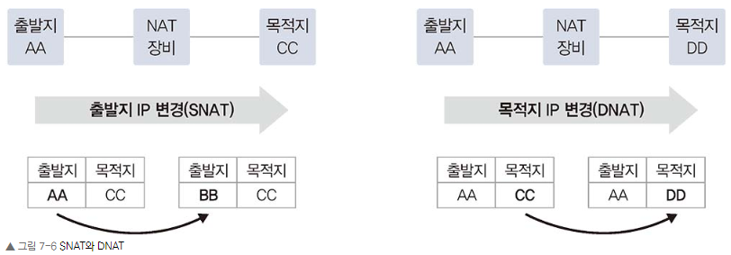
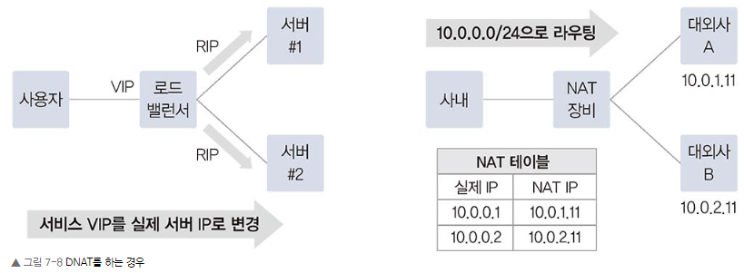
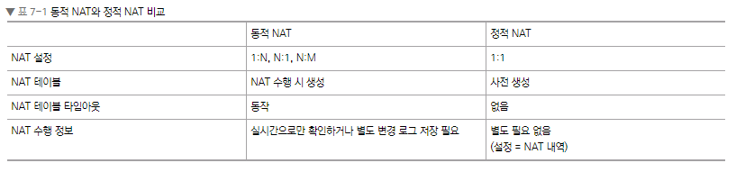
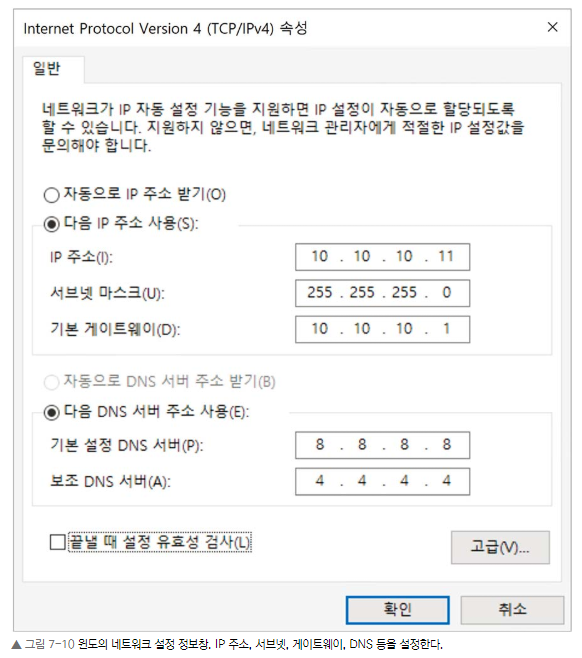
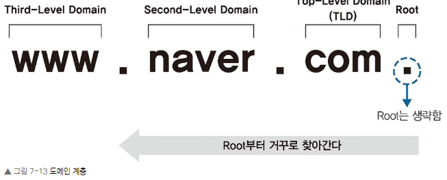
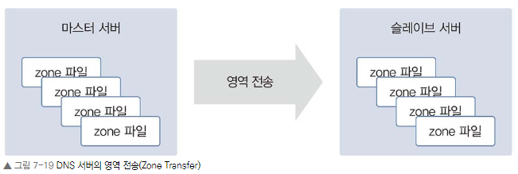
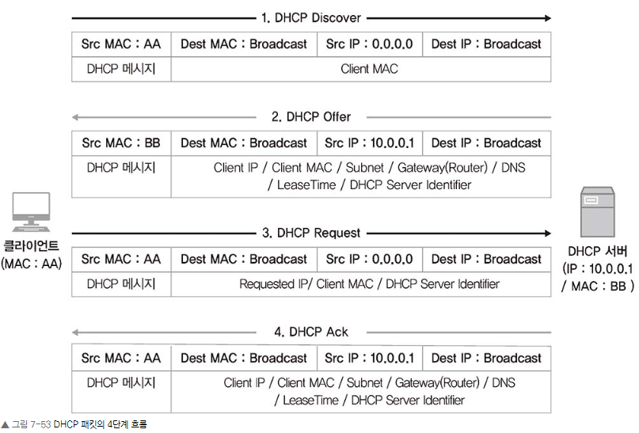

# Chapter 07. 통신을 도와주는 네트워크 주요 기술
### Chapter 7.1 NAT/PAT

NAT는 이름 그대로 네트워크 주소를 변환하는 기술입니다. NAT는 기본적으로 하나의 네트워크 주소에 다른 하나의 네트워크 주소로 변환하는 1:1 변환이 기본이지만 IP 주소가 고갈되는 문제를 해결하기 위해 1:1 변환이 아닌 여러 개의 IP를 하나의 IP로 변환하기도 합니다. 여러 개의 IP를 하나의 IP로 변환하는 기술도 NAT 기술 중 하나이고 NAT로 통칭하여 불리기도 하지만 실제 공식 용어는 NAPT(Network Address Port Translation, RFC2663)입니다. NAPT의 경우, 실무에서는 PAT(Port Address Translation)라는 용어로 더 많이 사용되기 때문에 본서에서도 PAT라는 용어로 설명하겠습니다.

NAT가 가장 많이 사용되는 경우는 사설 IP 주소에서 공인 IP 주소로 전환하는 경우입니다.

#### 7.1.1 NAT/PAT의 용도와 필요성

첫째, IPv4 주소 고갈문제의 솔루션으로 NAT가 사용됩니다.

인터넷 대중화로 갑자기 폭증한 IP 주소 요구를 극복하기 위해 단기, 중기, 장기의 3단계 IP 주소 보존과 전환전략을 수립했습니다.  

전략으로 IPv4 주소 부족 문제가 많이 해소되었습니다. 물론 현재는 IPv4 주소 할당이 끝나면서 신규로 할당 가능한 IPv4 주소가 없는 상태이고 IPv6 주소 체계 전환을 일부 분야에서는 매우 많이 진행하고 있습니다. 

IPv4 주소 보존전략 
- 단기 전략은 서브네팅
- 중기 전략은 NAT와 사설 IP 체계
- 장기 전략은 IPv6 전환 

NAT를 이용한 중기 전략이 IPv4 주소 보존에 큰 기여를 했는데 외부에 공개해야 하는 서비스에 대해서는 공인 IP를 사용하고 외부에 공개할 필요가 없는 일반 사용자의 PC나 기타 종단 장비에 대해서는 사설 IP를 사용해 꼭 필요한 곳에만 효율적으로 IP를 사용할 수 있게 되었습니다.

둘째, 보안을 강화하는 데 NAT 기술을 사용합니다.

IP 주소는 네트워크에서 유일해야 하고 이 정보가 식별자로 사용되어 외부와 통신하게 해줍니다. 외부와 통신할 때 내부 IP를 다른 IP로 변환해 통신하면 외부에 사내 IP 주소 체계를 숨길 수 있습니다.

NAT는 주소 변환 후 역변환이 정상적으로 다시 수행되어야만 통신이 가능합니다. 이 성질을 이용해 복잡한 룰 설정 없이 방향성을 통제할 수 있습니다. 내부 네트워크에서 외부 네트워크로 나가는 방향 통신은 허용하지만 외부에서 시작해 내부로 들어오는 통신은 방어할 수 있습니다. NAT/PAT의 이런 성질을 이용해 보안을 쉽게 강화할 수 있습니다.

셋째, IP 주소 체계가 같은 두 개의 네트워크 간 통신을 가능하게 해줍니다.

IP 네트워크에서 서로 통신하려면 식별 가능한 유일한 IP 주소가 있어야 합니다. 공인 IP는 인터넷에서 유일한 주소로 IP 주소가 중복되면 안 되지만 사설 IP는 외부와 통신할 때 공인 IP로 변환되어 통신하므로 서로 다른 회사에서 중복해 사용할 수 있습니다. 회사 내부에서 사설 IP를 독립적으로 사용한다면 상관없지만 사설 IP를 이용해 다른 회사와 직접 연결해야 하거나 회사 간 합병으로 서로 통신해야 한다면 사설 IP 주소가 충돌할 수 있습니다.

IP 대역이 같은 네트워크와 통신할 가능성이 높은 대외계 네트워크를 연결하기 위해 출발지와 도착지를 한꺼번에 변환하는 “더블 나트(Double NAT)” 기술을 사용합니다.

넷째, 불필요한 설정 변경을 줄일 수 있습니다.

외부에 서비스하던 공인 IP 주소가 변경되므로 DNS 서비스나 NAT를 수행하는 네트워크 장비 설정은 변경해야 하지만 내부 서버나 PC 설정 변경을 최소화할 수 있어 NAT/PAT 기술을 적용하면 복잡한 작업을 많이 줄일 수 있습니다. 이런 설계는 특정 사업자에 종속되지 않는 유연한 인프라스트럭처의 기본 요소로 비즈니스 유연성을 높이는 데 매우 중요한 기술로 활용됩니다.

#### 7.1.2 NAT 동작 방식

NAT의 동작 방식을 이해하기 위해 출발지 사용자(10.10.10.10)가 목적지의 웹 서버(20.20.20.20)로 통신하는 과정을 살펴보겠습니다.

1. 사용자는 웹 서버에 접근하기 위해 출발지 IP를 10.10.10.10으로, 목적지 IP와 서비스 포트는 20.20.20.20과 80으로 패킷을 전송합니다. 출발지 서비스 포트는 임의의 포트로 할당됩니다. 여기서는 2000번 포트로 가정했습니다.

2. NAT 역할을 수행하는 장비에서는 사용자가 보낸 패킷을 수신한 후 NAT 정책에 따라 외부 네트워크와 통신이 가능한 공인 IP인 11.11.11.11로 IP 주소를 변경합니다. NAT 장비에서 변경 전후의 IP 주소는 NAT 테이블에 저장됩니다.

3. NAT 장비에서는 출발지 주소를 11.11.11.11로 변경해 목적지 웹 서버로 전송합니다.

4. 패킷을 수신한 웹 서버는 사용자에게 응답을 보냅니다. 응답이므로 수신한 내용과 반대로 출발지는 웹 서버(20.20.20.20)가 되고 목적지는 NAT 장비에 의해 변환된 공인 IP 11.11.11.11로 사용자에게 전송합니다.

5. 웹 서버로부터 응답 패킷을 수신한 NAT 장비는 자신의 NAT 테이블에서 목적지 IP에 대한 원래 패킷을 발생시킨 출발지 IP 주소가 10.10.10.10인 것을 확인합니다.

6. NAT 변환 테이블에서 확인된 원래 패킷 출발지 IP(10.10.10.10)로 변경해 사용자에게 전송하면 사용자는 최종적으로 패킷을 수신합니다.

#### 7.1.3 PAT 동작 방식
NAT 동작에 이어 PAT 동작을 이해하기 위한 예제를 살펴보겠습니다. NAT 예제와 동일한 출발지와 목적지로 하고 NAT 장비는 PAT로 동작합니다.

1. 사용자가 웹 서버로 접근하기 위해 패킷에 출발지 10.10.10.10, 목적지 20.20.20.20, 목적지 서비스 포트는 웹 서비스 포트인 80으로 채워 패킷을 전송합니다. 출발지 서비스 포트는 NAT와 마찬가지로 임의의 서비스 포트가 할당되며 이 예제에서는 2000번 포트로 할당

2. NAT 장비는 사용자가 보낸 패킷을 받아 외부 네트워크와 통신이 가능한 공인 IP인 11.11.11.11로 변경합니다. 다만 출발지에 있는 다수의 사용자가 동일한 공인 IP로 변환되어야 하므로 패킷의 주소 변경 시 출발지 IP뿐만 아니라 출발지의 서비스 포트도 변경됩니다. 출발지 IP와 출발지 서비스 포트는 NAT 장비에 의해 모두 변경되고 NAT 장비가 이 변경 정보를 NAT 테이블에 기록합니다.

3. NAT 장비에서 변경된 출발지 IP 주소인 11.11.11.11과 서비스 포트 3000으로 패킷을 재작성해 웹 서버로 다시 전송합니다.

4. 사용자가 보낸 패킷을 수신한 웹 서버는 사용자에게 패킷을 응답하는데 출발지 IP는 웹 서버의 IP 주소인 20.20.20.20으로 채워지고 목적지 IP는 NAT 장비에 의해 변환된 공인 IP 11.11.11.11과 서비스 포트로 채워져 전송합니다.

5. 웹 서버로부터 응답 패킷을 수신한 NAT 장비는 NAT 테이블을 확인해 웹 서버로부터 받은 패킷의 목적지 IP 주소인 11.11.11.11이 원래 10.10.10.10이며 서비스 포트 3000이 원래 2000인 것을 확인합니다.

6. NAT 장비는 NAT 테이블에서 확인한 목적지 IP 주소와 서비스 포트로 패킷을 재작성한 후 사용자에게 전달합니다. 사용자는 NAT 장비에서 역변환된 패킷을 받아 웹 페이지를 표시합니다.

즉, PAT 동작 방식은 NAT와 거의 동일하게 이루어지지만 IP 주소뿐만 아니라 서비스 포트까지 함께 변경해 NAT 테이블을 관리하므로 하나의 IP만으로도 다양한 포트 번호를 사용해 사용자를 구분할 수 있습니다. 하지만 이 서비스 포트의 개수는 제한되어 있어 재사용됩니다. 만약 서비스 포트가 동시에 모두 사용 중이거나 재사용할 수 없을 때는 PAT이 정상적으로 동작하지 않습니다. 따라서 동시 사용자가 매우 많을 때는 PAT에서 사용하는 공인 IP 주소를 IP 하나가 아닌 풀(Pool)로 구성해야 합니다.

#### 7.1.4 SNAT와 DNAT

NAT를 사용해 네트워크 주소를 변환할 때 어떤 IP 주소를 변환하는지에 따라 두 가지로 구분합니다.

• SNAT(Source NAT) - 출발지 주소를 변경하는 NAT

• DNAT(Destination NAT) - 도착지 주소를 변경하는 NAT

 

SNAT와 DNAT는 트래픽이 출발하는 시작 지점을 기준으로 구분합니다. 어떤 주소를 변경해야 하는지는 서비스 흐름과 목적에 따라 결정됩니다.

앞에서 말했듯이 SNAT와 DNAT의 기준은 NAT가 수행되기 이전의 트래픽이 출발하는 시작 지점입니다. 즉, 요청 시 SNAT를 해 목적지로 전송하면 해당 트래픽에 대한 응답을 받을 때는 출발지와 목적지가 반대가 되므로 DNAT가 되는데 이때 트래픽을 요청하는 시작 지점만 고려해 SNAT 설정을 해야 합니다. NAT 장비를 처음 통과할 때 NAT 테이블이 생성되므로 응답 패킷이 NAT 장비에 들어오면 별도의 NAT 설정이 없더라도 NAT 테이블을 사용해 반대로 패킷을 변환해줄 수 있기 때문입니다. 이 과정을 역 NAT라고 하며 NAT가 정상적으로 수행되려면 역 NAT 과정이 함께 수행되어야 합니다.

-- Source NAT --

SNAT는 사설에서 공인으로 통신할 때 많이 사용합니다. 공인 IP 주소의 목적지에서 출발지로 다시 응답을 받으려면 출발지 IP 주소 경로가 필요한데 공인 대역에서는 사설 대역으로의 경로를 알 수 없으므로 공인 IP의 목적지로 서비스를 요청할 때 출발지에서는 사설 IP를 별도의 공인 IP로 NAT해 서비스를 요청해야 합니다. 그래야 해당 요청을 받은 목적지에서 출발지 IP를 공인 IP로 확인해 다시 응답할 수 있는 경로를 찾을 수 있습니다. 이것은 공유기처럼 PAT를 사용하는 경우에 해당할 수 있습니다.

다른 경우는 보안상 SNAT를 사용할 때입니다. 회사에서 다른 대외사와 통신 시 내부 IP 주소가 아니라 별도의 다른 IP로 전환해 전송함으로써 대외에 내부의 실제 IP 주소를 숨길 수 있습니다. 보안상의 문제뿐만 아니라 대외사와 통신해야 하는 사내 IP가 대외사의 사내 IP 대역과 중복될 때도 SNAT를 통해 중복되지 않는 다른 IP로 변경해 통신하는 데 사용할 수 있습니다. 이 경우는 앞에서 말한 사설에서 공인으로 통신해야 하는 경우와 비슷하지만 이 경우에는 변경되는 IP가 반드시 공인일 필요는 없습니다.

로드 밸런서의 구성에 따라 SNAT를 사용하기도 합니다. 출발지와 목적지 서버가 동일한 대역일 때는 로드 밸런서 구성에 따라 트래픽이 로드 밸런서를 거치지 않고 응답할 수 있어 SNAT를 통해 응답 트래픽이 로드 밸런서를 거치게 할 수 있습니다.

-- DNAT --

DNAT는 로드 밸런서에서 많이 사용합니다. 사용자는 서비스 요청을 위해 로드 밸런서에 설정된 서비스 VIP(Virtual IP)로 서비스를 요청하고 로드 밸런서에서는 서비스 VIP를 로드 밸런싱될 서버의 실제 IP로 DNAT해 내보냅니다.

사내가 아닌 대외망과의 네트워크 구성에도 DNAT를 사용합니다. 사내 IP 주소는 중앙에서 일괄적으로 관리되므로 IP가 중복되는 경우가 없지만 사내가 아닌 대외망과의 연동에서는 IP가 중복될 수 있습니다. 설사 IP가 중복되지 않더라도 IP 주소가 제각각이므로 신규 대외사와의 연동마다 라우팅을 개별적으로 설정해야 합니다. 이 경우, 대외망에 NAT 장비를 이용해 대외사의 IP를 특정 IP 대역으로 NAT합니다. 사내에서는 어떤 대외사든 대외망 전용 NAT 대역으로 변경된 네트워크 대역으로 라우팅을 처리하면 되므로 대외사 추가에 따라 별도 라우팅을 개별적으로 설정할 필요가 없고 사내 IP와 중복되는 IP가 있더라도 라우팅 이슈 없이 구성할 수 있습니다.

#### 7.1.5 동적 NAT와 정적 NAT

출발지와 목적지의 IP를 미리 매핑해 고정해놓은 NAT를 정적 NAT라고 합니다. 반대로 출발지나 목적지 어느 경우든 사전에 정해지지 않고 NAT를 수행할 때 IP를 동적으로 변경하는 것을 동적 NAT라고 합니다.

동적 NAT는 출발지와 목적지가 모두 정의된 것이 아니라 다수의 IP 풀에서 정해지므로 최소한 출발지나 목적지 중 한 곳이 다수의 IP로 구성된 IP 풀이나 레인지(Range)로 설정되어 있습니다. NAT가 필요할 때 IP 풀에서 어떤 IP로 매핑될 것인지 판단해 NAT를 수행하는 시점에 NAT 테이블을 만들어 관리합니다. NAT 테이블은 설정된 시간 동안 유지되고 일정 시간 동안 통신이 없으면 다시 사라지므로(NAT 테이블 타임아웃) 동적 NAT의 설정은 서비스 흐름을 고려해 적용해야 합니다.

정적 NAT는 출발지와 목적지 매핑 관계가 특정 IP로 사전에 정의된 것이므로 1:1 NAT라고 부르기도 합니다. 실제 IP 매핑도 A라는 IP와 B라는 IP가 항상 고정되어 매핑된 상태이므로 서비스 방향에 따라 고려할 필요가 없습니다. 즉, 방향성 없이 서비스 흐름을 고려하지 않고 NAT를 설정할 수 있습니다.

### Chapter 7.2 DNS

DNS(Domain Name System)는 도메인 주소를 IP 주소로 변환하는 역할을 합니다. IP 주소보다 도메인 주소를 이용하는 것이 일반 사용자에게 더 익숙하고 서버 IP 변경에 쉽게 대처할 수 있으므로 네트워크 통신에서 DNS의 역할이 매우 중요합니다.

특히 최근 클라우드 기반 인프라 구성이 많아지면서 인프라가 빈번히 변경되어 DNS 설계가 더 중요해지고 있습니다. 또한, MSA(Micro Service Architecture) 기반의 서비스 설계가 많아지면서 다수의 API를 이용하다보니 사용자의 호출뿐만 아니라 서비스 간 API 호출이나 인터페이스가 많아져 DNS의 역할은 더 중요해졌습니다.

#### 7.2.1 DNS 소개

사이트에 접속하거나 링크에 지정된 주소는 http://202.179.177.21 같은 IP 주소이거나 http://www.naver.com 같은 도메인 주소를 사용하게 됩니다. 물론 어떤 주소를 사용하더라도 실제 네트워크 통신에서는 202.179.177.21 같은 IP 주소를 이용합니다. 하지만 사용자가 수많은 IP 주소를 외우기는 어렵습니다. 

IP 주소 대신 도메인 주소를 이용하면 하나의 IP 주소를 이용해 여러 개의 웹 서비스를 운영할 수 있고 서비스 중인 IP 주소가 변경되더라도 도메인 주소 그대로 유지해 접속 방법 변경 없이 서비스를 그대로 유지할 수 있습니다. 또한, 도메인을 이용하면 지리적으로 여러 위치에서 서비스할 수도 있습니다. 따라서 특별한 경우를 제외하면 대부분의 웹사이트는 도메인 주소 기반으로 운영합니다.

물론 서비스를 도메인 주소를 사용하더라도 실제로 패킷을 만들어 통신하려면 3계층 IP 주소를 알아야 하고 이를 위해 문자열로 된 도메인 주소를 실제 통신에 필요한 IP 주소로 변환하는 DNS(Domain Name Server) 정보를 그림 7-10처럼 네트워크 설정 정보에 입력해야 합니다.

#### 7.2.2 DNS 구조와 명명 규칙

도메인은 계층 구조여서 수많은 인터넷 주소 중 원하는 주소를 효율적으로 찾아갈 수 있습니다. 역트리 구조로 최상위 루트부터 Top-Level 도메인, Second-Level 도메인, Third-Level 도메인과 같이 하위 레벨로 원하는 주소를 단계적으로 찾아갑니다. 

우리가 도메인 주소를 사용할 때는 각 계층의 경계를 “.”으로 표시하고 뒤에서 앞으로 해석합니다. Third.second.top.과 같은 형태로 표현하고 맨 뒤의 루트는 생략됩니다. www.naver.com의 경우, 맨 뒤에 생략된 루트(.)를 시작으로 Top-Level인 com, Second-Level인 naver, Third-Level인 www와 같이 뒤에서 앞으로 해석됩니다.

#### 7.2.2.1 루트 도메인

루트 도메인은 도메인을 구성하는 최상위 영역입니다. DNS 서버는 사용자가 쿼리한 도메인에 대한 값을 직접 갖고 있거나 캐시에 저장된 정보를 이용해 응답합니다. 만약 DNS 서버에 해당 도메인의 정보가 없으면 루트 도메인을 관리하는 루트 DNS에 쿼리하게 됩니다.

루트 DNS는 전 세계에 13개가 있고 DNS 서버를 설치하면 루트 DNS의 IP 주소를 기록한 힌트(Hint) 파일을 가지고 있어 루트 DNS 관련 정보를 별도로 설정할 필요가 없습니다.

#### 7.2.2.2 Top-Level Domain(TLD)

최상위 도메인인 TLD는 IANA(Internet Assigned Numbers Authority)에서 구분한 6가지 유형으로 구분할 수 있습니다. 각 유형은 다음과 같으며 전체 리스트는 IANA 사이트(https://www.iana.org/domains/root/db)에서 확인할 수 있습니다.

• Generic(gTLD)

• country-code(ccTLD)

• sponsored(sTLD)

• infrastructure

• generic-restricted(grTLD)

• test(tTLD)

-- Generic TLD(gTLD) -- 

gTLD는 특별한 제한없이 일반적으로 사용되는 최상위 도메인이며 세 글자 이상으로 구성됩니다. 초기 gTLD는 1980년대 7개의 gTLD(.com, .edu, .gov, .int, .mil, .net, .org)로 시작했으며 필요에 의해 새로운 gTLD가 지속적으로 만들어지고 있습니다.

-- Country Code TLD(ccTLD) --

ccTLD는 국가 최상위 도메인으로 ISO 3166 표준에 의해 규정된 두 글자의 국가 코드를 사용합니다. 우리나라는 ‘kr’을 사용합니다. 일반적으로 ccTLD를 사용하는 경우, Second Level TLD에는 gTLD에서 구분한 것처럼 사이트 용도에 따른 코드를 사용합니다. 예를 들어 일반 회사는 co.kr을 사용하고 정부기관은 go.kr을 사용하는 방법입니다. 우리나라는 gTLD를 두 글자로 줄여 사용하지만 호주나 대만처럼 gTLD를 그대로 사용하는 나라도 있습니다(com.au, gov.au, com.tw, gov.tw 등). 영국은 ISO 3166 표준이 아닌 uk라는 별도 ccTLD를 사용합니다. 할당에 대한 세부 구분은 그림에 있는 위키피디아 링크를 참고하면 확인할 수 있습니다.

-- Sponsored(sTLD) --

sTLD는 특정 목적을 위한 스폰서를 두고 있는 최상위 도메인입니다. 스폰서는 특정 민족공동체, 전문가 집단, 지리적 위치 등이 속할 수 있습니다. sTL의 종류에는 ‘.aero’, ‘.asia’, ‘.edu’, ‘.museum’ 등이 있습니다.

-- Infrastructure --

운용상 중요한 인프라 식별자 공간을 지원하기 위해 전용으로 사용되는 최상위 도메인입니다. Infrastructure에 속하는 TLD는 ‘.arpa’입니다. ‘.arpa’는 인터넷 안정성을 유지하기 위해 새로운 모든 인프라 하위 도메인이 배치될 도메인 공간 역할을 합니다. ‘.IN-ADDR.ARPA’가 이런 .‘arpa’의 하위 도메인 중 하나로 IPv4 주소를 도메인 이름에 매핑하는 역방향 도메인에서 사용합니다.

-- Generic-restricted(grTLD) --

grTLD는 특정 기준을 충족하는 사람이나 단체가 사용할 수 있는 최상위 도메인입니다. grTLD의 종류에는 ‘.biz’, ‘.name’, ‘.pro’가 있습니다.

-- Test(tTLD) --

tTLD는 IDN(Internationalized Domain Names) 개발 프로세스에서 테스트 목적으로 사용하는 최상위 도메인입니다. tTLD의 종류에는 ‘.test’가 있습니다.

#### 7.2.3 DNS 동작 방식

도메인을 IP 주소로 변환하려면 DNS 서버에 도메인 쿼리하는 과정을 거쳐야 합니다. 하지만 DNS 서버없이 로컬에 도메인과 IP 주소를 직접 설정해 사용할 수도 있습니다. 로컬에서 도메인과 IP 주소를 관리하는 파일을 hosts 파일이라고 합니다. hosts 파일에 도메인과 IP 주소를 설정해두면 해당 도메인 리스트는 항상 DNS 캐시에 저장됩니다.

도메인을 쿼리하면 DNS 서버에 쿼리를 하기 전 로컬에 있는 DNS 캐시 정보를 먼저 확인합니다. 동일한 도메인을 매번 질의하지 않고 캐시를 통해 성능을 향상시키기 위해서입니다. 이런 DNS 캐시 정보에는 기존 DNS 조회를 통해 확인한 동적 DNS 캐시와 함께 hosts 파일에 저장되어 있는 정적 DNS 캐시가 함께 저장되어 있습니다. DNS 캐시 정보에 필요한 도메인 정보가 없으면 DNS 서버로 쿼리를 수행하고 DNS 서버로부터 응답을 받으면 그 결과를 캐시에 먼저 저장합니다. 전에 쿼리를 한 번 수행한 DNS 정보는 캐시부터 조회하므로 DNS 서버에 별도로 쿼리하지 않고 캐시 정보를 사용합니다.

그림 7-16은 윈도에서 DNS 캐시를 확인한 결과입니다. 윈도에서 DNS 캐시를 확인하려면 명령창에서 ‘ipconfig /displaydns’ 명령을 사용합니다.

호스트가 DNS 서버에 질의했던 방식을 재귀적 쿼리(Recursive Query)라고 하고 DNS 서버가 루트 NS와 TLS NS, zigispace NS에 질의한 방식을 반복적 쿼리(Iterative Query)라고 합니다.

재귀적 쿼리는 쿼리를 보낸 클라이언트에 서버가 최종 결괏값을 반환하는 서버 중심 쿼리이고 반복적 쿼리는 최종값을 받을 때까지 클라이언트에서 쿼리를 계속 진행하는 방식입니다. 일반적으로 재귀적 쿼리는 클라이언트와 로컬 DNS 간에서 사용하고 반복적 쿼리는 로컬 DNS 서버와 상위 DNS 구간에서 사용합니다. 이때 로컬 DNS는 클라이언트로 동작해 상위 DNS에 반복적으로 쿼리합니다.

#### 7.2.4 마스터와 슬레이브
DNS 서버는 마스터(Master, Primary) 서버와 슬레이브(Slave, Secondary) 서버로 나눌 수 있습니다. 

마스터 서버가 우선순위가 더 높지 않고 두 서버 모두 도메인 쿼리에 응답합니다. 마스터와 슬레이브는 도메인에 대한 존(Zone) 파일을 직접 관리하는지 여부로 구분합니다. 마스터 서버는 존 파일을 직접 생성해 도메인 관련 정보를 관리하고 슬레이브 서버는 마스터에 만들어진 존 파일을 복제합니다. 이 과정을 ‘영역 전송(Zone Transfer)’이라고 합니다. 마스터 서버는 도메인 영역을 생성하고 레코드를 직접 관리하지만 슬레이브 서버는 마스터 서버에 설정된 도메인이 가진 레코드값을 정기적으로 복제합니다. 그림 7-19는 이런 영역 전송을 도식화한 그림입니다.

#### 7.2.6 DNS에서 알아두면 좋은 내용

• 도메인 위임

• TTL

• 화이트 도메인

• 한글 도메인

도메인 위임은 7.3 GSLB 절에서 다루는 GSLB 구성 때도 사용되고 TTL은 도메인 변경작업을 위해 알아두면 좋습니다. 메일 서버 운영 시 필요한 화이트 도메인 개념과 기존 영문 도메인이 아니라 도메인을 한글로 운영하기 위한 한글 도메인까지 이번 장에서 다룹니다.

#### 7.2.6.1 도메인 위임(DNS Delegation)

도메인은 그 도메인에 대한 정보를 관리할 수 있는 네임 서버를 지정하지만 도메인 내의 모든 레코드를 그 네임 서버가 직접 관리하지 않고 일부 영역에 대해서는 다른 곳에서 레코드를 관리하도록 위임하기도 합니다. 이 방식을 도메인 위임이라고 합니다. 

즉, 자신이 가진 도메인 관리 권한을 다른 곳으로 일부 위임해 위임한 곳에서 세부 레코드를 관리하도록 하는 것입니다. CDN을 이용하거나 GSLB를 사용하는 것이 대표적인 경우입니다. 도메인은 계층 구조여서 특정 계층의 레코드를 위임하면 해당 레코드의 하위 계층은 함께 위임 처리됩니다.

#### 7.2.6.2 TTL

도메인의 TTL(Time To Live) 값은 DNS에 질의해 응답받은 결괏값을 캐시에서 유지하는 시간을 뜻합니다. DNS에 설정된 TTL 값에 따라 그 시간만 로컬 캐시에 저장합니다. DNS 서버에서 TTL 값을 늘려 캐시를 많이 이용하면 DNS 재귀적 쿼리로 인한 응답 시간을 많이 줄일 수 있고 결과적으로 전체적인 네트워크 응답 시간이 단축됩니다. 

하지만 DNS에서 해당 도메인 관련 정보가 변경되었을 때, TTL 값이 크면 새로 변경된 값으로 DNS 정보 갱신이 그만큼 지연되는 단점이 발생합니다. 반대로 TTL 값이 너무 작으면 DNS의 정보 갱신이 빨라지므로 DNS 쿼리량이 늘어나 DNS 서버 부하가 증가할 수 있습니다.

변경이 빈번하지 않다면 TTL 값을 늘려 DNS 부하를 줄이는 것이 좋고 IDC 이전이나 공인 IP, 서비스 변경이 예정되어 있다면 DNS의 TTL 값을 미리 극도로 줄여 변경을 신속히 적용하는 것이 좋습니다.

#### 7.2.6.3 화이트 도메인

정상적으로 발송하는 대량 이메일이 RBL 이력으로 간주되어 차단되는 것을 예방하기 위해 사전에 등록된 개인이나 사업자에 한해 국내 주요 포탈 사이트로의 이메일 전송을 보장해주는 제도입니다.

- 통합 White Domain 등록제[한국인터넷진흥원 사이트]

한국인터넷진흥원(KISA)에서는 불법적인 방법으로 발송되는 스팸메일 차단활동을 하고 있습니다. 이를 위해 정상적인 도메인을 인증, 관리하는 제도가 ‘화이트 도메인’입니다. 

반대로 불법적인 스팸메일을 발송하는 사이트를 실시간 블랙리스트 정보로 관리해 메일 발송을 제한합니다. 이 실시간 블랙리스트를 RBL(Realtime Blackhole List, Realtime Blocking List)이라고 합니다.

현재 보유 중인 도메인을 화이트 도메인으로 등록하려면 KISA RBL 사이트에서 화이트 도메인으로 등록해야 합니다. 이를 위해 사전에 해당 도메인에 SPF 레코드(Sender Policy Framework)가 설정되어 있어야 합니다. SPF 레코드를 통해 사전에 메일 서버 정보를 공개하면 수신 측 메일 서버에서는 해당 도메인을 통해 발송된 메일이 실제 메일 서버에 등록된 정보와 일치하는지 확인할 수 있습니다. 메일 정보와 도메인의 SPF 정보가 일치하지 않을 때는 비정상적인 이메일 서버에서 전송된 것으로 간주해 해당 이메일을 수신하지 않고 스팸 처리할 수 있습니다.

SPF 레코드 길이는 최대 512바이트이므로 하나의 도메인에 화이트 도메인으로 등록할 수 있는 메일 서버 개수가 제한되는 것에 유의해야 합니다.

#### 7.2.6.4 한글 도메인

도메인 주소는 영문뿐만 아니라 “http://한국인터넷진흥원.한국”처럼 한글로 주소를 만들 수 있습니다. 사용자가 도메인을 한글로 등록하고 사용하기 위해 DNS에서는 해당 한글을 “퓨니코드”로 변경하고 이 퓨니코드로 DNS에 도메인을 생성해야 합니다. 한국정보통신기술협회에서 정의한 “퓨니코드”의 정의는 다음과 같습니다.

#### 7.2.9 호스트 파일 설정

앞에서 설명한 것처럼 DNS를 이용해 도메인 주소를 IP 주소로 변환하는 방법 외에도 도메인과 IP 주소를 매핑해놓은 hosts 파일을 이용하여 도메인-IP 주소 쿼리를 사용할 수 있습니다. 

DNS 기능이 개발되기 전부터 사용하던 방식이고 일반적으로 현대 인터넷에서는 사용하지 않고 테스트 목적 등으로 특정 도메인에 대해 임의로 설정한 값으로 도메인을 접속할 때 이 hosts 파일을 사용할 수 있습니다(예: DNS 등록 전에 내부 테스트, DNS에 도메인과 레코드가 이미 등록되어 있지만 임시로 다른 질의 값을 사용해야 하는 경우 등).

### Chapter 7.3 GSLB

DNS에서 동일한 레코드 이름으로 서로 다른 IP 주소를 동시에 설정할 수 있습니다. 이렇게 설정하면 도메인 질의에 따라 응답받는 IP 주소를 나누어 로드밸런싱할 수 있습니다. 이것을 DNS 로드밸런싱이라고 합니다. 

하지만 DNS만 이용한 로드밸런싱으로는 정상적인 서비스를 할 수 없습니다. DNS는 설정된 서비스 상태의 정상 여부를 확인하지 않고 도메인에 대한 질의에 대해 설정된 값을 무조건 응답합니다. 

DNS에 저장된 레코드와 매핑된 서비스가 모두 정상일 때는 문제가 없지만 그림 7-45처럼 특정 서비스(서버 2)에 문제가 있을 때 DNS 서버는 이것을 감지하지 못해 사용자의 도메인 질의 요청에 비정상 상태인 서비스 IP 주소를 응답한 경우, 사용자는 해당 서비스에 접근할 수 없습니다. 즉, DNS 서버에서는 각 레코드에 대한 서비스 체크가 이루어지지 않고 설정된 값에 따라 동작하므로 서비스 가용성 향상 방법으로는 부적합합니다.

GSLB(Global Server/Service Load Balancing)는 DNS의 이런 문제점을 해결해 도메인을 이용한 로드밸런싱 구현을 도와줍니다. 

GSLB는 DNS와 동일하게 도메인 질의에 응답해주는 역할과 동시에 로드 밸런서처럼 등록된 도메인에 연결된 서비스가 정상적인지 헬스 체크를 수행합니다. 즉, 등록된 도메인에 대한 서비스가 정상인지 상태를 체크해 정상인 레코드에 대해서만 사용합니다. 

이런 이유로 GSLB를 ‘인텔리전스 DNS’라고도 부릅니다.

이어서 GSLB에 대한 기본적인 동작 방식과 GSLB를 통한 분산 방식, GSLB를 사용했을 때 유용한 점에 대해 알아보겠습니다.

#### 7.3.2 GSLB 구성 방식
GSLB를 사용한 도메인 설정 방법은 두 가지가 있습니다.

• 도메인 자체를 GSLB로 사용

• 도메인 내의 특정 레코드만 GSLB를 사용

도메인 자체를 GSLB로 사용하면 해당 도메인에 속하는 모든 레코드 설정을 GSLB 장비에서 관리합니다. 즉, 도메인에 대한 모든 레코드를 GSLB에서 설정합니다. 

도메인 구입 시 도메인에 대한 권한을 갖는 네임 서버를 지정하는데 이 네임 서버가 도메인을 관리합니다. 도메인 자체를 GSLB로 사용하는 것은 도메인에 대한 네임 서버를 GSLB로 지정하고 GSLB에서 도메인에 대한 모든 레코드를 등록해 처리하는 방식입니다. 즉, GSLB 자체가 도메인의 네임 서버 역할을 하는 경우입니다.

이 경우에는 도메인의 레코드 중 헬스 체크 기능이 불필요한 경우뿐만 아니라 모든 레코드에 대한 질의가 GSLB를 통해 이루어지므로 GSLB에 부하를 주게 됩니다. 

다음은 도메인 내의 특정 레코드에 대해서만 GSLB를 사용하는 경우입니다. 

DNS에서 도메인 설정 시 GSLB를 사용하려는 레코드에 대해서만 GSLB로 처리하도록 설정합니다. 회사 대표 도메인에 속한 레코드 중 GSLB 적용이 불필요한 경우가 많아 도메인 내의 특정 레코드에 대해서만 GSLB로 처리를 이관하는 방식을 사용합니다. 특정 레코드에 대해서만 GSLB로 처리를 이관하는 방법은 두 가지입니다.

• 별칭(Alias) 사용(CNAME 레코드 사용)

• 위임(Delegation) 사용(NS 레코드 사용)

별칭(CNAME)을 이용해 GSLB를 사용하는 방법은 실제 도메인과 다른 별도의 도메인 레코드로 GSLB에 등록됩니다. 일반적으로 외부 CDN을 사용하거나 회사 내부에 GSLB를 사용해야 할 도메인이 많은 경우 한꺼번에 관리하기 위해 사용합니다. 위임(NS)을 이용해 GSLB를 사용하는 경우, 실제 도메인과 동일한 도메인 레코드를 사용하며 도메인 전체를 위임하는 것이 대표적인 예입니다.

DNS 서버에 CNAME 레코드로 CDN과 같은 외부 GSLB를 지정하면 CNAME 레코드의 값으로 등록된 FQDN을 GSLB로 재질의해 서버를 찾아가게 됩니다. 즉, CNAME 값으로 등록되는 FQDN이 GSLB가 네임 서버로 등록된 도메인을 사용해 GSLB로 재질의하게 만드는 것입니다.

다음은 NS 레코드를 이용해 위임하여 GSLB를 사용하는 방법입니다. DNS에서 특정 FQDN에 대한 설정을 NS 레코드로 설정하면 해당 FQDN에 대한 값을 NS 레코드의 값으로 설정된 네임 서버로 재질의합니다. 이때 NS 레코드에 지정된 네임 서버가 GSLB입니다. 이렇게 NS 레코드를 이용한 위임으로 재질의하는 경우, 최초 요청한 FQDN을 그대로 재질의하므로 GSLB에서 관리되는 도메인은 사용자가 최초 호출하는 동일한 FQDN이 됩니다. 

#### 7.3.3 GSLB 분산 방식
GSLB를 이용해 서비스를 분산하면 다음과 같은 주요 목적을 달성할 수 있습니다.

• 서비스 제공의 가능 여부를 체크해 트래픽 분산

• 지리적으로 멀리 떨어진 다른 데이터 센터에 트래픽 분산

• 지역적으로 가까운 서비스에 접속해 더 빠른 서비스 제공이 가능하도록 분산

### Chapter 7.4 DHCP

일반적으로 데이터 센터의 서버 팜과 같은 운영 망에서 사용되는 IP는 주로 정적 할당을 사용하지만 PC 사용자를 위해 운영되는 사무실 네트워크에서는 IP를 자동으로 할당받는 동적 할당 방식을 많이 사용합니다. 

보안이나 관리 목적으로 사무실의 사용자 PC를 정적 할당해 사용하는 경우가 많았지만 최근 동적 할당 방식을 이용하면서도 보안을 강화하고 쉽게 관리하도록 도와주는 서비스와 장비가 대중화되어 동적 할당 방식이 많이 사용되고 있습니다. 

이렇게 IP를 동적으로 할당하는 데 사용되는 프로토콜이 바로 DHCP(Dynamic Host Configuration Protocol)입니다. 

DHCP를 사용하면 사용자가 직접 입력해야 하는 IP 주소, 서브넷 마스크, 게이트웨이, DNS 정보를 자동으로 할당받아 사용할 수 있습니다. 

별도의 IP 설정 작업이 필요없어 사용자와 관리자 모두 편리하게 네트워크에 접속할 수 있고 사용하지 않는 IP 정보는 회수되어 사용하는 경우에만 재할당되어 사용자 이동이 많고 한정된 IP 주소를 가진 경우 유용하게 사용될 수 있습니다. 또한, IP가 자동으로 관리되므로 사용자가 직접 입력하면서 발생할 수 있는 설정 정보 오류나 중복 IP 할당과 같은 문제를 예방할 수 있습니다.

#### 7.4.1 DHCP 프로토콜

DHCP는 BOOTP(Bootstrap Protocol)라는 프로토콜을 기반으로 합니다. DHCP는 BOOTP와 유사하게 동작하지만 BOOTP에서 지원되지 않는 몇 가지 기능이 추가된 확장 프로토콜입니다. 

DHCP와 BOOTP 프로토콜 사이에는 호환성이 있어 BOOTP와 DHCP에서 사용되는 서비스 포트가 같고 BOOTP 클라이언트가 DHCP 서버를 사용하거나 DHCP 클라이언트가 BOOTP 서버를 사용해 정보를 수신할 수도 있습니다.

DHCP는 서버와 클라이언트로 동작하며 클라이언트의 서비스 포트는 68(bootpc), 서버의 서비스 포트는 67(bootps)입니다.

#### 7.4.2 DHCP 동작 방식

1. DHCP Discover

DHCP 클라이언트는 DHCP 서버를 찾기 위해 DHCP Discover 메시지를 브로드캐스트로 전송합니다.

2. DHCP Offer

DHCP Discover를 수신한 DHCP 서버는 클라이언트에 할당할 IP 주소와 서브넷, 게이트웨이, DNS 정보, Lease Time 등의 정보를 포함한 DHCP 메시지를 클라이언트로 전송합니다.

3. DHCP Request

DHCP 서버로부터 제안받은 IP 주소(Requested IP)와 DHCP 서버 정보(DHCP Server Identifier)를 포함한 DHCP 요청 메시지를 브로드캐스트로 전송합니다.

4. DHCP Acknowledgement

DHCP 클라이언트로부터 IP 주소를 사용하겠다는 요청을 받으면 DHCP 서버에 해당 IP를 어떤 클라이언트가 언제부터 사용하기 시작했는지 정보를 기록하고 DHCP Request 메시지를 정상적으로 수신했다는 응답을 전송합니다.

#### 7.4.3 DHCP 서버 구성

DHCP 서버는 윈도 서버의 DHCP 서비스를 사용하거나 리눅스의 DHCP 데몬을 사용해 구성할 수 있습니다. 또한, 스위치, 라우터, 방화벽, VPN과 같은 네트워크, 보안 장비에서도 DHCP 서비스가 가능합니다.

DHCP 서버를 구성할 때는 클라이언트에 할당하게 될 IP 주소 풀을 포함해 다양한 속성과 정보를 설정할 수 있습니다. DHCP 서버를 구성할 때 주로 설정하는 값은 다음과 같습니다.

• IP 주소 풀(IP 범위)

클라이언트에 할당할 IP 주소 범위

 

• 예외 IP 주소 풀(예외 IP 범위)

클라이언트에 할당할 IP 주소로 선언된 범위 중 예외적으로 할당하지 않을 대역

 

• 임대 시간

클라이언트에 할당할 IP 주소의 기본 임대 시간

 

• 서브넷 마스크(Subnet Mask)

클라이언트에 할당할 IP 주소에 대한 서브넷 마스크 정보

 

• 게이트웨이(Router)

클라이언트에 할당할 게이트웨이 정보

 

• DNS(Domain Name Server)

클라이언트에 할당할 DNS 주소