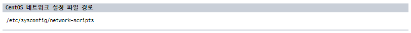
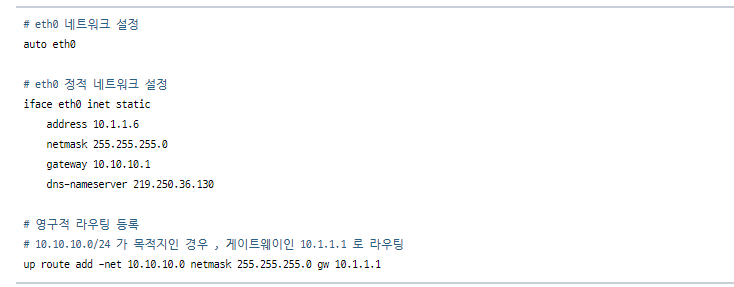
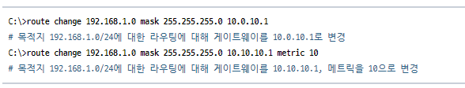
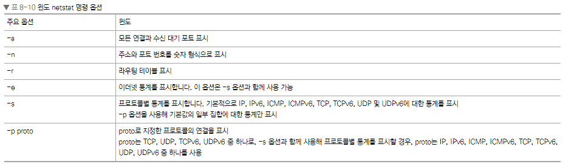
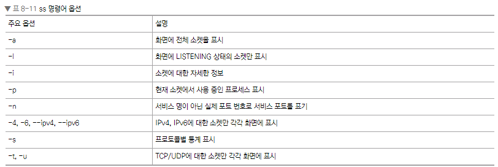
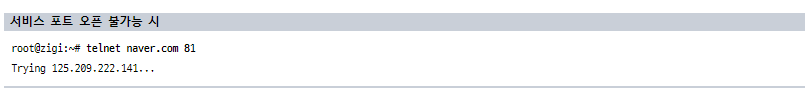

# Chapter 08. 서버 네트워크 기본
## Chapter 8.1 서버의 네트워크 설정 및 확인

서버를 네트워크에 연결해 정상적으로 동작시키려면 먼저 서버에서 환경에 맞는 적절한 네트워크 설정이 필요합니다. 

가장 기본적인 네트워크 설정은 3장(네트워크 통신하기)에서 다룬 IP 주소, 서브넷, 게이트웨이와 7.2 DNS 절에서 다룬 DNS IP 주소입니다. 

서버뿐만 아니라 네트워크에 연결하려는 다른 모든 장비(노트북, 데스크톱, OA기기와 다양한 IoT기기 포함)는 이런 네트워크 정보가 필요합니다. 

다양한 정보를 많은 네트워크 장치에 설정하는 것이 번거로워 이런 필수 정보를 자동으로 설정해주는 DHCP 기술이 주로 사용됩니다. DHCP의 자세한 내용은 7.4 DHCP 절에서 다루었습니다.

이번 장에서는 윈도 서버와 리눅스 서버에서 IP 주소, 서브넷, 게이트웨이, DNS 서버와 같은 네트워크 필수 정보를 어떻게 설정하고 현재 설정된 정보를 어떻게 확인하는지 살펴보겠습니다.

### 8.1.1 리눅스 서버 네트워크


#### 8.1.1.1 CentOS의 네트워크 설정


이 디렉터리에는 인터페이스에 대한 설정이 있는 ifcfg-eth0, eth1과 같은 설정 파일과 인터페이스 up/down과 같은 다양한 인터페이스 제어용 스크립트가 있습니다. 각 인터페이스 설정은 하나의 파일에 모든 인터페이스의 설정 정보를 쓰지 않고 인터페이스별 설정 파일로 관리합니다.


ONBOOT는 부팅 시 해당 인터페이스를 활성화 상태로 사용할 것인지, 비활성화 상태로 사용할 것인지 결정합니다. ONBOOT 속성이 no로 되어 있는 경우, 리부팅 시 인터페이스는 비활성화 상태가 되므로 네트워크에 연결되지 않습니다. 따라서 리부팅 후에도 네트워크를 자동으로 사용하려면 ONBOOT 속성을 yes로 변경해주어야 합니다.

BOOTPROTO는 부팅 시 사용할 프로토콜을 지정하는 설정으로 none, static, dhcp로 설정할 수 있습니다. none으로 설정된 경우 BOOTP(BOOTstrap Protocol)를 사용하며 관리자가 고정 IP를 사용하고 싶을 때는 static으로, DHCP를 이용한 자동 IP 환경이라면 dhcp로 설정할 수 있습니다.

DEFROUTE는 default route라는 명칭을 줄인 설정 값으로 디폴트 라우팅을 설정할 것인지를 결정하는 값입니다. 속성값은 yes나 no 중에서 선택할 수 있고 별도로 이 속성을 사용하지 않을 때는 기본적으로 yes로 인지해 디폴트 라우팅이 생성됩니다.

IP ADDRESS는 서버에서 사용할 IP 주소를 입력하고 PREFIX는 서브넷 마스크를 비트로 기입합니다. GATEWAY와 DNS는 각각 게이트웨이 주소와 DNS 서버 주소를 입력합니다.

그 외에도 MACADDR, NAME, UUID 등 많은 설정값이 있지만 설정하지 않더라도 상관없습니다. 다만 해당 값은 하드웨어에 종속적인 값이므로 네트워크 어댑터 변경과 같이 하드웨어가 변경될 때는 수정해야 합니다.

리눅스에서는 인터페이스의 설정 파일을 수정하더라도 변경한 값이 즉시 적용되지 않습니다. 변경된 설정값을 적용하려면 다음 두 가지 방법 중 하나를 수행해야 합니다.

• 네트워크 서비스 재시작


• 인터페이스 재시작


#### 8.1.1.2 우분투의 네트워크 설정

CentOS는 네트워크 인터페이스별로 설정 파일이 있었지만 우분투는 interfaces 설정 파일에 네트워크의 모든 인터페이스 설정이 들어갑니다. 우분투에서는 다음과 같이 네트워크를 설정할 수 있습니다.


위의 예제에서 볼 수 있듯이 세 개의 인터페이스를 interfaces 파일 한 개에서 모두 정의하고 있습니다. 설정에 필요한 속성값은 CentOS와 거의 비슷하고 속성 이름만 조금 다르므로 설정 파일의 내용만으로도 우분투 네트워크 설정을 쉽게 이해할 수 있을 것입니다.

우분투에서 네트워크 서비스를 시작/정지/재시작하기 위해서는 다음 명령어를 사용합니다.


### 8.1.2 윈도 서버 네트워크

윈도 서버의 네트워크 설정은 노트북이나 데스크톱에서 사용하는 윈도 HOME, PRO 버전 설정과 동일하므로 리눅스보다 접근하기 쉽습니다. 하지만 윈도에서 설정에 접근하는 방법은 여러 가지이고 추가로 netsh과 같은 명령어 기반 설정 방법도 있어 다양한 방법을 하나씩 차근차근 소개할 예정입니다.


1. [네트워크 연결]에서는 그림 8-4처럼 현재 윈도 서버에 구성된 네트워크 어댑터가 보일 겁니다. 특정 네트워크 어댑터를 설정하려면 네트워크 어댑터에서 마우스를 우클릭한 후 팝업 메뉴에서 [속성]을 선택해야 합니다.


2. 여러 가지 서비스 중 Internet Protocol Version 4(TCP/IPv4) 속성을 선택하면 그림 8-5처럼 해당 어댑터에서 사용할 IP 주소, 서브넷, 게이트웨이, DNS 정보를 설정할 수 있습니다.


3. 기본 네트워크 설정 외에 하단의 [고급] 버튼을 클릭하면 그림 8-6처럼 추가적인 네트워크 고급 설정이 가능합니다. 고급 설정을 변경해 사용하는 경우는 많지 않지만 네트워크 어댑터가 두 개 이상이면 네트워크 우선순위를 조절해야 하는 경우가 발생합니다. 기본 설정은 메트릭을 이용한 우선순위 설정이 자동이지만 이런 경우, 메트릭을 자동으로 두지 않고 수동으로 변경해 사용하기도 합니다.


4. 네트워크 속성값 입력을 마친 후 [확인] 버튼을 클릭해야만 네트워크 설정이 완료됩니다.

 

5. 현재 설정한 정보나 기존에 설정된 정보를 확인하기 위해 [명령 프롬프트]에서 ipconfig 명령으로 설정값을 확인할 수 있습니다. 하지만 ipconfig 기본 명령어만으로는 IP 주소, 서브넷 마스크, 게이트웨이 정보와 같은 간단한 정보만 확인할 수 있습니다. 추가적인 상세 정보(MAC 주소, DNS 서버 정보, DHCP 사용 여부 등)는 /all 옵션을 사용해 확인합니다.<BR><BR>
ipconfig /all 옵션을 사용하면 네트워크 어댑터에서 상세 정보를 확인할 수 있습니다. 다음 예시는 어댑터에서 /all로 확인할 수 있는 특정 어댑터 정보입니다.


```
네트워크 어댑터 설정을 위한 netsh 명령

netsh interface ipv4 set address name="인터페이스명" static IP 주소 서브넷 게이트웨이
```

netsh 명령은 윈도 서버 Core 버전과 같이 GUI 환경이 제공되지 않는 환경이나 노트북을 이용할 때, 고정 IP를 사용하는 장소를 자주 옮겨 다닐 때, 스크립트를 만들어 네트워크 설정을 손쉽게 바꾸는 데 유용하게 사용할 수 있습니다. 스크립트는 관리자 권한으로 실행한다는 것도 잊지 마세요!

```
DHCP 환경이라면 source=dhcp로 입력하면 됩니다.

netsh interface ip4 set address name="인터페이스명" source=dhcp
```

```
DNS 서버 주소 정보도 IP 주소 설정 방법과 동일하게 CLI로 설정할 수 있습니다. set address 부분 대신 set dns로 바꾸어 입력하면 됩니다. DNS 서버 주소를 설정하는 명령은 다음과 같습니다.

netsh interface ipv4 set dns name="인터페이스명" static DNS_서버 주소
```

```
윈도에서는 DNS를 두 개 설정할 수 있습니다. 두 번째 DNS 설정 명령은 첫 번째 DNS 설정 명령과 동일하고 명령문 마지막에 index=2를 추가하면 됩니다.

netsh interface ipv4 set dns name="인터페이스명" static DNS_서버 주소 index=2
```

```
DHCP 환경에서 DNS를 설정할 때는 IP 주소 설정과 마찬가지로 source=dhcp로 입력하면 DHCP 로부터 DNS 주소를 자동으로 할당받습니다.

netsh interface ipv4 set dns name="인터페이스명" source=dhcp
```

## Chapter 8.2 서버의 라우팅 테이블


두 네트워크 어댑터에 모두 디폴트 게이트웨이 설정을 하면 정상적으로 통신이 되지 않습니다. 외부 공인망 네트워크와 통신해야 하는 프런트엔드 네트워크 쪽 어댑터에만 디폴트 게이트웨이를 설정하고 백엔드를 연결하는 어댑터에는 별도로 적절한 라우팅 정보를 반드시 설정해주어야 합니다.

### 8.2.1 서버의 라우팅 테이블

라우팅 테이블 확인 항목

• 목적지(Destination)

• 서브넷(Genmask)

• 게이트웨이(Gateway)

• 인터페이스(Iface)

• 우선순위(Metric)


목적지 네트워크와 서브넷은 서버가 통신하려는 목적지 IP 주소에 맞는 라우팅을 선택하는 기준이 됨.

게이트웨이는 선택된 목적지로 가기 위해 서버에서 선택하는 넥스트 홉임

인터페이스는 서버의 네트워크 카드를 말하고 라우팅에서 어떤 물리적인 경로로 패킷을 내보낼지 설정함

우선순위(메트릭)은 동일한 라우팅 테이블이 두 개 이상 존재할 때 어떤 라우팅 테이블을 선택할지 정하는 값. 갑이 낮을수록 우선순위가 높다.

### 8.2.2 리눅스 서버의 라우팅 확인 관리

```
라우팅 테이블 확인 명령어

ip route
```


서버의 네트워크 인터페이스가 두 개 이상으로 구성되었다면 어떤 네트워크 인터페이스를 사용해 패킷을 전송할 것인지 명시해주어야 하는 경우가 있는데 이때 라우팅 테이블을 추가하거나 삭제해 라우팅 테이블을 조정해야 하므로 라우팅 테이블 관리법을 반드시 알아야 합니다.

```
리눅스 서버에서 라우팅 테이블을 추가하는 설정

route add { -host | -net } Target[/prefix] [gw Gw] [metric M] [[dev] If]
```


```
라우팅 테이블 삭제 명령어

route del { -host | -net } Target[/prefix] [gw Gw] [metric M] [[dev] If]
```


#### 8.2.2.1 CentOS의 영구적 라우팅 설정

```
CentOS 리눅스 라우팅 설정 파일

/etc/sysconfig/network-scripts/route-장치명
```

#### 8.2.2.2 우분투의 영구적 라우팅 설정

CentOS에서는 라우팅을 위해 라우팅 설정 파일을 별도로 만들어 사용하지만 우분투에서는 네트워크 설정에서 사용했던 interfaces 파일에 라우팅 설정을 합니다. 우분투의 영구적 라우팅 설정은 일반 라우팅 테이블 설정과 동일한 양식으로 합니다.

```
up route add [-net|-host] <host/net>/<mask> gw <host/IP> dev <Interface>
```

다음은 우분투에서 라우팅 설정을 추가한 interfaces 파일의 예제입니다.



이렇게 설정된 라우팅은 서버를 재부팅하거나 네트워크 서비스를 다시 시작해야 라우팅 테이블에 적용됩니다.

### 8.2.3 윈도 서버의 라우팅 확인 및 관리

윈도 서버(일반 개인용 윈도도 동일)에서 라우팅 테이블을 확인하고 관리하기 위해서는 route 명령을 사용합니다. 윈도에서 route 명령은 4가지 옵션을 사용할 수 있습니다.

• PRINT

• ADD

• DELETE

• CHANGE

```
*를 이용해 10.10.0.0/16에 대한 전체 라우팅 테이블을 확인하고 싶을 때는 다음과 같이 확인할 수 있습니다.

C:\>route print 10.10.*
```

```
또한, ‘?’를 이용해 10.10.10.0/24~10.10.19.0/24에 대한 라우팅 테이블을 확인하고 싶다면 다음과 같이 명령을 입력할 수 있습니다.

C:\>route print 10.10.1?.0
```

```
10.10.10.0~10.10.19.0에 대한 라우팅을 확인하거나 목적지 네트워크가 24비트 이하로 나누어진 세부 라우팅 테이블을 확인할 때는 다음과 같이 ‘*’와 ‘!’를 모두 사용합니다.

C:\>route print 10.10.1?.*
```

```
이어서 윈도 서버의 라우팅 테이블 관리를 위해 라우팅 테이블을 어떻게 추가하고 삭제하는지 알아보겠습니다. 먼저 라우팅 테이블을 추가하는 명령입니다.

ROUTE [ -p ] ADD [ dest ] [ MASK netmask ] [ gateway ] [ METRIC metric ] [ IF interface ]
```


```
다음은 라우팅 테이블을 삭제하는 명령입니다.

ROUTE DELETE [ dest ] [ MASK netmask ] [ gateway ] [ METRIC metric ] [ IF interface ]
```


```
현재의 라우팅 테이블을 변경하는 명령입니다.

ROUTE CHANGE [ dest ] [ MASK netmask ] [ gateway ] [ METRIC metric ] [ IF interface ]
```



## Chapter 8.3 네트워크 확인을 위한 명령어

이번 장에서 다룰 명령어 들은 갑자기 서버가 정상적으로 통신이 되지 않거나 서비스가 정상적으로 제공되지 않는 문제가 발생할 때 더 유용하게 사용될 수 있습니다. 

이번 장에서 다루는 네트워크 관련 명령어를 잘 이해하고 숙지한다면 네트워크 연결에 문제가 발생했을 때 더 쉽게 빨리 찾아내 해결할 수 있을 것입니다.

### 8.3.1 ping(Packet InterNet Groper)

ping은 IP 네트워크를 통해 특정 목적지까지 네트워크가 잘 동작하고 있는지 확인하는 네트워크 명령어입니다.

```
ping 명령의 수행은 아래와 같이 ping 명령어와 목적지 IP만으로 간단히 수행할 수 있습니다.

ping [옵션] 목적지_IP 주소
```

ping에서 사용되는 주요 옵션


### 8.3.2 tcping(윈도)

ping은 목적지 단말이 살아 있는지 확인하고 출발지와 목적지까지의 네트워크가 잘 연결되어 있는지 확인하는 명령이다. 

하지만 목적지 단말이 잘 살아 있고 중간 경로에 문제가 없더라도 서비스 포트가 정상 상태인지 ping만으로는 확인할 수 없다.

따라서 목적지의 실제 서비스 포트로 정상적인 통신이 가능한지 확인하는 작업이 매우 중요하다. tcping 프로그램을 통해 서비스 포트가 정상적으로 열려 있는지 확인할 수 있다.

```
tcping의 사용법은 다음과 같습니다.

tcping [옵션] 목적지_IP 주소
```


### 8.3.3 traceroute(리눅스)/tracert(윈도)

traceroute는 출발지부터 통신하거나 목적지까지의 네트워크 경로를 확인할 때 사용하는 네트워크 명령어입니다. 

ping은 목적지 단말이 잘 동작하는지 확인하는 데 사용되고 icmp 메시지를 이용해 중간 경로에 문제가 있을 때 이것을 확인할 수 있었지만 traceroute는 중간 경로의 더 상세한 정보를 얻는 데 사용됩니다. 

중간 네트워크 장비가 아닌 출발지 pc에서 목적지까지의 라우팅 경로를 확인할 수 있고 목적지까지의 통신에 문제가 있을 때, 어느 구간부터 문제가 발생했는지 찾아낼 수 있습니다. 

추가로 목적지까지의 네트워크 응답 시간이 느린 경우, 어느 구간에서 응답 시간이 느려지는지도 알아낼 수 있습니다.

traceroute는 IP 헤더의 TTL(Time To Live) 필드를 이용합니다. TTL을 1부터 1씩 증가시키면서 목적지에 도달할 때까지 패킷을 반복적으로 전송하면서 경로를 추적합니다. 

인터넷 구간에서 경로를 찾지 못하거나 잘못 전송된 패킷이 무제한적으로 계속 돌아다니지 않도록 IP 헤더에 패킷이 살아 있을 수 있는 한계를 명시하는데 이 정보를 TTL이라고 합니다. 

인터넷 구간에서 라우터 장비를 하나 지날 때마다 패킷의 TTL 값이 1씩 줄고 TTL이 0이 되는 순간, 해당 라우터에서 이 패킷을 드롭시키고 icmp 메시지를 이용해 출발지 단말에 패킷을 드롭한 이유를 알려줍니다. 

TTL이 1일 때는 1홉까지의 장비로 전달되고 TTL이 0으로 만료되면서 해당 장비는 ‘ICMP time exceed’ 메시지를 출발지로 전달합니다. 

traceroute는 이 메시지를 전달한 장비의 IP를 출력하는 과정을 반복하면서 경로를 추적합니다. 

즉, traceroute 경로 추적은 IP 헤더인 3계층 정보에 의한 경로 추적이므로 2계층 이하의 스위치 장비 추적은 불가능합니다. 라우팅이 동작하는 라우터나 L3 스위치와 같은 3계층 장비의 경로만 확인할 수 있습니다.

traceroute로 두 호스트 간 경로가 의도대로 정상적인 경로인지 확인하려면 각 호스트에서 trace route를 모두 수행해야 합니다. 

예를 들어 그림 8-12처럼 서버 #1과 서버 #2가 있고 두 호스트로 가는 경로가 두 개인 경우, 서버 #1에서 서버 #2로 가는 경로와 서버 #2에서 서버 #1로 가는 경로 설정이 다를 수 있습니다. 

즉 비대칭 경로인 경우입니다. 라우터와 같이 L3 장비로만 구성되어 라우팅만 이루어지는 상황에서는 비대칭 경로여도 서비스에 문제가 없지만 라우팅 외에 세션을 확인하는 보안 장비가 중간에 섞여 있다면 비대칭 경로에 의해 통신이 차단될 수도 있습니다. 

이렇게 패킷이 비대칭 경로임을 찾아내려면 서버 #1과 서버 #2에서 traceroute를 각각 수행한 결괏 값으로 경로를 검증해야 합니다.


traceroute 명령어에 대해 알아보겠습니다. 리눅스 계열과 윈도 계열에서의 traceroute 명령어는 다음과 같습니다.

• 리눅스: traceroute [옵션] 목적지_IP 주소

• 윈도: tracert [옵션] 목적지_IP 주소


traceroute 경로 추적은 화면상에 모든 경로가 표기되지 않을 수 있습니다. 

보안상의 이유로 중간에 있는 보안 장비에서 icmp 메시지나 UDP 패킷을 차단하는 경우나 중간의 라우터 장비에서 자신의 IP가 노출되는 것을 막기 위해 traceroute icmp 메시지에 대해 응답하지 않을 때는 응답 시간이 아닌 ***로 표기됩니다.


### 8.3.4 tcptraceroute

traceroute는 경로 추적만 가능하며 서비스를 위한 서비스 포트가 정상적으로 열리는지 확인할 수 없습니다.

 서비스에 문제가 생겼을 때는 중간 경로에서 차단되었는지, 최종 목적지에서 차단되었는지, 목적지 단말에서 서비스를 제대로 오픈하지 못했는지 확인해야 합니다. 이런 여러 가지 사항을 한꺼번에 확인할 수 있는 명령어가 tcptraceroute(tcptrace)입니다.

 ```
 리눅스에서 tcptraceroute 설치

# yum install traceroute     # CentOS/레드햇 계열
$ apt-get install traceroute # 우분투/데비안 계열
 ```

 ```
 리눅스 계열과 윈도 계열에서의 tcptraceroute 명령어는 다음과 같습니다.

tcptraceroute [옵션] 목적지_IP 주소 [서비스 포트]       # 리눅스
tcproute [옵션] 목적지_IP 주소                          # 윈도
 ```

 

 

### 8.3.5 netstat(network statistics)

netstat은 서버의 다양한 네트워크 상태를 확인하는 데 사용하는 명령어입니다. 여러 가지 네트워크 관련 정보를 확인할 수 있어 사용 범위가 매우 넓지만 서비스 포트 상태를 확인하는 용도로 가장 많이 사용됩니다

```
리눅스 계열과 윈도 계열에서의 netstat 명령어

netstat [옵션]
```




 -ant 옵션으로 TCP에 대한 모든 연결과 수신 대기 정보를 숫자로 표기해 출력


 TCP 프로토콜(-p TCP)에 대한 통계 값(-s)을 확인하는 예제입니다.


### 8.3.6 ss(socket statistics)

ss는 소켓 정보를 확인할 수 있는 네트워크 명령어입니다. 기존 netstat 명령어를 대체하는 것뿐만 아니라 다양한 옵션을 제공해 더 많은 정보를 추가로 확인할 수 있습니다. 

ss는 화면에 표기할 정보를 커널 스페이스를 통해 직접 가져오므로 netstat보다 결과를 빨리 확인할 수 있습니다.

```
ss 명령어는 다음과 같이 사용합니다.

ss [ 옵션 ] [ 필터 ]
```



```
다음은 IPv4 연결 정보 중 TCP 상태가 커넥티드인 연결에 대한 세부적인 정보 값을 확인하는 예제입니다.

ss -it4 state connected
```

-i 옵션은 현재 소켓에 대한 세부적인 정보 값을 볼 수 있도록 하고 -t는 TCP에 대한 정보, -4는 IPv4에 대한 정보를 화면에 출력시킵니다. 이 정보 중 connected 상태인 연결 정보들만 필터링하면 최종 결괏값이 보입니다.

ss에서 state(연결 상태)로 필터링할 수 있는 상태 값은 established, syn-sent, syn-recv, fin-wait-{1,2}, time-wait, closed, close-wait, last-ack, listen, closing 등입니다. 이 상태 값을 적절히 사용하려면 앞에서 언급했듯이 각 상태 값의 의미를 이해해야 합니다.

### 8.3.7 nslookup(name server lookup)

nslookup은 DNS(Domain Name Server)에 다양한 도메인 관련 내용을 질의해 결괏값을 전송받을 수 있는 네트워크 명령입니다. 가장 자주 사용되는 질의는 특정 도메인에 매핑된 IP 주소를 확인하기 위해 사용하는 것입니다.

nslookup 명령어를 사용하면 운영체제에 설정했던 네트워크 설정 정보를 이용해 DNS 서버 주소로 질의를 보내지만 필요한 경우, 옵션값으로 질의하려는 DNS 서버를 변경할 수 있습니다. 

DNS 서버 변경은 보통 특정 도메인의 변경된 설정값이 외부 DNS로 잘 전파되었는지 확인할 때 사용됩니다. 

대부분의 인터넷 사용자들이 주요 통신사의 DNS 서버를 참조하고 있으므로 외부 DNS 서버에 변경 정보가 전파되었는지 확인하려면 통신사 DNS 서버에 질의해 확인하는 것이 좋습니다. 이때 사용되는 DNS 서버 정보는 다음과 같습니다.


### 8.3.8 telnet(tele network)
텔넷은 원격지 호스트에 터미널 연결을 위해 사용되는 매우 오래된 표준 프로토콜입니다. 다양한 텔넷 프로그램을 이용해 서버에 접근해 관리하는 용도로 사용되지만 네트워크 문제 해결을 위해 특정 서버의 서비스에 대한 접근 가능성을 테스트하는 데도 사용할 수 있습니다

```
서비스 확인을 위한 텔넷 사용법은 다음과 같습니다.

  telnet 목적지 IP 서비스 포트
```




텔넷으로 서비스를 테스트할 때 접근이 불가능한 이유는 여러 가지가 있지만 보통 다음과 같은 몇 가지 경우가 대부분입니다.

출발지 네트워크 설정이나 연결이 올바르다고 가정하겠습니다.

• 도착지 단말이 꺼져 있거나 네트워크에 정상적으로 연결되어 있지 않은 경우

• 도착지 단말의 네트워크 설정에 문제가 있는 경우

1. 출발지로부터 해당 서비스가 동작 중인 서버까지의 경로가 정상적으로 잡혀 있지 않은 경우

2. 출발지로부터 해당 서비스가 동작 중인 서버까지의 경로상 보안 장비 등에 의해 차단된 경우

3. 도착지 단말의 방화벽이나 iptables와 같은 보안 기능에서 차단된 경우

4. 도착지 단말이 정상적으로 서비스가 열려 있지 않은 경우(서비스 포트가 Listening 상태가 아니거나 서버 서비스가 구동되지 않았거나 다른 포트로 매핑되어 서비스가 올라온 경우)

### 8.3.9 ipconfig

ipconfig는 네트워크 설정을 확인하는 윈도 명령으로 앞에서 기본 명령에 대해 간단히 다루었습니다. 자주 사용하는 두 가지 옵션을 추가로 알아보겠습니다.


```
먼저 DHCP 환경에서 할당받은 현재 IP 주소를 해제(release)하고 갱신(renew)하는 옵션입니다.

ipconfig /release # 네트워크 주소 해제
ipconfig /renew   # 네트워크 주소 갱신
```

```
다음은 현재 서버에서 도메인에 대한 로컬 캐시 정보를 지우기 위해 사용하는 옵션입니다.

C:\>ipconfig /flushdns

Windows IP 구성

DNS 확인자 캐시를 플러시했습니다.
C:\>
```

### 8.3.10 tcpdump

tcpdump는 네트워크 인터페이스로 오가는 패킷을 캡처해 보는 기능의 명령어입니다. 평소에는 사용하지 않지만 장애 처리나 패킷 분석이 필요할 때 자주 사용하는 명령어입니다.


```
웹 서비스에 대한 패킷만 캡처하고 싶을 때는 tcp와 port 옵션을 사용할 수 있습니다.

HTTP 서비스 패킷 캡처

tcpdump -i eth0 tcp port 80
```

특정 웹 사이트의 웹 서비스에 대한 패킷만 캡처하고 싶을 때는 tcp, port 옵션과 함께 host 옵션을 사용합니다. 출발지나 목적지를 지정한 src나 dst를 사용할 수도 있지만 서비스에 대한 요청과 응답을 모두 보려면 host 옵션을 사용해 필터링해야 합니다.


