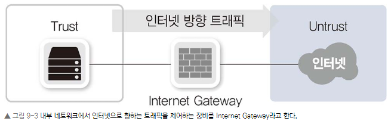
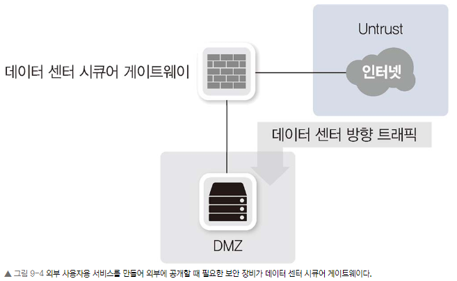

### Chapter 09 보안

#### Chapter 9.1 보안의 개념과 정의

다음의 3대 보안 정의를 보안의 필수 요소로 볼 수 있습니다.

• 기밀성(Confidentiality)

>인가되지 않은 사용자가 정보를 보지 못하게 하는 작업입니다. 가장 대표적인 기밀성은 암호화 작업입니다.

• 무결성(Integrity)
> 정확하고 완전한 정보 유지에 필요한 모든 작업을 말합니다. 누군가가 정보를 고의로 훼손하거나 중간에 특정 이유로 변경이 가해졌을 때, 그것을 파악해 잘못된 정보가 전달되거나 유지되지 못하게 하는 것이 무결성입니다.

• 가용성(Availability)
> 정보가 필요할 때, 접근을 허락하는 일련의 작업입니다. 보안에 대해 잘 모르는 분들은 가용성이 보안에 포함된 것이 의아할 수 있습니다. 우리가 유지하는 정보에 대해 사고날 염려 없이 온전한 상태를 유지하는 것이 정보 보안이므로 어떤 이유에서라도 그 정보를 사용할 수 없는 상황이라면 정보 보안에 실패한 것입니다.

이 3대 요소 외에 추가로 진정성, 책임성, 부인 방지, 신뢰성 유지를 정보 보안 활동 중 하나로 정의하기도 합니다.

#### 9.1.2 네트워크의 정보 보안

 정보를 가진 시스템을 공격해 유출하거나 사용하지 못하게 하거나 시스템이 동작하지 못하게 해 정보 서비스를 정상적으로 구동할 수 없게 만드는 행위를 네트워크에서 적절히 막는 것이 네트워크 보안의 1차 목표입니다. 
 
 또한, 정보는 여러 가지 서비스를 제공하기 위해 한 자리에만 있는 것이 아니라 네트워크를 통해 복제, 이동되므로 그 유출을 막는 것이 2차 목표입니다.

#### 9.1.3 네트워크 보안의 주요 개념

네트워크 보안의 목표는 외부 네트워크로부터 내부 네트워크를 보호하는 것입니다. 이때 외부로부터 보호받아야 할 네트워크를 트러스트(Trust) 네트워크, 신뢰할 수 없는 외부 네트워크를 언트러스트(Untrust) 네트워크로 구분합니다.

우리가 운영하는 내부 네트워크이지만 신뢰할 수 없는 외부 사용자에게 개방해야 하는 서비스 네트워크인 경우, DMZ 네트워크라고 부른다.

네트워크 보안 분야는 트래픽의 방향과 용도에 따라 두 가지로 나눌 수 있습니다.

• 인터넷 시큐어 게이트웨이(Internet Secure Gateway)

- 트러스트(또는 DMZ) 네트워크에서 언트러스트 네트워크로의 통신을 통제

• 데이터 센터 시큐어 게이트웨이(Data Center Secure Gateway)

- 언트러스트 네트워크에서 트러스트(또는 DMZ)로의 통신을 통제

#### 9.1.3.1 네트워크 보안 정책 수립에 따른 분류
- 화이트리스트
>화이트리스트는 방어에 문제가 없다고 명확히 판단되는 통신만 허용하는 방식. 일반적으로 회사 내부에서 사용하는 방화벽이 명확한 정책에 의해 필요한 서비스만 허용하는 화이트리스트 방식을 주로 사용한다.

- 블랙리스트
> 방어는 공격이라고 명확히 판단되거나 문제가 있었던 IP 리스트나 패킷 리스트를 기반으로 데이터베이스를 만들고 그 정보를 이용해 방어하는 형태.

#### 9.1.3.2 정탐, 오탐, 미탐(탐지 에러 타입)
공격을 탐지할 때 원래 예상한 내용과 다른 결과가 나올 수 있다. 이런 경우를 오탐지, 미탐지로 구분하고 정상적으로 탐지한 경우를 정상 탐지으로 표현한다. 예상했던 상황과 탐지 결과에 따라 4가지 경우가 나타날 수 있다.

#### 9.1.4 네트워크 정보 보안의 발전 추세와 고려사항
트워크 보안 장비와 서비스를 이해하려면 인프라스트럭처의 변화와 해킹 기법의 발전을 모두 이해해야 하고 반대로 인프라스트럭처의 발전을 이용해 더 높은 수준의 네트워크 보안을 제공하는 보안업체의 대응도 눈여겨 보아야 합니다.

#### Chapter 9.2 보안 솔루션의 종류

#### Chapter 9.3 방화벽

#### Chapter 9.4 IPS, IDS

#### Chapter 9.5 DDoS 방어 장비

#### Chapter 9.6 VPN