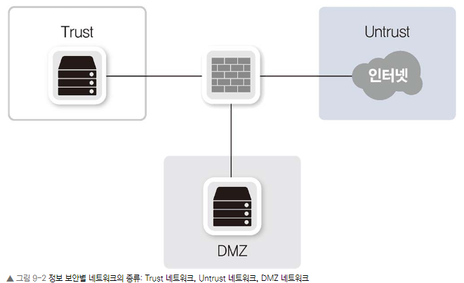

## Chapter 11. 이중화 기술

## Chapter 11.1 이중화 기술 개요

이중화를 하지 않았을 때 발생하는 SPoF(Single Point of Failure) 문제점과 이중화의 목적

### 11.1.1 SPoF
"'단일 장애점(Single Point of Failure(SPoF),)'은 시스템 구성 요소 중 동작하지 않으면 전체 시스템이 중단되는 요소를 말합니다.

단일 고장점 또는 단일 실패점이라고도 합니다.

인프라를 설계할 때는 SPoF를 만들지않도록 해야한다.

### 11.1.2 이중화의 목적
안정적인 서비스 제공을 위해 네트워크를 포함한 모든 인프라에서 반드시 갖추어야 할 요소 중 하나는 이중화입니다.

복수 개 이상으로 인프라를 구성해 특정 인프라에 문제가 발생하더라도 이중화된 다른 인프라를 통해 서비스가 지속되도록 해준다.

특정 인프라의 장애 상황에서도 서비스는 가능하므로 서비스의 연속성이 보장되고 이것을 폴트 톨런스(Fault Tolerance(FT); 장애 허용, 결함 감내)가 보장된다고 말하기도 합니다.

## 11.2 LACP

벤더 독자적인 방법으로는 다른 장비끼리 연결할 때 호환성 문제가 발생해 1887년 11월, IEEE 802.3 그룹이 이 문제를 해결하기 위해 상호호환 가능한 연결 계층(Link Layer) 표준화를 시작했습니다. 

이 표준화가 바로 LACP(Link Aggregation Control Protocol)입니다.

LACP는 액티브-액티브 구조이므로 LACP로 구성하는 논리 인터페이스의 대역폭을 서비스에 필요한 전체 트래픽 기준으로 서비스 트래픽을 산정하면 안된다.

LACP를 사용해 액티브-액티브로 구성하면 모든 인터페이스를 동시에 사용할 수 있어 1G 두 개를 묶어 2G로 구성할 수 있지만 하나의 물리 인터페이스의 문제로 장애가 발생하면 대역폭이 1G만 남으므로 정상적인 서비스를 제공하지 못하게 된다.

따라서 액티브-액티브 구조로 만들더라도 이런 부분을 고려해 대역폭을 산정해야 한다.

### 11.2.1 LACP 동작 방식

LACP를 통해 장비 간 논리 인터페이스를 구성하기 위해 LACPDU라는 프레임을 사용한다.

LACP를 구성하기 위한 출발지 주소, 목적지 주소, 타입, 서브 타입, 버전 정보 등을 매초마다 주고 받는다.

LACP가 연결되려면 LACPDU를 주고 받는 장비가 한 장비여야 한다.

### 11.2.2 LACP와 PXE

PXE(Pre-boot eXecution Environment)를 이용할 때는 서버가 운영체제를 설치하기 전 단계이므로 본딩과 티밍 같은 논리 인터페이스를 설정할 수 없습니다.

이 경우 네트워크 장비에서는 서버로부터 LACPDU를 수신할 수 없으므로 해당 인터페이스는 정상적으로 활성화되지 않습니다. 

따라서 LACP로 구성하려는 서버를 PXE로 운영체제를 설치할 때는 LACP 인터페이스가 아닌 일반 인터페이스로 구성해 운영체제를 설치하고 운영체제에서 LACP 설정을 다시 한 후 스위치 포트 설정을 다시 변경해야 한다.

이것을 해결하기 위해 네트워크 장비에서 LACP를 설정할 때, 일정 시간 동안 LACPDU를 수신하지 못하면 한 개의 인터페이스만 활성화하고 LACPDU가 다시 수신되기 시작하면 두 개 인터페이스를 모두 활성화할 수 있는 옵션을 제공한다.

## 11.3 서버의 네트워크 이중화 설정(Windows, Linux)

인터페이스 이중화에 사용되는 기술 명칭은 윈도와 리눅스에 따라 다음과 같이 부른다.
- 윈도: 팀/team/티밍/teaming
- 리눅스: 본드/bond/본딩/bonding

서버 인터페이스를 이중화하면 네트워크 장비와 마찬가지로 논리 인터페이스가 생성된다. 이때 생성되는 논리 인터페이스의 이름이 각 운영체제의 네트워크 이중화의 기술명이다.

이 기술을 티밍이라고 하고 리눅스는 본드라는 논리 인터페이스가 만들어지고 이 기술을 본딩이라고 한다.

### 11.3.1 리눅스 본딩 모드
리눅스 본딩 모드는 모드 0~4까지 있습니다.

액티브-스탠바이로는 모드 1을 사용하고 액티브-액티브로는 모드 4를 사용하며 나머지 모드는 보통 잘 사용하지 않습니다.

### 11.3.2 윈도 티밍 모드
윈도 티밍 모드는 7가지가 있지만 여기서는 현업에서 주로 쓰이는 두 가지만 설명합니다.

#### 11.3.2.1 스위치 독립(Switch Independent) 구성

팀을 구성하는 멤버 인터페이스가 스위치의 구성에 독립적인 경우

즉 스위치에서는 팀의 이중화에 관여하지 않는 구성이며 액티브-스탠바이 구성이라고 할 수 있다.

#### 11.3.2.2 LACP
리눅스 서버의 모드 4와 동일한 LACP 구성이다. 표준 프로토콜인 LACP를 이용해 팀을 액티브-액티브로 구성할 때 사용한다.

### 11.4 MC-LAG

스위치에서도 서버 이중화 구성처럼 서로 다른 스위치 간의 단일 MAC 주소를 사용해 액티브-액티브 형태의 이중화 구성을 할 수 있다.

MC-LAG(Multi-Chassis Link Aggregation Group) 기술로 서로 다른 스위치 주소를 만들어 논리 인터페이스로 LACP를 구성할 수 있다.

VPC, MLAG. MC-LAG 서로 다른 스위치에서 하나의 가상의 논리 인터페이스를 만드는 기술

#### 11.4.1 MC_LAG 동작 방식

MC-LAG을 구성하는 장비를 피어장비라고 한다.

- MC-LAG 도메인(Domain)
두 Peer 장비를 하나의 논리 장비로 구성하기 위한 영역 ID. Peer 장비는 이 영역 ID를 통해 상대방 장비가 Peer를 맺으려는 장비인지 판단한다.

- 피어 링크(Peer-Link)
MC-LAG을 구성하는 두 Peer 장비 간의 데이터 트래픽을 전송하는 인터링크입니다.

피어 링크를 이용할 경우, 각 피어의 VLAN 인터페이스의 IP를 설정하고 이 IP를 이용해 통신할 수 있다.

별도의 데이터 트래픽을 위한 인터페이스를 사용한다면 L3 인터페이스로 구성해 이 인터페이스의 IP를 이용해 통신할 수도 있다.

### 11.5 게이트웨이 이중화

#### 11.5.1 게이트웨이 이중화란?

특정 호스트가 동일한 서브넷에 있는 내부 네트워크와 통신할 때는 ARP(Address Resoultion Protocol)를 직접 브로드캐스트해 출발지와 목적지가 직접 통신합니다.

이때 3계층 장비인 라우터의 도움 없이 직접 통신하므로 실무에서는 이것을 L2 통신이라고 부르기도 합니다. 

목적지가 출발지 호스트의 서브넷에 포함되지 않은 외부 네트워크인 경우, 목적지와 통신하기 위해 게이트웨이를 통해야 하는데 이런 통신을 L3 통신이라고 한다.

게이트웨이 장비에 장애가 발생하면 어떻게 될까?

IP 주소와 하나의 MAC 주소를 갖고 하단 호스트들이 그 가상 IP와 MAC 주소를 알 수 있다면 위의 3가지 예제와 같은 장애가 발생하더라도 통신할 수 있지 않을까요?

이런 경우에 사용하는 프로토콜이 바로 FHRP(First Hop Redundancy Protocol)라는 게이트웨이 이중화 프로토콜이다.

#### 11.5.2 FHRP
FHRP는 외부 네트워크와 통신하기 위해 사용되는 게이트웨이 장비를 두 대 이상의 장비로 구성할 수 있는 프로토콜입니다. 

FHRP 기술에 대한 표준 프로토콜은 VRRP(Virtual Router Redundancy Protocol)입니다. 

VRRP는 표준 프로토콜이므로 게이트웨이 이중화 기술로서 거의 모든 벤더 장비가 VRRP 기능을 지원한다.

#### 11.5.3 올 액티브 게이트웨이 이중화

MC-LAG 기술을 사용할 때는 게이트웨이 이중화 가상 IP와 MAC 주소를 액티브 장비와 스탠바이 장비에서 모두 사용할 수 있도록 해 게이트웨이를 액티브-액티브 형태로 구성하는 기능을 제공한다.

게이트웨이를 액티브-액티브로 구성하면 액티브 장비로 들어오는 트래픽은 물론 스탠바이 장비로 들어오는 트래픽도 스탠바이 장비에서 직접 처리해 트래픽 흐름을 최적화할 수 있다.

#### 11.5.4 애니캐스트 게이트웨이
액티브-액티브 게이트웨이는 네트워크가 한 위치에 존재할 때 게이트웨이를 이중화하는 방식이다.

오버레이 기반의 SDN 네트워크를 구현하면 같은 네트워크가 여러 위치에 존재하게 네트워크를 디자인할 수 있는데 게이트웨이가 한 곳에 위치하게 되면 모든 트래픽이 하나의 게이트웨이를 거쳐 통신하게 되므로 통신이 비효율적이다.

이런 경우, 애니캐스트를 사용하여 여러 개의 같은 IP를 가지는 게이트웨이가 존재하지만 가장 가까운 위치에 있는 게이트웨이에서 서비스를 제공한다.