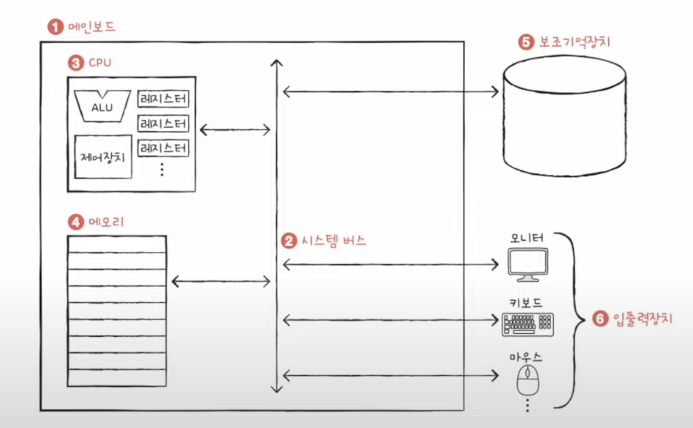

# Chapter 01. 컴퓨터 구조 시작하기

## 01 - 1 컴퓨터 구조를 알아야 하는 이유

 

    Keyword : 문제해결, 성능/용량/비용 

- 컴퓨터 구조는 개발자의 필수 기본 지식  

- 컴퓨터 구조를 알아야 하는 이유

    - 문제 상황을 빠르게 진단, 문제 해결의 실마리

    - 성능/용량/비용과 직결

---
 

## 01 - 2 컴퓨터 구조의 큰 그림
 

    Keyword : 데이터, 명령어, 메모리, CPU, 보조기억장치, 입출력장치, 시스템 버스

### 1. 컴퓨터가 이해하는 정보 

- 데이터

    - 컴퓨터가 이해하는 숫자, 문자, 이미지 동영상과 같은 정적인 정보

- 명령어  

    - 데이터를 움직이고 컴퓨터를 작동시키는 정보     

 

### 2. 컴퓨터의 네가지 핵심 부품
 

- CPU

    - 메모리에 저장된 명령어를 읽어들이고 해석하고 실행
    
    - ALU(산술논산연산장치)
    
        - 계산 장치
      
    - 레지스터

        - 작은 임시 저장 장치
    
    - 제어장치

        - 제어 신호를 보내고 명령어를 해석하는 장치

- 메모리

    - 현재 실행되는 프로그램의 명령어와 데이터를 저장

    - 저장된 값에 빠르고 효율적으로 접근하기 위해 '주소'라는 개념 사용

- 보조기억장치

    - 전원이 꺼져도 보관될 프로그램을 저장 (SSD, HDD, USB ..) 

- 입출력장치  

    - 컴퓨터 외부에 연결되어 컴퓨터 내부와 정보를 교환 (모니터, 키보드, 마우스 ..)

- 시스템 버스

    - 컴퓨터의 네가지 핵심 부품이 서로 정보를 주고 받는 통로 

    - 주소버스, 데이터 버스, 제어 버스로 구성

