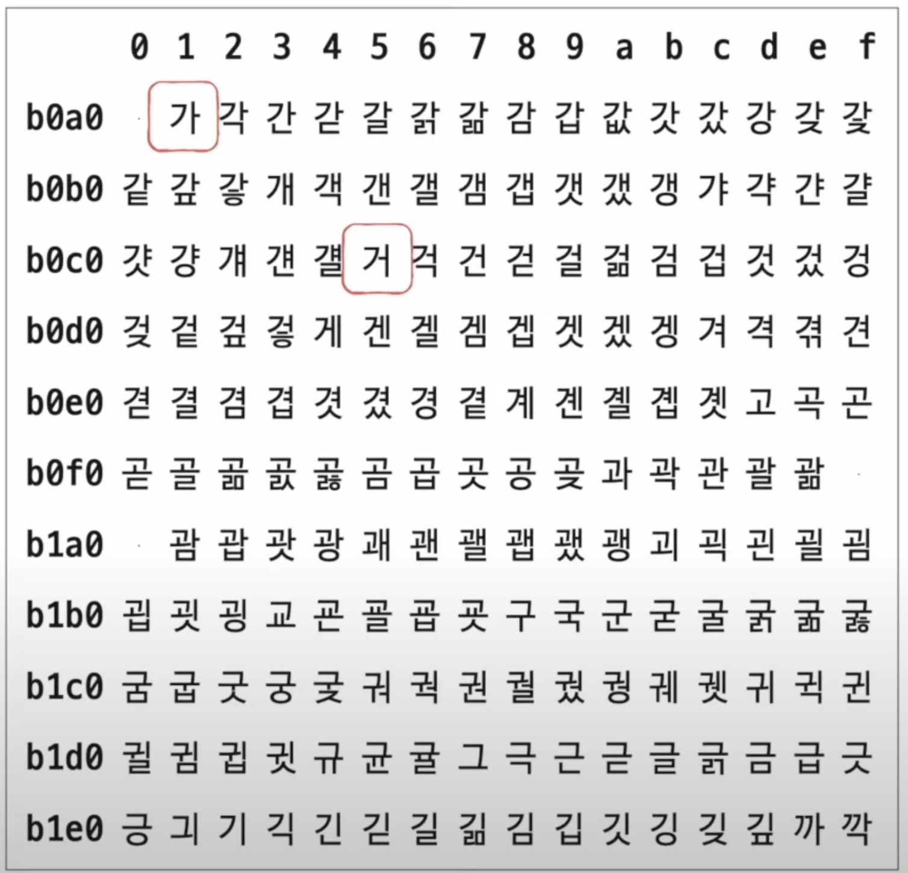
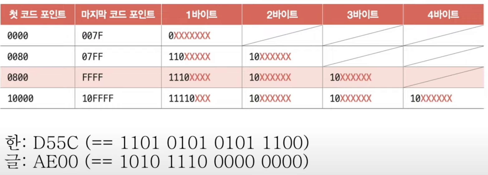

# Chapter 02. 데이터

## 02 - 1 0과 1로 숫자를 표현하는 방법

 

    Keyword : 비트, 바이트, 이진법, 2의 보수, 십육진법

- 비트

    0과 1을 나타내는 가장 작은 정보 단위 

- 바이트 

    여덟 개의 비트를 묶은 단위

- 워드 
    
    CPU가 한번에 처리할 수 있는 데이터 크기

    인텔의 x86 CPU는 32비트 워드 CPU, x64 CPU는 64 비트 워드 CPU 

---
 

- 이진법 
    
    0과 1만으로 모든 숫자를 표현하는 방법

    이진수는 끝에 아래첨자(2)를 붙이거나 앞에 0b로 표기

- 십진법 

    0 ~ 9 까지 10개의 숫자로 모든 수를 표현하는 기법

- 십육진법 
    
    0 ~ F까지 10개의 글자로 모든 수를 표현하는 방법 / 10 이후의 수는 A,B,C,D,E,F로 표현

    십육진수는 끝에 아래첨자(16)을 붙이거나 앞에 0x로 표기

- 2의 보수 
    
    모든 0과 1을 뒤집고 +1을 해준 값
    
    ex ) 11의 보수는 01

    0이나 2^n을 표현할 수 없는 한계

- 플래그 

    컴퓨터 내부에서 수를 다룰 때 이 수가 양수인지 음수인지를 구분하기 위해 사용

- 십육진수 <-> 이진수

    - 십육진수 -> 이진수 
        
        한글자를 4자리의 이진수로 간주

    - 이진수 -> 십육진수 
        
        이진수를 4개씩 끊어서 한글자로 변환
---
 

## 02 - 2 0과 1로 문자를 표현하는 방법
 

    Keyword : 문자 집합, 아스키 코드, EUC-KR, 유니코드

- 문자 집합

    컴퓨터가 인식하고 표현할 수 있는 문자의 모음

- 문자 인코딩

    문자 집합에 속한 문자를 0과 1로 변환하는 과정     

- 문자 디코딩

    0과 1로 이루어진 문자 코드를 사람이 이해할 수 있는 문자로 변환하는 과정  

---
 

- 아스키 코드

    아스키는 초창기 문자 집합 중 하나로, 영어 알파벳과 아라비아 숫자, 일부 특수 문자를 포함

    아스키 문자는 각 7비트로 표현되는데 7비트로 표현할 수 있는 가짓수는 2^7개로 128개의 문자를 표현할 수 있음

    실제 하나의 아스키 문자는 8비트로 표현되지만 그 중 1비트는 패리티 비트로 오류 검출을 위해 사용되는 비트

    매우 간단하게 인코딩되는 장점이 있지만 한글을 표현하지 못하는 단점

- EUC-KR

    한글 인코딩은 완성형과 조합형이 존재

    완성형은 초성, 중성, 종성으로 이루어진 완성된 글자에 하나의 코드를 부여하는 방식

    조합형은 초성, 중성, 종성이 따로 코드를 가지고 있으며 이것을 조합하여 만드는 방식

    EUC-KR는 대표적인 완성형 인코딩이며 한 단어에 2바이트 크기의 코드를 부여하므로 총 16비트가 필요하고 4자리의 십육진수로 표현

    

    총 2350개 정도의 한글 단어를 표현할 수 있지만 쀍,믜 같은 글자는 표현할 수 없음

    이러한 문제를 해결하기 위해 CP949가 등장했지만 한글 전체를 표현하기에는 부족

- 유니코드

    여러 나라의 문자를 광범위 하게 표현할 수 있는 통일된 문자 집합

    글자에 부여된 값 자체를 인코딩된 값으로 삼지 않고 이 값을 다양한 방법으로 인코딩

- UTF-8

    1바이트부터 4바이트까지의 인코딩 결과를 만들어냄

    1바이트가 될 수도 4바이트가 될 수도 있음

    

    예를 들어, 한에 부여된 값은 D5CC, 글에 부여된 값은 AE00이라고 했을 때 두 글자 모두 0800 ~ FFFF 사이에 있기 때문에 3바이트로 표현됨

    D55C와 AE00를 이진수로 변환하고 그 값을 X에 넣으면 UTF-8 인코딩

미니 프로젝트를 했을 때 csv를 불러오는 과정에서 디코딩 문제가 발생하는 이유를 알게 되었음