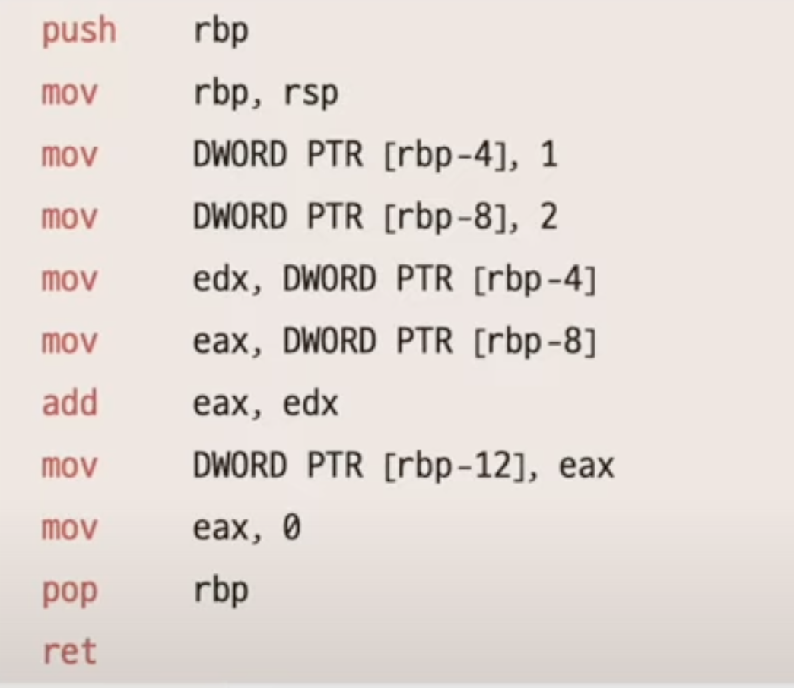
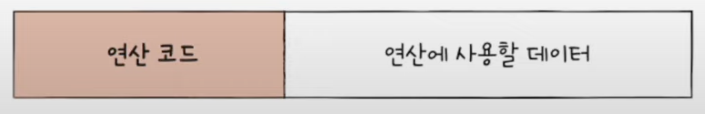
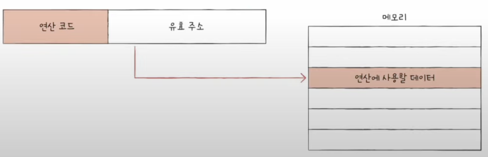
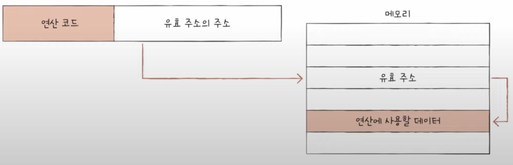
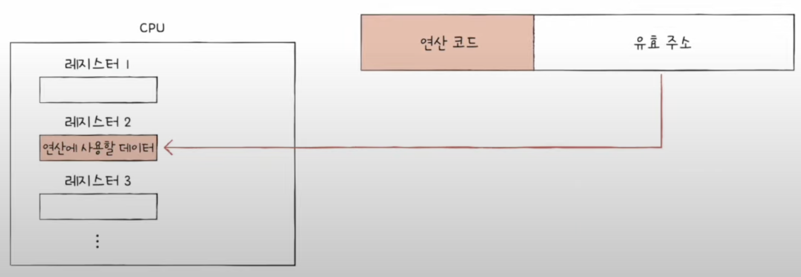
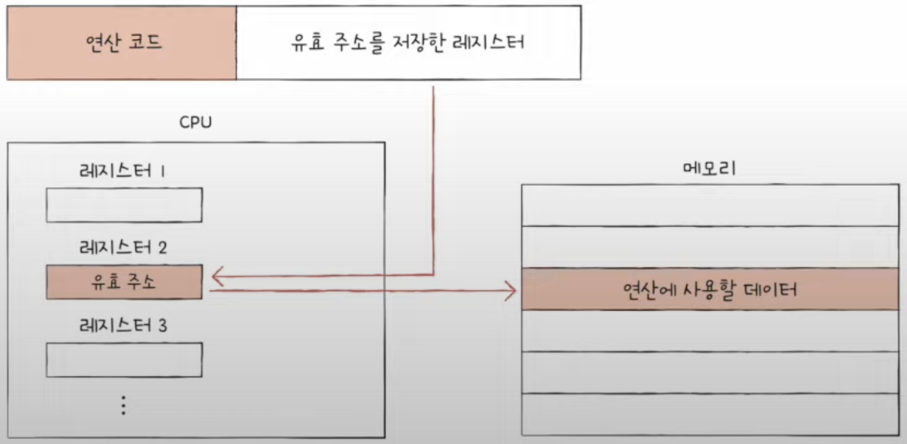

# Chapter 03. 명령어

## 03 - 1 소스 코드와 명령어

 

    Keyword : 고급 언어, 저급 언어, 기계어, 어셈블리어, 컴파일 언어, 인터프리터 언어

- 고급 언어

    C++, C, Java, Python과 같이 사람이 이해하고 작성하기 쉽게 만들어진 언어 

- 저급 언어 

    컴퓨터가 직접 이해하고 실행할 수 있는 언어

    - 기계어 : 0과 1의 명령어 비트로 이루어진 언어

    - 어셈블리어 : 기계어를 읽기 편한 형태로 번역한 언어

        임베디드, 게임, 정보 보안 분야는 어셈블리어를 사용
---
 

- 고급 언어가 저급 언어로 변환되는 과정
    
    - 컴파일 언어

        대표적 컴파일 언어 : C, C++, Go

        소스 코드 전체가 저급 언어로 변환 되는 과정을 컴파일이라고 하며, 이를 수행해주는 도구가 컴파일러

        목적 코드 : 컴파일러를 통해 저급 언어로 변환된 코드 

    - 인터프리터 언어 

        대표적 인터프리터 언어 : Python, R, Js

        소스 코드를 한 줄씩 차례로 실행하고 저급 언어로 변환 
- 일반적으로 인터프리터 언어는 컴파일 언어보다 느림

- 컴파일 언어와 인터프리터 언어 간의 경계가 모호한 경우가 많음   python도 컴파일을 하지 않는 것은 아니며, Java의 경우 컴파일과 인터프리트를 동시에 수행함

- 목적 코드가 실행 파일이 되기 위해서는 링킹 작업이 필요
---
 

## 03 - 2 명령어의 구조
 

    Keyword : 명령어, 연산 코드, 오퍼랜드, 주소 지정 방식

- 명령어

    연산 코드 + 오퍼랜드

    연산 코드(연산자) : 명령어가 수행할 연산

    오퍼랜드(피연산자) : 연산에 사용할 데이터 또는 연산에 사용할 데이터가 저장된 위치 

    

    빨간 글씨가 연산코드, 검은 글씨가 오퍼랜드

---
 

- 오퍼랜드

    대부분 연산에 사용할 데이터가 저장된 위치가 담기며, 때문에 주소 필드라고 부르기도 함

    없는 경우 0-주소 명령어, 1개인 경우 1-주소 명령어 ...   

- 연산 코드

    - 데이터 전송
        
        MOVE, STORE, LOAD, PUSH, POP ...
    
    - 산술 / 논리 연산

        ADD, SUBTRACT, MULTIPLY, DIVIDE, AND, OR, NOT ...
    
    - 제어 흐름 변경

        JUMP, CALL, RETURN ...

    - 입출력 제어

        READ, WRITE, START IO, TEST IO ...

---
 

- 주소 지정 방식

    오퍼랜드 필드에 메모리나 레지스터의 주소를 담는 이유는 직접 데이터를 넣는 경우 표현할 수 있는 정보의 가짓수가 훨씬 적어지기 때문

    하지만, 메모리 주소를 담는다면 하나의 메모리에 저장할 수 있는 공간만큼임

    유효 주소 : 연산의 대상이 되는 데이터가 저장된 위치

-   주소 지정 방식  

    유효 주소를 찾는 방법

    대표적인 주소 지정 방식

    

    - 즉시 주소 지정 방식

        데이터를 직접 명시하는 방법

        연산에 사용할 데이터를 찾는 과정이 없기 때문에 다른 방식들보다 빠름

    

    - 직접 주소 지정 방식

        유효 주소를 직접적으로 명시하는 방법

        연산 코드를 뺀 나머지가 오퍼랜드이기 때문에 이 부분만큼만 유효 주소를 표현할 수 있는 제한이 있음

    

    - 간접 주소 지정 방식

        유효 주소의 주소를 명시하는 방법

        유효 주소의 범위가 넓어졌지만, 두 번의 메모리 접근이 필요하기 때문에 일반적으로 느린 방식

    

    - 레지스터 주소 지정 방식

        직접 주소 지정 방식과 비슷, 레지스터를 오퍼랜드 필드에 직접 명시하는 방법

        CPU 외부의 메모리에 접근하는 것보다 내부의 레지스터에 접근하는 것이 더 빠르지만 표현할 수 있는 레지스터 크기에 제한

    

    - 레지스터 간접 주소 지정 방식

        간접 주소 지정 방식과 비슷하지만 연산에 사용할 데이터를 메모리에 저장하고 그 주소를 저장한 레지스터를 오퍼랜드 필드에 명시하는 방법

        메모리에 한 번만 접근하기 때문에 간접 주소 지정 방식보다 빠름

---
 

- 스택

    LIFO(Last In First Out) 자료 구조

- 큐

    FIFO(First In First Out) 자료 구조
 