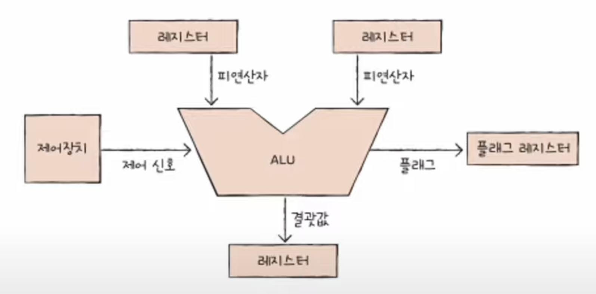
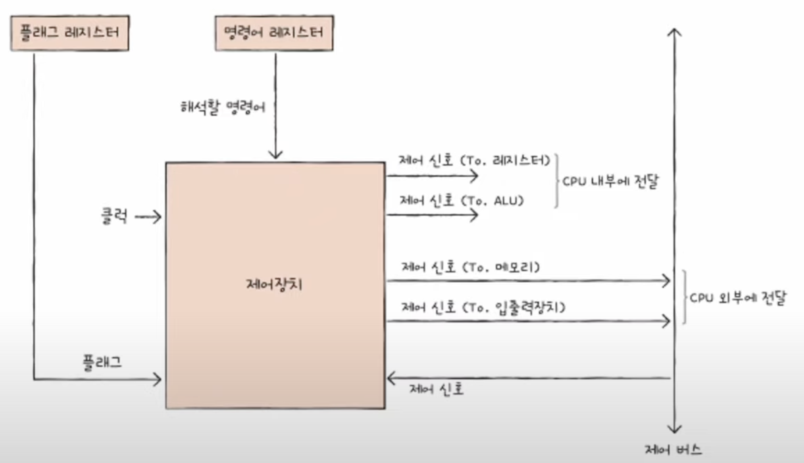

# Chapter 04. CPU의 작동 원리

## 04 - 1 ALU와 제어장치

 

    Keyword : ALU, 플래그, 제어장치, 제어 신호

- ### ALU

    

    #### 받아들이는 정보

    `레지스터`로부터 `피연산자`를 받아들이고, `제어장치`로부터 수행할 연산을 알려주는 `제어 신호`를 받아들임

    #### 내보내는 정보

    연산을 수행한 결과는 특정 숫자나 문자가 될 수도 있고, 메모리 주소가 될 수도 있음

    이 결과 값은 바로 메모리에 저장되지 않고 `일시적으로 레지스터에 저장`

    Why? 
    
    ALU가 연산할 때마다 연산 결과를 메모리에 저장하면 CPU가 메모리가 접근하는 횟수가 늘어나기 때문에 느려짐
---
- ### 플래그
    
    계산 결과와 함께 플래그도 내보냄
    
    ex) 연산 결과가 음수일 때, 연산 결과가 레지스터보다 클 때(오버플로우)

    대표적인 플래그의 종류

    - 부호 플래그 : 어떤 부호인지

    - 제로 플래그 : 0인지

    - 캐리 플래그 : 올림수, 빌림수가 발생했는지

    - 오버플로우 플래그 : 오버플로우가 발생했는지

    - 인터럽트 플래그 : 인터럽트가 가능한지

    - 슈퍼바이저 플래그 : 커널 모드 or 사용자 모드

    이러한 플래그들은 `플래그 레지스터`에 저장됨
---
- ### 제어장치

    제어 신호를 내보내고, 명령어를 해석하는 장치

    제어 신호 : 컴퓨터 부품들을 관리하고 작동시키기 위한 전기 신호

    

    #### 받아들이는 정보

    - 클럭 신호

        부품을 움직일 수 있게 하는 시간 단위

        클럭의 주기에 맞춰 데이터가 이동하거나, 연산이 수행되는 등의 일이 일어남
        
        But, 컴퓨터 부품은 클럭이라는 박자에 맞춰 작동할 뿐 한 박자마다 작동하는 것은 아님

    - 해석해야 할 명령어

        `명령어 레지스터`에 저장된 명령어를 받아들이고 해석한 뒤, 제어 신호를 발생시켜 부품들에게 수행해야 할 내용을 알려줌

    - 플래그 레지스터 속 플래그 값

        중요한 참고 사항인 플래그 레지스터에서 플래그 값을 받아들이고 제어 신호를 발생시킴

    - 시스템 버스(제어 버스)로 전달된 제어 신호

        제어 신호는 CPU 뿐만 아니라 입출력장치를 비롯한 CPU 외부 장치도 발생

    #### 내보내는 정보

    - CPU 외부에 전달하는 제어 신호

        제어 장치가 메모리에 저장된 값을 읽거나 새로운 값을 쓰고 싶다면 메모리로 제어 신호를 내보냄

        입출력장치도 마찬가지

    - CPU 내부에 전달하는 제어 신호

        수행할 연산을 지시하기 위한 ALU에 전달하는 제어 신호와 데이터를 이동시키거나 명령어를 해석하기 위해 레지스터에 전달하는 제어 신호