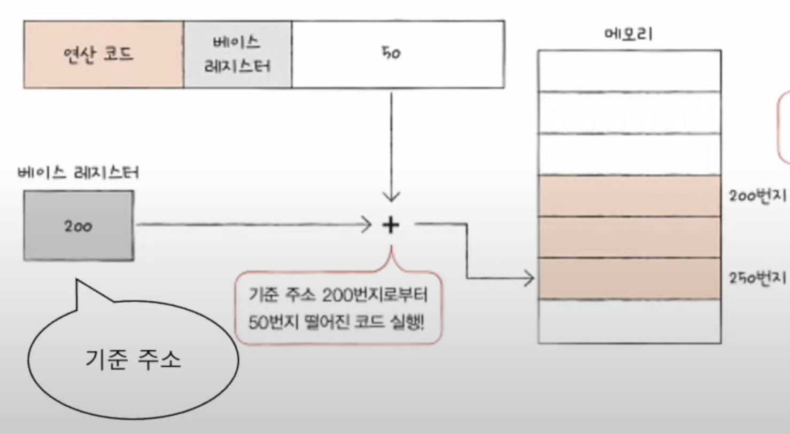

# Chapter 04. CPU의 작동 원리

## 04 - 1 ALU와 제어장치

 

    Keyword : ALU, 플래그, 제어장치, 제어 신호

- ### ALU

    

    #### 받아들이는 정보

    `레지스터`로부터 `피연산자`를 받아들이고, `제어장치`로부터 수행할 연산을 알려주는 `제어 신호`를 받아들임

    #### 내보내는 정보

    연산을 수행한 결과는 특정 숫자나 문자가 될 수도 있고, 메모리 주소가 될 수도 있음

    이 결과 값은 바로 메모리에 저장되지 않고 `일시적으로 레지스터에 저장`

    Why? 
    
    ALU가 연산할 때마다 연산 결과를 메모리에 저장하면 CPU가 메모리가 접근하는 횟수가 늘어나기 때문에 느려짐
---
- ### 플래그
    
    계산 결과와 함께 플래그도 내보냄
    
    ex) 연산 결과가 음수일 때, 연산 결과가 레지스터보다 클 때(오버플로우)

    대표적인 플래그의 종류

    - 부호 플래그 : 어떤 부호인지

    - 제로 플래그 : 0인지

    - 캐리 플래그 : 올림수, 빌림수가 발생했는지

    - 오버플로우 플래그 : 오버플로우가 발생했는지

    - 인터럽트 플래그 : 인터럽트가 가능한지

    - 슈퍼바이저 플래그 : 커널 모드 or 사용자 모드

    이러한 플래그들은 `플래그 레지스터`에 저장됨
---
- ### 제어장치

    제어 신호를 내보내고, 명령어를 해석하는 장치

    제어 신호 : 컴퓨터 부품들을 관리하고 작동시키기 위한 전기 신호

    

    #### 받아들이는 정보

    - 클럭 신호

        부품을 움직일 수 있게 하는 시간 단위

        클럭의 주기에 맞춰 데이터가 이동하거나, 연산이 수행되는 등의 일이 일어남
        
        But, 컴퓨터 부품은 클럭이라는 박자에 맞춰 작동할 뿐 한 박자마다 작동하는 것은 아님

    - 해석해야 할 명령어

        `명령어 레지스터`에 저장된 명령어를 받아들이고 해석한 뒤, 제어 신호를 발생시켜 부품들에게 수행해야 할 내용을 알려줌

    - 플래그 레지스터 속 플래그 값

        중요한 참고 사항인 플래그 레지스터에서 플래그 값을 받아들이고 제어 신호를 발생시킴

    - 시스템 버스(제어 버스)로 전달된 제어 신호

        제어 신호는 CPU 뿐만 아니라 입출력장치를 비롯한 CPU 외부 장치도 발생

    #### 내보내는 정보

    - CPU 외부에 전달하는 제어 신호

        제어 장치가 메모리에 저장된 값을 읽거나 새로운 값을 쓰고 싶다면 메모리로 제어 신호를 내보냄

        입출력장치도 마찬가지

    - CPU 내부에 전달하는 제어 신호

        수행할 연산을 지시하기 위한 ALU에 전달하는 제어 신호와 데이터를 이동시키거나 명령어를 해석하기 위해 레지스터에 전달하는 제어 신호

---
 

## 04 - 2 레지스터
 

    Keyword : 프로그램 카운터, 명령어 레지스터, 메모리 주소/버퍼 레지스터, 범용/플래그 레지스터, 스택 포인터, 베이스 레지스터

- ### 레지스터의 종류 1

    프로그램 속 명령어와 데이터는 실행 전후로 반드시 레지스터에 저장

    즉, 레지스터만 잘 관찰해도 프로그램의 자세한 실행 과정을 알 수 있음

    - `프로그램 카운터`

        메모리에서 읽어 들일 명령어의 주소를 저장

        명령어 포인터라고 부르기도 함

    - `명령어 레지스터`

        방금 메모리에서 읽어 들인 명령어를 저장

        제어 장치는 명령어 레지스터 속 명령어를 받아들이고 이를 해석한 뒤 제어 신호를 내보냄

    - `메모리 주소 레지스터`

        메모리의 주소를 저장

        CPU가 읽어 들이고자 하는 주소값을 주소 버스로 보낼 때 메모리 주소 레지스터를 거침

    - `메모리 버퍼 레지스터`

        메모리와 주고받을 값(데이터와 명령어)을 저장

        데이터 버스로 주고 받을 값은 메모리 버퍼 레지스터를 거침

    ### 메모리에 저장된 프로그램을 실행하는 과정

    

    CPU로 실행할 프로그램이 1000번지부터 1500번지까지 저장되어 있다고 가정하고 1000번지에는 1101(2)가 저장되어있다고 가정

     

    

    프로그램을 처음부터 실행하기 위해 프로그램 카운터에는 1000이 저장. 이는 메모리에서 가져올 명령어가 1000번지에 있다는 것을 의미

     

    

    1000번지를 읽어 들이기 위해 주소 버스로 1000번지를 내보냄. 이를 위해 메모리 주소 레지스터에는 1000이 저장

     

    

    '메모리 읽기' 제어 신호와 메모리 주소 레지스터 값이 각각 제어 버스와 주소 버스를 통해 메모리로 보내짐

     

    

    메모리 1000번지에 저장된 값은 데이터 버스를 통해 메모리 버퍼 레지스터로 전달되고, 프로그램 카운터는 증가되어 다음 명령어를 읽어 들일 준비를 함

     

    

    메모리 버퍼 레지스터에 저장된 값은 명령어 레지스터로 이동
     

    제어장치는 명령어 레지스터의 명령어를 해석하고 제어 신호를 발생

    이처럼 프로그램 카운터는 지속적으로 증가하며 다음 명령어를 읽어 들일 준비를 함. 이 과정이 반복되며 CPU는 프로그램을 차례대로 실행

    ---

- ### 레지스터의 종류 2

    - `플래그 레지스터`

        연산 결과 또는 CPU상태에 대한 부가적인 정보를 저장

    - `범용 레지스터`

        다양하고 일반적인 상황에서 자유롭게 사용할 수 있는 레지스터

        메모리 버퍼 레지스터는 데이터 버스로 주고 받을 값만 저장하고, 메모리 주소 레지스터는 주소 버스로 내보낼 주소값만 저장하지만 범용 레지스터는 데이터와 주소를 모두 저장할 수 있음

        일반적으로 CPU 안에 여러 개의 범용 레지스터가 있고, 현재 대다수의 CPU는 모두 범용 레지스터를 가지고 있음

---

- ### 주소 지정 방식에 사용되는 특별한 레지스터

    - `스택 포인터`

        

        스택 주소 지정 방식이라는 주소 지정 방식에 사용

        스택에 마지막으로 저장한 값의 `위치`를 저장하는 레지스터

    
    - `베이스 레지스터`

- ### 스택 주소 지정 방식

    

    스택과 스택 포인터를 이용한 주소 지정 방식

    

    스택은 메모리 안에 스택처럼 사용할 영역으로 존재. 이를 스택 영역이라고 함. 다른 주소 공간과는 다르게 스택처럼 사용하기로 암묵적으로 약속된 영역 

- ### 변위 주소 지정 방식

    

    오퍼랜드 필드의 값(변위)과 특정 레지스터의 값을 더하여 유효 주소를 얻어내는 주소 지정 방식

    - 상대 주소 지정 방식

        

        오퍼랜드와 프로그램 카운터 값을 더하여 유효 주소를 얻는 방식

        if문과 유사하게 모든 코드를 실행하는 것이 아닌 분기하여 특정 주소의 코드를 실행할 때 사용

    - 베이스 레지스터 주소 지정 방식

        

        오퍼랜드와 베이스 레지스터의 값을 더하여 유효 주소를 얻는 방식
        
        이점은?

