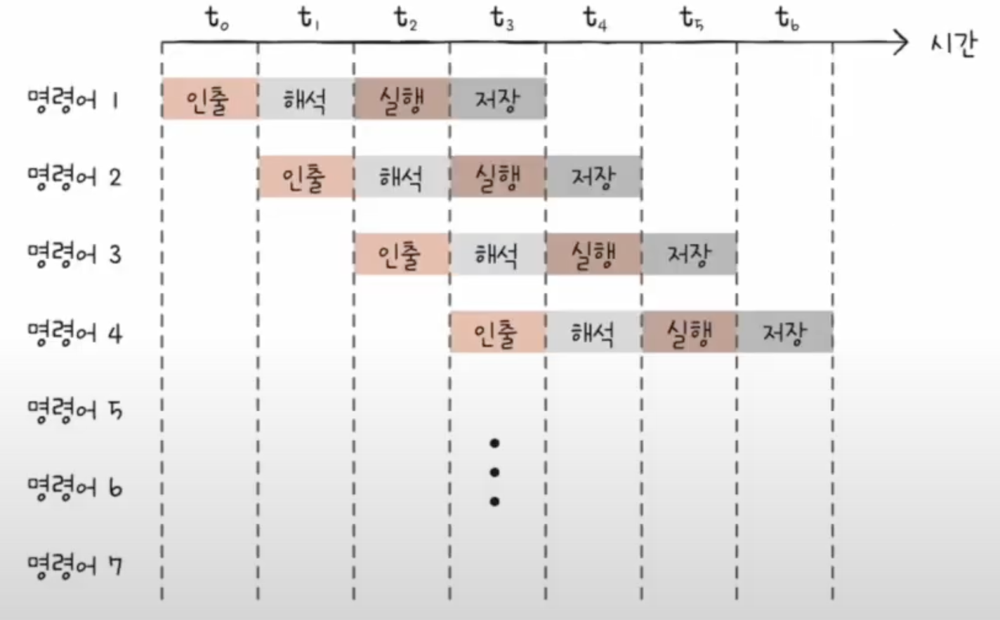

# Chapter 05. CPU 성능 향상 기법

## 05 - 1 빠른 CPU를 위한 설계 기법

 

    Keyword : 클럭, 코어, 멀티코어, 스레드, 멀티스레드

- ### 클럭

    컴퓨터 부품들은 `클럭 신호`에 맞춰 움직임

    CPU는 `명령어 사이클`이라는 흐름에 맞춰 명령어를 실행

    클럭 속도가 높아지면 CPU는 명령어 사이클을 더 빠르게 반복할 것이고, 다른 부품들도 그것에 맞춰 더 빠르게 작동할 것
    
    실제로 클럭 속도가 높은 CPU는 일반적으로 성능이 좋음

    `클럭 속도`는 1초에 클럭이 몇 번 반복되는지를 나타내기 위해 Hz(헤르츠) 단위로 측정

    클럭 속도를 엄청 높이면 무조건 CPU가 빨라질까?

    No, 발열 문제가 심각해지기 때문

---
- ### 코어와 멀티코어
    
    전통적인 관점에서 CPU는 명령어를 실행하는 부품이지만, 현대적인 관점에서는 많은 기술적 발전으로 그런 부품을 얼마든지 만들 수 있게 되었음. 다시 말해 '명령어를 실행하는 부품을 여러 개 포함 하는 부품'으로 명칭의 범위가 확장

    코어는 '명령어를 실행하는 부품'을 의미
    
    코어를 여러 개 포함하고 있는 CPU를 멀티코어 CPU, 멀티코어 프로세서라고 부름

    하지만 CPU의 연산 속도는 꼭 코어 수에 비례하여 증가하진 않음

    코어마다 처리할 명령어들을 적절하게 분배하느냐에 따라 연산 속도가 크게 달라짐

---

- ### 스레드와 멀티스레드

    스레드는 CPU에서 사용되는 하드웨어적 스레드와 프로그램에서 사용되는 소프트웨어적 스레드로 나뉨

    - 하드웨어적 스레드

        하나의 코어가 동시에 처리하는 명령어의 단위

        하나의 코어로 여러 명령어를 동시에 처리하는 CPU를 멀티스레드 프로세서, 멀티스레드 CPU라고 부름

        ex ) 8코어 16스레드는 1개의 코어당 2개의 하드웨어 스레드를 처리한다는 뜻

        인텔에서는 멀티스레드를 하이퍼스레딩이라고 부름

    - 소프트웨어적 스레드

        하나의 프로그램에서 독립적으로 실행되는 단위

        

    한 번에 하나씩 명령을 처리하는 1코어 1스레드 CPU도 소프트웨어적 스레드를 수십 개 실행할 수 있음

---

- ### 멀티스레드 프로세서

    멀티스레드 프로세서를 설계하는 일은 매우 복잡하지만, 가장 큰 핵심은 `레지스터`

    레지스터 세트의 갯수가 중요

    하드웨어 스레드를 논리 프로세서라고 부르기도 함

---
### 결론
코어는 명령어를 실행할 수 있는 하드웨어 부품

스레드는 명령어를 실행하는 단위

멀티코어 프로세서는 명령어를 실행할 수 있는 하드웨어 부품이 CPU 안에 두 개 이상 있는 CPU

멀티스레드 프로세서는 하나의 코어로 여러 개의 명령어를 동시에 실행할 수 있는 CPU

---
 

## 05 - 2 명령어 병렬 처리 기법
 

    Keyword : 명령어 파이프라이닝, 슈퍼스칼라, 비순차적 명령어 처리 기법

CPU가 놀지 않고 시간을 알뜰하게 쓰며 작동하게 만드는 기법
    
- ### 명령어 파이프라인

    명령어 처리 과정을 클럭 단위로 나누어 보면
    
    1. 명령어 인출

    2. 명령어 해석

    3. 명령어 실행

    4. 결과 저장

    

    중요한 점은 같은 단계가 겹치지만 않는다면 CPU는 각 단계를 동시에 실행할 수 있음

    이처럼 명령어들을 `명령어 파이프라인`에 넣고 동시에 처리하는 기법을 `명령어 파이프라이닝`이라고 함

    특정 상황에서 성능 향상에 실패하는 경우를 `파이프라인 위험`이라고 함

    - `데이터 위험`

        

        데이터 의존적인 두 명령어를 동시에 실행하려고 하면 파이프라인이 제대로 작동하지 않음

    - `제어 위험`

        

        분기 등으로 인한 프로그램 카운터의 갑작스러운 변화에 의해 발생

        기본적으로 프로그램 카운터는 현재 실행 중인 명령어의 다음 주소로 갱신

        프로그램 실행 흐름이 바뀌어 명령어가 실행되면서 프로그램 카운터에 변화가 생긴다면 미리 처리 중이던 명령어는 쓸모가 없어짐

    - `구조적 위험`

        명령어가 겹처 실행 과정에서 서로 다른 명령어가 동시에 ALU, 레지스터 등과 같은 CPU 부품을 사용하려고 할 때 발생

        자원 위험이라고 부르기도 함

- ### 슈퍼스칼라

    오늘날 대부분의 CPU는 여러 개의 파이프라인을 이용

    이러한 구조를 슈퍼 스칼라라고 함

    파이프라인 위험 등 예상치 못한 문제가 있기에 파이프라인 개수에 비례하여 빨라지진 않고, 고도로 설계되어야 함

- ### 비순차적 명령어 처리

    명령어들을 순차적으로 실행하지 않는 기법

    앞선 기법들은 모두 순차적 처리

    

    3번과 같이 M(101) 값이 결정되어야 인출이 가능한 명령어의 순서를 바꾸어 명령어 파이프라인이 멈추는 것을 방지하는 기법이 `비순차적 명령어 처리 기법`

    어떤 명령어와 데이터 의존성을 가지고 있는지, 순서를 바꿔 실행할 수 있는 명령어에는 어떤 것들이 있는지 판단이 필요

---

## 05 - 3 CISC와 RISC
 

    Keyword : ISA, CISC, RISC