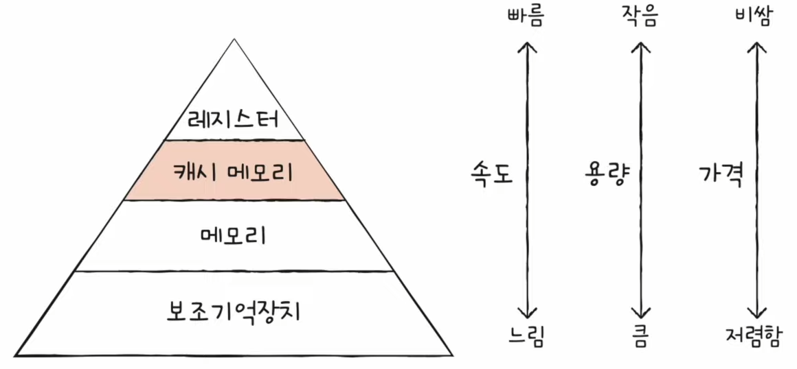

# Chapter 06. 메모리와 캐시 메모리

## 06 - 1 RAM의 특징과 종류

 

    Keyword : 휘발성 저장 장치, 비휘발성 저장 장치, DRAM, SRAM, SDRAM, DDR SDRAM

- ### RAM의 특징

    RAM에는 실행할 프로그램의 명령어와 데이터가 저장

    - `휘발성 저장 장치`

        전원을 끄면 명령어와 데이터가 모두 날아가는 저장 장치

        ex ) RAM .. 

    - `비휘발성 저장 장치`

        전원이 꺼져도 저장된 내용이 유지되는 저장 장치

        ex ) HDD, SSD, CD-ROM 등과 같은 보조기억장치

    일반적으로 비휘발성 저장 장치에 '보관할 대상'을 저장, 휘발성 저장 장치에 '실행할 대상'을 저장

    CPU는 보조기억장치에 직접 접근할 수 없음

    CPU가 실행하고 싶은 프로그램이 보조기억장치에 있다면 이를 RAM으로 복사하여 저장한 뒤 실행

- ### RAM의 용량과 성능
    
    RAM 용량이 적다면 보조기억장치에서 가져오는 일이 많아 실행 시간이 길어짐

    보조기억장치를 책이 꽂혀 있는 책장, RAM을 책을 읽을 수 있는 책상으로 이해하자

    용량이 필요 이상으로 커졌을 때 속도가 그에 비례하여 증가하진 않음

- ### RAM의 종류

    - `DRAM`

    - `SRAM`

    - `SDRAM`

    - `DDRSDRAM`

     

    - `DRAM`
    
        저장된 데이터가 동적으로 사라지는 RAM 
        
        데이터의 소멸을 막기 위해 일정 주기로 데이터를 다시 저장해야 함

        이런 단점에도 우리가 일반적으로 사용하는 RAM은 DRAM
        
        Why? 
        
        소비 전력이 비교적 낮고, 저렴하고, 집적도가 높기 때문에 대용량으로 설계하기 용이하기 때문

    - `SRAM`

        저장된 데이터가 변하지 않는 RAM

        DRAM보다 집적도가 낮고, 소비 전력도 크며, 가격도 비쌈

        메모리가 아닌 대용량으로 만들어질 필요는 없지만 속도가 빨라야 하는 저장 장치, 예를 들어 캐시 메모리에 사용

    - `SDRAM`

        클럭 타이밍에 맞춰 동작하며 클럭마다 CPU와 정보를 주고받을 수 있는 DRAM

    - `DDRSDRAM`

        최근 가장 흔히 사용되는 RAM

        대역폭(데이터를 주고받는 길의 너비)를 넓혀 속도를 빠르게 만든 SDRAM
---

## 06 - 2 메모리의 주소 공간
 

    Keyword : 물리 주소, 논리 주소, MMU, 베이스 레지스터, 한계 레지스터

- ### 물리 주소와 논리 주소

    - 물리 주소 : 메모리가 사용하는 하드웨어상의 실제 주소

    - 논리 주소 : CPU와 실행 중인 프로그램이 사용하는 각각 프로그램에 부여된 주소

    CPU와 메모리가 상호작용을 하려면  물리 주소와 논리 주소 간의 변환이 필요

    `메모리 관리 장치(MMU)`에 의해 논리 주소와 물리 주소간의 변환이 수행

    MMU는 CPU가 발생시킨 논리 주소에 베이스 레지스터 값을 더하여 논리 주소를 물리 주소로 변환

    - `베이스 레지스터` : 프로그램의 첫 물리 주소를 저장

    - 논리 주소 : 프로그램의 시작점으로부터 떨어진 거리

- ### 메모리 보호 기법

    다른 프로그램의 영역을 침범할 수 있는 명령어는 위험하기 때문에 논리 주소 범위를 벗어나는 명령어 실행을 방지하고 실행 중인 프로그램이 다른 프로그램에 영향을 받지 않도록 보호하는 `한계 레지스터`를 사용

    프로그램의 물리 주소 범위 : 베이스 레지스터 값 ~ 베이스 레지스터 값 + 한계 레지스터 값

    

    CPU는 메모리에 접근하기 전에 접근하고자 하는 논리 주소가 한계 레지스터보다 작은지를 검사하고 한계 레지스터보다 높은 논리 주소에 접근하려고 하면 인터럽트를 발생시켜 실행을 중단시킴
    
---

## 06 - 3 캐시 메모리
 

    Keyword : 저장 장치 계층 구조, 캐시 메모리, 캐시 적중률, 참조 지역성의 원리

- ### 저장 장치 계층 구조

    CPU와 가까운 저장 장치는 빠르고, 멀리 있는 저장 장치는 느림

    속도가 빠른 저장 장치는 저장 용량이 작고, 가격이 비쌈

    이 두가지는 양립하기 어려움

    컴퓨터가 사용하는 저장 장치들은 'CPU에 얼마나 가까운가'를 기준으로 계층적으로 나타낼 수 있고 이를 `저장 장치 계층 구조`라고 함

- ### 캐시 메모리

    CPU와 메모리 사이에 위치하고, 레지스터보다 용량이 크고 메모리보다 빠른 SRAM 기반의 저장 장치

    CPU가 매번 메모리에 왔다 갔다 하는 시간을 아끼기 위해 캐시 메모리를 활용

    

    캐시 메모리들은 CPU와 가까운 순서대로 계층을 구성 

    

    CPU와 가장 가까운 캐시 메모리부터 순서대로 L1, L2, L3

    L1 캐시와 L2 캐시는 코어마다 고유한 캐시 메모리로 할당, L3는 여러 코어가 공유하는 형태

- ### 참조 지역성 원리

    캐시 메모리는 메모리보다 용량이 작음

    그래서 CPU가 사용할 법한 대상을 예측하여 저장

    자주 사용될 것으로 예측한 데이터가 실제로 들어맞아 CPU에서 활용할 경우 `캐시 히트`라고 함

    반대의 경우 `캐시 미스`라고 함

    캐시가 히트되는 비율을 캐시 적중률이라고 하며 우리가 사용하는 컴퓨터의 캐시 적중률은 대략 85 ~ 95%

    그렇다면 사용할 법한 데이터는 어떻게 알 수 있을까?

    참조 지역성의 원리

    - CPU는 최근에 접근했던 메모리 공간에 다시 접근하려는 경향이 있음

        CPU는 변수가 저장된 메모리 공간을 언제든 다시 참조

        변수에 저장된 값은 일반적으로 한 번만 사용되지 않고 프로그램이 실행되는 동안 여러 번 사용

        이것을 `시간 지역성`이라고 함

    - CPU는 접근한 메모리 공간 근처를 접근하려는 경항이 있음

        예를 들어 CPU가 워드 프로세서 프로그램을 실행할 적에는 워드 프로세서 프로그램이 모여 있는 공간 근처를 집중적으로 접근할 것이고, 입력을 할 적에는 입력 기능이 모여 있는 공간 근처를 집중적으로 접근

        이것을 `공간 지역성`이라고 함