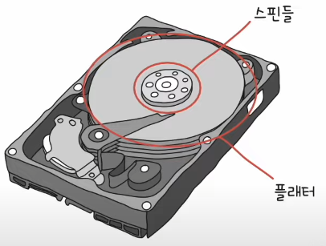
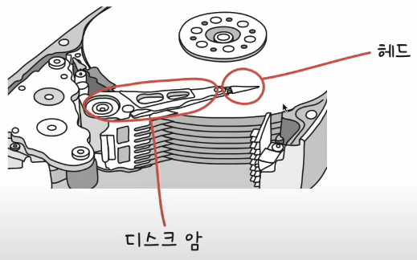
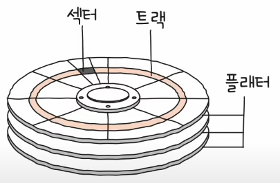
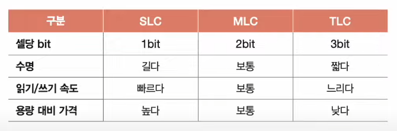
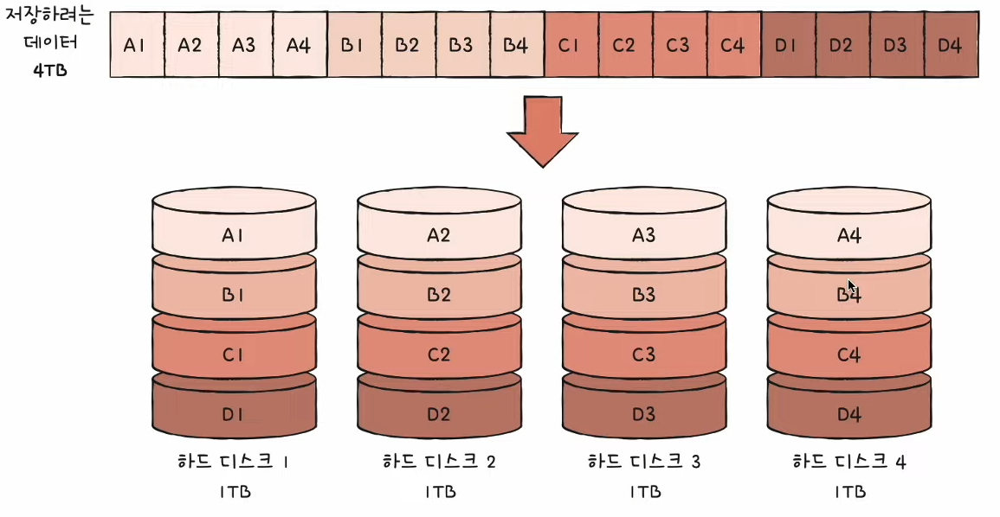
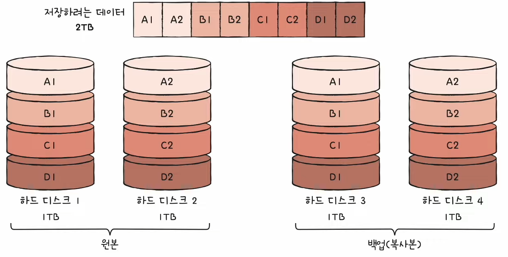
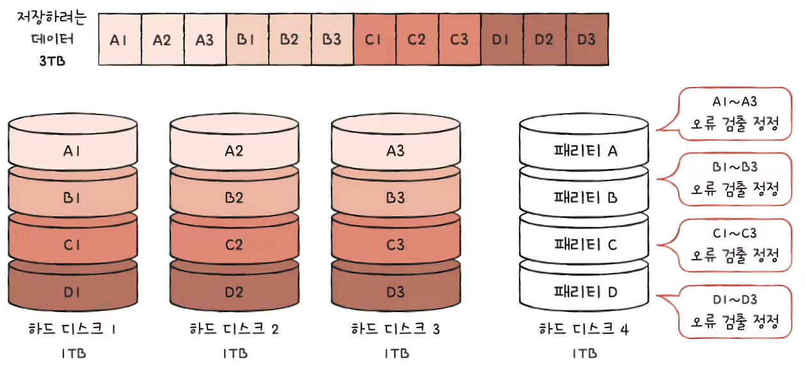
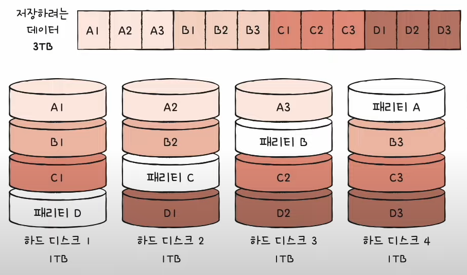
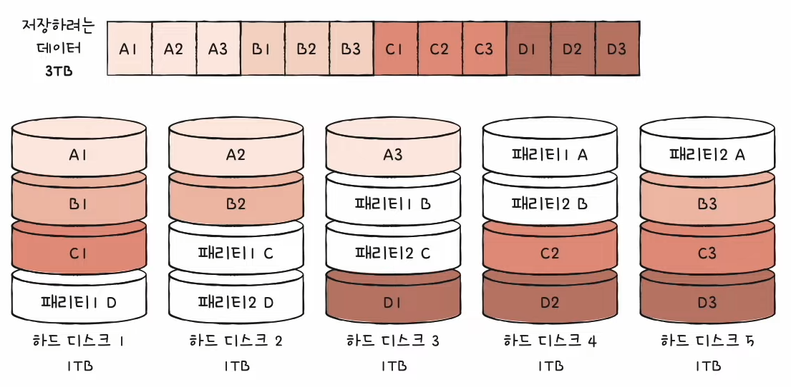

# Chapter 07. 보조기억장치

  

## 07 - 1 다양한 보조기억장치

 

    Keyword : 하드 디스크, 플래터, 데이터 접근 시간, 플래시 메모리, 페이지, 블록

  

- ### 하드 디스크

    자기적인 방식으로 데이터를 저장하는 보조기억장치

    자기 디스크의 일종
    
    

    데이터가 저장되는 동그란 원판은 `플래터`

    플래터는 자기 물질로 덮여 있어 0과 1의 역할을 수행하는 수많은 N극과 S극을 저장

    플래터를 회전 시키는 구성 요소는 `스핀들`

    스핀들이 플래터를 돌리는 속도는 RPM(분당 회전수)으로 표현
    
     

    

    플래터를 대상으로 데이터를 읽고 쓰는 구성 요소는 `헤드`

    플래터 위에서 미세하게 떠 있는 채로 데이터를 읽고 씀

    헤드를 원하는 위치로 이동시키는 `디스크 암`

     

    

    플래터는 `트랙`과 `섹터` 단위로 데이터를 저장

    여러 겹의 플래터 상에서 같은 트랙을 모아 `실린더`를 이룸

    디스크 암을 움직이지 않고도 바로 데이터에 접근할 수 있기 때문에 연속된 정보는 보통 한 실린더에 기록

      

- 하드 디스크가 저장된 데이터에 접근하는 시간

    성능에 큰 영향을 끼치는 시간이기에 중요

    - 탐색 시간

        접근하려는 데이터가 저장된 트랚까지 헤드를 이동시키는 시간

         

    - 회전 지연
        
        헤드가 있는 곳으로 플래터를 회전시키는 시간

         

    - 전송 시간

        하드 디스크와 컴퓨터 간에 데이터를 전송하는 시간

         

    탐색 시간과 회전 지연을 단축시키기 위해서는 플래터를 빨리 돌려 RPM을 높이는 것도 중요하지만, 참조 지역성 즉 접근하려는 데이터가 플래터 혹은 헤드를 조금만 옮겨도 접근할 수 있는 곳에 위치해 있는 것도 중요

  

- ### 플래시 메모리

    전기적으로 데이터를 읽고 쓸 수 있는 반도체 기반의 저장 장치
    
    USB, SD 카드, SSD 등은 플래시 메모리 기반의 보조기억장치

    플래시 메모리에는 데이터를 저장하는 가장 작은 단위인 `셀`이 있음

      

    하나의 셀에 몇 비트를 저장할 수 있느냐에 따라서 종류가 나뉘는데 한 셀에 1비트를 저장할 수 있으면 SLC, 2비트를 저장할 수 있으면 MLC, 3비트를 저장할 수 있으면 TLC라고 함

    - SLC

        한 셀로 0과 1 두 개의 정보를 표현

        MLC, TLC에 비해 비트의 빠른 입출력이 가능

        수명도 MLC, TLC에 비해 길지만, 용량 대비 가격이 높음

        혼자서 살면 감당해야 할 주거 비용이 커지는 것과 비슷

        데이터를 읽고 쓰기가 매우 많이 반복되며 고성능의 빠른 저장 장치가 필요할 경우에 사용

         

    - MLC

        한 셀로 네 개의 정보를 표현

        SLC보다 속도와 수명은 떨어지지만, SLC보다 많은 데이터를 수용할 수 있음

        SLC보다 가격이 저렴

        시중에 사용되는 많은 플래시 메모리 저장 장치들은 MLC, TLC로 만들어짐

         

    - TLC

        한 셀로 여덟 개의 정보를 표현

        SLC, MLC보다 수명과 속도는 떨어지지만 용량 대비 가격이 저렴

         

    

      

    셀보다 더 큰 단위들

    - 페이지 : 셀들이 모여서 만들어진 단위

    - 블록 : 페이지가 모여 만들어진 단위

    - 플레인 : 블록이 모여 만들어진 단위

    - 다이 : 플레인이 모여 만들어진 단위

    `플래시 메모리에서 읽기와 쓰기는 페이지 단위로 이루어지며, 삭제는 페이지보다 큰 블록 단위로 이루어짐`

    
      

    페이지의 상태

    - Free

        어떠한 데이터도 저장하고 있지 않아 새로운 데이터를 저장할 수 있는 상태

         

    - Valid

        이미 유효한 데이터를 저장하고 있는 상태

         

    - Invalid

        쓰레기값이라고 부르는 유효하지 않은 데이터를 저장하고 있는 상태

         

    플래시 메모리는 하드 디스크와 달리 덮어쓰기가 불가능하여 Valid 상태인 페이지에는 새 데이터를 저장할 수 없음

    유효한 페이지들만 새로운 블록으로 복사한 후 기존 블록을 삭제하여 공간을 정리하는 `가비지 컬렉션`을 사용

    Why?

    플래시 메모리의 삭제는 블록 단위로 실행되기 때문

    
---

## 07 - 2 RAID의 정의와 종류
 

    Keyword : RAID, RAID 0, RAID 1, RAID 4, RAID 5, RAID 6

  

- ### RAID의 정의

    주로 하드 디스크와 SSD를 사용하는 기술로, 데이터의 안전성 혹은 높은 성능을 위해 `여러 개의 물리적 보조기억장치를 마치 하나의 논리적 보조기억장치처럼 사용하는 기술`

      

- ### RAID의 종류

    RAID 레벨(RAID 구성 방법)

    RAID 0, RAID 1, RAID 2, RAID 3, RAID 4, RAID 5, RAID 6, RAID 10, RAID 50 ...

    But, RAID 2와 RAID 3은 현재 잘 활용되지 않음

    - RAID 0
        
        

        여러 개의 보조기억장치에 데이터를 단순히 나누어 저장하는 구성 방식

        데이터를 저장할 때 각 하드 디스크는 번갈아 가며 데이터를 저장

        저장되는 데이터가 하드 디스크 개수만큼 나뉘어 저장

        줄무늬처럼 분산되어 저장된 데이터를 `스트라입`

        분산하여 저장하는 것을 `스트라이핑`

         

        스트라이핑이 되면 데이터를 읽고 쓰는 속도가 빨라짐
        
        Why?
        
        하나의 대용량 저장 장치를 이용했더라면 여러 번에 걸쳐 읽고 써야하지만 동시에 읽고 쓸 수 있기 때문

        하지만 RAID 0의 단점은 저장된 정보가 안전하지 않다는 것

        RAID 0으로 구성된 하드 디스크 중 하나에 문제가 생긴다면 다른 모든 하드 디스크의 정보를 읽는 데 문제가 생김

        그래서 등장한 것이 RAID 1

          

    - RAID 1

        

        복사본을 만드는 방식이기에 미러링이라고 부름

        데이터를 쓸 때 원본과 복사본 두 군데에 씀

        쓰기 속도는 RAID 0보다 느리지만 복구가 매우 간단하다는 장점

        하지만 사용 가능한 용량이 적어지는 단점이 존재

          

    - RAID 4

        

        완전한 복사본을 만드는 대신 오류를 검출하고 복구하기 위한 정보를 저장하는 장치를 둠

        오류를 검출하고 복구하기 위한 정보를 `패리티 비트`라고 함

        패리티를 저장한 장치를 이용해 다른 장치들의 오류를 검출하고, 오류가 있다면 복구

        RAID 1보다 적은 하드 디스크로도 데이터를 안전하게 보관 가능

        cf) 패리티 비트는 본래 오류 검출용 정보지만, RAID에서는 오류 복구도 가능함

          

    - RAID 5

        

        새로운 데이터가 저장될 때마다 패리티를 저장하는 디스크에도 데이터를 쓰기 때문에 패리티를 저장하는 장치에 병목 현상이 발생한다는 문제를 해결하기 위해 패리티 정보를 분산하여 저장하여 병목 현상을 해소

          

    - RAID 6

        

        기본적인 구성은 RAID 5와 같으나 서로 다른 두 개의 패리티를 두는 방식

        RAID 4, RAID 5보다 안전한 구성

        다만 함께 저장할 패리티가 두 개이므로 쓰기 속도는 RAID 5보다 느리지만, 데이터 저장 속도를 조금 희생하더라도 데이터를 더욱 안전하게 보관하고 싶을 때 사용하는 방식

        

    