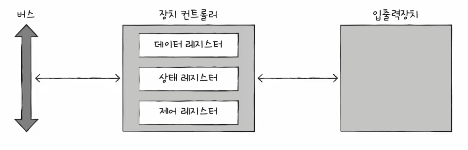
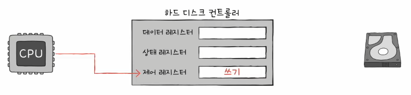
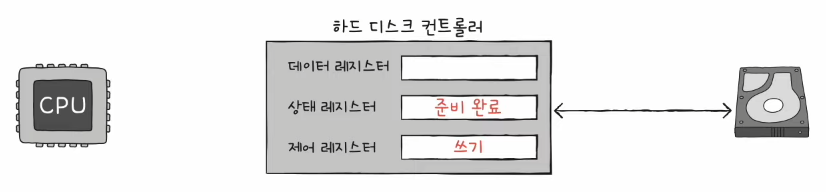
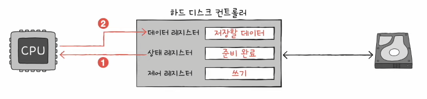
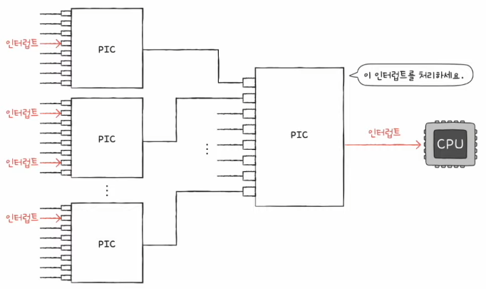

# Chapter 08. 입출력장치

  

## 08 - 1 장치 컨트롤러와 장치 드라이버

 

    Keyword : 장치 컨트롤러, 장치 드라이버

  

- ### 장치 컨트롤러

    입출력 장치는 CPU, 메모리보다 다루기 까다로움

    - 입출력장치의 종류가 너무 많음

        키보드, 모니터, USB, SSD, 마우스, 프린터 등

        다양한 입출력장치와 정보를 주고 받는 방식을 규격화하기 어려움

         

    - 입출력장치의 데이터 전송률은 낮음

        전송률 : 데이터를 얼마나 빨리 교환할 수 있는지 나타내는 지표

        전송률의 차이는 CPU와 메모리, 입출력장치 간의 통신을 어렵게 함

         

    위와 같은 이유로 입출력장치는 컴퓨터에 직접 연결되지 않고 `장치 컨트롤러`를 통해 연결

    모든 입출력장치는 각자의 장치 컨트롤러를 통해 컴퓨터 내부와 정보를 주고받고, 장치 컨트롤러는 하나 이상의 입출력장치와 연결

      

    장치 컨트롤러의 역할

    - CPU와 입출력장치 간의 통신 중개

    - 오류 검출

    - 데이터 버퍼링

        전송률이 높은 장치와 낮은 장치 사이에 주고받는 데이터를 버퍼라는 임시 저장 공간에 저장하여 전송률을 비슷하게 맞추는 방법

      

    

    장치 컨트롤러의 내부 구조

    - 데이터 레지스터

        CPU와 입출력장치 사이에 주고받을 데이터가 담기는 레지스터

        버퍼 역할을 함

        최근에는 주고 받는 데이터가 많은 입출력장치에는 RAM을 사용하기도 함

         

    - 상태 레지스터

        입출력장치의 준비, 작업 완료, 오류 등의 상태 정보가 저장

         

    - 제어 레지스터

        입출력장치가 수행할 내용에 대한 제어 정보와 명령을 저장

         

    이 레지스터들에 담긴 값들은 버스를 타고 CPU나 다른 입출력장치로 전달되기도 하고, 장치 컨트롤러에 연결된 입출력장치로 전달

  

- ### 장치 드라이버

    장치 컨트롤러의 동작을 감지하고 제어함으로써 장치 컨트롤러가 컴퓨터 내부와 정보를 주고받을 수 있게 하는 프로그램

    장치 컨트롤러가 입출력장치를 연결하기 위한 하드웨어적인 통로라면, 장치 드라이버는 입출력장치를 연결하기 위한 소프트웨어적인 통로

---

  

## 08 - 2 다양한 입출력 방법
 

    Keyword : 프로그램 입출력, 메모리 맵 입출력, 고립형 입출력, 인터럽트 기반 입출력, DMA 입출력, 입출력 버스

  

- ### 프로그램 입출력

    프로그램 속 명령어로 입출력을 제어하는 방법

    CPU가 프로그램 속 명령어를 실행하는 과정에서 입출력 명령어를 만나면 CPU는 입출력장치에 연결된 장치 컨트롤러와 상호작용하며 입출력 작업 수행

    

    

    

      

    CPU는 어떻게 장치 컨트롤러의 레지스터를 아는 것일까?

    - 메모리 맵 입출력

        메모리에 접근하기 위한 주소 공간과 입출력장치에 접근하기 위한 주소 공간을 하나의 주소 공간으로 간주하는 방법

        전체 메모리를 메모리 주소와 장치 컨트롤러의 레지스터로 나눠서 사용

        그렇기 때문에 메모리의 주소나 장치 컨트롤러의 레지스터나 똑같이 메모리 주소를 대하듯이 하면 됨

         

    - 고립형 입출력

        메모리를 위한 주소 공간과 입출력장치를 위한 주소 공간을 분리하는 방법

        메모리 주소 공간이 축소되지 않고, 입출력 전용 명령어를 사용함

          

- ### 인터럽트 기반 입출력

    입출력장치에 의한 하드웨어 인터럽트는 장치 컨트롤러에 의해 발생

    CPU는 장치 컨트롤러에게 입출력 작업을 명령하고, 장치 컨트롤러가 입출력장치를 제어하면 입출력을 수행하는 동안 CPU는 다른 일을 함

    반대로 장치 컨트롤러가 입출력 작업을 끝낸 뒤 CPU에게 인터럽트 요청 신호를 보내면 CPU는 잠시 백업하고 인터럽트 서비스 루틴을 실행

      

    여러 입출력장치에서 인터럽트가 동시에 발생한 경우에는?

    순차적으로 처리하는 방법이 있지만, 현실적으로 전부 순차적으로만 해결할 순 없음

    그래서 우선순위를 고려하여 인터럽트를 처리

     

    `프로그래머블 인터럽트 컨트롤러(PIC)`를 사용하여 우선순위를 판별한 뒤 다중 인터럽트를 처리

    PIC는 무시할 수 없는 인터럽트까지 우선순위를 판별하진 못함

    PIC가 우선순위를 조정해 주는 인터럽트는 인터럽트 비트를 통해 막을 수 있는 하드웨어 인터럽트

    

    PIC의 다중 인터럽트 처리 과정

    - 장치 컨트롤러에서 인터럽트 요청 신호를 받아들임

    - PIC는 인터럽트 우선순위를 판단 후 CPU에 인터럽트 요청 신호를 보냄

    - CPU는 PIC에 인터럽트 확인 신호를 보냄

    - PIC는 데이터 버스를 통해 CPU에 인터럽트 벡터를 보냄

    - CPU는 인터럽트 벡터를 통해 요청의 주체를 알게 되고, 해당 장치의 인터럽트 서비스 루틴을 실행

  

- ### DMA 입출력

    프로그램 기반 입출려과 인터럽트 기반 입출력의 공통점은 데이터 이동은 CPU가 주도하고, 이동하는 데이터도 CPU를 반드시 거친다는 점

    이 방법은 CPU에 대한 부담이 커짐

     

    그래서 CPU를 거치지 않고 상호작용할 수 있는 입출력 방식인 `DMA(Direct Memory Access)`가 등장

    DMA 입출력을 하기 위해서는 시스템 버스에 연결된 `DMA 컨트롤러`가 필요

      

    DMA 입출력 과정

    - CPU는 DMA 컨트롤러에 입출력장치의 주소, 수행할 연산(읽기/쓰기), 메모리 주소 등의 정보로 입출력 작업을 명령

     

    - DMA 컨트롤러는 CPU 대신 장치 컨트롤러와 상호작용하며 입출력 작업을 수행, 직접 메모리에 접근하여 정보를 읽거나 쓸 수 있음

     

    - 입출력 작업이 끝나면 DMA 컨트롤러는 CPU에 인터럽트를 걸어 작업이 끝났음을 알림

     

    이 방법은 CPU는 오로지 입출력의 시작과 끝만 관여하기에 작업 부담을 훨씬 줄일 수 있음

    하지만 시스템 버스는 공용 자원이기에 동시에 사용이 불가능해서 CPU가 시스템 버스에 접근하면 사용이 불가능함

      

    DMA 컨트롤러와 장치 컨트롤러들을 `입출력 버스`에 연결하여 시스템 버스에 자주 접근하는 문제를 해결

    현재 대부분의 입출력장치는 시스템 버스가 아닌 입출력 버스와 연결됨

    입출력 버스에는 PCI 버스, PCI Express(PCIe) 버스 등이 있음

    
    

