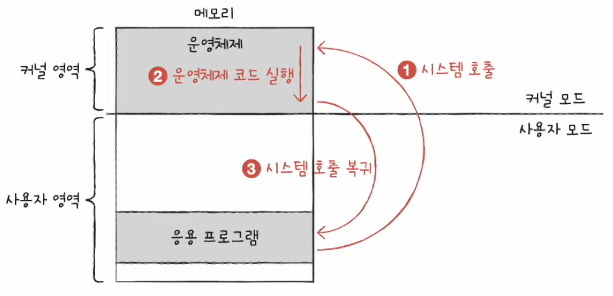

# Chapter 09. 운영체제 시작하기

  

## 09 - 1 운영체제를 알아야 하는 이유

 

    Keyword : 운영체제, 문제 해결

  

- ### 운영체제란
  
  프로그램 실행에 필요한 요소들을 `시스템 자원` 혹은 `자원`이라고 함

  `운영체제`는 실행할 프로그램에 필요한 자원을 할당하고, 프로그램이 올바르게 실행될 수 있도록 돕는 특별한 프로그램

  운영체제는 여느 프로그램과 마찬가지로 메모리에 적재되어야 함

  하지만 매우 특별한 프로그램이기에 컴퓨터가 부팅될 때 메모리 내 `커널 영역`이라는 공간에 따로 적재되어 실행

  커널 영역 이외의 영역은 사용자 영역
  
   
  
  운영체제의 역할
  
  - 메모리 주소가 겹치지 않도록 적당한 공간에 프로그램에 적재하고 더 이상 실행되지 않는 프로그램을 메모리에서 삭제하며 지속적으로 메모리 자원을 관리

  - 응용 프로그램과 하드웨어 사이에서 응용 프로그램에 필요한 자원을 할당하고, 올바르게 실행되도록 관리 
  
`즉, 운영체제는 응용 프로그램에 자원을 효율적으로 배분하고, 실행할 프로그램들이 지켜야 할 규칙을 만들어 컴퓨터 시스템 전체를 관리 `

  

- ### 운영체제를 알아야 하는 이유

운영체제가 하드웨어를 조작하고 관리하는 기능을 제공하기에 그런 코드를 작성할 필요없이 간편하게 개발 가능

운영체제와의 대화를 통해 하드웨어와 프로그램을 더 깊이 이해하고 `문제 해결`의 실마리를 찾을 수 있음

---

  

## 09 - 2 운영체제의 큰 그림

 

    Keyword : 커널, 이중 모드, 시스템 호출, 운영체제 서비스

  

- ### 운영체제의 심장, 커널

  운영체제는 현존하는 프로그램 중 규모가 가장 큰 프로그램 중 하나

  자원에 접근하고 조작하는 기능, 프로그램이 올바르고 안전하게 실행되게 하는 기능이 운영체제의 핵심 서비스이며 이를 담당하는 부분은 `커널`

   

  운영체제가 제공하는 서비스 중 커널에 포함되지 않는 서비스는 대표적으로 `사용자 인터페이스`

  사용자 인터페이스의 종류

  - 그래픽 유저 인터페이스(GUI)

    그래픽을 기반으로 컴퓨터와 상호작용하는 인터페이스

     

  - 커맨드 라인 인터페이스(CLI)

    명령어를 기반으로 컴퓨터와 상호작용하는 인터페이스

  

- ### 이중 모드와 시스템 호출

  운영체제는 사용자가 실행하는 응용 프로그램이 하드웨어 자원에 직접 접근하여 자원이 무질서하게 관리되는 것을 방지하여 자원을 보호

  운영체제는 응용 프로그램의 자원 접근을 대행하는 일종의 문지기 역할

   

  응용 프로그램의 요청을 받은 운영체제는 응용 프로그램 대신 자원에 접근하여 요청한 작업을 수행

  예를 들어, 
  
  1. 응용 프로그램 실행 과정에서 하드 디스크에 접근하여 데이터를 저장하려면 운영체제에 도움을 요청
  
  2. 운영체제는 커널 영역 내의 하드 디스크에 데이터를 저장하려는 코드를 실행하여 응용 프로그램의 작업을 대신 수행

  이러한 역할은 이중 모드로써 구현됨
  
   

  `이중 모드`란 CPU가 명령어를 실행하는 모드를 사용자 모드와 커널 모드로 구분하는 방식

   

  - `사용자 모드`

    운영체제 서비스를 제공받을 수 없는 실행 모드

    즉, 커널 영역의 코드를 실행할 수 없는 모드

    일반적인 응용 프로그램은 기본적으로 사용자 모드로 실행

     

  - `커널 모드`

    운영체제 서비스를 제공받을 수 있는 실행 모드

    즉, 커널 영역의 코드를 실행할 수 있는 모드

     

  운영체제 서비스를 제공받기 위한 요청을 `시스템 호출`이라고 함

  사용자 모드로 실행되는 프로그램은 시스템 호출을 통해 커널 모드로 전환하여 운영체제 서비스를 제공받을 수 있음

  시스템 호출은 일종의 소프트웨어적인 인터럽트

  Chapter 4의 인터럽트 처리 순서와 유사함

  

  ex) 한 응용 프로그램이 하드 디스크에 데이터를 저장하는 상황

  1. 응용 프로그램은 하드 디스크에 접근하기 위해 커널 모드로 전환해야 함
  
   
  
  2. 하드 디스크에 데이터를 저장하는 시스템 호출을 발생시켜 커널 모드로 전환
  
   
  
  3. 운영체제 내의 '하드 디스크에 데이터를 저장하는 코드'를 실행함으로써 하드 디스크에 접근

   
  
  4. 하드 디스크 접근이 끝나면 다시 사용자 모드로 복귀

  일반적으로 응용 프로그램은 실행 과정에서 빈번하게 시스템 호출을 발생시키고 사용자 모드와 커널 모드를 오가며 실행됨

  

- ### 운영체제의 핵심 서비스

  - 프로세스 관리
  
  - 자원 접근 및 할당
  
  - 파일 시스템 관리

   
  
  - 프로세스 관리
    
    `프로세스`는 실행 중인 프로그램을 의미

    일반적으로 하나의 CPU는 한 번에 하나의 프로세스만 실행할 수 있기에 CPU는 이 프로세스를 번갈아가면서 실행

    운영체제는 다양한 프로세스를 일목요연하게 관리하고 실행할 수 있어야 함

    여러 프로세스가 동시에 실행되는 환경에서는 `프로세스 동기화`가 필수적

    프로세스가 더이상 실행되지 못하는 `교착 상태`를 해결해야 함

    

  - 자원 접근 및 할당
    
    모든 프로세스는 실행을 위해 자원이 필요

    운영체제는 프로세스들이 사용할 자원에 접근하고 조작함으로써 프로세스에 필요한 자원을 할당

    #### CPU

    - 운영체제는 프로세스들에 공정하게 CPU를 할당하기 위해 어떤 프로세스부터 CPU를 이용하게 할지, 얼마나 오래 CPU를 이용하게 할지 결정

    - 이를 `CPU 스케줄링`이라 함

    #### 메모리

    - 운영체제는 새로운 프로세스가 적재될 떄마다 어느 주소에 적재해야 할지를 결정

    #### 입출력장치

    - 입출력장치가 CPU에 하드웨어 인터럽트 요청 신호를 보내면 CPU는 하던 일을 백업한 뒤 커널 영역에 있는 인터럽트 서비스 루틴을 실행

    - 운영체제는 인터럽트 서비스 루틴을 제공함으로써 입출력작업을 수행

    

  - 파일 시스템 관리

    운영체제는 파일을 열고, 생성하고, 삭제하고, 디렉터리(폴더)로 관리하는 `파일 시스템`을 지원

  

