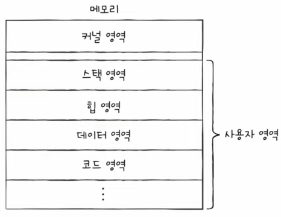
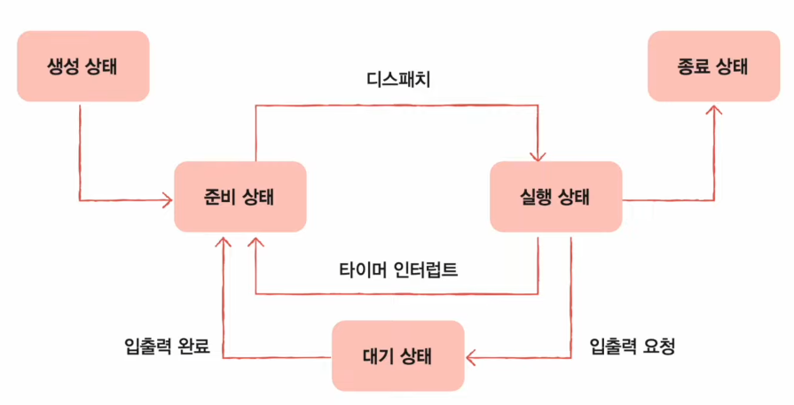

# Chapter 10. 프로세스와 스레드

  

## 10 - 1 프로세스 개요

 

    Keyword : 프로세스, 프로세스 제어 블록, 문맥 교환, 프로세스 사용자 영역

  

- ### 프로세스 직접 확인하기

    

    

    포그라운드 프로세스 : 사용자가 볼 수 있는 공간에서 실행되는 프로세스

    백그라운드 프로세스 : 사용자가 보지 못하는 공간에서 실행되는 프로세스

    사용자와 상호작용하지 않고 정해진 일만 수행하는 백그라운드 프로세스를 유닉스에서는 데몬, 윈도우에서는 서비스라고 부름

      

- ### 프로세스 제어 블록

    운영체제는 프로세스의 실행 순서를 관리하고 프로세스에 CPU를 비롯한 자원을 배분

    이를 위해 프로세스 관련 정보를 저장하는 자료 구조인 `프로세스 제어 블록(PCB)`을 사용

    PCB는 메모리의 커널 영역에 생성되고 수많은 프로세스들 사이에서 PCB로 특정 프로세스를 식별하고 해당 프로세스를 처리하는 데 필요한 정보를 판단
    
     

    PCB는 프로세스 생성 시에 만들어지고 실행이 끝나면 폐기

    즉, 
    
    새로운 프로세스가 생성되었다 = 운영체제가 PCB를 생성했다

    프로세스가 종료되었다 = 운영체제가 해당 PCB를 폐기했다

      

    ### PCB에 담기는 정보

  - #### 프로세스 ID

    `프로세스 ID(PID)`는 특정 프로세스를 식별하기 위해 부여하는 고유한 번호

    같은 일을 수행하는 프로그램일지라도 두 번 실행하면 PID가 다른 두 개의 프로세스가 생성

     

  - #### 레지스터 값

    이전까지 진행했던 작업들을 그대로 이어 실행하기 위해 이전까지 사용했던 레지스터의 중간값들을 모두 복원

     

  - #### 프로세스 상태

    입출력장치를 사용하기 위해 기다리는지, CPU를 사용하기 위해 기다리는지, CPU를 이용하고 있는 상태인지 등의 프로세스 상태 정보

     

  - #### CPU 스케줄링 정보

    프로세스가 언제, 어떤 순서로 CPU를 할당받을지에 대한 정보

     

  - #### 메모리 관리 정보

    프로세스가 어느 주소에 저장되어 있는지에 대한 정보

     

  - #### 사용한 파일과 입출력장치 목록

    어떤 입출력장치가 이 프로세스에 할당되었는지, 어떤 파일들을 열었는지에 대한 정보

      

- ### 문맥 교환

    `문맥`이란 하나의 프로세스 수행을 재개하기 위해 기억해야 할 정보

    프로세스가 CPU를 사용할 수 있는 시간이 다 되거나 예기치 못한 상황이 발생하여 인터럽트가 발생하면 운영체제는 해당 프로세스의 PCB에 문맥을 백업

    

    

  

    문맥 교환은 끊임없이 빠르게 실행되기에 우리의 눈에는 프로세스들이 동시에 실행되는 것처럼 보임

      

- ### 프로세스의 메모리 영역

    

  

    - 코드 영역

    - 데이터 영역

    - 힙 영역

    - 스택 영역

     

    #### 코드 영역

    텍스트 영역, 기계어로 이루어진 명령어가 저장

    데이터가 아닌 CPU가 실행할 명령어가 담겨 있기 때문에 쓰기가 금지, 읽기 전용 공간

     
    
    #### 데이터 영역

    전역변수와 같이 프로그램이 실행되는 동안 유지할 데이터가 저장되는 공간

    코드 영역과 데이터 영역은 `정적 할당 영역`으로 크기가 고정되어 있음

     
    
    #### 힙 영역

    프로그래머가 직접 할당할 수 있는 저장 공간

    힙 영역에 메모리 공간을 할당했다면 언젠가는 해당 공간을 반환해야 하고 반환하지 않는다면 메모리 낭비를 초래, `메모리 누수` 문제를 만듬

     
    
    #### 스택 영역

    매개 변수, 지역 변수와 같이 데이터를 일시적으로 사용하는 공간

    힙 영역과 스택 영역은 `동적 할당 영역`으로 크기가 변할 수 있음

    일반적으로 힙 영역은 메모리의 낮은 주소에서 높은 주소로 할당되고, 스택 영역은 높은 주소에서 낮은 주소로 할당

    

  

      

## 10 - 2 프로세스 상태와 계층 구조

 

    Keyword : 프로세스 상태, 부모 프로세스, 자식 프로세스, 프로세스 계층 구조

  

- ### 프로세스 상태

     

 

      

    - 생성 상태

        메모리에 적재되어 PCB를 할당 받은 상태

         
  
    - 준비 상태

        차례를 기다리고 있는 상태

        준비 상태인 프로세스가 실행 상태로 전환되는 것을 디스패치라고 함

         

    - 실행 상태

        CPU를 할당 받아 실행 중인 상태

        일정 시간 동안 CPU를 사용하고 다시 준비 상태가 되기를 반복

         

    - 대기 상태

        입출력장치의 작업을 기다리는 상태

         

    - 종료 상태

        프로세스가 종료된 상태
        

  

- ### 프로세스 계층 구조

    

 

    프로세스는 실행 도중 시스템 호출을 통해 다른 프로세스를 생성할 수 있음

    부모 프로세스, 자식 프로세스라고 부르며, 이들은 각기 다른 PID를 가짐

  

- ### 프로세스 생성 기법

    `부모 프로세스를 통해 생성된 자식 프로세스들은 복제와 옷 갈아입기를 통해 실행`

    부모 프로세스는 fork를 통해 자신의 복사본을 자식 프로세스로 생성하고, 

    자식 프로세스는 exec를 통해 자신의 메모리 공간을 다른 프로그램과 교체
    

     

    fork와 exec는 시스템 호출

    자식 프로세스는 복사본이기에 부모 프로세스의 자원들, 메모리의 내용, 열린 파일 목록 등을 상속받음 
    
    But, PID값이나 저장된 위치는 다름

    자식 프로세스는 exec 시스템 호출을 사용하여 자신의 메모리 공간을 새로운 프로그램으로 덮음

     

    즉, 부모 프로세스로부터 자식 프로세스가 복사되고, 자식 프로세스는 새로운 프로그램으로 옷을 갈아입고, .. 하는 식으로 여러 프로세스가 계층적으로 실행

      

## 10 - 3 스레드

 

    Keyword : 스레드, 멀티프로세스, 멀티스레드

  

- ### 프로세스와 스레드

  한번에 하나의 작업을 처리하는 프로세스를 `단일 스레드 프로세스`라고 함

  스레드는 프로세스를 구성하는 실행 단위

  프로세스 내에서 각기 다른 스레드 ID, 프로그램 카운터 값을 비롯한 레지스터 값, 스택으로 구성

   

  

 

  프로세스의 스레드들은 실행에 필요한 최소한의 정보(프로그램 카운터를 포함한 레지스터, 스택)만을 유지한 채 프로세스 자원을 공유하며 실행

  프로세스의 자원을 공유한다는 것이 스레드의 핵심

    

- ### 멀티프로세스와 멀티스레드

  여러 프로세스를 동시에 실행하는 것이 `멀티프로세스`

  여러 스레드로 프로세스를 동시에 실행하는 것이 `멀티스레드`
  
  둘의 다른 점은?

  

  프로세스끼리는 자원을 공유하지 않지만, 
  
  스레드끼리는 같은 프로세스 내의 자원을 공유

   

  - 멀티프로세스
  
    프로세스를 fork하여 같은 작업을 하는 동일한 프로세스를 두 개 동시에 실행한다고 생각하자

    PID, 저장된 메모리 주소를 제외하면 모든 것이 동일한 프로세스 두 개가 통째로 메모리에 적재

    같은 프로그램을 실행하기 위해 메모리에 동일한 내용들을 중복해서 적재하는 것이기에 낭비

   

  - 멀티스레드
  
    반면 같은 프로세스 내의 모든 스레드는 동일한 주소 공간의 코드, 데이터, 힙 영역을 공유하고, 열린 파일과 같은 프로세스 자원을 공유

    여러 프로세스를 병행 실행하는 것보다 메모리를 효율적으로 사용

    자원을 공유하기 때문에 협력과 통신에 유리

    But, 하나의 스레드에 문제가 생기면 프로세스 전체에 문제가 생길 수 있음

    

    