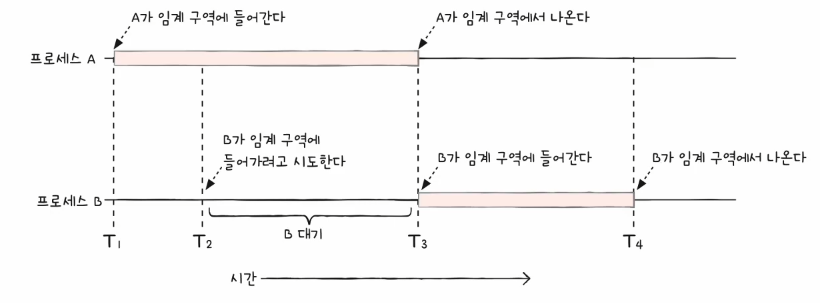
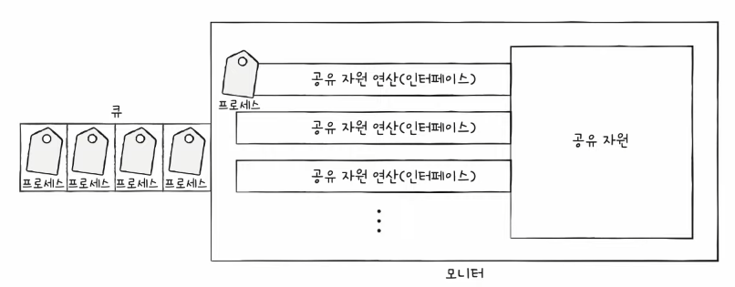
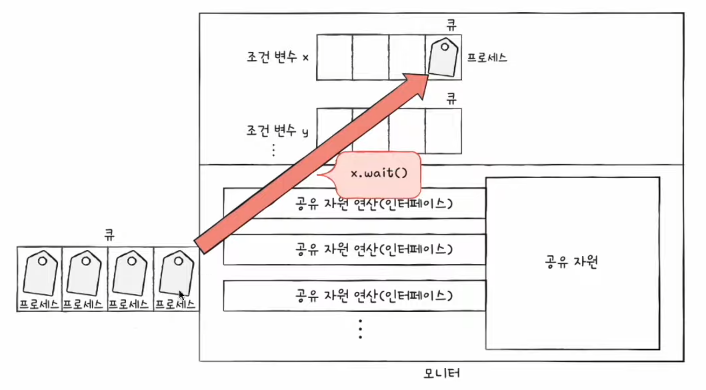
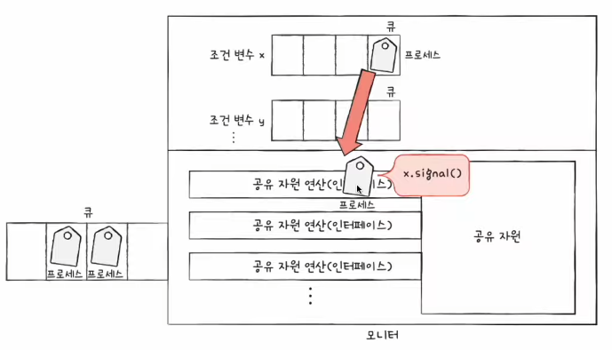

# Chapter 12. 프로세스 동기화

  

## 12 - 1 동기화란

 

    Keyword : 동기화, 공유 자원, 임계 구역, 상호 배제

  

- ### 동기화의 의미
    
     

    협력적으로 실행되는 프로세스는 마구 동시 실행이 되면 안됨

    올바른 실행을 위해서는 `동기화`가 필수

      
    
    그렇다면 프로세스 동기화란?

    `프로세스 사이의 수행 시기를 맞추는 것`

      

    수행 시기를 맞추는 것은 정확하게 어떤 것을 의미?

    - 실행 순서 제어
        
        프로세스를 올바른 순서대로 실행하기

    - 상호 배제

        동시에 접근해서는 안되는 자원에 하나의 프로세스만 접근하게 하기
    
      

    cf) 스레드도 동기화 대상, 정확하게는 실행의 흐름을 갖는 모든 것은 동기화의 대상

     
     

    동기화의 종류

    - 실행 순서 제어를 위한 동기화

    - 상호 배제를 위한 동기화

      

    #### 실행 순서 제어를 위한 동기화

    ex)
     Writer 프로세스가 Book.txt에 값을 저장하기 전에 Reader 프로세스가 Book.txt를 읽는 것은 올바른 실행 순서가 아님

    `동시에 실행되는 프로세스를 올바른 순서로 실행하는 것`이 실행 순서 제어를 위한 동기화
    
      

    #### 상호 제어를 위한 동기화

    상호 배제

    공유가 불가능한 자원의 동시 사용을 피하기 위해 사용하는 알고리즘

      

     | 
    --- | --- | 

    `동시에 접근해서는 안되는 자원에 동시에 접근하지 못하게 하는 것`이 상호 배제를 위한 동기화

  

- ### 생산자와 소비자 문제

     

    상호 배제를 위한 동기화에 대해 더 알아보자면

     
    
    생산자와 소비자 문제가 있음

    - 생산자는 물건을 계속해서 생산하는 프로세스

    - 소비자는 물건을 계속해서 소비하는 프로세스

      

    총합이라는 데이터를 동시에 사용하는 생산자와 소비자가 있다면

    소비자가 생산자의 작업이 끝나기도 전에 총합을 수정하고

    반대로 생산자가 소비자의 작업이 끝나기 전에 총합을 수정한다면

    엉뚱한 결과가 발생

  

- ### 공유 자원과 임계 구역

     

    동시에 접근해서는 안되는 자원이란?
    
    공유 자원이라고 함

    - 전역 변수 ex) 잔액, 총합

    - 파일

    - 입출력

    - 보조기억장치 등

      

    공유 자원 중 두개 이상의 프로세스를 동시에 실행하는 문제가 발생하는 자원

    

    전역 변수 ex) 잔액, 총합 와 같이 동시에 실행하는 문제가 발생하는 자원에 접근하는 코드 영역을 `임계 구역`이라고 함

    두 개 이상의 프로세스가 임계 구역에 진입하고자 하면 둘 중 하나는 대기

      

    `레이스 컨디션`

    임계 구역은 잘못된 실행으로 인해 여러 프로세스가 동시 다발적으로 임계 구역의 코드를 실행하여 문제가 발생하는 경우

    레이스 컨디션이 발생하면 계좌 잔액 문제나 생산자와 소비자 문제처럼 데이터의 일관성이 깨지는 문제 발생

      

    레이스 컨디션이 발생하는 이유는?

    고급 언어로 작성된 코드는 컴퓨터 내부에서 저급 언어로 변환되어 실행

    `해당 과정에서 문맥 교환이 일어나기 때문`

    이 때 상호 배제를 위한 동기화는 두 개 이상의 프로세스가 임계 구역에 동시에 접근하지 못하도록 관리하는 것을 의미

      

    임계 구역 문제를 해결하는 3가지 원칙

    - 상호 배제

        한 프로세스가 임게 구역에 진입했다면 다른 프로세스는 임계 구역에 들어올 수 없음

    - 진행

        임계 구역에 어떤 프로세스도 진입하지 않았다면 임계 구역에 진입하고자 하는 프로세스는 들어갈 수 있음

    - 유한 대기

        한 프로세스가 임계 구역에 진입하고 싶다면, 그 프로세스는 언젠가는 임계 구역에 들어올 수 있어야 함

        무한정 대기 X

    
  

## 12 - 2 동기화 기법

 

    Keyword : 뮤텍스 락, 세마포, 모니터 

  

- ### 뮤텍스 락
    
     

    손님과 탈의실을 예로 들면, 

    손님은 프로세스, 탈의실은 임계 구역

    자물쇠가 있다면 걸려 있으면 사람이 있다는 것이고, 없다면 탈의실을 이용 가능

      

    `뮤텍스 락`
    
    자물쇠 기능을 코드로 구현

    상호 배제를 위한 동기화 도구

      

    뮤텍스 락의 형태

    하나의 전역 변수와 두개의 함수

    - 자물쇠 역할

        프로세스들이 공유하는 전역 변수 lock

    - 임계 구역을 잠그는 역할

        acquire 함수

    - 임계 구역의 잠금을 해제하는 역할

        release 함수

      

    acquire과 release 함수를 임계 구역 전후로 호출함으로써 하나의 프로세스만 임계 구역이 진입할 수 있도록 함

    `바쁜 대기`
    
    acquire 함수는 임계 구역이 잠겨 있을 경우 프로세스는 반복적으로 lock을 확인

  

- ### 세마포
    
     

    공유 자원이 여러 개 있을 경우 여러 개의 프로세스가 각각 공유 자원에 접근이 가능해야 함

    세마포는 공유 자원이 여러 개 있는 상황에서도 적용이 가능한 동기화 도구

      

    세마포는 멈춤 신호와 가도 좋다는 신호로서 임계 구역을 관리

    세마포의 형태

    - 임계 구역에 진입할 수 있는 프로세스의 개수

        전역 변수 S

    - 임계 구역에 들어가도 좋은지, 기다려야 할지를 알려주는 역할

        wait 함수

    - 임게 구역에 들어가도 좋다고 신호를 주는 역할

        signal 함수

      

    바쁜 대기를 반복하는 것은 CPU 주기를 낭비하는 것이기에 손해

    세마포는 큐를 이용해 이것을 해결

    wait 함수는 사용할 수 있는 자원이 없다면 프로세스 상태를 대기로 만들고 그 프로세스의 PCB를 세마포를 위한 대기 큐에 넣음

    반대로 signal 함수는 대기 중인 프로세스를 대기 큐에서 제거하고, 프로세스 상태를 준비 상태로 변경한 뒤 준비 큐로 옮겨줌

  

- ### 모니터
    
     

    임계 구역 앞뒤로 wait와 signal 함수를 명시하는 것은 번거로운 일

    `모니터`
    
    공유 자원과 공유 자원에 접근하기 위한 인터페이스(통로)를 묶어 관리

      

    

    모니터는 공유 자원을 인터페이스에 접근 하기 위한 큐를 만들고

    모니터는 안에는 항상 하나의 프로세스만 들어오도록 하여 상호 배제를 위한 동기화를 제공

      

    

    

    실행 순서 제어를 위한 동기화도 제공

    특정 조건을 바탕으로 프로세스를 실행하고 일시 중단하기 위해 조건 변수를 사용

    조건 변수는 프로세스나 스레드의 실행 순서를 제어하기 위해 사용하는 특별한 변수

      

    모니터에 이미 진입한 프로세스의 실행 조건이 만족될 때까지 잠시 실행이 중단되어 기다리기 위해 만들어진 wait 큐와 실행을 재개하는 signal 연산이 있음

      

    모니터는 조건 변수를 이용하여 다음과 같은 프로세스 실행 순서 제어를 위한 동기화를 제공

    - 특정 프로세스가 아직 실행될 조건이 되지 않았을 때 wait를 통해 실행 중단

    - 특정 프로세스가 실행될 조건이 충족되었을 때 signal을 통해 실행 재개

