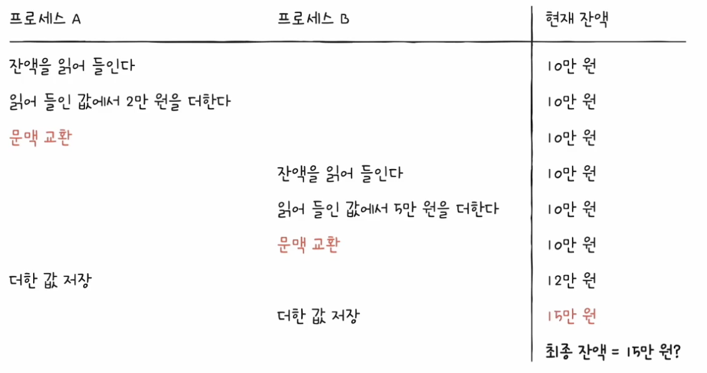
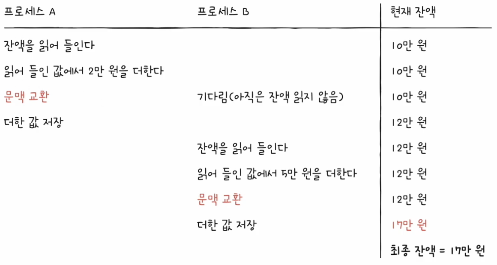

# Chapter 12. 프로세스 동기화

  

## 12 - 1 동기화란

 

    Keyword : 동기화, 공유 자원, 임계 구역, 상호 배제

  

- ### 동기화의 의미
    
     

    협력적으로 실행되는 프로세스는 마구 동시 실행이 되면 안됨

    올바른 실행을 위해서는 `동기화`가 필수

     
    
    그렇다면 프로세스 동기화란?

    `프로세스 사이의 수행 시기를 맞추는 것`

     

    수행 시기를 맞추는 것은 정확하게 어떤 것을 의미?

    - 실행 순서 제어
        
        프로세스를 올바른 순서대로 실행하기

    - 상호 배제

        동시에 접근해서는 안되는 자원에 하나의 프로세스만 접근하게 하기
    
     

    cf) 스레드도 동기화 대상, 정확하게는 실행의 흐름을 갖는 모든 것은 동기화의 대상

     
     

    동기화의 종류

    - 실행 순서 제어를 위한 동기화

    - 상호 배제를 위한 동기화

     

    #### 실행 순서 제어를 위한 동기화

    ex)
     Writer 프로세스가 Book.txt에 값을 저장하기 전에 Reader 프로세스가 Book.txt를 읽는 것은 올바른 실행 순서가 아님

    `동시에 실행되는 프로세스를 올바른 순서로 실행하는 것`이 실행 순서 제어를 위한 동기화
    
     

    #### 상호 제어를 위한 동기화

    상호 배제

    공유가 불가능한 자원의 동시 사용을 피하기 위해 사용하는 알고리즘

     

     | 
    --- | --- | 

    `동시에 접근해서는 안되는 자원에 동시에 접근하지 못하게 하는 것`이 상호 배제를 위한 동기화

  

- ### 생산자와 소비자 문제

     

    상호 배제를 위한 동기화에 대해 더 알아보자면

     
    
    생산자와 소비자 문제가 있음

    - 생산자는 물건을 계속해서 생산하는 프로세스

    - 소비자는 물건을 계속해서 소비하는 프로세스

     

    총합이라는 데이터를 동시에 사용하는 생산자와 소비자가 있다면

    소비자가 생산자의 작업이 끝나기도 전에 총합을 수정하고

    반대로 생산자가 소비자의 작업이 끝나기 전에 총합을 수정한다면

    엉뚱한 결과가 발생

  

- ### 공유 자원과 임계 구역

     

    동시에 접근해서는 안되는 자원이란?
    
    공유 자원이라고 함

    - 전역 변수 ex) 잔액, 총합

    - 파일

    - 입출력

    - 보조기억장치 등

     

    공유 자원 중 두개 이상의 프로세스를 동시에 실행하는 문제가 발생하는 자원

    전역 변수 ex) 잔액, 총합 와 같이 동시에 실행하는 문제가 발생하는 자원에 접근하는 코드 영역을 `임계 구역`이라고 함

    두 개 이상의 프로세스가 임계 구역에 진입하고자 하면 둘 중 하나는 대기

     

    `레이스 컨디션`

    임계 구역은 잘못된 실행으로 인해 여러 프로세스가 동시 다발적으로 임계 구역의 코드를 실행하여 문제가 발생하는 경우

    레이스 컨디션이 발생하면 계좌 잔액 문제나 생산자와 소비자 문제처럼 데이터의 일관성이 깨지는 문제 발생

     

    레이스 컨디션이 발생하는 이유는?

    고급 언어로 작성된 코드는 컴퓨터 내부에서 저급 언어로 변환되어 실행

    `해당 과정에서 문맥 교환이 일어나기 때문`

    이 때 상호 배제를 위한 동기화는 두 개 이상의 프로세스가 임계 구역에 동시에 접근하지 못하도록 관리하는 것을 의미

     

    임계 구역 문제를 해결하는 3가지 원칙

    - 상호 배제

        한 프로세스가 임게 구역에 진입했다면 다른 프로세스는 임계 구역에 들어올 수 없음

    - 진행

        임계 구역에 어떤 프로세스도 진입하지 않았다면 임계 구역에 진입하고자 하는 프로세스는 들어갈 수 있음

    - 유한 대기

        한 프로세스가 임계 구역에 진입하고 싶다면, 그 프로세스는 언젠가는 임계 구역에 들어올 수 있어야 함

        무한정 대기 X

    
  

## 12 - 1 동기화란

 

    Keyword : 동기화, 공유 자원, 임계 구역, 상호 배제

  

- ### 동기화의 의미
    
     

